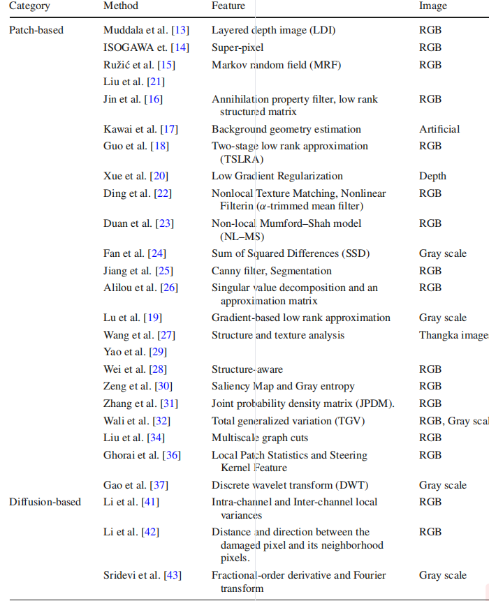
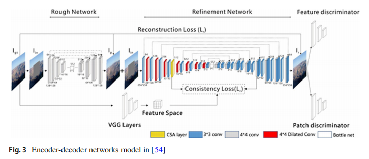

# **Image Inpainting: A Review**

虽然图像在绘画，或修复旧的和退化的图像的艺术，已经存在多年，但由于图像处理技术的发展，它最近得到了更多的欢迎。

随着图像处理工具的改进和数字图像编辑的灵活性，自动图像修复在计算机视觉中得到了重要的应用，也成为图像处理中一个重要而具有挑战性的研究课题。

本文综述了现有的 图像修复方法，将其分为基于序列、基于cnn和基于GAN的方法。

此外，对于每个类别，还给出了处理不同类型的图像失真的方法列表。

此外，本文还给出了可用的数据集。

最后但并非最不重要的是，我们给出了在不同类型的图像失真的所使用的数据集上执行的三类图像修复方法的真实评估结果。我们还提出了评估指标，并根据这些指标讨论了这些方法的性能。

这个概述可以作为图像修复研究人员的参考，它也可以促进方法和所使用的数据集的比较。本文的主要贡献是介绍了三类图像修复方法，以及一列可用的数据集，研究人员可以用来评估他们提出的方法。

# **1 Introduction**

如今，图像和视频是生活[1,2]不同领域所需要的最常见的信息形式，由于图像/视频内容的处理成为图像/视频内容的任务。这些信息的提取与分析[5–7]的目的有关。此外，它是监控人员和对象安全的关键工具。但是，编辑应用程序可以编辑图像而不留下任何痕迹，这给公众的信任和信心造成了一个问题。因此，迫切需要一个自动系统来检测和提取现有的真实图像表示。同时，从给定图像中获得原始图像的可用性在很大程度上依赖于原始图像的提取机制；因此，从图像中去除对象是本研究的主要问题之一，也是信息安全[13,14]的热点问题。

社交网络中共享的图像可以包含许多添加到这些图像中的对象，包括签名、矩形或表情符号。这些对象的添加可以改变图像的语义。从图像中移除这些物体是一个被广泛认识到的问题，也是目前计算机视觉研究的一个轨道。

此外，物体去除被认为是伪造图像的解决方案。文献中存在的对象去除技术可以分为两类：图像插入绘画和复制移动方法。

基于复制移动的方法通过从另一个图像的一个区域或同一图像的另一个区域，然后将其粘贴到我们试图删除的对象区域来执行不希望的对象删除。

该技术由于其简单性被广泛用于物体去除；它不适用于某些情况，如人脸图像或复杂的场景。另一方面，将图像修复应用于旧图像上，以去除划痕，增强受损图像。

现在，它被用于删除可以通过用估计值填充目标区域来添加到图像中的伪影对象。图像修复也用于消除任何类型的失真，包括文本、块、噪音、划痕、线条或许多类型的掩模[15–17]。

图1表示了现有的不同类型的失真。通过使用最近开发的算法，图像内画可以连贯地恢复图像的纹理和结构成分。所得结果表明，这些方法可以从图像中去除不良的对象，而不会留下类似伪影幽灵的痕迹。到目前为止，针对大量已发表的基于序列、基于cnn或基于gan等不同技术的作品，很少提出关于盲图像插入的方法

使用图像修复从图像中去除对象可以在未来达到提高的性能，但是当图像编辑器使用复杂的技术隐藏痕迹时，检测伪造和修复图像就变得困难了。因此，几乎所有的检测方法都试图通过检测在后处理操作过程中可能受到影响的图像块之间的相似性异常来处理这个问题。这项工作总结了使用不同技术的图像修复的不同方法，包括基于序列、基于cnn或基于gan的方法。

本文的其余部分组织如下：文献概述，包括基于顺序的方法、基于cnn的方法和基于gan的方法在第二节。使用的数据集在三节。 评估和所使用的指标在第四节中被讨论。结论见第五节。

# **2 Literature Review**

**图像修复是完成或恢复图像中缺失的区域或删除一些添加到其中的对象的过程**。修复的操作取决于图像中损坏的类型，以及造成这种扭曲的应用程序。

例如，在图像恢复中，我们讨论去除图像中可以找到的划痕或文本，而在照片编辑应用程序中，我们对图像编码中的对象去除感兴趣，在传输应用程序，图像修复相关的操作是恢复缺失的块。

**最后，对于虚拟绘画的恢复，相关的操作是去除划痕。**

为了解决这个问题，许多方法已经被提出，包括序列算法或深度学习技术。

为此，我们将现有的图像绘制方法分为三类：基于序列的方法、基于cnn的方法和基于gan的方法。

序列简化的方法是一种不使用神经网络进行深度学习的方法。

其中基于cnn的方法是使用自动深度学习的算法

基于gan的方法代表了使用生成对抗网络（GANs）对修复模型的图像进行标记。

下面介绍了与各类方法相关的图像修复工作

## **2.1 Sequential-Based Methods**

与图像修复相关的方法可以分为两类： patch-based(基于补丁)的方法和 diffusion-based(基于扩散)的方法。

基于补丁的方法是基于在图像未损坏的部分搜索匹配良好的替换补丁（即候选补丁）并将其复制到相应的位置，从而填充缺失区域补丁的技术。

目前已经提出了许多使用基于补丁的方法来绘制图像的方法。

.Ruži´c and Pi˘zurica[15]提出了一种基于patch的方法，即利用马尔可夫随机场（MRF）在纹理分量中搜索匹配良好的块。

Jin和Ye [16]提出了一种基于annihilation property fifilter和低秩结构矩阵的基于补丁的方法

为了从图像中删除一个对象，Kawai[17]等人提出了一种基于选择目标对象并通过背景限制目标周围搜索的方法。

利用两阶段低秩近似（TSLRA）[18]和基于梯度的低秩近似[19]，作者提出了基于补丁的方法来恢复图像中的损坏块。

对于充满噪声和文本的RGB-D图像，Xue等[20]提出了一种基于低梯度正则化的深度图像修复方法。

Liu等[21]利用统计正则化和区域间相似性提取目标区域的优势线性结构，然后利用马尔可夫随机场模型（MRF）对缺失区域进行修复。

Ding等人[22]提出了一种基于非局部纹理匹配和非线性滤波（Alpha-trimmed mean filter）的图像修复方法。

Duan等[23]提出了一种基于非局部Mumford-Shah模型（NL-MS）的图像内修复方法。

Fan和Zhang [24]提出了另一种基于使用差异平方和（SSD）度量斑块之间相似性的图像修复方法。

为了从图像中去除块，Jiang [25]提出了一种进行图像压缩的方法。

利用奇异值分解，Alilou和Yaghmaee [26]利用近似矩阵，提出了一种重建缺失区域的方法。

其他值得注意的研究包括利用纹理分析在**唐卡图像**上来恢复图像[27]中的缺失块，以及利用图像[28,29]的结构信息。

在同样的背景下，Zeng等人[30]提出了使用显著性图和灰色熵。

Zhang等[31]提出了一种利用联合概率密度矩阵（JPDM）从图像中去除目标的图像插入绘制方法。

Wali等[32]提出了一种使用全广义变异（TGV）的去噪和修复方法。作者分析了文本、噪声、面具等三种失真类型。

在相同的背景下，Zhang等人[33]提出了一种基于颜色分布的基于实例的图像修复方法，即利用邻近区域恢复缺失的区域。这项工作分析了许多类型的扭曲，包括对象、文本和划痕。

[34]采用多尺度图切割技术，通过分析不同类型的失真来修复图像。

在[35]中，作者提出了一种新的基于边匹配向量量化（SMVQ）和图像嵌入的联合数据隐藏和压缩方案。所提出的方法在六种灰度识别的图像上进行了测试，包括莉娜、飞机、辣椒、帆船、湖和蒂芙尼。

为了保持纹理的一致性和结构的一致性，[36]中的作者使用多金字塔法、局部斑块统计法和基于几何特征的稀疏表示法去除图像中添加的对象

针对三维堆叠图像传感器，[37]提出了一种基于离散小波变换（DWT）的图像嵌入绘制方法。

为了填充缺失的区域，[38]中的作者提出了一种基于补丁的方法，通过搜索和填充这些区域周围的最佳匹配信息。

为了重建Borehole images的目的，[39]中的作者提出了一种通过分析图像的纹理和结构成分的方法。

采用亥姆霍兹方程对[40]中的图像进行修复，在对缺失区域进行修复后，提出了一种提高图像质量的方法。

Diffusion-based(基于扩散)的方法通过将图像内容从边界平滑地传播到缺失区域的内部，来填补缺失区域（即孔洞）。

为此，Li等人[41]提出了一种基于扩散的图像修复方法，通过定位修复区域的扩散，然后基于通道内和通道间变化的局部方差构建特征集来识别修复区域。

同一作者在后来的研究[42]中提出了另一种基于扩散的图像绘制方法，即扩散系数是利用受损像素与其邻域像素之间的距离和方向计算的。

Sridevi等人[43]提出了另一种基于分数阶导数和傅里叶变换的基于扩散的图像修复方法。

表1描述了基于补丁和基于扩散的图像方法。

Jin等人[44]提出了一种基于典型相关分析（CCA）的基于稀疏的图像图像检测方法。

Mo和Zhou [45]提出了一种基于使用稀疏表示的字典学习的研究。

这些方法对于简单的图像是鲁棒的，但是当图像是复杂的，如包含大量的纹理和物体或物体覆盖图像的大区域时，寻找类似的补丁可能会很困难。

## **2.2 Convolutional-Neural-Network-Based Methods**

近年来，深度卷积网络（CNNs）的强大潜力正出现在所有的计算机视觉任务中，特别是在图像修复中。

cnn专门用于利用大规模训练数据改善这一领域的预期结果。

基于序列的方法在图像内绘制的某些部分取得了成功，如填充纹理细节，并取得了良好的结果，但捕获全局结构的问题仍然是一个具有挑战性的任务[46]

本文提出了几种基于卷积神经网络（CNNs）或基于CNN的编解码器网络的图像修复方法。

基于U-Net架构的Shift-Net是这些在结构和精细纹理[46]方面具有良好精度的恢复缺失块的方法之一。

在同样的背景下，维拉塞克拉等人[47]使用图像的深度图作为CNN架构的输入，而Zhao等人[48]使用所提出的架构来绘制x射线医学图像。

VORNet [49]是另一种基于cnn的视频插修复以删除对象的方法。

大多数图像修复方法都知道块中损坏像素的参考。

Cai等人[50]提出了一种盲图像修复方法（BICNN）。

基于卷积神经网络（CNNs）的解码网络结构，提出了许多图像修复的工作。

Zhu等人[51]提出了一种基于补丁的取证图像修复方法。利用同样的编解码器网络技术，西多罗夫和哈德伯格[52]提出了一种分别对噪声图像、嵌入绘制和低分辨率图像进行去噪、嵌入绘制和超分辨率的架构。

利用同样的编解码器网络技术，西多罗夫和哈德伯格[52]提出了一种分别为噪声、修复和低分辨率图像进行去噪、修复的超分辨率架构。

.Zeng等人[53]构建了一个名为PEN-NET的金字塔背景架构，用于高质量的图像修复。

Liu等人[54]提出了编码解码网络层称为连贯性语义注意力机制（SCA）层用于图像修复方法。本文所提出的体系结构如图3所示。

此外，Pathak等人[55]提出了用于图像修复的解码器模型。

为了填补在图像中绘制的线之间的空白，Sasaki等人的[56]使用了一个基于编解码器的模型。这项工作可以帮助处理那些可能遗漏的某些部分的扫描数据。

对于可能影响分辨率或包含一些盲点的无人机数据，Hsu等人[57]提出了一种使用VGG架构的解决方案。

此外，为了从图像中删除一些文本，中村[58]等人提出了一种使用CNN的文本擦除方法。

**为了增强受损艺术品的图像，Xiang等人[59]也提出了一种基于cnn的方法。**

在与[59]相同的背景下，利用GRNN神经网络，Alilou和Yaghmaee [60]提出了一个非纹理图像修复法。

与之前的方法不同，Liao等人[61]提出了一种名为Artist-Net的图像修复方法。

Cai等人的[62]也达到了同样的目标，他提出了一种使用CNN架构的语义对象去除方法。

为了从单个图像中去除图案，Hertz等人[63]提出了一种基于cnn的方法。

表2总结了基于cnn的方法，描述了用于图像恢复的数据类型。

为了实现图像恢复的相同目的，但为了将另一个区域替换为另一个图像的另一个区域，基于VGG模型的[64]作者训练了自己的模型。

为了减轻梯度消失的影响，[65]哈罗斯等人引入了一个用于U-Net架构的密集块，用于恢复图像。

出于医学目的，[67]中的作者试图使用残差U-Net架构的图像恢复原理对医学图像进行去噪。

为了解决图像绘制的模糊和颜色差异问题，[66]中的作者提出了一种利用区域级卷积进行的缺失区域重建的方法。

由于作者在[68]中在编码解码器体系结构中添加了一些名为交错缩放块的层，用于恢复图像。

[69]中的作者提出了一个具有编解码器模型的全分辨率残差块（FRRB）。

## **2.3 GAN-Based Methods**