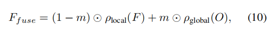

# Bringing Old Photos Back to Life

我们建议通过深度学习方法恢复严重退化的旧照片。与传统的通过监督学习解决的恢复任务不同，真实照片的退化非常复杂，合成图像和真实旧照片之间的领域差距使得网络无法泛化。

因此，我们提出了一种新的三重态域转化网络，利用真实的照片和大量的合成图像对。

具体来说，我们训练两个变分自动编码器（VAEs）分别将旧照片和干净照片转换为两个潜在空间。利用合成成对数据学习这两个潜在空间之间的平移。

这种转换可以很好地推广到真实照片，因为域间隙在紧凑的潜在空间中是闭合的。

此外，为了解决混合在一张老照片中的多个退化，我们设计了一个全局分支，其中局部非局部块，并针对非结构缺陷，如噪声和模糊。

两个分支在潜在空间中融合，从而提高了从多个缺陷中恢复旧照片的能力。该方法在旧照片恢复的视觉质量方面优于最先进的方法。

# 1. Introduction

拍摄照片是为了冻结那些原本已经消失的快乐时刻。即使时间在流逝，人们仍然可以通过观看过去来唤起人们的回忆。

尽管如此，旧的照片打印在保存在恶劣的环境条件下就会恶化，这将导致有价值的照片内容被永久损坏。幸运的是，随着移动相机和扫描仪变得越来越容易使用，人们现在可以将照片数字化，并邀请一个熟练的专家进行修复。

然而，手工修饰通常是费力的，这使得成堆的旧照片无法修复。因此，为那些希望将旧照片恢复到生活中的人，设计出能够立即修复旧照片的自动算法是很有吸引力的。

在深度学习时代之前，有一些尝试[1,2,3,4]通过自动检测局部缺陷，如划痕和瑕疵，并用喷漆技术填充损坏区域来修复照片。

而这些方法的重点是完成缺失的内容，但都不能修复膜粒、棕褐色效果、褪色等空间均匀的缺陷，因此修复后的照片与现代照片图像相比仍然显得过时。

在深度学习时代之前，有一些尝试[1,2,3,4]通过自动检测局部缺陷，如划痕和瑕疵，并用喷漆技术填充损坏区域来修复照片。而这些方法的重点是完成缺失的内容，但都不能修复膜粒、棕褐色效果、褪色等空间均匀的缺陷，因此修复后的照片与现代照片图像相比仍然显得过时。

____

然而，同样的框架并不适用于旧的照片恢复。

首先，旧照片的退化过程相当复杂，不存在能够真实渲染旧照片制品的退化模型。因此，从这些合成数据中学习到的模型在真实照片上的普遍性很差。

第二，旧照片受到退化的困扰，本质上需要不同的修复策略：空间均匀的非结构化缺陷，如薄膜颗粒和褪色，应该利用附近的像素进行恢复，而结构化缺陷，如划痕、尘点等，应该以全局图像背景进行修复。

为了规避这些问题，我们将旧的照片恢复表述为一个三重态域转换问题。与以往的图像转换方法[11]不同，我们利用了三个领域的数据（即真实的老照片、合成图像和相应的地面真实值），转换是在潜在空间中进行的。

合成图像和真实照片首先用一个共享的变分自编码器[12]（VAE）转换到相同的潜在空间。同时，训练另一个VAE，将地面真实干净的图像投影到相应的潜在空间中。然后用合成图像对学习两个潜在空间之间的映射，将损坏的图像恢复为干净的图像。

潜在恢复的优点是，由于在第一个VAE内的域对齐，学习到的潜在恢复可以很好地推广到真实的照片中。此外，我们还区分了混合退化，并提出了一个部分非局部块，它考虑了潜在特征的长期依赖性，以具体解决潜在转换过程中的结构化缺陷。通过与几种领先的修复方法进行比较，我们证明了我们的方法在恢复真实照片的多次降解方面的有效性。

# 2. Related Work

## Single degradation image restoration.

现有的图像退化大致可以分为两类：非结构化退化，如噪声、模糊度、褪色和低分辨率，以及结构化退化，如孔洞、划痕和斑点。

对于前一种非结构化作品，传统作品往往会施加不同的图像先验，包括非局部自相似性[13,14,15]、稀疏性[16,17,18,19]和局部平滑性[20,21,22]。近年来，许多基于深度学习的方法也被提出用于不同的图像退化，如图像去噪[5,6,23,24,25,26,27]、超分辨率[7,28,29,30,31]和去模糊[8,32,33,34]。

与非结构化退化相比，结构化退化更具挑战性，通常被建模为“图像修复”问题。由于强大的语义建模能力，大多数现有的最佳性能的恢复方法都是基于学习的。例如，Liu等人的[35]掩盖了卷积算子内的空穴区域，并强制网络只关注非空穴特征。为了得到更好的恢复结果，许多其他方法同时考虑了局部补丁统计量和全局结构。具体来说，Yu等人[36]和Liu等人[37]提出采用注意层来利用远处上下文信息。而Ren等人的[38]则明确地估计了外观流，从而可以根据相应的斑块直接合成孔洞区域的纹理。

无论是非结构化或结构化退化，虽然上述基于学习的方法都可以取得显著的结果，但它们都是在合成数据上进行训练的。因此，它们在真实数据集上的性能高度依赖于合成数据的质量。对于真实的旧图像，由于它们经常被未知降解的混合物严重降解，因此潜在的退化过程更难以准确地表征。换句话说，只经过合成数据训练的网络，会出现领域差距问题，在真实的老照片上表现不佳。本文将真实的旧照片恢复作为一个新的三重态域平移问题进行建模，并采用了一些新的技术来最小化域间隙。

## Mixed degradation image restoration. 

在现实世界中，一个被损坏的图像可能会出现复杂的缺陷，并混合有划痕、分辨率下降、褪色和薄膜噪声。然而，对解决混合降解的研究探索却较少。[39]的先驱工作提出了一个工具箱，它包括多个轻量级网络，每个网络都负责特定的退化。然后，他们学习一个从工具箱中动态选择操作符的控制器。

受[39]的启发，[40]并行执行不同的卷积操作，并使用注意机制来选择最合适的操作组合。然而，这些方法仍然依赖于从合成数据中进行的监督学习，因此不能推广到真实的照片中。此外，它们只关注非结构化缺陷，不支持图像恢复等结构化缺陷。

另一方面，Ulyanov等人[41]发现，深度神经网络固有地与低级图像统计数据产生共鸣，因此，可以作为图像先验，不需要外部训练数据进行盲图像恢复。这种方法有潜力，虽然没有在[41]中声称，以恢复被混合因素破坏的野生图像。相比之下，我们的方法在恢复性能和效率方面都很出色。

## Old photo restoration

旧的照片修复是一个典型的混合退化问题，但大多数现有的方法[1,2,3,4]只专注于修复。它们遵循一个类似的范式，即，划痕和斑痕等缺陷首先根据低级特征被识别，然后通过借用附近的纹理来绘制。然而，手工制作的模型和他们使用的低级特性很难很好地检测和修复这些缺陷。

此外，这些方法都没有考虑恢复一些非结构化缺陷，如褪色或低分辨率和不喷漆。因此，修复后的照片仍然显得过时了。在这项工作中，我们通过一种数据驱动的方法重新研究了这个问题，该方法可以同时从多个缺陷中恢复图像，并将严重损坏的旧照片变成现代风格。

# 3. Method

 与传统的图像恢复任务相比，旧的照片恢复任务更具挑战性。

首先，旧照片包含了更复杂的退化，很难被真实地建模，而且在合成照片和真实照片之间总是存在一个领域差距。因此，该网络通常不能通过纯粹地从合成数据中学习来很好地推广到真实的照片上。

其次，老照片的缺陷是多种退化的混合，因此本质上需要不同的修复策略。薄膜噪声、模糊度、褪色度等非结构化缺陷。可以利用局部补丁内的周围像素使用空间均匀过滤器进行恢复；另一方面，对于划痕和斑痕等结构化缺陷，应考虑全局上下文，以确保结构的一致性。下面，我们分别提出了解决上述泛化问题和混合退化问题的解决方案。

## 3.1. Restoration via latent space translation

为了缩小领域差距，我们将旧照片恢复表述为一个图像转换问题，其中我们将干净的图像和旧照片视为来自不同领域的图像，我们希望学习两者之间的映射。

然而，与一般的连接两个不同域[11,42]的图像转换方法不同，我们将图像跨三个域进行翻译：真实照片域R，图像遭受人工退化的合成域X，以及相应的包含不退化的图像的地面真实域Y。这种三重态域转化在我们的任务中是至关重要的，因为它利用了未标记的真实照片以及大量与地面真相相关的合成数据。

我们分别用r∈R、x∈X和y∈y表示来自三个域的图像，其中x和y通过数据合成成对，即x从y退化。

直接学习从真实照片$\{r\}_{i=1}^N$的映射到清洁图像$\{y\}_{i=1}^N$是困难的，因为它们不是成对的，因此不适合监督学习。

因此，我们建议用两个阶段来分解转换，如图2所示。

首先，我们建议分别通过$E_R：R→Z_R$、$E_X：X→Z_X$和$E_Y：Y→Z_Y$，将R、X、Y映射到相应的潜在空间。

特别是因为合成图像和真实的老照片都被损坏了，共享相似的外观，我们通过强制执行一些约束，将它们的潜在空间对齐到共享域中。因此，我们有$Z_R≈Z_X$

这个对齐的潜在空间编码了所有损坏的图像的特征，无论是合成的还是真实的。

然后，我们提出了在潜在空间中学习图像的恢复问题。

具体来说，利用合成数据对$\{x，y\}^N_{i=1}$，我们学习转换从损坏图像的潜在空间$Z_X$到地面真理的潜在空间$Z_Y$，通过映射$T_Z： Z_X →Z_Y$，$Z_Y$可以进一步逆转到Y通过生成器$G_Y： Z_Y →Y$。

通过学习潜在空间转换，真实的旧照片r可以通过按顺序执行映射来恢复：

### **Domain alignment in the VAE latent space：**

我们的方法的一个关键是满足R和X被编码到相同的潜在空间中的假设。

为此，我们提出利用变分自编码器[12]（VAE）对具有紧凑表示的图像进行编码，并通过对抗性鉴别器[43]进一步检验其域间隙。

我们使用图3中所示的网络体系结构来实现这个概念。

在第一阶段，学习两个VAEs。旧照片和合成图像共享第一个称为$VAE_1$，与编码器$E_{R,X}$和生成器$G_{R，X}$，而地面真实图像与编码器-生成器对$\{E_Y、G_Y\}$一起输入第二个称为$VAE_2$。

$VAE_1$为r和x共享，目的是从两个损坏域的图像可以映射到一个共享的潜在空间。

VAEs对潜在码的分布假设为高斯先验，因此可以通过从潜在空间中采样来重建图像。我们使用重新参数化的技巧来实现可微随机抽样[44]，并分别使用数据{r}和{x}优化$VAE_1$。对目标的定义为：

$z_r∈Z_R$是r的潜在码，$r_{R→R}$是生成输出。

方程中的第一项是kl-散度，它惩罚了潜在分布与高斯先验的偏差。

第二个ℓ1项允许VAE重构输入，隐式地强制执行潜在码来捕获图像的主要信息。

此外，我们引入了最小二乘损失（LSGAN）[45]，在公式中记为$L_{VAE_1,GAN}$，以解决VAEs中众所周知的过光滑问题，进一步鼓励VAE以高真实性重建图像。

具有{x}的目标，表示为LVAE1 (x)，其定义类似。

域Y的$VAE_2$用类似的损失训练，从而导出相应的潜在表示$z_y∈Y$。

我们使用VAE而不是普通的自动编码器，因为由于KL正则化，VAE具有更密集的潜在表示（这将在消融研究中得到证明），这有助于为$VAE_1$的{r}和{x}产生更近的潜在空间，从而导致更小的域间隙。

为了进一步缩小空间中的域间隙，我们建议使用对抗性网络来检验残余的潜在间隙。

具体地说，我们训练另一个鉴别器$D_{R,X}$，它鉴别$Z_R$和$Z_X$，它们的损失定义为，

同时，VAE1的编码器ER，X试图用一个矛盾的损失来欺骗鉴别器，以确保R和X被映射到相同的空间。

结合潜在的对抗性损失，VAE1的总目标函数变为，

### **Restoration through latent mapping**

利用VAEs捕获的潜在代码，在第二阶段，我们利用合成的图像对{x，y}，并提出通过映射它们的潜在空间（图3中的映射网络M）来学习图像的恢复。

潜在恢复的好处有三处。

首先，当R和X对齐到相同的潜在空间时，从ZX到ZY的映射也可以很好地推广到恢复R中的图像。

其次，在紧凑的低维潜在空间中的映射原则上比在高维图像空间中更容易学习。

此外，由于两个VAEs是独立训练的，并且两个流的重建不会受到相互干扰。

根据从ZX映射的潜在代码zY，生成器GY总是可以得到一个绝对干净的图像，而如果我们学习在像素级的转换，退化可能会继续存在

设$r_{R→Y}$、$x_{X→Y}$和$y_{Y→Y}$分别为r、x和Y的最终转换输出。

在这一阶段，我们只训练潜在映射网络T的参数，并固定这两个VAE。

损失函数LT施加在两个潜在空间上和生成器GY的两端，由三项组成，

潜在空间损失惩罚相应的潜在码的ℓ1距离。

我们引入了对抗性损失$L_{T ，GAN}$，仍然以LSGAN [45]的形式，以鼓励最终翻译的合成图像$x_{X→Y}$看起来真实。

此外，我们还引入了特征匹配损失LFM来稳定GAN训练。

具体来说，$L_{FM}$匹配了对抗性网络DM的多级激活和预先训练的VGG网络（也在[11,46]中也称为知觉损失）

$φ^i_{D_T}(φ^i_{VGG})$表示鉴别器（VGG网络）的第i层特征图，$n^i_{D_T}(n^i_{VGG})$表示该层的激活次数。

## 3.2. Multiple degradation restoration

如前所述，使用残差块的潜在恢复，由于每一层的接受域有限，只集中于局部特征。

尽管如此，结构缺陷的恢复需要合理的修复，这必须考虑长期依赖，以确保全局结构的一致性。

由于遗留照片通常包含混合退化，我们必须设计一个同时支持这两种机制的恢复网络。

为了实现这一目标，我们建议通过合并一个如图3所示的全局分支来增强潜在恢复网络，该分支由一个考虑全局上下文的非局部块和下面的几个残差块组成。

虽然在[47]中提出的原始块不知道损坏区域，但我们的非局部块显式地利用了掩模输入，因此损坏区域中的像素将不会被用来完成这些区域。由于所考虑的上下文是特征映射的一部分，因此我们将专门为潜在的恢复而设计的模块称为部分非局部块。

形式上，让$F∈R^{C×HW}$中间特征图M（C、H和W通道的数量，高度和宽度），和$m∈\{0,1\}^{HW}$表示二进制掩膜缩小到相同的大小，其中1代表要被恢复的缺陷区域和0代表完整的区域。

F中第i个位置与第j个位置之间的亲合力，用$s_{i，j}∈R^{HW×HW}$表示，由Fi和掩模（1−mj）调制的Fj的相关性计算，

给出了与嵌入式高斯分布的成对亲和力。

θ和φ映射F到高斯空间进行亲和性计算。

根据考虑掩模中孔洞的亲和度si，j，最终得到部分非局部输出

是每个位置的相关特征的加权平均值。我们用1×1的卷积实现了嵌入函数θ、φ、µ和ν。

我们设计了专门用于恢复的全局分支，希望非孔区域保持不变，因此我们在掩膜指导下将全局分支与局部分支融合

算子⊙表示阿达玛乘积，ρlocal和ρglobal表示两个分支中残差块的非线性变换。

这样，这两个分支就构成了潜在的恢复网络，能够处理旧照片中的多重退化。我们将在第4.1节中详细介绍缺陷掩模的推导方法。

 

# 4. Experiment

## 4.1. Implementation

**Training Dataset**

我们使用来自Pascal VOC数据集[48]的图像来合成旧照片。为了渲染真实的缺陷，我们还收集了划痕和纸张的纹理，并进一步增强了弹性扭曲。我们使用层添加、仅变亮和随机不透明度的屏幕模式来混合数据集真实图像上的划痕纹理。为了模拟大面积的照片损伤，我们产生了具有羽状和随机形状的孔，在那里下面的纸纹理被揭示。最后，引入薄膜晶粒噪声和随机量模糊法对非结构化缺陷进行了模拟。此外，我们收集了5718张老照片，形成图像老照片数据集。

**Scratch detection** 

为了检测部分非局部块的结构化区域，我们使用Unet体系结构[49]训练另一个网络。检测网络首先只使用合成图像进行训练。我们采用focal loss[50]来弥补positive和negative检测的不平衡。为了进一步提高对真实老照片的检测性能，我们对783张收集的老照片进行了标注，其中400张图像对检测网络进行了微调。图4中验证集上的ROC曲线显示了微调的有效性。经过微调后的曲线下面积（AUC）达到0.91。