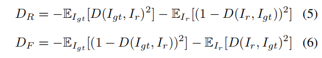

# **Coherent Semantic Attention for Image Inpainting**

最新的基于深度学习的方法在插入绘制图像缺失区域的具有挑战性的任务中显示出了有希望的结果。

然而，由于局部像素的不连续，现有的方法往往会产生纹理模糊和结构扭曲的内容。从语义层面的角度来看，局部像素的不连续性主要是由于这些方法忽略了孔洞区域的语义相关性和特征连续性。

处理这个问题，我们调查人类修复图片行为和提出一个精细的深度生成模型的方法与一个新颖的连贯语义注意（CSA）层，不仅可以保持上下文结构，而且更有效地预测缺失部分通过建模洞之间的语义相关性特性。

该任务分为粗糙、细化两步，在U-Net架构下使用神经网络对每一步进行建模，其中CSA层嵌入到细化步骤的编码器中。

稳定网络训练过程和促进CSA层学习更有效的参数，我们提出一个一致性损失执行CSA层和相应在解码器的CSA层接近地面真实图像的VGG特征层。

在CelebA、地点2和巴黎街景数据集上的实验验证了我们所提出的方法在图像绘制任务中的有效性，与现有的先进方法相比，可以获得更高质量的图像。

# **1. Introduction**

图像修复是合成一个合理假设中缺失或损坏部分的任务，可以用于许多应用，如去除不需要的物体，完成遮挡区域，恢复损坏或损坏的部分。

图像恢复的核心挑战是维护全局语义结构，并为缺失的区域生成真实的纹理细节。

传统的工作[2,3,11,12,34]大多开发纹理合成技术来解决孔洞填充的问题。

在[2]中，Barnes等人提出了补丁匹配算法，从空洞边界迭代搜索最佳拟合补丁，以合成缺失部分的内容。

[34]等人采取了进一步的步骤，检测理想的搜索区域，以找到更好的匹配补丁。

然而，这些方法缺乏理解高级语义，并努力重建局部独特的模式。

相比之下，早期基于深度卷积神经网络的方法[17,24,30,39]学习数据分布来捕获图像的语义信息，并可以实现合理的绘制结果。然而，这些方法不能有效地利用上下文信息来生成空洞的内容，往往导致包含噪声模式的结果。

最近的一些研究有效地利用了上下文信息，获得了更好的内绘制结果。这些方法可以分为两种类型。

第一种类型的[32,36,42]利用空间注意，以周围的图像特征作为参考来恢复缺失的区域。这些方法可以保证生成的内容与上下文信息的语义一致性。然而，他们只关注矩形的孔，结果总是倾向于显示像素不连续，并有语义鸿沟（见图1（b，c））。

第二种类型的[26,41]是对原始图像中的有效像素上的缺失像素条件进行预测。这些方法可以正确地处理不规则的孔，但生成的内容仍然满足语义故障和边界伪影的问题（见图1（g，h））。上述方法无效的原因是它们忽略了生成内容的语义相关性和特征连续性，这对局部像素的连续性至关重要。

为了获得更好的图像恢复效果，我们研究了人类在修复图像中的行为，发现这一过程包括构思和绘画两个步骤，以保证图像的全局结构一致性和局部像素连续性。具体地说，就是先观察图像的整体结构，在构思过程中构思缺失部分的内容，从而保持图像整体结构的一致性。然后，在绘画过程中，内容的概念将被填充到实际的图像中。在绘制过程中，人们总是继续从之前画的线的末端节点上绘制新的线和着色，这实际上确保了最终结果的局部像素连续性。

受此过程的启发，我们提出了一个连贯的语义注意层（CSA），它用类似的过程填充图像特征图的未知区域。

首先，对未知区域中的每个未知特征补丁都用已知区域中最相似的特征补丁进行初始化。然后，通过考虑与相邻斑块的空间一致性进行迭代优化。因此，通过第一步保证了全局语义的一致性，并通过优化步骤保持了局部特征的一致性。

与[42]类似，我们将图像修复分为两个步骤。

第一步可以通过训练一个粗糙的网络来梳理出缺失的内容来构建。

编码器中包含CSA层的细化网络指导第二步细化粗略预测。

为了使网络训练过程更加稳定和激励CSA层学习更有效的特性，我们提出一致性损不仅失测量VGG特征层和CSA层之间的距离而且测量VGG特征层和解码器中CSA的相应层之间的距离。

同时，除了一个补丁鉴别器[18]外，我们还通过引入一个比传统的[29]公式更简单、训练速度更快、训练速度更稳定的特征补丁来改进细节。

除了一致性损失，重建损失和相对平均LS对抗损失[28]被作为约束，指导我们的模型学习有意义的参数。

我们在标准数据集CelebA [27]、Places2 [44]和巴黎街景[8]上进行了实验。定性和定量试验都表明，我们的方法可以产生比现有方法更高质量的喷漆结果。（见图1（d、i）)。

我们的贡献总结如下：

- 我们提出了一种新的连续语义注意层来构建空洞区域的深层特征之间的相关性。无论未知区域是不规则的还是居中的，我们的算法都能获得最先进的内部绘制结果。
- 为了提高CSA层的性能和训练的稳定性，我们引入了一致性损失来指导CSA层和相应的解码器层来学习地面真实值的VGG特征。同时，设计并连接了一个特征补丁鉴别器，以实现更好的预测。
- 与[26,36,41,42]相比，我们的方法获得了更高质量的结果，并产生了更多连贯的纹理。即使修复任务分两个阶段完成，我们的全网络也可以端到端训练。

# **2. Related Works**

## **2.1. Image inpainting**

在文献中，以往的图像修复研究一般可以分为两类：非学习的绘画方法和学习绘画方法。

前者是传统的基于扩散的或基于补丁的使用低级特征的方法。

后者学习图像的语义来完成插入任务，并训练深度卷积神经网络来推断缺失区域的内容。

非学习的方法，如[1、3、4、6、7、10-13、19、21、23、31、35]，通过传播邻近的信息或从类似的背景补丁中复制信息来填补缺失的区域。Huang等人[16]将已知区域混合到目标区域，以减少不连续性。然而，搜索已知的最佳匹配区域是一个非常昂贵的操作。为了解决这一挑战，Barnes等人[2]提出了一种快速最近邻场算法，促进了图像嵌入式应用的发展。虽然非学习方法对表面纹理的合成效果很好，但它们不能生成有语义上有意义的内容，也不适合处理大的缺失区域。

学习方法[9,15,25,33,38,40,43]经常使用深度学习和GAN策略来生成孔的像素。

上下文编码器[30]首先训练深度神经网络进行图像嵌入化任务，将对抗性训练[14]引入一种新的编码-解码器管道中，输出缺失区域的预测。

然而，它在生成精细详细的纹理方面表现不佳。

此后不久，Iizuka等人[17]扩展了这项工作，并提出了局部和全局的鉴别器来提高修复质量。然而，它需要后处理步骤来加强在孔边界附近的颜色相干性。

Yang等人[37]将上下文编码器[30]的结果作为输入，逐步增加纹理细节，获得高分辨率预测。但由于其优化过程，这种方法显著增加了计算成本。

Liu等[26]更新每层的掩模，并将卷积权值与掩模值重新归一化，确保卷积滤波器集中于已知区域的有效信息来处理不规则孔。

Yu等人，[41]进一步提出通过门控卷积自动学习掩模，并结合SN-PatchGAN鉴别器来实现更好的预测。然而，这些方法没有明确地考虑有效特征之间的相关性，从而导致完整图像的颜色不一致。

## **2.2. Attention based image inpainting**

近年来，基于上下文和空洞区域关系的空间注意经常被用于图像绘制任务。

上下文注意[42]提出了一个上下文注意层，它搜索与粗预测相似性最高的背景补丁集合。

Yan等人[36]引入了一个由移动操作和引导损失驱动的shift-net。移位操作推测了编码器层中的上下文区域与解码器层中的相关空穴区域之间的关系。

Song et al. [32]引入了一个补丁交换层，用上下文区域上最相似的补丁替换特征图缺失区域内的每个补丁，并通过VGG网络提取特征图。

虽然[42]具有空间传播层，通过融合注意力分数来鼓励空间相干性，但它不能模拟空洞区域内补丁之间的相关性，这也是其他两种方法的缺点。

为此，我们提出了解决这个问题并取得更好的结果的方法，这在第3节中详细介绍。

# **3. Approach**

我们的模型包括两个步骤：粗糙的绘制和细化的绘制。

如[42]所述，这种结构有助于稳定训练和扩大接受域。我们的内部喷漆系统的整体框架如图2所示。

设$I_{gt}$为地面真实图像，$I_{in}$为粗糙网络的输入，$M$和$\overline{M}$分别表示特征图中的缺失区域和已知区域。

我们首先得到了粗略恢复过程中的粗略预测$I_p$。

然后，具有CSA层的细化网络以$I_p$和$I_{in}$作为输入对，输出最终结果$I_r$。

最后，将补丁鉴别器和特征补丁鉴别器协同工作，获得了更高的$I_r$分辨率。

## **3.1. Rough inpainting**

粗糙网络$I_{in}$的输入是一个3×256×256的带有中心或不规则的孔洞图像，发送到粗糙网输出粗糙预测Ip。

我们的粗糙网络的结构与[18]中的生成网络相同，它由4×4的卷积和跳跃连接组成，将每个编码器层和相应的解码器层的特征连接起来。用L1重构损失进行训练。

## **3.2. Refifinement inpainting**

### **3.2.1 refifinement network**

我们使用$I_{in}$条件下的$I_p$作为细化网络的输入，预测最终结果$I_r$。**这种类型的输入会堆叠已知区域的信息，以敦促网络更快地捕获有效的特征**，这对于重建空洞区域的内容至关重要。细化网络由编码器和解码器组成，其中也采用了类似于粗糙网络的跳跃连接。

在编码器中，每一层都由3×3卷积和4×4扩张卷积组成。3×3卷积保持相同的空间大小，同时翻倍的通道数量。

这种大小的层可以提高获取深度语义信息的能力。

4×4扩张卷积使空间大小减少了一半，并保持相同的通道数。扩张的卷积可以扩大接受域，从而防止过度的信息丢失。CSA层嵌入在编码器的第四层中。

解码器的结构编码器对称，没有使用CSA层，所有4×4卷积都是解卷积。

### **3.2.2 Coherent Semantic Attention**

我们认为，仅考虑特征图中M与$\overline{M}$之间的关系是不够的，因为忽略了生成的补丁之间的相关性，这可能会导致最终结果缺乏延性和连续性。

为了克服这一限制，我们考虑了生成的补丁之间的相关性，并提出了CSA层。

我们以中心孔为例：CSA层分两个阶段实现：搜索和生成。

对于每个生成M中的（1×1）补丁$m_i$，（i∈（1∼n），n是补丁的数量），CSA层在搜索已知区域M中最接近匹配的神经补丁$\overline{m_i}$，在搜索过程中初始化$m_i$。

然后我们在生成过程中将$\overline{m_i}$设置为主要参考，之前生成的补丁$m_{i−1}$作为次要信息来恢复mi。为了测量这些斑块之间的相关程度，采用以下互相关度量：

为了测量这些补丁之间的相关程度，采用以下互相关度量：

$D_{maxi}$表示$m_i$与上下文区域中最相似的补丁$\overline{m_i}$之间的相似性。

$D_{adi}$表示两个相邻生成的补丁之间的相似性，

由于每个生成的补丁都包含上下文和之前的补丁信息，因此$D_{adi}$和$D_{maxi}$被归一化为生成补丁的两部分的权重。

M中的原始补丁被替换为生成的补丁，以获得一个新的特征图。

我们在图3中说明了这个过程。

**搜索**：我们首先提取补丁在$\overline{M}$并使用卷积滤波器重塑，然后应用卷积滤波器在M上.

这个操作，我们可以获得一个向量的值表示每个补丁在M和所有补丁在$\overline{M}$.最后，生成补丁mi，我们初始化它与最相似的上下文补丁mi和最大互相关值Dmaxi记录下一步。

最后，对于生成的补丁$m_i$，我们使用最相似的上下文补丁$\overline{m_i}$初始化它，并记录下一步的最大互相关值$D_{maxi}$。

**生成**：取左上角的补丁作为生成过程的初始补丁（图3中用m1标记）。

因为$m_1$没有以前的补丁，所以Dad1是0，我们直接用$\overline{m_1}$替换了m1，m1=$\overline{m_1}$。

当下一个补丁m2有一个之前的补丁m1作为额外的参考时，因此我们将m1视为一个卷积滤波器，以测量m1和m2之间的互相关度量Dad2。

最后，将Dad2和Dmax2合并并归一化为新的m2的计算，

如上所述，从$m_1$到$m_n$，生成过程可以概括为：

由于生成操作是一个迭代过程，因此mi与所有之前的补丁（m1到mi−1）和$\overline{m_i}$相关，因此每个生成的补丁mi同时可以获得更多的上下文信息。

我们得到了一个可以记录和的注意力地图Ai

然后A1到An形成注意矩阵，最后利用$\overline{M}$中的提取块作为反卷积滤波器重构M。

为了解释CSA层，我们将图4中一个像素的注意图可视化，其中红色方块标记了像素的位置，背景是我们的绘制结果，深红色表示注意值较大，浅蓝色表示注意值较小。

## **3.3. Consistency loss**

一些方法[26,39]利用感知损失[20]来提高网络的识别能力。然而，感知损失并不能直接优化卷积层，这可能会误导CSA层的训练过程。此外，也不能保证CSA层后的特征映射与解码器中对应层的一致性。

我们调整了感知损失的形式，并提出了一致性损失来解决这个问题。如图2所示，我们使用imagenet预训练的VGG-16来提取原始图像中的高级特征空间。

.接下来，对于M中的任何位置，我们分别设置特征空间为CSA层和解码器中CSA对应层的目标，以计算l2距离。

为了匹配特征图的形状，我们采用了4_3层的VGG-16来弥补一致性损失。一致性损失的定义为：

Φn是VGG-16中所选图层的激活图。

CSA(.)表示CSA层后的特征，CSAd（.）是解码器中对应的特征。

在[36]中提出的指导损失类似于一致性损失。他们将缺失部分的地面真实编码器特征视为稳定训练的指导。然而，利用移网提取地面真实特征是一项昂贵的操作，而且移网的语义理解能力不如VGG网络。此外，它不能同时优化编码器和解码器的特定卷积层。总之，我们的一致性损失更符合我们的要求。

## **3.4. Feature Patch Discriminator**

以前的图像修复网络总是使用一个额外的局部鉴别器来改善结果。

然而，局部鉴别器不适用于可能具有任何形状和任何位置的不规则空洞。

在Gated Conv [41]、Markovian Gans  [5]和SRFeat [29]的激励下，我们开发了一种特征补丁鉴别器，通过检查其特征图来区分已完成的图像和原始图像。

如图5所示，我们使用VGG-16提取池3层之后的特征图，然后将特征图作为几个下样本层的输入，以捕获Markovain补丁的特征统计量

最后，我们直接计算了这个特征图中的对抗性损失，因为这个特征图中每个点的接受域仍然可以覆盖整个输入图像。

我们的特征补丁鉴别器结合了卷积特征鉴别器[29]和补丁鉴别器[18]的优点，不仅在训练过程中快速、稳定，而且使细化网络合成更有意义的高频细节。

除了特征补丁鉴别器外，和[29]相似我们还使用70×70补丁鉴别器通过检测Ir的像素值来鉴别Ir和Igt图像。

同时，我们使用相对平均LS对抗性损失[28]作为我们的鉴别器。这种损失可以帮助细化网络从对抗性训练中生成的数据和真实数据的梯度中获益，这对训练的稳定性是很有用的。细化网络的GAN损失项DR和鉴别器的损失函数DF定义为：

D代表鉴别器，表示对小批量中所有真假数据取平均值的操作。

## **3.5. Objective**

根据[36]，我们使用L1距离作为我们的重建损失，使Ip和Ir应该近似于地面真实图像：

考虑到一致性、对抗性和重构损失，我们的细化网络和粗糙网络的总体目标定义为：

λr、λc、λd分别是重建、一致性和对抗性损失的权衡参数。

 

