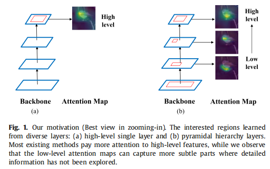

# Learning attention-guided pyramidal features for few-shot fine-grained recognition

few-shot细粒度识别(FS-FGR)的目的是在有限的监督条件下，从不同的子类别中区分出几个高度相似的对象。

然而，传统的少镜头学习解决方案通常利用图像级的特征，并致力于捕获全局轮廓，而意外地忽略了探索局部细节，导致不可避免的不明显但可区分的信息丢失问题。

因此，如何在有限的样本条件下有效地解决细粒度识别问题仍然是一个主要的挑战。

在本文中，我们倾向于提出一种有效的**双向金字塔体系结构**来增强特征的内部表示，以满足少镜头学习场景中的细粒度图像识别任务。

具体来说，我们在主干网络上部署了一个多尺度的特征金字塔和一个多层次的注意金字塔，并通过它们两者逐步聚合来自不同粒度空间的特征。

然后，我们进一步提出了一种注意导向的细化策略与一个多层次的注意力金字塔合作，以减少背景条件带来的不确定性

此外，该方法在元学习框架下以端到端方式进行训练，没有任何额外的监督。在四个具有挑战性和广泛使用的细粒度基准测试上的广泛实验结果表明，所提出的方法优于最先进的技术，特别是在one-shot场景中

# **1. Introduction**

细粒度识别，又称子类别识别，旨在在同一超类别下区分属于不同子类别的对象，这已经引起了研究界的广泛关注。

由于类内的高和类间的低方差，细粒度识别的主要任务是区分细微的视觉差异（如不同种类的鸟类），这比一般的物体识别更具挑战性。

近年来，随着卷积神经网络(CNNs)的快速发展和对视觉语义特征的强大学习能力，本研究取得了很大的进展[1-3]。不幸的是，两个主要的限制仍然没有得到解决，这使得许多现有的工作在现实应用程序中不那么实际和可伸缩。

首先，传统的工作[4,5]通常依赖于额外的注释（例如，边界框或部分注释），而预定义的手动注释通常需要专家提供特定领域的知识，这是非常耗时和成本消耗的

第二，几乎所有基于深度学习的模型[6,7]都严重依赖于大规模标记良好的训练数据，以有监督的方式进行学习。收集数据是一项非常劳动密集型的任务。更糟糕的是，我们无法获得一些特殊类别的足够的训练样本，比如濒危物种和医学图像。

人们一致认为，与机器相比，人类具有从一个或几个例子中学习的非凡能力。

在此的激励下，少镜头学习成为一种有效的解决方案，以缓解对大规模注释数据的挑战性需求。

.在这种情况下，研究人员更关注如何学习一个良好的广义模型来识别给定的一些样本的新的视觉类别，这也促进了元学习的出现。在本文中，我们将研究在一个更实际的少镜头设置中的细粒度识别问题，其中只有少数甚至一个标记样本可用。

少镜头细粒度识别(FS-FGR)是由Wei等人的[8]首次提出的，这是一种以前几乎很少有工作探索过的新任务。毫无疑问，FS-FGR不仅继承了一般的少镜头学习(FSL)任务的难度，而且在细粒度识别任务中还必须面临新的难点。

FS-FGR非常具有挑战性的主要原因有三个：

（1）低类间方差和高类内方差。细粒度数据集的一个自然特点是，属于同一子类别的对象通常会出现明显不同，而属于不同子类别的对象可能非常相似;

（2）有限数据机制。被标记的样本不足以区分在新的子类别中存在的细微的视觉差异；

（3）集群背景。杂乱的背景倾向于反对对象的存在，并在FS-FGR任务中发挥负面作用。

总之，FS-FGR的目标是充分利用可访问的标记数据来提高模型的泛化和表示能力，以满足细粒度的识别任务。

FS-FGR的关键是学习区分性特征，以区分低数据机制下的细微的视觉差异。因此，直接使用现有的FSL算法来解决FS-FGR问题是不合理的，尽管这些方法在一般的图像分类中已经取得了令人印象深刻的性能。

大多数现有的FSL算法[9–12]通常将从网络的最后一层提取的卷积池化全局特征视为图像级表示。例如，在最具代表性的基于度量学习的方法中，高级特征被直接用于通过最近邻分类器进行分类。

很明显，这些具有全局概念的深度全局特征不能为细粒度的对象捕获相当多的有区别的局部信息，特别是在低数据状态中。低级别信息可能是进一步提高性能的适当选择。

图1显示了不同层中特征激活的差异。可以观察到，高级特征包含全局语义信息，而低级特征包含局部详细信息。在现有的方法中，利用一些常见的实践（如注意机制）来加强主导对象和增强鉴别特征，而多尺度表示在对细粒度对象的上下文理解中探索较少。因此，我们能够通过增强的高级和低级信息的协作，从各种子类别中区分出几个高度相似的对象。

在本研究中，我们将所提出的方法制定为一个两阶段的元学习范式，它结合了多层次特征学习和注意导向前景细化，构建了FS-FGR的注意导向金字塔特征。所提框架的概述架构如图2所示。

该方法分别分为粗化阶段和细化阶段两个阶段。粗阶段主要获得目标的整体特征和信息前景区域。细化阶段，包括裁剪机制，以原始图像的放大版本作为输入，研究具有可分辨性更强、冗余性更少的细粒度特征。

考虑到由于粗阶段的错误定位，被注意的细化结果只是目标的一部分，我们连接了两个阶段的输出嵌入，以提高元嵌入对相似性计算的鲁棒性。为了证明所提出的模型的优越性，在四个具有挑战性和广泛使用的细粒度基准测试上进行了广泛的实验。我们的工作的主要贡献总结如下：

- 我们提出了一个两阶段的元学习框架，包括一个粗阶段和一个精炼阶段来学习注意力引导的金字塔细粒度识别(FSFGR)任务。特别是，该方法可以在没有任何额外监督的情况下进行端到端的优化。据我们所知，这是第一个成功开发的利用特征金字塔网络到FS-FGR任务模型的范式。
- 我们提出在我们的模型中联合利用一个多尺度的特征金字塔(MSFP)和一个多层次的注意金字塔(MLAP)。两者都可以插入到任何主干网络中，形成双向金字塔结构，用于从不同的粒度中提取不同的特征，然后将其进行整合，得到FS-FGR的最终相似性度量

- 为了进一步提高金字塔特征的性能，提出了一种注意导向的细化策略来增强主导对象，消除背景的负干扰。这种策略允许网络分离前景和背景，而不需要边界框/部分注释。

- 在多个细粒度基准数据集上的大量实验结果表明，所提出的注意引导金字塔特征可以有效地显著提高FSFGR的精度。

本文的其余部分组织如下。第二节介绍了一些关于少镜头学习和细粒度识别的相关工作。在第4节中提供了关于所提出的方法的每个组成部分的细节。接下来，我们分析了第5节和第6节的实验，总结了本文。

# **3. Preliminaries**

## *3.1. Problem defifinition*

在少镜头学习(FSL)问题的标准设置中，数据集通常分为三个部分，包括训练集$D_{base}$、支持集S和查询集Q

更具体地说，S和Q共享相同的标签空间$C_{novel}$，但与$D_{base}$不相交，

因此，少镜头识别任务的目标是在给定一个大规模标记数据集$D_{base}$的情况下，用来自S中只有少量标记的样本识别Q中的未标记样本 。

如果支持集S由N个类别和每个类别的K个标记样本组成，则目标识别问题也称为“Nway K-shot”少样本任务。

Episode-training机制[9]是在meta-learning范式中学习可转移知识的有效方法，其中训练过程模拟了测试阶段的设置。在这项工作中，我们还在成千上万个sampled meta-task(即“n-wayK-shot”)上优化了所提出的框架，以解决FS-FGR任务

## *3.2. Metric-learning based baseline*

基于度量学习的基线的核心思想是在潜在空间中获得具有适当的度量的广义表示。随后，通过直接比较查询样本和支持类别的代理之间的关系（例如，距离或相似性）来执行分类。

.一个简单的度量学习基线模型(即ProtoNet[10])是直接计算每个支持类别的平均向量作为其相应的代理表示，即原型，并通过对支持原型执行近向质心搜索对查询样本进行分类。

具体来说，给定一个N-wayK-shotmeta任务T={S1，S2，...，SN，Q}，其中SN表示第N个类别中的少镜头支持样本，Q表示查询样本。

因此，通过平均SN嵌入可以计算出N类嵌入的原型CN，公式为

事实上，|SN|=K，这表示在第n类中有K个样本

这里，每个样本的全局特征表示由深度网络fθ提取，其中θ表示网络参数。

对于一个查询样本xq∈Q，给定一个距离函数d<·，·>，样本xq属于类别N的预测概率可以表示为：

其中，整个模型在训练阶段的一些少镜头任务上使用交叉熵损失进行更新。

# **4. Method**

## *4.1. Overall*

该框架的概述如图2所示。据观察，我们的两阶段方法包括一个粗的阶段和一个精炼的阶段。粗阶段以原始图像作为输入，而细化阶段以细化图像作为输入。每个阶段都包括一个多尺度的特征金字塔(MSFP)和一个在基本主干上的多层次的注意金字塔(MLAP)，以探索更细粒度的特征。注意到，这两个阶段共享相同的网络架构，以从原始和细化输入中提取多粒度信息，用于最终预测。

在粗阶段，该模型以原始图像为输入，在主干上建立MSFP，生成金字塔特征，包括高级语义信息和低级纹理信息。MSFP具有双路径结构，在每个金字塔级别水平上插入一个注意门，以传递从自上而下路径到自下而上路径的详细信息。

同时，注意门在金字塔特征上建立了额外的注意层次，即MLAP。

一旦建立了MSFP和MLAP，我们就可以得到（1）根据注意引导细化策略得到一个有边界框的参与区域，（2）一个由金字塔特征和金字塔注意整合的判别特征表示，即元嵌入

.在细化阶段，该模型以从原始图像中裁剪出的放大区域（即细化图像）作为输入，提取出更具鉴别性和更少冗余的特征。值得注意的是，这两个阶段都为多尺度金字塔特征设置了单独的分类器，这只在训练阶段使用。

最后，将粗阶段元嵌入和细化阶段元嵌入连接起来，基于相似性度量对FS-FGR进行最终预测。

该方法采用端到端meta-learning的方式进行训练，没有边界框或部分注释，该框架可以灵活地扩展到CNN主干结构。

## *4.2. Multi-scale feature pyramid*

多尺度特征金字塔(MSFP)的动机是为了捕获low-level的微妙信息和高级语义信息，以便在少镜头场景中进行细粒度识别

实际上，CNN骨干通常应用一系列卷积块，生成的不同尺度的特征图记为{B1、B2、...，Bn}。

以往的许多工作都是通过只包含高级语义信息的最后一个全局特征Bn直接对通用对象进行分类的。

但是对于少镜头场景中的细粒度识别，低级特征中的详细纹理信息是必不可少的。

提出的方法通过建立多尺度特征金字塔，分析不同尺度的特征映射，同时捕获高级语义信息和低层次纹理信息。

如图2(a)所示，我们使用Conv64和ResNet12给出主干，并选择最后三个块的输出特征建立MSFP，记为{B2、B3、B4}。

受FPT[32]思想的启发，我们构建了一个自上而下的路径，将高级语义特征与低级纹理特征结合起来，以及一个自下而上的路径将微妙的信息从低层次传递到高级层次。

特别地，我们进一步引入了一个额外的注意门来更好地定位鉴别区域，并从输入中跳过连接，以保持每个金字塔级别的主干信息。换句话说，MSFP以一种显式的方式学习多种尺度特定的表征，其中包含了更具鉴别性和丰富的信息。

为了使模型充分有效地学习MSFP获得的表示，我们对上述输出进行聚合，以预测训练阶段$D{base}$中输入图像的全局语义标签。

具体来说，给定支持集S和查询集Q，我们使用$|C{base}|$类分类器对每个样本进行语义预测，并选择交叉熵损失作为整个分类损失，如下所示：

式中$(q_i，y_i^q)∈Q$和$(s_j，y_j^s)∈S$为每个集的查询样本和支持样本，θ表示模型的参数。

## *4.3. Multi-level attention pyramid*

如图2(b)所示，我们在MSFP的每个金字塔层次上引入注意门(即{A2、A3、A4})，构建一个额外的注意层次，即多层次注意金字塔(MLAP)

MLAP的意义有两个方面：

(i)通过个体注意激活重新权衡金字塔特征，有效整合不同尺度上的高级语义和低级详细信息；

(ii)基于空间激活进行注意导向细化，定位区分区域，同时减少背景噪声。

受CBAM[33]的启发，我们引入了一个更简单、更有效的注意门，沿着信道和空间维度进行自适应特征细化，旨在提高模型的泛化性能。图3为工艺流程图。

给定一个输入特征图x，通道注意图Ac和空间注意图As可以表示为

这里的W1、W2、W3是指卷积核的参数。

与以往的注意模块实现不同，我们采用了所提出的注意门，没有任何residual 操作。

具体来说，类似于最近的研究MattML[20]，它使用多个注意模块以集成的方式来捕获互补的区分部分，注意门被插入到MSFP的每个尺度中，以学习细粒度特征，以获得更高的多样性。

因此，我们建立了一个基于多尺度特征图的由{As2、As3、As4}组成的多层次注意金字塔

**Attention-based reweighting**

注意图$A_{sn}$意味着在MLAP的每个层次中对应的特征Bn的空间激活，因此我们使用Asn中每个元素的绝对值作为权重，生成权重图$\widetilde{A}_{sn}$，编码强调或抑制的位置

然后，我们可以利用$\widetilde{A}_{sn}$，通过元素级的乘法和池化操作来突出显示信息区域。如图2所示，采用蓝色流，将不同尺度的细化特征{Eb2、Eb3、Eb4}连接起来，最终形成由全局特征和局部特征组成的最终特征描述符Eb。

## *4.4. Attention-guided refifinement*

所提出的注意导向细化策略的直觉是，在空间注意地图上激活值较高的位置往往是目标对象所在的区域，因此我们采用空间注意地图，以弱监督的方式定位主导前景。

如图2(c)所示，考虑到整体结构以外的对象是我们需要的，我们进行注意力引导细化的底部（即As2）MLAP学习输入图像的最小边界框，进一步研究细化阶段的整体特征

然后，我们根据位置坐标对感兴趣的前景区域进行裁剪，并将其放大到与原始图像相同的大小，得到细化的特征

选择As2作为区域引导的原因是，低层次的特征包含了前景的细节或轮廓信息，更适合定位。通过处理空间激活图生成裁剪坐标的主要过程如图算法1所示，图4是一个可视化的例子。

·	

## *4.5. Meta embedding*

如图2(d)所示，在每个阶段，我们通过将的输出和由MLAP重新加权的MSFP的输入连接起来，对每个输入样本进行特定的元嵌入。

我们测量了FS-FGR任务的元嵌入之间的相似性，这些任务聚集了从不同尺度和阶段发现的互补信息。

在这项工作中，我们对FS-FGR任务的解决方案符合3.2节阐述的基于度量学习的基线模型，由于其简单性和有效性。值得注意的是，该方法可以很容易地扩展到任何其他基于度量学习的meta-learning方法。

具体来说，我们首先通过平均属于该类别的所有元嵌入来计算每个类别的原型，然后将查询样本视为与最接近的原型相同的类别。

注意，在粗阶段和细化阶段都将获得两个元嵌入，我们将它们连接为最终的元嵌入Mx，以表示每个输入样本x。

对于N ways K-shot元任务，给定一个查询样本xq∈Q和一组原型C={C1，C2…CN}，可以根据等式（2）计算样本xq属于N类的概率p(y=N|xq)，则将最近邻识别损失定义为：

xq∈Q和模型参数均为θ。该方法利用欧氏距离来计算xq与原型CN之间的相似性。

## *4.6. Optimization objectives*

该框架采用episode-training机制进行训练，旨在学习元学习范式中不同少镜头任务之间的可转移表征。

事实上，所提出的方法有两个目标：全分类目标(即等式（3）)和元学习目标(即，等式（5）)，它们都以端到端方式进行联合优化。

考虑到该方法有两个阶段，我们在这两个阶段都进行全分类，并从两个阶段连接元嵌入来进行元学习，因此总体目标函数可以表示为：

