# **FAPIS: A Few-shot Anchor-free Part-based Instance Segmenter**

本文是关于少镜头实例分割，其中训练和测试图像集不共享相同的对象类。

我们指定并评估了一个新的少锚基于部分的实例分割器（FAPIS）。

我们的关键新颖之处在于对训练对象类之间共享的潜在对象部分进行显式建模，这将促进我们在测试中的新类上的少镜头学习。

我们指定了一种新的无锚目标检测器，旨在评分和回归前景边界框的位置，并估计每个框内潜在部分的相对重要性。

此外，我们指定了一个新的网络来描述和加权在每个检测到的边界框内的最终实例分割的潜在部分。

我们对基准COCO-20i数据集的评估表明，我们的性能明显优于最新水平。

# **1. Introduction**

本文解决了少镜头实例分割的问题。在训练中，我们给出了许多显示目标对象类实例的支持和查询图像，目标是在对支持的地面真实实例分割掩码的访问权限下，生成正确的查询实例分割。在测试中，我们只给出一个或极少数支持图像及其基础实例分割掩码，以及一个查询图像，我们应该在目标类分割的所有实例。

在测试中，我们只给出一个或非常少的支持图像及其基本真实实例分割掩码，以及一个查询图像，其中我们应该分割目标类的所有实例

重要的是，训练图像集和测试图像集并不共享相同的对象类。

少镜头实例分割是一个基本的视觉问题。它出现在许多应用程序中，其中提供所有对象实例的手动分割是非常昂贵的。关键的挑战是如何对小数据进行可靠的培训

____

图1展示了一个常用的Mast实例分割框架，通常利用Mask-RCNN[12,43,29]。

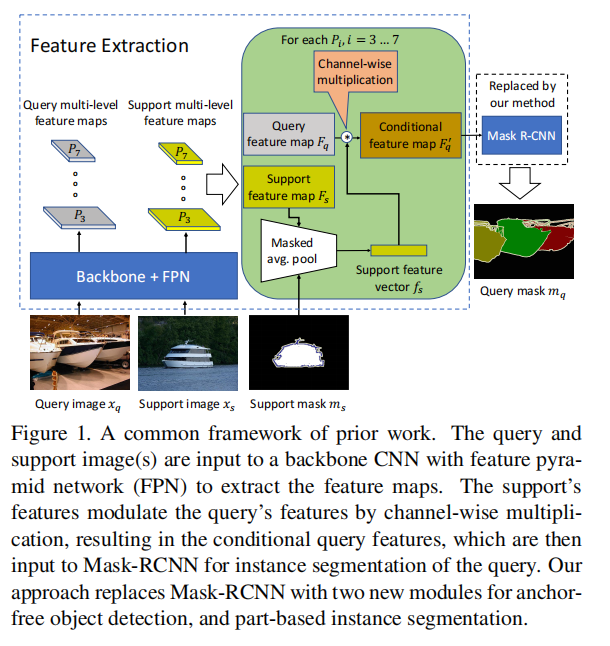

首先，将支持和查询图像输入到一个主干CNN和特征金字塔网络（FPN）[23]中，用于计算支持和查询的特征图。

其次，对于每个特征映射和每个支持的分割掩码，掩码平均池计算支持集的特征向量。

第三，使用支持集的特征向量，通过通道级乘法来调整查询图像的特征图，从而生成条件查询特征图。

最后，将条件查询特征输入到Mask-RCNN的其余模块中，生成查询的实例分割。

这个框架有局限性。

首先，Mask-RCNN是基于锚定的，因此可能会过拟合训练对象的特定大小和纵横比，这并不能描述测试中的新类。

其次，Mask-RCNN从主干中学习与特征图相关的特征原型[12]，以产生目标分割。然而，原型通常捕获在训练[12]中看到的对象的全局轮廓，因此测试中可能不适合完全分割新的不同形状的对象类

为了解决这些限制，我们提出了FAPIS——一种新的基于无锚基于部分的实例分段器，如图2所示。

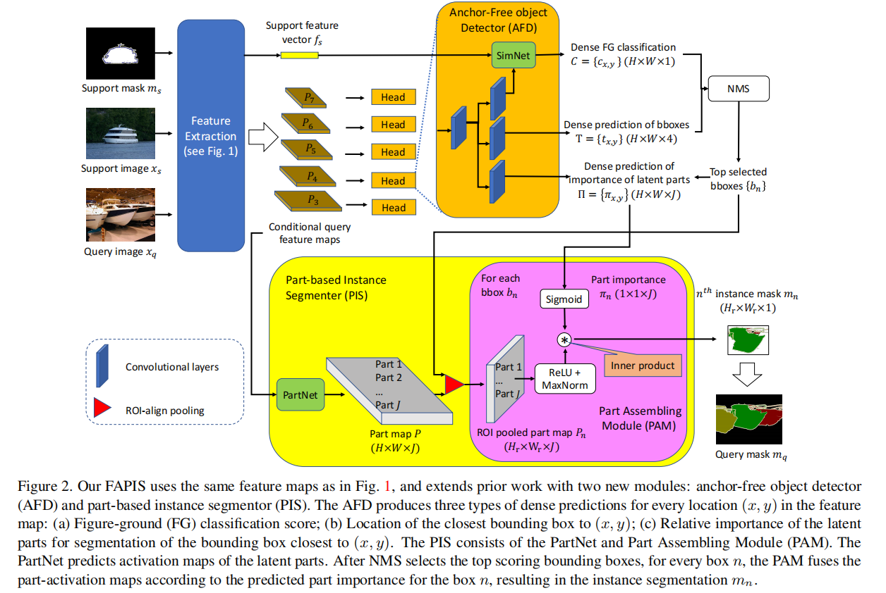

在给定的查询中，FAPIS首先检测由支持图像及其分割掩码定义的目标对象类的边界框，然后通过训练中看到的所有对象类中共享定位一组通用的潜在对象部分 对每个边界框进行分割。

我们的关键新颖之处在于对潜在对象部分的显式建模，这些部分是较小的对象组件，但可能没有意义（因为部分没有地面真相）。

与[12]的原型不同，我们的潜在部分捕获了被估计为对分割很重要的对象的某些较小的组件。

由于部分可能由不同的对象共享，包括新的测试对象类，我们期望对部件的计算将导致比上述共同框架更可靠的少镜头学习。我们不知道之前的工作，学习潜在部分的少量实例分割。

我们做出了两项贡献。

首先，我们指定了一个新的无锚对象检测器（AFD），它不使用一组具有预定义大小和纵横比的候选边界框，称为锚，并且，如[39]中所示，通过这种方式减轻了对特定锚选择的过拟合。AFD（图2中的橙色框）针对查询特征图的每个位置的三个任务：前景边界框的密集评分和回归位置，以及对分割中潜在部分的相对重要性的密集估计。**虽然所有的潜在部分都被认为与对象分割相关，但不同实例的大小和形状的差异将使一些潜在部分在每个实例的分割中比其他一些部分更重要。**因此，AFD中的第三个头部根据预期估计了在图像中预测的边界框中变化的部分重要性。AFD的输出被传递给标准的非最大抑制（NMS），以选择最高得分的边界框。

其次，我们指定了一个新的基于部分的实例分割器（PIS）。PIS（图2中的黄色框）旨在定位和集成潜在对象部分，从而在每个NMS选择的边界框内产生最终的实例分割。PIS由PartNet和部件组装模块（PAM）组成。PartNet预测潜在部分的激活图，称为部分图，其中大的激活强烈表示图像中相应部分的存在。重要的是，在图像位置（x，y）上的某个潜在部分的高激活可能对于在（x，y）上的对象实例的分割并不重要（例如，当几个潜在部分重叠但没有“覆盖”实例的整个空间范围时）。因此，对于每个NMS选择的边界框，这些部件图被PAM集成，以考虑到该框的部件的预测相对重要性。最后，所有的实例分割形成输出查询分割掩码。

我们对COCO-20i数据集[29]的评估表明，我们的性能明显优于目前的技术水平。在下面sec2.回顾之前的工作；sefc指定了我们的深层体系结构；sec4给出了我们的实现细节和实验结果；sec5.描述了我们的结束语。

# **2. Related Work**

**Few-shot semantic segmentation** 

少镜头语义分割查询中的像素与目标类，每个类由K支持示例[36,32,33,6,47,38,28,14,37,46,45,44,31,41]定义。我们的问题可以说比少镜头语义分割更具挑战性，因为我们需要额外区分同一类的对象实例

**Instance segmentation**

实例分割定位了在训练中看到的对象类的实例，而我们应该分割新类的实例。有基于proposal的方法和无proposal的方法。

前一个[12,22,4,27,1]首先检测对象边界框，然后在每个框内分割前景。

后一种[16,17,2,8]通常从语义分割开始，然后利用某些视觉线索（例如，对象中心，或Watershed energy）将相同语义类的像素聚类到实例中。

我们的FAPIS和YOLACT [1]的相似之处在于，它们都可以预测某些物体特征的激活图，并且在图像中的每个位置，它们通过加权它们对分割的相对重要性来融合这些激活图。然而，由于YOLACT并不是针对少数镜头的设置，因此有一些显著的差异。

首先，我们的FAPIS建模潜在的对象部分，而YOLACT建模的对象原型用来表示相似对象形状组的全局轮廓。

虽然后者被认为适合于实例分割，但我们的实验表明，在少镜头实例分割的测试中，在训练例子上学习到的原型不能很好地代表新的、不同形状的对象类。

**由于我们的潜在部分可能是新对象类的组成部分，因此它们很可能比原型的全局形状更好地表示新对象。**

其次，YOLACT是标准的基于锚的探测器，而我们的AFD目标探测器是无锚的，产生密集的边界盒预测。我们的方法更适合于少镜头实例分割，因为训练中的预定义锚点可能不能很好地代表测试中新对象的大小和长径比。

**Few-shot instance segmentation**

少镜头实例分割方法通常采用实例分割方法（例如，MaskRCNN [12]），以适应少镜头设置[29,43,7]（见图1）。我们的主要区别在于，用我们的AFD和PID替换了Mask-RCNN，用于建模潜在对象部件，并通过定位和组装与该实例相关的潜在部件来分割每个检测到的实例。

**Anchor-free Object Detection**

无锚点对象检测[39,48,19]预测特征图中所有像素的边界框。这与基于锚点的方法[34,24]相反，在[34,24]中，一组具有预定义大小和长宽比的边界框被分类为存在或不存在。我们的AFD遵循FCOS方法[39]，在每个位置（x，y），到最近边界框的上、下、左、右的距离通过回归预测。我们使用SimNet扩展FCOS，以更可靠地评分边界框，从而减少假报的数量。

**Part-based segmentation.** 

虽然文献中有大量的关于使用部分进行图像分类和目标检测的方法，但关于基于部分的分割的工作相对较少。

在[40,10]中，使用可变形部分模型[9]进行语义分割，在[26]推理中，对前景对象的“左”、“右”、“下”和“上”部分显示有助于实例分割。

最近的工作[21,11]解决了人类（一类）分割的问题，而不是我们的多类分割问题。我们不知道之前的工作，学习潜在部分的少量实例分割。

# **3. Our Approach**

## **3.1. Problem Statement**

在训练中，我们得到了许多对支持和查询图像，显示来自类集C1的相同目标类，以及它们对目标类的每个实例的像素级注释。

在测试中，我们给出了K个支持图像{xs}和它们的K个实例分割掩码{ms}，它们定义了从类集C2中采样的目标类，其中C1∩C2 =∅。

给定一个测试查询xq，显示与测试支持的相同的目标类，我们的目标是分割xq中的所有前景实例，即估计查询实例分割掩码mq。

这个问题被称为**1-way** ***K*-shot**t实例分割。在本文中，我们考虑K = 1和K = 5，即支持的测试设置。

值得注意的是，通过在同一个查询上运行N个支持类，我们可以轻松地将单向Kshot扩展到N路K-shot，因为每个类都可以被独立地检测到。然而，n路K-shot问题超出了本文的研究范围。

## **3.2. Multi-level Feature Extraction**

如图1所示，FAPIS首先使用带有特征金字塔网络（FPN）的主干CNN从xs和xq中提取不同分辨率的多层特征图，如[23]中所示。

对于每一个级别i = 3,4，...，7，支持特征映射$F_{s，i}$被降采样的支持掩码ms 进行掩码平均池化操作，以获得支持特征向量$F_{s，i}$。然后，对于每个级别i ,$f_{s，i}$被用于调整相应的查询特征映射$F_{q，i}$。具体来说，$f_{s，i}$和$F_{q，i}$是按通道相乘。这就给出了条件查询特征映射$F'_{q，i}$。当相应的支持度的激活量较高（或较低）时，查询的$F_{q，i}$中的通道级乘法会增加（或减少）激活量。这样，就增强了与目标类相关的信道特征，并抑制了不相关的特征，以方便实例分割。

## **3.3. The Anchor-free Object Detector**

对于每个条件查询特征图$F'_{q，i}，i=3,4，...，7$，AFD得分和回归前景边界框的位置。

下面，为了简单起见，我们放弃了特性级别的符号i，并注意到对每个级别i都进行了相同的处理。AFD的工作流程如图2中的橙色框所示。

对于$F 'q$中高度和宽度为H×W的每个位置（x，y），AFD预测：

1. 使用SimNet和分类头的Figure-ground (FG)分类评分$C = \{c_{x，y}\}∈[0,1]^{H×W}$；
2. 回归$T = \{t_{x，y}\}∈R_+^{H×W×4}$的顶部，底部，左，右距离（x，y）到最近的盒子。
3. J个潜在部分的相对重要性对于在（x，y）预测的 bounding box，$Π = \{π_{x，y}\}∈R^{H×W×J}$。

**SimNet and Classifification Head**

之前的工作[43,29]，使用支持特征向量通过通道级乘法来调制查询特征映射，从而检测目标对象。然而，在我们的实验中，我们观察到这种方法导致了很高的假阳性率。为了解决这个问题，我们指定了SimNet，它由一个完全连接的层块和一个单个卷积层组成。第一个块作为输入fs，并预测顶部卷积层的权值。这适用于在测试中处理新的类。然后，顶部卷积层以$F 'q$作为输入，将得到的特征图传递给FG头部，以预测每个位置（x，y）的FG分类得分C。通过这种方式，SimNet学习了如何更有效地调制$F 'q$，扩展了[43,29]中的信道乘法。

对于训练FG头，我们使用焦点损失[24]：

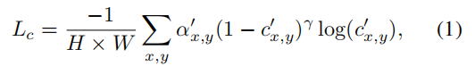

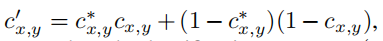

$c^*_{x，y}∈\{0，1\}$是（x，y）地面真实分类得分

$α^*_{x,y}=c^*_{x，y}α+(1-c^*_{x，y})(1-α),α∈[0, 1]$是一个类别的平衡因素 γ∈[0,5]是一个聚焦参数，可以平稳地调整简单的例子降低加权的速率

**Bounding Box Regression.** 

对于训练box回归头，我们使用一般的交叉过并集（GIoU）损失[35]：

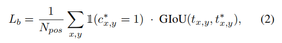

$t^*_{x，y}∈R^4_+$是从(x，y)到地面真相的顶部，底部，左边，右边的盒子距离的向量 。1（·）是如果（x，y）属于地面真相框，则值为1的指标函数，否则为0；

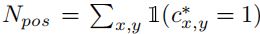是特征图中属于前景的位置的数量。

**Part-Importance Prediction Head**

对于$F'_q$中的每个位置（x、y），这个头预测了潜在部分的相对重要性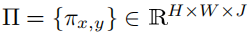

当联合使用来估计预测每个（x，y）的边界框的分割掩码时，这个部分重要的预测试图捕获潜在部分之间的不同依赖关系。

请注意，我们不能为训练这个头指定一个明确的损失，因为这些部分是潜在的，并且在我们的训练集中没有注释。重要的是，我们确实通过反向传播实例分割损失来训练这个头，如Sec3.4所述。

AFD的预测被转发到标准NMS，以选择得分最高的n = 1，…，所有特征金字塔级别的n个边界框。

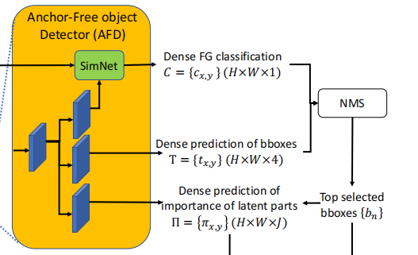

## **3.4. The Part-based Instance Segmenter**

PIS如图2中的黄色方框所示。PIS由PartNet和PAM组成。

**The PartNet**

PartNet以最大的条件查询特征图作为输入，

具体来说，$F '_{q，3}$，并预测J个潜在部分的激活图，或简称的部分图，$P∈R^{H×W×J}$。

J是一个超参数，我们通过实验将其设置为一个最优值。

P在位置（x，y）的高激活强烈表明该部分在（x，y）的存在。

对于每个NMS选择的边界框$n = 1，…，N$, 我们对P进行region-of-interest (ROI) aligned pooling  推导出 J ROI-aligned pooled part maps $P_n∈R^{Hr×Wr×J}$，Hr和Wr是参考值的高度和宽度，以确保N个边界框的合并特征具有相同的参考尺寸。。

PartNet是通过PAM模块反向传播实例分割损失来学习的，因为潜在部分没有注释，而且我们不能定义训练PartNet的显式损失。

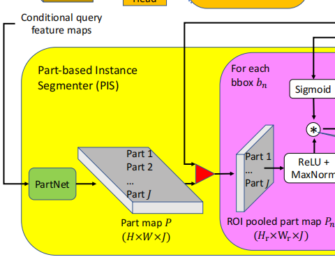

在位置（x，y）一个在Pn中强烈表示存在某种潜在部分的存在  对于边界框n中的对象实例的分割可能不重要（例如，当这个信息是冗余的时候，许多其他潜在部分在Pn中（x，y）上也可能有很高的激活）。对于每个位置，我们得到了类分数、边界框和部分重要性πn的三元组。因此，对于每个边界框n = 1，…，N，以下PAM模块将合并部分映射$P_n∈R^{Hr×Wr×J}$和用于分割实例n的估计部分重要性$π_n∈R^J$作为输入。

**The PAM** 

PAM计算每个边界框的分割掩码，n = 1，……，N

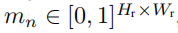

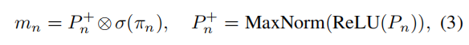

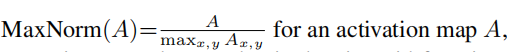

⊗为内积，σ为sigmoid函数。注意，(3)中的⊗要求将张量$P_n^+$被修正为一个大小矩阵$(H_rW_r)×J$。因此，算子⊗通过它们各自对于分割的重要性来融合部分映射

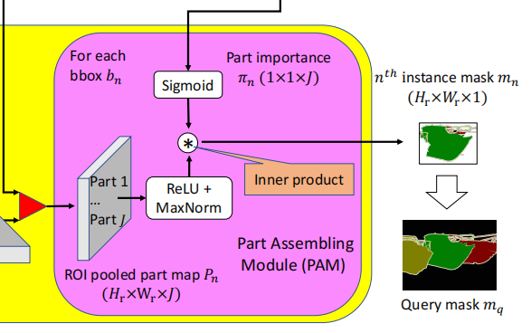

(3)中的MaxNorm-ReLU复合函数和的sigmoid使部分映射及其重要性有[0,1]的非负值。这种设计选择的灵感来自于众所周知的非负矩阵分解（NMF）[20]，因此，如果实例分割矩阵$m_n$可用，(3)中的表达式将等于$m_n$的NMF变成非负的$P_n^+$和$σ(π_n)$。

这种设计选择可以方便地用于规范学习的PartNet和AFD的头部，以预测部分的重要性。

具体来说，在学习中，我们最大化预测的$P_n^+$和地面真实实例分割掩模$\{m^∗_n： n = 1，…，D\}$计算的NMF基之间的相似性，其中D是训练集中的实例总数。这种基于NMF的学习正则化使得我们的$P_n^+$是稀疏的，这证明了我们的解释，即$P_n^+$代表了对象实例中较小的潜在部分。

由(3)给出的预测$m_n$，相对于地面真实实例分割掩模$$m^∗_n$$产生以下分割损失：

![ldice是地图A和地图B之间的骰子损失[30]。](image/image-20221202173603235.png)

ldice是地图A和地图B之间的dice损失[30]。

Ls通过PAM反向传播到PartNet和AFD，以改进预测P和Π，从而使Ls最小化。

____

我们通过使用地面真实实例分割掩模的NMF来规范这种学习，如下所示。训练数据集中所有对象类的所有地面真实分割$\{m^∗_n： n = 1，…，D\}$首先被调整大小并堆叠成一个大的$(HrWr)×D$矩阵$M^∗$。

然后，我们将NMF应用为$M^∗≈P∗U$，其中P∗为大小为$(HrWr)×J$的非负基矩阵，U为大小为$J×D$的非负权矩阵。乘积$P∗U$是$M^∗$的低秩近似。由于非负约束，P∗被迫是稀疏的。

图3显示了我们在COCO-20i数据集[29]中的地面真实掩模${m^∗_n}$上计算的的NMF的基P∗。因此，P∗被解释为存储M∗中所有训练对象类的部分。方便的是，NMF，即P∗，可以在学习之前预先计算。

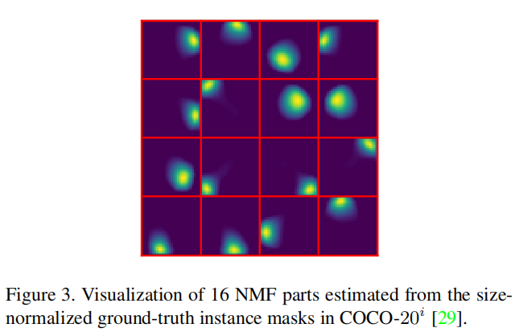

我们使用P∗来规范我们对PartNet的学习，使它产生类似于P∗的部分映射$P_n^+$。请注意，$P_n^+$中的J个潜在部分可能与$P^∗$中存储的NMF的J个基有不同的索引。因此，我们使用基于他们的交叉过联合（IoU）得分的Hungarian algorithm[18]来识别潜在部分$P^+_{n，j}$和基$P^∗_{j'}$，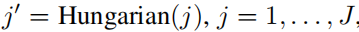之间的一一对应关系。利用此对应关系，我们将NMF正则化损失指定为

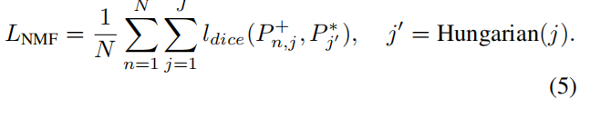

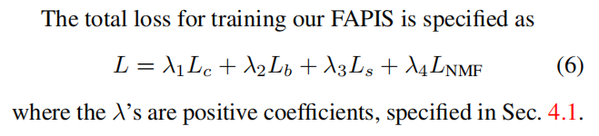