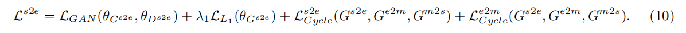

# TricycleGAN: Unsupervised Image Synthesis and Segmentation Based on Shape Priors

医学图像分割通常用于分离感兴趣的区域，如器官和病变。

目前，深度学习是自动分割的最新技术，但通常受到需要监督训练的限制，这些大数据集已由训练有素的临床医生手动分割。

半监督和无监督图像分割的目标是大大减少，甚至消除，对训练数据的需要，从而在训练分割模型时尽量减少临床医生的负担。

为此，我们引入了一种新的能够进行无监督和半监督图像分割的网络架构，称为TricycleGAN。

该方法使用三种生成模型来学习医学图像和使用边缘maps作为中间步骤的分割maps之间的转换。

与其他基于生成网络的方法不同，TricycleGAN依赖于形状先验，而不是颜色和纹理先验。

因此，它特别适合于医学成像的几个领域，如超声成像，其中通常使用的视觉线索可能缺失。

我们在肾脏超声图像的临床数据集和基准的ISIC 2018皮肤损伤数据集上进行了使用TricycleGAN的实验。

# **1 Introduction**

体内医学成像是一种临床应用的重要技术。然而，由于目前的成像技术获得的图像质量较差，分析往往具有挑战性。为了利用这些技术，目前的医疗实践严重依赖于在解释医学图像[1,2]方面高度专业化的临床医生

分割，或从图像中识别和隔离感兴趣的区域（roi），通常是医学图像分析中的一个关键步骤。对于人类和机器阅读器，分割通过识别相关组织和/或物体，如器官或病变，帮助提取临床重要特征，而不受图像中捕获的非相关组织的干扰[3]。由于人工分割，即经过适当训练的临床医生手工分割图像，是耗时、昂贵和主观的，因此在开发算法上投入了大量的精力可以自动为下游分析提供准确和可靠的分割[4]。这导致了语义分割子域的增长，即通过像素与分类标签的关联来进行图像分割

在这里，我们提出了一种新的图像分割方法，可以训练无监督或半监督，从而大大减少，甚至消除，人工分割图像的需要。受训练有素的临床医生在进行人工分割时使用roi形状及其内部结构的解剖知识的启发，我们依靠形状先验生成合成标记数据，可用于训练分割模型。形状先验是通过从ROI形状模板中生成合成的医学图像，使学习生成的分割-医学图像对之间的映射成为可能。我们将在第4节中扩展这种方法的基本原理和方法。

我们的新架构TricycleGAN由三个生成对抗网络（GANs）组成，特别是三个连接在一起的CyclelGANs[5]。

每个CycleGAN学习三种映射中的一种：

1. 原始医学图像和来自这些医学图像的边缘地图之间的映射，
2. 这些医学图像中边缘地图和对于感兴趣区域的分割地图之间的映射，
3. 以及分割地图和医学图像之间的映射。

总的来说，TricycleGAN使用一个自适应的周期一致性损失来统一这三个子网络，从而通过学习生成真实的图像-边缘-分割三联体来学习分割医学图像。

正如在第4节中进一步解释的那样，在该过程中包含边缘映射提供了一个中间步骤，引入了差异和复杂性的来源，允许TricycleGAN将简单的ROI模板转换为现实的医学图像，同时保留预测分割地图所需的必要形状信息。

为了展示这种新方法的价值，我们使用两个不同的数据集来评估我们的方法：超声图像的任务是分割肾脏，和ISIC 2018皮肤病变分析竞争数据集，其任务是分割皮肤镜图像中的皮肤病变。

# **2 Related Work**

在采用自动图像分割的深度学习方法之前，基于边缘检测[6]、区域增长[7]、轮廓建模[8]和纹理分析[9]的技术依赖于使用明确定义的约束和标准检测图像中对象之间的统计差异。这些方法通常在医学成像应用中表现不佳，因为通常使用的度量（如对比度梯度）不够稳健，无法克服噪声图像（如超声成像）和伪影（如周围组织）带来的挑战

目前的图像分割策略旨在克服使用监督深度神经网络克服这些限制，该网络可以通过发现暴露于大量标记样本的鉴别特征的组合，来学习识别图像中的不同对象和roi。卷积神经网络（CNNs）在语义分割和各种其他计算机视觉应用[10,11,12,13]方面特别成功。值得注意的是，全卷积网络（FCNs）省略了标准cnn中用于按类标签对像素进行分组的全连接层，而支持用于估计整个图像[14]的分割概率图的反褶积层。编码-解码器网络最初是通过预先训练的VGG16 CNN架构[15]的解卷积引入的，也基于类似的原理。cnn还与条件随机场（CRFs）配对，以更好地利用属于同一对象[16]的像素之间的空间相关性。

这些面向分割的cnn的变化在医学成像[17,18,19,20,21,22]的临床应用中也发挥了重要作用。U-net [23]是一种FCN，在各种医学图像分割任务（如[24]）中表现良好，包括3D分割任务[25]。已经开发了各种扩展，包括合并注意机制[26]，或通过改变模型[27]的初始化。

虽然在许多领域都取得了成功，但基于cnn的方法在某些条件下往往表现较差，这在医学成像应用中经常观察到。一个问题是，获得空间和语义连续的解决方案通常需要对得到的分割图进行大量的后处理。在存在伪影和干扰物的情况下，例如当只有一个是期望的ROI时，存在多个显著器官，这些方法可能会导致很大的误差。幸运的是，最近的工作已经开始解决这个问题，[28,29,30]。然而，现实世界使用的另一个重要限制是，深度学习方法通常需要大量的训练数据，这通常意味着数百或数千个地面真实分割，必须由放射科医生在其临床职责之外手工抽取。

虽然一些成功已经看到无监督CNN方法在某些条件下，例如，与W-net[31]（通常只有成功分割不同重叠对象任务）或DeepCo3[32]（依赖于一个图像中同类对象的多个实例之间的特征相似性像），无监督解决方案为一些医疗应用程序可能需要一个完全不同的方法。

使用GANs已被提出作为一种解决对地面真实分割标签的需要的方法。GANs通过使用图像对[33]训练来学习图像到图像的转换，因此可以通过监督[34,35,36,37,17]或半监督[38]方式的图像-分割图对来用于分割任务训练。**GANs的一个有用的功能是，它们能够通过生成真实的合成数据来增强训练数据集，从而需要相对较少的标记训练数据**[39,40,41]。为了使GANs在无监督的方式下学习分割，已经使用了重组方法。例如，SEIGAN可以通过利用背景和前景对象之间的不同特征统计以及相似背景[42]之间的相似特征统计来分割前景对象。另一种最近的方法，ReDO，使用场景分解来分离图像中的对象，假设每个对象对于特定的属性是不同的，如颜色和纹理[43]。

图像分割的无监督方法对所期望的ROI与图像中的其他对象不同的方式做出了合理的假设。然而，通常依赖于特征，如颜色、纹理或亮度，可能不能很好地延续到许多医学成像领域。在器官分割的情况下，如本研究中使用的肾脏超声数据集所示，**临床医生必须主要依靠先验的解剖知识和经验，以便在没有清晰的边界时估计肾脏的轮廓**。这项任务由于肾脏甚至可能不是图像中最突出的物体而变得特别困难，这使得甚至来自其他领域的临床医生也发现这项任务非常具有挑战性。

填补以前的方法留下的空白，TricycleGAN旨在克服这些挑战，通过为ROI的形状先验，只使用未标记的医学图像生成合成图像分割地图对，模拟放射科医生使用先验解剖知识来执行类似的分割任务。TTricycleGAN是CycleGAN [5]的扩展，它使用了三个生成器：第一个在分割图和边缘图之间转换，第二个在边缘图和医学图像之间转换，第三个使用周期一致性损失将医学图像转换回分割图。

图1给出了TricycleGAN管道的说明，图2显示了使用ISIC 2018皮肤病变数据集的管道的每个主要步骤的输出。

# **3 Data and Preparation**

## **3.1 Dataset 1: Renal Ultrasound Images**

我们使用了为产前肾积水开发的肾脏超声图像数据集，这是一种先天性肾脏疾病，其特征是肾脏内过度和潜在危险的液体潴留。该数据集包括来自773名在多个医院就诊的患者的2492张2D矢状肾超声图像。该评估集由438张图像组成，这些图像由一名训练有素的外科泌尿科医生手动分割。在去除评估集中代表的相同患者的训练图像后，保留918张未标记图像进行训练。在训练过程中，使用20%的图像的随机样本进行验证。每一种级别的肾积水在评估集中大致均匀地表示。

由于图像质量差、肾脏图像轮廓不清晰，以及不同程度的肾脏疾病所引起的巨大变化，这是一个困难的图像分割数据集（见补充图S1）。此外，该数据集的一个主要挑战是，两个最突出的边界是探头超声成像固有的外部超声锥和肾脏内部暗区域，这是由肾积水液体潴留引起的。由于这两者都不是期望的ROI，因此两者在分割肾脏方面都有误导性。关于该数据集的进一步细节可以在[44,45,46]中找到。

## **3.2 Dataset 2: Skin Lesion Segmentation**

我们使用ISIC 2018病变边界分割挑战数据集[47,48]来更直接地比较TricycleGAN与其他方法。所提供的2075张图像、100张验证图像和3 519张评价图像的训练集用于本研究的预期目的。通过证明TricycleGAN在这个基准数据集上也很成功，我们表明它并不局限于一个域和成像模式。此外，我们还展示了一种方法，通过它，TricycleGAN也可以适应利用常用的特征，如颜色。

## **3.3 Image Preprocessing**

我们采用了对[44]中描述的肾脏超声图像进行预处理的类似方法。我们裁剪图像以去除白色边界，对图像进行去噪以去除成像过程中与超声探头的干扰所引起的斑点噪声[49]，并重新缩放到256×256像素以保持一致性。我们删除了临床医生使用预先训练过的高效和准确的场景文本检测器（EAST）[50]所做的文本注释。然后，我们将每个图像的像素强度从图像上原始像素强度的第2百分位修剪到第98百分位之后，将其归一化为从0到1。此外，我们使用对比度有限的自适应直方图均衡化来增强每个图像的对比度，剪辑限制为0.03 [51]。最后，在交叉验证过程中，我们通过训练集的均值和标准差对图像进行归一化处理。我们没有对ISIC皮肤病变图像进行预处理，除了将其大小调整为256×256像素。

# **4 TricycleGAN**

## **4.1 Rationale**

类似于如何利用其他图像特征进行语义分割，我们假设特定图像分割任务的ROI形状在统计上比背景对象更相似。

为了利用这个假设，我们另外假设ROI的边界足够突出，以出现在相应的边缘图中（尽管正如前面在3.1节中提到的，这并不要求ROI边界是图像中最突出的边界，并不排除部分遮挡）。

基于这两个假设，我们使用了一个基本的模板形状，它适用于表示给定对象类的roi。

例如，**肾脏和皮肤病变的roi大致为椭圆形**。由于TricycleGAN增加了所需的复杂性，使结果合成图像本身真实，构建模板可以像绘制一个具有随机形状、大小和位置的椭圆一样简单。这部分过程的细节见第4.2节。

注意，通过显式构造简单的ROI并从中生成合成图像，我们还为我们的模型提供了合成图像的地面实况分割标签。正是由于这个原因，我们不能用生成模型来生成潜在的ground truth。相反，在应用领域中生成真实图像所需的方差和复杂性水平由TricycleGAN中的下游生成器引入。

除了类内ROI形态的潜在巨大变化之外，医学成像分割的一个常见挑战是存在伪影和干扰物（即，在边缘图中也明显出现但不是预期ROI的一部分的对象或解剖特征）。我们通过使用生成模型来学习从真实图像中提取的边缘图的统计信息，从而同时克服了这两个挑战，这些统计信息可用于从生成的模板ROI中构建真实的边缘图（见第4.4节）。然后，通过从合成边缘图构建应用领域中的合成图像，TricycleGAN生成可用于分割训练的分割图-边缘图-医学图像三元组。

使用边缘图作为中间步骤的原因是，可以使用已知的统计方法从实际训练数据中容易地提取边缘图，从而提供一组真实图像-边缘图对的训练集，可用于在监督下学习映射。由于无法从真实图像中提取分割图，因此无法学习直接映射。相反，如第4.4节所述，我们引入了一种块遮挡方法，用于学习真实边缘图的统计信息，并使用该方法从合成分割图生成真实的边缘图，从而以所需的复杂度完成从合成分割地图到合成边缘图再到合成图像再到预测分割地图的循环。

## **4.2 Constructing Synthetic Segmentation Maps**

当构建ROI模板或合成分割图作为地面真实分割图时，主要关注的是捕获在真实数据中可以期望的形状和位置的分布。对于许多应用程序来说，这操作相对简单。

为了生成ROI，我们创建一个随机椭圆，该椭圆具有随机原点（从中心水平和垂直偏移图像大小的1/8）、旋转（任意角度）以及长轴和短轴（长轴长度在图像长度的1/4和1/2之间，短轴长度在长轴长度的0.5和0.9倍之间）。椭圆本身用作地面真相分割掩码。

对于超声数据集，我们需要添加超声锥，因为它的轮廓比所需的肾脏ROI更加突出。通过创建一条随机的底部曲线（一个部分完整的椭圆）和一个延伸到图像上边界之外的三角形（以便在顶部截断），也可以随机生成圆锥体。所生成的肾脏ROI中不位于所生成的超声锥内的所有像素被移除，以模拟仅部分捕获的肾脏的常见情况。在构建ROI模板时，可以对其他应用程序进行类似的调整，在这些应用程序中，突出的形状可能会成为干扰因素。

## **4.3 Extracting Edge Maps from Real Images**

从真实图像中提取的边缘图用于训练合成边缘图生成器。我们使用VGG16模型[15]和Liu等人[52]中预处理的Richer卷积特征从真实医学图像中提取边缘图。根据此方法的建议，我们使用结构化森林的非最大抑制来进一步微调输出边缘图，以进行边缘细化[53]。

## **4.4 Generator 1: Segmentation Map to Edge Map Translation**

为了生成与真实数据中观察到的结构变化的图像，我们首先将合成分割图转换为真实的边缘图，包括伪影和自然不规则

使用TricycleGAN中的第一个生成模型$G^{s2e}$。与TricycleGAN中使用的所有生成器一样，$G^{s2e}$基于[33]中定义的pix2pix架构。

为了训练生成器$G^{s2e}$以产生真实数据中的适当变化，我们将此问题作为图像完成问题（例如，[54]），并使用我们先前提取的真实边缘图。
然而，由于$G^{s2e}$采用非常简单的合成分割图作为输入，而没有任何对应的真实边缘图（因为从真实图像中提取的边缘图没有成对的分割图），因此它自己学习生成非常简单的边缘图。这部分是因为使用用于训练TricycleGAN的循环一致性损失（见下文第4.7节）鼓励了不太复杂的边缘图。因此，我们结合了一个基于pix2pix架构的附加生成器，称为$G^{pf}$（补丁填充生成器），它通过添加伪影和更大程度的不规则性来增强$G^{s2e}$生成的边缘图的复杂性。因此，$G^{s2e}$生成的边缘图被分块遮挡，然后传递到$G^{pf}$以增加复杂性。

我们在edges2handbags数据集上对$G^{pf}$进行预训练[55]，然后使用随机生成的方形掩模在从部分遮挡后的实像训练集中提取的边缘图上对其进行进一步训练。对于每个提取的边缘图，最多使用10个长度在图像长度的1/8和1/2之间的非重叠方形掩模。完成此操作后，$G^{pf}$的权重将被冻结，使其能够产生伪影和必要的复杂度来模拟真实的边缘图，而$G^{s2e}$不会遇到这种情况，而不会因循环一致性损失而损失复杂度。此外，这允许我们使用$G^{pf}$作为正则化器来帮助训练$G^{s2e}$。具体而言，用于正则化$G^{s2e}$的L1损失是通过取$G^{s2e}$和$G^{pf}$生成的输出之间的差来计算的，从而鼓励$G^{s2e}$增加其输出的复杂性，从而为$G^{pf}$提供更好的增强起点，并抵消循环一致性损失所带来的一些简单性。

一个自然的问题是为什么TricycleGAN不能在没有$G^{s2e}$的情况下简单地使用$G^{pf}$。实际上，$G^{pf}$要求其权重被冻结，以保持其生成工件的能力。因此，它没有学会如何将网络的整体损失降到最低，从而打破了整体模型的统一，最终导致TricycleGAN的性能不理想。如果允许Gpf的权重改变，循环一致性损失将导致它逐渐简化其边缘映射，直到不再产生所需的复杂度。或者，在不受$G^{pf}$影响的情况下使用Gs2e会导致过于简单的边缘图，无法为TricycleGAN的后续生成器提供足够的挑战。通过使用$G^{pf}$既作为$G^{s2e}$输出的增强器，又作为其训练的正则化器，可以实现TricycleGAN所需的复杂度和最佳训练的平衡。

实际上，当$G^{s2e}$使用$G^{pf}$进行训练时，我们首先使用简单的Sobel滤波将分割图转换为边缘图，以便下游生成器可以生成有意义的输出。
经过250个周期的训练TricycleGAN之后，使用$G^{s2e}$的输出与Sobel滤波的概率线性下降，直到在500个周期达到零。从那时起，Sobel过滤被中断，$G^{pf}$仅将$G^{s2e}$输出作为输入。通过这种方式，TricycleGAN的下游生成器仍然可以学习生成有意义的输出，而$G^{s2e}$学习最初能够生成边缘图，并且随着$G^{s2e}$学会生成比Sobel滤波更复杂的边缘图，Tricycle GAN作为一个整体可以继续改进

最后，$G^{s2e}$可用于从合成分割图中构建逼真的边缘图，其中包含伪影和$G^{pf}$增加的复杂度。

图2提供了管道每个阶段的生成器输出示例，比较了训练早期阶段的$G^{pf}$输出，当使用Sobel滤波时，将其用于训练后期阶段。

## **4.5 Generator 2: Edge Map to Medical Image Translation**

作为TricycleGAN中的第二个生成器，$G^{e2m}$将边缘贴图转换为真实图像。如前所述，我们在这里使用*pix2pix*模型。$G^{e2m}$使用提取的边缘图和通过我们的训练数据获得的实像对进行训练，同时当合成图像用作输入时，还通过循环一致性损失进行训练，作为TricycleGAN的一部分。经过训练后，生成器用于将先前从$G^{s2e}$构建的边缘图转换为真实的合成医学图像

## **4.6 Generator 3: Medical Image to Segmentation Map Translation**

作为TricycleGAN中的最终生成器，$G^{m2s}$通过将真实的或合成的图像转换成相应的分割图来进行图像分割。同样，我们在这里使用pix2pix架构。利用$G^{e2m}$创建的合成分割地图及其对应的合成医学图像对该模型进行训练。由于训练数据没有真实的图像分割地图对，$G^{m2s}$只使用合成图像进行训练。因此，它所接受的训练比其他生成器要少得多。用于训练每个生成器的具体损失函数如下所示。

## **4.7 Training Scheme and Loss Functions**

### **4.7.1 Training Pipeline**

使用未标记的真实图像和标记的合成图像的组合来训练TricycleGAN。因为我们从真实图像中提取边缘图，所以图像-边缘图对是可用的。使用块遮挡方法，使用真实边缘图对Gpf进行预训练，如第4.4节所述。当使用冻结的Gpf权重训练TricycleGAN时，Gpf的输出用于计算Gs2e的L1损失。实像边缘图对也用于训练Ge2m。然而，由于没有可用的分割图，当TricycleGAN使用真实图像进行训练时，无法计算Gm2s的训练信号。取而代之的是，每20张图像都是使用一张经过整个网络的合成分割图生成的，这意味着Gm2s的训练速度比其他生成器慢。

为了确保生成器Gm2s能够学习生成准确的分割图，我们通过使用CycleGAN将循环一致性损失首次引入到对抗性学习中来约束网络的输出空间。这促使Gm2s在训练期间将图像转换回输入到网络的原始图像，即合成分割图[5]。使用循环一致性损失的第二个动机是，它不假设输入和输出的嵌入空间相同（在我们的例子中，分割图几乎保证位于比医学图像本身更低的维度嵌入空间中），这在TricycleGAN中提供了一些所需的灵活性

当使用合成图像进行训练时，在初始分割图通过整个网络后计算每个可训练生成器的循环一致性损失，这为Gm2s提供了训练信号。然后，**由Gm2s生成的预测分割图被循环回网络的起点，并再次通过每个生成器，并且它们在第二遍的输出与第一遍的输出之间的差用于计算循环一致性损失**（注意Gs2e使用Gpf的输出）。这使得TricycleGAN能够尽可能地利用真实数据，同时使用合成数据来训练生成器链，使其成为一个具有凝聚力的网络，为特定目的服务。由于TricycleGAN使用三个可训练的生成器，而不是CycleGAN的两个，因此我们使用了一个自适应的循环一致性损失，该损失分为三部分；每个生成器一个。培训管道如图1所示，下文提供了如何将每个生成器作为网络的一部分进行训练以及如何定义自适应循环一致性损失的进一步细节。

### **4.7.2 Training Generator** *$G^{s2e}$*

为了训练生成器Gs2e，我们从中定义的对抗性损失开始

θG和θD是在GAN中配对的发生器G和鉴别器D的参数。

是传统的对抗性损失[56]，其中x是来自未知分布Px的训练集X的真实图像，z是来自高斯分布PZ的随机噪声向量，和

只是生成的图像和目标图像之间的L1损失

当使用真实图像进行训练时，将$G_{s2e}$的目标图像定义为真实提取的边缘图，生成的图像为Gpf（Gs2e (x)），如第4.4节所述。

这个损失函数和pix2pix网络架构的完整细节可以在[33]找到。

为了训练TricycleGAN中的生成器作为一个内聚的网络一起工作，我们还为每个生成器包括了一个周期一致性损失。

对于边缘map x1，满足Gs2e的循环一致性

x1->

x1

Gs2e的周期一致性损失部分定义为

$L^{s2e}_{Cycle}$的计算方法是将生成的边缘图通过TricycleGAN中的生成器，生成一个具有Ge2m的图像，得到由Gm2s生成的预测分割图，然后作为输入，生成另一个具有Gs2e的边缘图。利用原始的真实边缘图和通过TricycleGAN进行一次循环后生成的新生成的边缘图来计算Gs2e的循环一致性损失。

### **4.7.3 Training Generator** *G**e*2*m*

生成器Ge2m的训练方法类似于Ge2m。除Ge2m的目标图像为医学图像域外，对抗性损失和L1损失的定义与之前相同。

由于Ge2m在tricyclegan周期的不同点开始，它贡献了总周期一致性损失的第二部分：

其中x2是来自应用域的真实图像，y是由Ge2m生成的图像的尝试复制。

### **4.7.4 Training Generator** *G**m*2*s*

Gm2s只有在地面真实分割图可用时才能进行训练，因此只有在合成分割图通过TricycleGAN时才会接收到训练信号。重要的是，gm2s不是GAN的一部分，因此不存在对抗性损失。相反，它作为一个分割模型，因此使用它的部分周期一致性损失、二值交叉熵损失和Tversky损失进行训练。

对于Gm2s，我们可以将地面真实分割x3与其预测分割之间的循环一致性损失定义为

二值交叉熵是所有i个像素的交叉熵损失之和的定义为 对于像素级的地面真实标签yi和模型预测ˆyi。

最后，我们添加了Tversky损失，这是dice损失的一般化[57]，以提高分割精度。给定两类问题的Tversky相似指数

Tversky损失只是LT = 1−Ti。参数α和β允许将重点转向尽量减少假阳性或假阴性，这取决于数据中显示的类别不平衡。这里我们使用α = β = 0.5来保持平衡的强调。

### **4.7.5 Total Loss for Training TricycleGAN**

为了训练发电机Gs2e，我们将Gs2e的周期一致性损失(Eq4)，和Ge2m (Eq5)，以及它的对抗性损失(Eq2)及其L1损失(Eq3）要获取的信息

注意，L s2e Cycle和L e2m Cycle的和类似于CycleGAN中前和后循环一致性的和。

同样，对于Ge2m，总损失为

为了训练Gm2s，我们结合了每个可训练生成器的周期一致性损失(Eq。4, Eq.5、和等式6)，二元交叉熵损失(Eq。7)和Tversky的损失(Eq。8)，以获取

对于上述每一个综合损失，λ1 = 100推荐在[33]和λ2 = 10。

### **4.7.6 Training Parameters**

所有的生成器都使用Adam优化器进行训练，学习率为2−4，批处理大小为32。当lm2在连续20个时期没有改善时，训练被认为是完成的。

### **4.7.7 Data Augmentation**

在训练过程中，图像被轻微地改变以引入额外的方差，从而允许生成的模型学习额外的鲁棒性并提高性能。这两个数据集的变化如下：沿着两个轴进行多达30个像素的随机平移，以及一个概率为0.5的水平翻转。2018年ISIC 2018训练数据：r∈{0，π/2，π，3π/2}的随机旋转，高达20%的亮度变化，50%的对比变化，5%的色调变化，50%的饱和度变化。

我们还使用样式转换来为ISIC 2018数据集提供额外的数据增强。这使得生成器能够产生更多种类的皮肤损伤，特别是为了更好地捕获不同皮肤颜色和伪影的统计数据（见图S2）。这使得TricycleGAN除了利用它所依赖的通常的形状特征外，还可以利用颜色特征。而不是将每个风格变体作为单独的训练图像，而是将风格作为一个额外的输入通道（或维度）合并，使网络能够更有效地学习为图像的不同风格变体生成相同的分割。