# **Asymmetric Deep Supervised Hashing**

哈希由于其存储和搜索能力，已被广泛应用于大规模近似最近邻搜索。

最近的研究发现，在许多应用程序中，深度监督哈希可以明显优于非深度监督哈希。然而，大多数现有的深度监督哈希方法都采用对称策略来学习查询点和数据库（检索）点的一个深度哈希函数。这些对称深度监督哈希方法的训练通常是耗时的，这使得对于大型数据库的案例很难有效地利用监督信息。

本文提出了一种新的深度监督哈希方法，称为非对称深度监督哈希（ADSH），用于大规模的最近邻搜索。ADSH以不对称的方式处理查询点和数据库点。

更具体地说，ADSH只学习查询点的深度哈希函数，而数据库点的哈希代码是直接学习的。ADSH的训练比传统的对称深度监督哈希方法要有效得多。

实验表明，ADSH在实际应用中能够达到最先进的性能。

# **Introduction**

随着实际应用中数据的爆炸性增长，最近邻（NN）搜索（Gionis、印地克和莫特瓦尼1999；安多尼和印地克2006；安多尼和拉曾什廷2015）引起了机器学习社区的广泛关注，在信息检索、计算机视觉等领域有很多应用。

然而，在大数据应用程序中，对于给定的查询，搜索精确的最近邻的时间通常是昂贵的或不可能的。因此，近似最近邻（ANN）搜索（Andoni和Razenshteyn 2015）近年来越来越受欢迎。

作为一种广泛应用于人工神经网络搜索的哈希技术（韦斯、托拉尔巴和费格斯2008；张等2010；内沙等2013；刘等2014；林等2014；2014a；沈等2015b；2015a；宋等2015；谢、沈、朱2016；2016b；刘等2016a；石等2017；沈等2017；达斯古普塔、史蒂文斯和纳夫拉卡2017）旨在将数据点编码为紧凑的二进制哈希码

由于二进制哈希代码表示，哈希方法可以提供常数或次线性搜索时间和显著降低了数据点的存储成本（Gong和Lazebnik 2011）。因此，哈希引起了大规模神经网络搜索越来越多的关注。

作为开创性的工作，局部敏感散列（LSH）（Kulis和Grauman 2009；Datar等人，2004）试图使用随机投影作为哈希函数。类似LSH的方法总是被称为数据无关的方法，因为随机投影通常独立于训练数据。相反，数据依赖的方法（Kong和Li 2012），也被称为学习哈希（L2H）方法，目的是从训练数据中学习哈希函数。数据支持方法通常比具有较短二进制码的数据独立方法获得更有前途的性能。因此，近年来，数据依赖的方法比数据独立的方法更为流行。

根据是否使用监督信息，数据依赖的方法可以进一步分为两类（Kang、Li和Zhou 2016）：无监督哈希和监督哈希。代表性的无监督哈希方法包括频谱散希（SH）（韦斯、托拉尔巴和费格斯2008)、迭代量化（ITQ）（龚和拉泽布尼克2011)、各向同性哈希（IsoH）（孔和李2012)、离散图散希（DGH）（刘等2014)、可扩展图哈希（SGH）（江和李2015)和顺序嵌入散列（OEH）（刘等2016b)。无监督哈希学习哈希函数，它将输入数据点映射到二进制代码中。相反，监督哈希试图利用监督信息来学习哈希函数。近年来，监督哈希引起了越来越多的关注，因为它比无监督哈希具有更好的准确性。

大多数传统的监督哈希方法都是非深度方法，它们不能从头开始进行特征学习。代表性的非深度监督哈希方法包括内核监督哈希（KSH）（刘等2012)、非对称哈希林：林和林：V（尼沙布尔等2013)、潜在因素散希（LFH）（张等2014)、快速监督散希（快速）（林等2014a)、监督离散哈希（SDH）（沈等2015b)、基于列采样的离散监督哈希（舒适）（康、李和周2016)和非对称离散哈散希ADGH（Shi等2017）。

最近，有人提出了深度监督哈希，它采用￾的深度学习（克里热夫斯基、苏茨科夫和辛顿2012）来进行哈希的特征学习。代表性的深度监督散希方法包括基于散列的卷积神经网络（CNNH）（夏等2014），网络在网络哈列（NINH）（赖等2015），深度成对监督哈希（DPSH）（李、王，康2016），深度哈希网络（DHN）（朱等2016），深度监督哈希（DSH）（刘等2016a）和深度不对称成对哈希（DAPH）（Shen等2017）1。通过将特征学习和哈希码学习（或哈希函数学习）集成到相同的端到端架构中，深度监督哈希可以显著优于非深度监督哈希。

大多数现有的深度监督哈希方法，包括CNNH、NINH、DPSH、DHN和DSH，都采用对称策略来学习查询点和数据库点的一个深度哈希函数。对这些对称的深度监督哈希方法的训练通常是耗时的。例如，这些具有成对监督信息的哈希方法的存储和计算成本为O（n 2），其中n是数据库点的数量。具有三重监督信息的方法的训练成本（Zhao等人. 2015；Zhang等人. 2015）甚至更高。为了使训练切实可行，大多数现有的深度监督哈希方法只需要从整个数据库中抽取一小的子集来构建哈希函数学习的训练集，在训练过程中可能会丢弃数据库中的许多点。因此，这些深度监督哈希方法很难在大规模数据库的情况下有效地利用监督信息，这使得搜索性能不理想。

本文提出了一种新的深度监督哈希方法，称为非对称深度监督哈希（ADSH），用于大规模的最近邻搜索。ADSH的主要贡献概述如下：

- ADSH以不对称的方式处理查询点和数据库点。更具体地说，ADSH只学习查询点的深度哈希函数，而数据库点的二进制哈希代码是直接学习的。据我们所知，ADSH是第一个以非对称的方式处理查询点和数据库点的深度监督哈希方法
- ADSH的训练比传统的对称深度监督哈希方法要有效得多。因此，即使数据库很大，也可以使用整个数据库点集来进行训练
- ADSH可以直接学习数据库点的二进制哈希码，这将被经验证明比传统的对称深度监督哈希方法使用学习到的哈希函数生成数据库点的哈希码更准确。
- 在三个大规模数据集上的实验表明，ADSH可以在实际应用中达到最先进的性能。

# **Notation and Problem Defifinition**

**Notation**

黑体小写字母b表示向量，黑体大写字母B表示矩阵

$B_{∗j}$表示B的第j列。

$B_{ij}$表示矩阵B的第（i、j）个元素。

此外，用$||B||_F$和$B^T$分别表示矩阵B的Frobenius范数和矩阵B的转置。像Ω这样的大写希腊字母表示一组索引。

黑体字体**0**表示所有元素都为0的向量。这个符号是用来表示阿达马乘积。

**Problem Defifinition**

对于监督哈希方法，监督信息可以是点级标签（Shen等2015b）、成对标签（刘等2011；贺等2012；刘等2012；李、王、康2016)或三重标签（诺鲁齐、舰队、萨拉胡迪诺夫2012；王等2013；赵等2015；张等2015)。在本文中，我们只关注基于成对网络的监督哈希，这是一种常见的应用场景。

假设我们有m个查询数据点，它们被表示为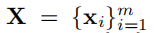

N个数据库点，记号为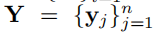

此外，成对的监督信息，记为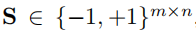也可用于监督哈希。

如果Sij = 1，则意味着点xi和点yj是相似的。否则，xi和yj是不同的。

监督哈希的目标是从X、Y和S中学习查询点和数据库点的二进制哈希代码，并且哈希代码试图保持查询点和数据库点之间的相似性。

更具体地说，如果我们使用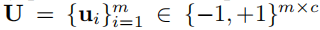表示对于查询点学习二进制哈希代码和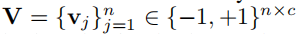表示对于数据库点学习二进制哈希代码，c表示二进制代码长度。

为了保持语义相似性，如果Sij =为1，则ui和vj之间的汉明距离应该尽可能小。否则，ui和vj之间的汉明距离应该尽可能大。

此外，我们还应该学习一个哈希函数h（xq）∈{−1，+1}c，这样我们就可以为任何看不见的查询点xq生成二进制代码。

请注意，在许多情况下，我们只给出了一组数据库点以及它们之间的成对监督信息。我们还可以通过采样一个子集或整个Y作为训练的查询集来学习哈希码和哈希函数。在这些情况下，X⊆Y。

# **Asymmetric Deep Supervised Hashing**

在本节中，我们将详细介绍我们的非对称深度监督哈希（ADSH），包括模型公式和学习算法

## **Model Formulation**

图1显示了ADSH的模型架构，它包含了两个重要的组成部分：特征学习部分和损失功能部分。特征学习部分试图学习一个深度神经网络，它可以提取适当的特征表示用于二进制哈希码学习。损失函数部分的目的是学习二进制哈希码，以保存查询点和数据库点之间的监督信息（相似性）。

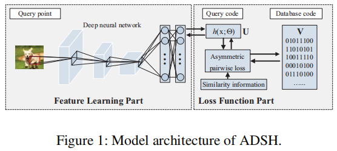

ADSH将这两个组件集成到同一个端到端框架中。在培训过程中，每个部分都可以反馈给另一部分。

请注意，特性学习只对查询点执行，而不是对数据库点执行。此外，ADSH基于深度特征学习神经网络，采用深度哈希函数生成查询点的哈希码，但直接学习数据库点的二进制哈希码。

因此，ADSH以不对称的方式处理查询点和数据库点。ADSH的这种非对称特性不同于传统的深度监督哈希方法。传统的深度监督哈希方法采用相同的深度神经网络对查询点和数据库点进行特征学习，然后使用相同的深度哈希函数为查询点和数据库点生成二进制代码。

**Feature Learning Part**

在本文中，我们采用了一个来自（Chatfield et al. 2014）的卷积神经网络（CNN）模型，即CNN-F模型，来进行特征学习。DPSH（Li，Wang，and Kang 2016）也采用了该CNN-F模型进行特征学习。CNN-F模型包含5个卷积层和3个全连接层，其细节见（Chatfield et al. 2014；Li、Wang和Kang 2016）。

在ADSH中，CNN-F模型的最后一层被一个全连接的层所取代，该层可以将前七层的输出投射到Rc空间中。请注意，ADSH的框架足够通用，可以采用其他深度神经网络来代替CNN-F模型进行特征学习。在这里，我们只是采用CNN-F作为说明。

**Loss Function Part** 

为了学习能够保持查询点和数据库点之间相似性的哈希码，一种常见的方法是最小化监督信息（相似性）和查询-数据库二进制代码对的内积之间的L2损失。这一点可以表述如下：

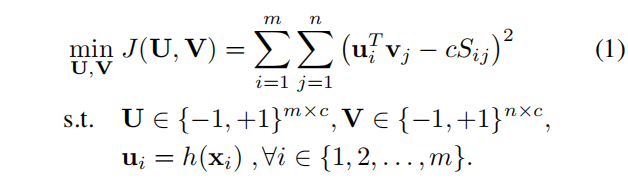

然而，由于离散输出，很难学习h（xi）。我们可以设置h（xi）=sign（F（xi；Θ））;$F(x_i ; Θ) ∈ R^c$

然后，将(1)中的问题转换为以下问题：

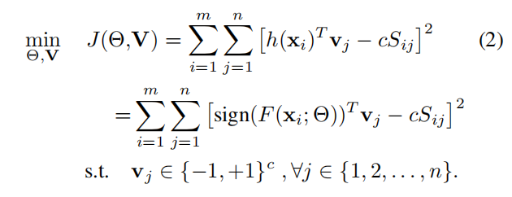

在(2)中，我们将F（xi；Θ）设置为特征学习部分的CNN-F模型的输出，Θ为CNN-F模型的参数。通过这种方式，我们将特征学习部分和损失函数部分无缝地集成到同一个框架中。

(2)中的公式仍然存在一个问题，即由于符号（F（xi；Θ））函数，我们不能将梯度反向传播到Θ。因此，在ADSH中，我们采用以下目标函数

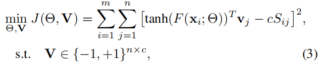

其中，我们使用tanh（·）来近似sign（·）函数。

在实践中，我们可能只给出一组数据库点$Y = \{y_j\}^n_{j=1}$，而没有查询点。在这种情况下，我们可以从数据库中随机抽取m个数据点来构建查询集。

更具体地说，我们设置了X = YΩ，其中YΩ表示由Ω索引的数据库点

这里，我们使用Γ = {1,2，…，n}表示所有数据库点的索引，Ω = {i1，i2，…，im}⊆Γ表示采样查询点的索引。

因此，我们设置了$S = S^Ω$，

S∈{−1，+1}n×n表示所有数据库点对之间的监督信息（相似性），SΩ∈{−1，+1}m×n表示由Ω索引的S行组成的子矩阵

然后，我们可以将J（Θ，V）重写如下：

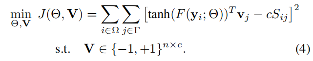

因为Ω⊆Γ，yi有两个表示，∀i∈Ω。一个是数据库中的二进制哈希代码vi，另一个是查询表示法tanh（F（yi；Θ））。我们添加了一个额外的约束条件，以保持vi和tanh（F（yi；Θ））尽可能地接近，∀i∈Ω。这在直觉上是合理的，因为tanh（F（yi；Θ））是yi的二进制代码的近似值。然后得到只有数据库点Y的ADSH的最终公式：

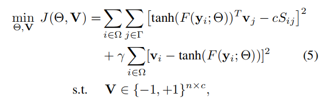

γ是一个超参数

在实际的应用中，如果我们同时给定Y和X，我们就使用(3)中的问题来训练ADSH。如果我们只给出Y，我们使用(5)中的问题来训练ADSH。经过ADSH训练后，我们可以得到用于数据库点的二进制哈希码，以及用于查询点的深度哈希函数。我们可以使用训练过的深度哈希函数为任何查询点生成二进制哈希码，包括在训练过程中看不到的新出现的查询点。为查询点生成二进制代码的一种简单方法是设置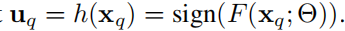。

从(3)和(5)中，我们可以发现ADSH以非对称的方式处理查询点和数据库点。更具体地说，特性学习只对查询点执行，而不对数据库点执行。此外，ADSH采用了一个深度哈希函数来生成查询点的哈希码，但它是直接学习数据库点的二进制哈希码的。这与传统的深度监督哈希方法不同，后者采用相同的深度哈希函数来为查询点和数据库点生成二进制哈希码。由于一般情况下，ADSH可以有效地学习深度神经网络，并且比传统的对称深度监督哈希方法要快得多。这将在我们的实验中得到验证。

## **Learning Algorithm**

在这里，我们只提出了问题(5)的学习算法，它可以很容易地适用于问题(3)。我们设计了一种交替优化策略来学习问题(5)中的参数Θ和V。更具体地说，在每次迭代中，我们学习一个参数，另一个参数是固定的，这个过程将重复多次迭代。

**Learn** Θ **with** **V** **fifixed**

当V被固定时，我们使用反向传播（BP）算法来更新神经网络参数Θ。具体来说，我们对少量的查询点进行采样，然后根据采样数据更新参数Θ。为了简单起见，我们定义$z_i = F(y_i ; Θ)$和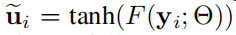。然后我们可以计算出zi的梯度如下：

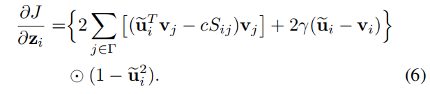

然后利用链规则基于∂∂Jzi计算∂J∂Θ，并利用BP算法更新Θ。

**Learn** **V** **with** Θ **fifixed**

当Θ固定时，我们将重写问题(5)为矩阵形式：

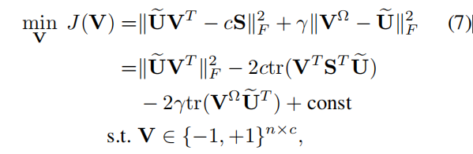

其中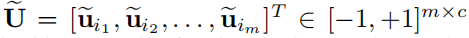 **V**Ω表示由Ω索引的数据库点的二进制代码，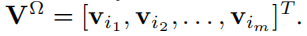

我们定义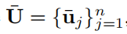，其中¯uj定义如下：

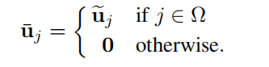

然后，我们可以将问题(7)重写如下：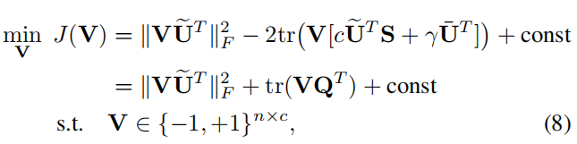

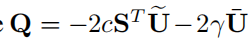    const是一个独立于V的常数。

然后，我们一位一位地更新V。也就是说，每次我们更新V的一个列，固定其他列。

$ V_{∗k}$表示V的第k列 $\hat V _k$表示不包括$ V_{∗k}$的V矩阵

$ Q_{∗k}$表示Q的第k列 $\hat Q _k$表示不包括$ Q_{∗k}$的Q矩阵

$ \widetilde U_{∗k}$表示$\widetilde U$的第k列 $\hat U _k$表示不包括$ \widetilde U_{∗k}$的$\widetilde U$矩阵

为了优化$ V_{∗k}$，我们可以得到目标函数：

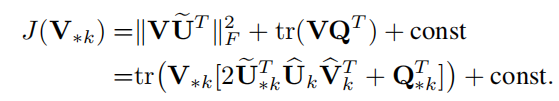

然后，我们需要解决以下问题：

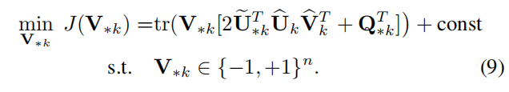

然后，我们可以得到问题(9)的最优解如下：

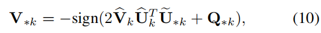

它可以用来更新V∗k。

我们总结了算法1中ADSH的整个学习算法。在这里，我们重复学习几次，每次我们都可以采样一个由Ω索引的查询集。

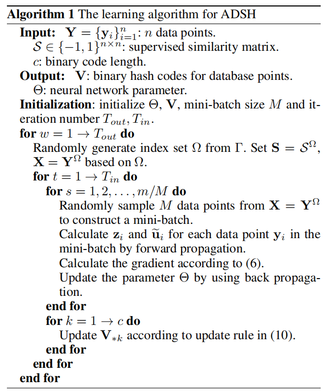

**Out-of-Sample Extension**

训练ADSH后，可以应用学习到的深度神经网络为训练过程中包括看不见的查询点在内的查询点生成二进制码。更具体地说，我们可以使用下面的方程来为xq生成二进制代码：

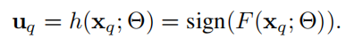