# Central Similarity Quantization for Effificient Image and Video Retrieval

现有的数据依赖哈希方法通常从成对或三重数据关系中学习哈希函数，它们只在局部捕获数据相似性，往往存在学习效率低和碰撞率低的问题

在本研究中，我们提出了一种新的全局相似度度量，称为中心相似度，它鼓励相似数据对的哈希码接近一个共同的中心，并鼓励不同数据对的哈希码收敛到不同的中心，以提高哈希学习效率和检索精度。

我们主要通过引入一个新的概念来表示哈希中心所提出的中心相似度度量的计算，哈希中心指的是分散在汉明空间中的一组数据点之间有足够的相互距离。

然后，我们提供了一种有效的方法，通过利用*Hadamard matrix*哈达玛矩阵和*Bernoulli distributions*伯努利分布来构造具有良好分离性的哈希中心。

最后，我们提出了中心相似度量化（CSQ），以优化数据点关于它们的哈希中心之间的中心相似度关，而不是优化局部相似性。

CSQ是通用的，适用于图像和视频哈希场景。

在大规模图像和视频检索任务上的大量实验表明，CSQ可以为相似的数据对生成内聚哈希码，为不同的数据对生成散哈希码，实现了检索性能的显著提高，即比之前的技术水平提高了3%- 20%

# \1. Introduction

通过适当的哈希函数[37]将高维数据转换为汉明空间中紧凑的二进制哈希码，哈希为数据的存储和检索提供了显著的效率。

近年来，“深度学习哈希”方法[14,32,21,18,22,44]已成功地应用于大规模图像检索[44,48]和视频检索[8,28,21]，它可以很自然地表示一个用于生成输入数据的哈希码的非线性的哈希函数。

大多数深度哈希方法[2,48,27,18]通过利用成对或三重数据相似性来学习哈希函数，其中数据关系是从局部角度捕获的。这种基于成对/三重态的散列学习本质上会导致以下问题。

1)对整个训练数据集之间的相似性进行分析的效率较低。对于n个数据点，常用的成对相似度[2,48,18]或三重态相似度度量[27,14]的时间复杂度为O（n！）。因此，从大规模图像或视频数据的所有可能的数据对/三联体中详尽地学习是不切实际的。

2)对数据分布的覆盖面不足。基于成对/三重相似度的方法只利用数据对之间的部分关系，这可能会损害生成的哈希码的可鉴别性。

3)对不平衡数据的有效性较低。在现实场景中，不同对的数量比相似对的数量要大得多。因此，基于成对/三重相似度的哈希方法不能充分学习相似度关系来生成足够好的哈希码，导致性能受限

为了解决上述问题，我们提出了一种新的全局相似度度量，称为中心相似度，我们不断优化以获得更好的哈希函数

具体地说，中心相似度度量了哈希码和哈希中心之间的哈明距离，哈希中心被解定义为汉明空间中具有足够相互距离的一组点。

中心相似性学习旨在鼓励生成的哈希码接近相应的哈希中心。

由于n个数据点和m个中心的时间复杂度仅为O（nm），基于中心相似度的哈希是高效的，可以从全局数据分布中生成足够多的鉴别哈希码（图1），克服了基于成对/三重相似度的哈希方法的局限性。即使存在严重的数据不平衡，哈希函数仍然可以从全局关系中很好地学习。

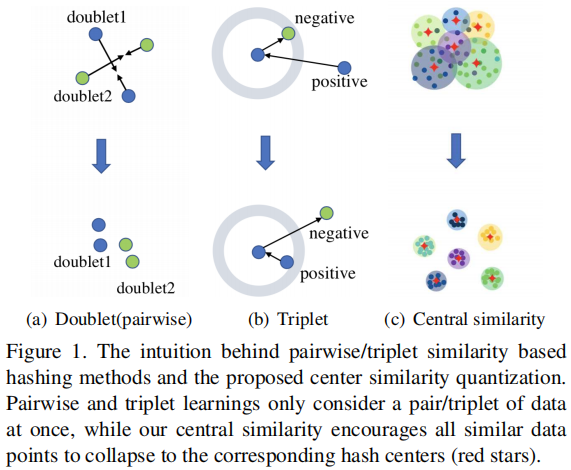

为了获得合适的散列中心，我们提出了两种系统的方法。

一是利用阿达玛矩阵直接构造具有最大相互汉明距离的哈希中心；

另一种是通过伯努利分布随机抽样生成哈希中心。

我们证明了这两种方法都能产生具有足够哈明距离的适当哈希中心。

我们还考虑使用哈希函数从数据中联合学习哈希中心。然而，我们通过经验发现，通过一些常用方法学习的中心[11,43,29]不能提供比解析构造的方法更好的哈希函数。第4.5中我们对不同方法的哈希中心进行了比较。

利用生成的哈希中心，我们发展了与卷积神经网络（CNNs）的中心相似性，以学习汉明空间中的深度哈希函数。我们将所提出的哈希学习方法命名为中心相似度量化（CSQ）。特别地，我们采用卷积层来学习数据特征，并使用哈希层来生成哈希码。在识别出哈希中心后，我们训练深度CNN和哈希层端到端生成哈希码，以优化中心相似性。CSQ是通用的，适用于学习图像和视频的哈希代码。

我们首先对MNIST [15]进行了说明性实验来验证我们的CSQ的有效性。我们发现，与其他最先进的哈希方法相比，CSQ学习到的哈希码具有良好的类内紧密性和类间可分性，如图2所示。然后，我们分别对三个图像哈希基准数据集和两个视频哈希视频数据集进行了广泛的比较实验。使用CSQ，检索性能有了显著的提高，即mAP的3%-20%，训练速度也比最新的方法快3到5.5×

我们的贡献是有三倍的。

1)我们重新考虑数据相似性建模，并提出了一个新的哈希中心概念，以更有效地捕获数据关系。我们提出了两种系统的方法来快速生成适当的哈希中心的方法。

2)介绍了一种新的基于哈希的中心相似度方法。它可以有效地捕获全局数据分布，生成高质量的哈希函数。据我们所知，这是第一个利用全局相似性和哈希中心进行深度哈希函数学习的工作。

3)我们提出了一个深度学习模型来实现我们的图像和视频检索方法，并建立了新的技术水平。

# \3. Method

我们考虑以监督的方式从N个数据点$X=\{{\{x_i\}}_{i=1}^N，L\}$的训练集中学习哈希函数，其中每个$x_i∈R^D$是哈希的数据点，L表示数据X的语义标签集。

设$f：x→h∈\{0,1\}^ K$表示从输入空间R^D^到K位汉明空间{0,1}^K^的非线性哈希函数。与其他有监督的“深度学习哈希”方法[2,48]类似，我们追求一个哈希函数，该数据点x靠近汉明空间，并共享相似的语义标签。

我们定义了一组点$C =\{c1，c2，…c_m\} ⊂ \{0,1\}^K$在汉明空间中有足够距离的作为哈希中心，并提出学习由 关于C的中心相似度 监督的哈希函数。 中心相似性将鼓励相似的数据对靠近一个共同的哈希中心，而不同的数据对分别分布在不同的哈希中心周围。通过这种中心相似性学习，在f中可以保留数据对之间的全局相似性信息，得到高质量的哈希码。

下面，我们首先给出了哈希中心的正式定义，并解释了如何系统地生成适当的哈希中心。然后，我们详细阐述了中心相似度量化的细节。

## 3.1. Defifinition of Hash Center

最直观的动机是从图像或视频特征中学习散列中心，这样学习到的中心就可以保持不同数据点之间的“特殊性”。然而，我们发现，从具有不同相互汉明距离的数据特征中学习到的散列中心并不比具有预定义汉明距离的散列中心表现得更好（在实验中，第4.5节）。

因此，我们假设每个中心与其他中心的距离应该比与之相关的哈希码更远。因此，不同的对可以更好地分离，相似的对可以内聚聚集。基于观察和直觉，我们正式定义了汉明空间中的一组点为有效的哈希中心。

定义1（哈希中心）：我们将哈希中心定义为K维汉明空间中满足平均成对距离的点$C=\{c_i\}_{i=1}^m⊂\{0,1\}^K$

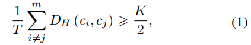

DH为汉明距离，m为哈希中心数，T为不同ci和cj∈C的组合数。

为了更好地清晰，我们在图3中展示了三维和四维汉明空间中所需的哈希中心的一些例子。

在图3(a)中，哈希码[0,1,0]、[0,0,1]和[1,0,0]的哈希中心为c1，c1与c2之间的汉明距离为3。

在图3(b)中，我们使用一个四维超立方体来表示四维汉明空间。这两颗星c1和c2是定义1中给出的哈希中心。c1与c2之间的距离为DH（c1、c2）= 4，绿点与中心c2之间的距离相同（DH = 1）。然而，我们并不严格要求所有的点与相应的中心有相同的距离。相反，我们将最近的中心定义为哈希代码的相应哈希中心。

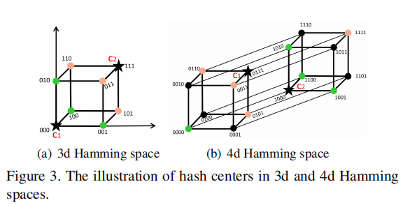

## 3.2. Generation of Hash Centers

基于以下观察结果，我们开发了两种生成有效哈希中心的方法

在K维汉明空间（在本文中，K设为偶数），如果一组点相互正交，它们之间的距离K/2相等。即，它们是满足定义1的有效哈希中心。

我们的第一种方法是通过利用阿达玛矩阵的以下良好属性来生成哈希中心。已知一个K×K阿达玛矩阵$H_K = [h^1_a；…；h^K_a ]$满足：

 1)它是一个行$h^i_a$相互正交的平方矩阵，即任意两行向量的内积$<h^i_a，h^j_a> = 0$。

​	任意两行向量之间的汉明距离为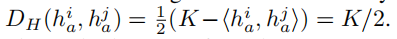

因此，我们可以从这些行向量中选择哈希中心。

2)它的大小K是2的幂（即K = 2^n^），这与通常的哈希码的位数相一致。

3)它是一个二进制矩阵，其项是-1或+1。我们可以简单地用0替换所有-1来得到{0,1} K中的哈希中心

为了从哈达玛矩阵中采样哈希中心，我们首先用西尔维斯特的构造[42]构建了一个K×K哈达玛矩阵，如下：

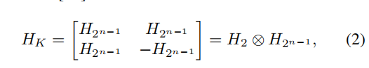

⊗代表Hadamard的乘积，K = 2^n^

初始阿达玛矩阵中的两个因子是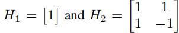

当中心数为m <=K时, 我们直接选择每一行作为一个哈希中心

当K < m <= 2K时，我们使用两个阿达玛矩阵$H_{2K} = [H_K，−H_K]⊤$的组合来构造散列中心。

虽然在大多数情况下都适用，但由上述方法产生的有效中心的数量受到阿达玛矩阵是一个平方1这一事实的限制。如果m大于2K或K不是2的幂次，则第一种方法不适用。

因此，我们提出了第二个生成的方法，通过随机抽样的每个中心向量的位。特别地，中心ci的每一位都从伯努利分布伯尔尼（0.5）中采样，其中P（x = 0）=0.5，如果x∼伯尔尼（0.5）。我们可以很容易地证明这些中心之间的距离是K/2。即，$E[D_H（ci，cj）] = K/2 if ci，cj∼Bern（0.5）$。我们在Alg中总结了这两种方法。 1.该生成算法非常有效，只需要一个简单的计算/时间成本来生成哈希中心。

一旦获得了一组散列中心，下一步是将训练数据样本X与其各自对应的中心关联起来，以计算中心相似度。召回L是X的语义标签，通常是L = {l1，……，lq}。

对于单标签数据，每个数据样本属于一个类别，而每个多标签数据样本属于多个类别。

我们称之为由Alg1生成的哈希中心。并与语义标签作为语义散列中心进行关联。我们现在解释如何分别获得单标签数据和多标签数据的语义哈希中心。

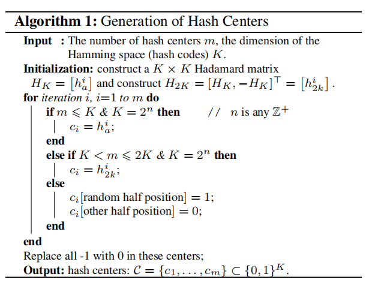

**Semantic hash centers for single-label data**

 对于单个标签数据，我们为每个类别分配一个哈希中心。也就是说，我们对应于标签{l1，...，lq}}由Alg1生成q个哈希中心{c1，…，cq}。                          

因此，具有相同标签的数据对共享一个共同的中心，并被鼓励彼此接近。

因为每个数据样本都被分配到一个哈希中心，所以我们得到了语义哈希中心C‘={c’1，c‘2，……，c’N}，其中c‘i是xi的哈希中心。

**Semantic hash centers for multi-label data** 

对于多标签数据，DCH [1]、HashNet [2]和DHN [48]如果共享至少一个类别，则直接使数据对相似

然而，当数据对共享多个类别时，它们忽略了传递相似性。在本文中，我们为共享多个标签的数据对生成传递中心。

首先，我们对应于标签{l1，...，lq}}由Alg1生成q个哈希中心{c1，…，cq}。      

然后，对于包含两个或多个类别的数据，我们计算这些中心的质心，每个质心对应一个类别。

.例如，假设一个数据样本x∈X有三类li、lj和lk。这三类的中心分别为ci、cj和ck，如图4所示。

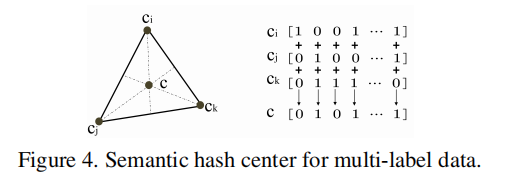

我们计算出这三个中心的质心c作为x的哈希中心。

为了确保元素是二进制的，我们通过在三个中心的相同位上投票并取占优势的值来计算每个位，如图4的右面板所示。

如果0的数目等于某些位上的1的数目（即，投票结果是抽签），我们从Bern（0.5）中采样这些位。

最后，对于每个xi∈X，我们以质心作为其语义散列中心，然后得到语义散列中心C‘={c’1，c‘2，……，c’N}，其中c‘∈是xi的哈希中心。

## 3.3. Central Similarity Quantization

给定对于q类别的训练数据X生成的中心C = {c1，…，cq} 对于单标签或多标签数据我们得到语义哈希中心C‘={c’1，c‘2，…，c’N}，其中c‘i表示数据样本xi的哈希中心。

我们通过最大化关于语义哈希中心的哈希码的对数后验来推导出中心相似度学习目标

形式上，所有训练数据的哈希码H = [h1，...，hN ]的对数后验（MAP）最大估计可以通过最大化以下似然概率得到：

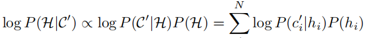

P (H)是哈希码上的先验分布，P（C‘|H）是似然函数。

$P(c'_i|h_i)$是给定哈希码hi中心c’i的条件概率。

我们将P（C‘|H）建模为吉布斯分布：$P(c'_i|h_i)=\frac 1 α exp(-βD_H(c'_i,h_i))$,α和β是常数，DH度量哈希代码和它的哈希中心之间的汉明距离。

由于哈希中心是二进制向量，我们使用二进制交叉熵（BCE）来测量哈希码和它的中心之间的汉明距离 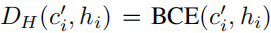

所以条件概率被计算为 $log P(c'_i|h_i)∝ \frac 1 K \sum_{k∈K}(c'_{i,k}logh_{i,k}+(1-c'_{i,k})log(1-h_{i,k}))$

我们可以看到，条件概率P（c‘i|hi）越大，哈希码h与其哈希中心c之间的汉明距离就越小，这意味着哈希码靠近相应的中心；否则哈希码远离相应的中心。

通过将logP（c‘i|hi）代入MAP估计中，我们得到了中心相似度损失LC的优化目标：

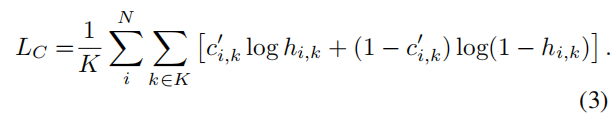

由于每个哈希中心都是二进制的，由于其固有的优化困难，现有的优化不能保证生成的哈希码完全收敛到哈希中心[40]。

因此，我们引入了一个量化损失LQ来细化生成的哈希码。

与DHN [48]类似，我们使用双模态拉普拉斯先验进行量化，其定义为

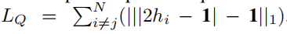

1∈RK是一个全一个向量。

由于LQ是一个非光滑函数，使得计算其导数很困难，所以我们采用光滑函数logcosh [10]来代替它

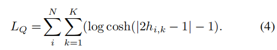

最后，我们有了一个中心相似度优化问题：

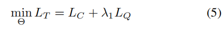

Θ是进行深度哈希函数学习的所有参数的集合，而λ1是在我们的工作中通过网格搜索获得的超参数

基于损失函数LT，我们采用深度哈希方法中的标准框架[9,2]来进行CSQ。具体来说，采用多个卷积层来学习数据特征，并以三个fc层和ReLU作为激活函数来生成哈希码。CSQ的详细框架在补充材料中给出。

# \4. Experiments

我们进行了图像和视频检索的实验，以评估我们的CSQ与几种最先进的技术。在我们的实验中使用了5个基准（图像和视频）数据集，它们的统计数据汇总在Tab 1.中。

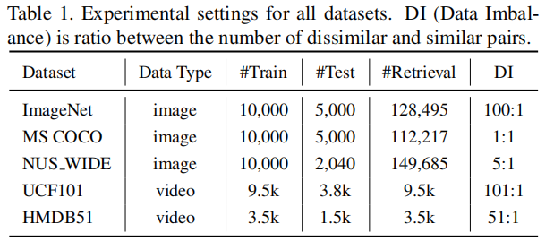

## 4.1. Experiments on Image Hashing

**Datasets**

我们使用了三个图像基准数据集，包括ImageNet [30]、NUS WIDE [5]和MS COCO [20]。在ImageNet上，我们使用与[2,48]相同的数据和设置。由于ImageNet是一个单标签数据集，我们直接为每个类别生成一个哈希中心。MS COCO是一个有80个类别的多标签图像数据集。NUS WIDE也是一个多标签的图像数据集，我们从21个最常见的类别中选择图像进行评价[48,14]。对于MS COCO和NUS WIDE数据集，我们首先分别生成所有类别的80个和21个散列中心，然后计算多中心的质心作为每个具有多个标签的图像的语义散列中心，按照Sec3.2.中的方法。生成的哈希中心的可视化在补充材料中给出。

**Baselines and evaluation metrics**

我们比较了我们提出的CSQ与9种经典或最先进的哈希/量化方法的检索性能，包括四种监督浅层方法ITQ-CCA [7]，BRE [13]，KSH [24]，SDH [32]和五种监督深度方法CNNH [44]，DNNH [14]，DHN [48]，HashNet [2]和DCH [1].对于四种浅哈希方法，我们采用最新工作[48,2,1]的结果使它们直接可比性。我们基于四个标准评价指标来评估图像检索性能：平均平均精度（mAP）、精度召回曲线（PR）和精度曲线w.r.t.不同数量的返回样本（P@N），汉明距离2范围内的精度曲线（P@H=2）。ImageNet采用mAP@1000，因为每个类别有1300张图像，而MS COCO和NUS WIDE采用mAP@5000。