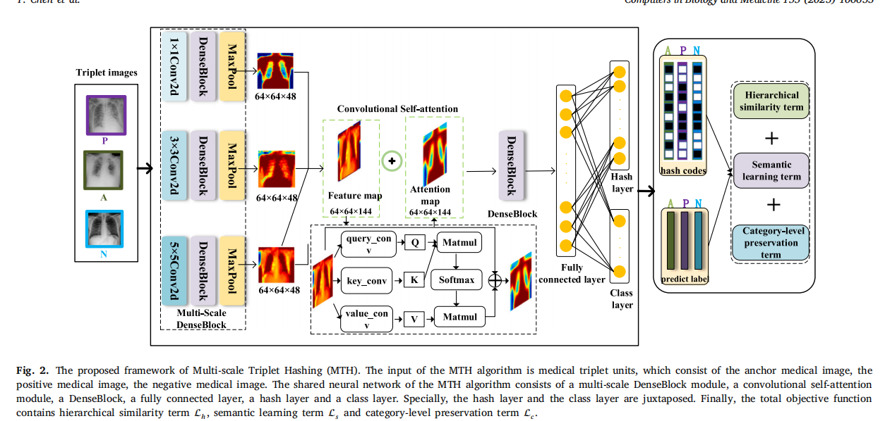

# Multi-scale Triplet Hashing for Medical Image Retrieval

在医学图像检索任务中，由于哈希码的检索效率优势，深度哈希算法被广泛应用于大规模数据集的辅助诊断。

.其中主要关注特征学习，而忽略了医学图像的区分区域和深度特征和哈希码的层次相似性。

在本文中，我们采用一种新的多尺度三重哈希（MTH）算法来解决这些困境，该算法可以利用多尺度信息、卷积自注意和层次相似性来同时学习有效的哈希码。

MTH算法首先设计了多尺度的密度块模块来学习医学图像的多尺度信息。同时，开发了一种卷积自注意机制来进行通道域的信息交互，从而可以有效地捕获医学图像的识别区域。

在这两条路径的基础上，提出了一种新的损失函数，不仅可以在学习过程中保存深度特征的分类级信息和哈希码的语义信息，而且还可以捕获深度特征和哈希码的层次相似性。

在策划的X射线数据集、皮肤癌MNIST数据集和COVID-19放射学数据集上进行的大量实验表明，与其他最先进的医学图像检索算法相比，MTH算法可以进一步提高医学检索的效果。

# **1. Introduction**

对于大规模的医学图像数据集，医学图像检索算法需要具有良好的可伸缩性和[8]精度。为此，由于哈希码[9]的检索效率优势，深度哈希码学习在医学图像检索中得到了广泛的应用。而深度哈希码学习则通过利用深度神经网络将高维特征投射到低维二进制码中,例如深度多实例哈希（DMIH）[10]、深度残余哈希（DRH）[11]、顺序敏感的深度哈希（OSDH）[12]等。

虽然这些算法[8–12]已经取得了良好的性能，但仍存在三个挑战。首先，多尺度信息对于医学图像的[13]非常重要。然而，传统的[8,10]算法不能考虑医学图像的多尺度信息，这会导致大量的信息丢失，最终影响实验效果。因此，如何学习医学图像的多尺度信息是一项具有挑战性的任务。其次，[8,9]算法利用空间注意模块生成哈希码进行医学图像检索，忽略信道域的信息交互，捕获区分区域，最终影响哈希码的质量。因此，如何增强信道域的信息交互来捕获区分区域也是一个挑战。最后，有算法[11,12]只利用损失函数来考虑哈希码的相似性。然而，深度哈希学习过程中存在不可控制的深度特征相似性，与哈希码的相似性不最优兼容，最终影响医学检索结果。因此，如何对深度特征和哈希码执行层次相似性是一个非常重要的挑战。

实际上，如果医学专家观察到更多关于医疗实例[14]的信息，查询的医疗实例的哈希码与同源医疗实例的哈希码关联更准确。显然，如果我们想要获得更好的医学图像检索结果，就会考虑上述挑战。受此启发，利用一种新的医学图像检索策略，利用更多的信息、更好的注意机制和更强的相似性来进行哈希码学习。

图1显示了一个查询的𝐶𝑂𝑉𝐼𝐷示例的传统方法与所提出的MTH方法之间的可视化解释比较。图1(a)中的红框表示单个信息。查询的𝐶𝑂𝑉𝐼𝐷和𝐿𝑢𝑛𝑔_𝑂𝑝𝑎𝑐𝑖𝑡𝑦有相似的信息，所以他们的距离相对较近。图1(b)中的三个红框表示多尺度信息。红色区域代表注意方向区域。𝐶𝑂𝑉𝐼𝐷的注意导向区域集中在右下角。𝐿𝑢𝑛𝑔_𝑂𝑝𝑎𝑐𝑖𝑡𝑦的注意方向区域集中在右上角。所提出的MTH方法利用多尺度信息学习和卷积自我注意机制进行医学图像检索。因此，查询的𝐶𝑂𝑉𝐼𝐷与𝐶𝑂𝑉𝐼𝐷比𝐿𝑢𝑛𝑔_𝑂𝑝𝑎𝑐𝑖𝑡？

在本文中，我们提出了一种新的医学图像检索算法，即多尺度三重哈希（MTH），应用多尺度信息、卷积自注意机制和层次相似度来进行有效的哈希码学习，如图2所示。为了学习医学图像的多尺度信息，MTH算法设计了多尺度的密度块模块来进行哈希函数学习。多尺度密度块模块由三个并行卷积、三个并行密度块和最大池化操作组成。为了执行通道域的信息交互，我们利用卷积自注意机制来学习哈希码。卷积自注意机制可以增强信道域之间的信息交互作用，从而更有效地捕获区分区域。

其主要贡献归纳为三个方面：

- 设计了一种新的医学图像检索框架，利用层次相似度来解决深度哈希学习过程中深度特征的不可控制相似性问题。此外，医学图像检索框架可以通过多尺度的密度块模块和卷积自注意机制来捕获医学图像的多尺度信息，增强信道域的信息交互作用。据我们所知，这是第一次通过同时利用多尺度信息、卷积自注意机制和层次相似度来进行有效的哈希码生成
- 设计了一种新的目标函数，以捕获深度特征和哈希码的层次相似性，保留深度特征的分类级信息，同时学习哈希码的语义信息。
- 在策划的x射线数据集、皮肤癌MNIST数据集和COVID-19射线摄影数据集上进行的大量实验表明，哈希码的有效性明显提高，生成的哈希码比其他医学图像检索算法具有更好的相似性。

其余部分说明如下。关于MTH算法的相关工作见第2节。第3节中MTH算法的架构。第4节介绍了三个医疗数据集、三个评估方案和广泛的实验。第5节详细阐述了MTH算法的总结。

## **2. Related works**

## *2.2. Hashing algorithms*

哈希技术可以将样本投影到哈希码中，同时保持相似样本的相似性。例如，Zhang等人[25]开发了一种无监督哈希算法来学习域不变哈希函数，该算法可以使目标域和源域的两个哈希投影之间的误差矩阵最小化。Huang等[26]提出了一种新的高效、可转移的无约束跨域视觉检索哈希算法。Zhang等人[27]设计了一种新的具有层次学习策略的多层次级联哈希算法，用于图像检索。

随着深度神经网络的爆炸式发展，深度哈希技术在[28,29]检索领域得到了广泛的应用。深度哈希技术利用深度神经网络将实例映射到哈希码中，同时保存类似实例[30,31]的相似性。深度哈希技术分为两类：无监督深度哈希和有监督深度哈希。

无监督深度哈希算法利用深度神经网络对无标记实例实现哈希码的生成。例如，Xia等人[32]引入了一个无监督的深度哈希学习框架，该框架在整个框架中集成了自动编码器层和限制性的玻尔兹曼机器层。Wu等人[33]提出了一种无监督哈希码生成框架，通过学习自学的鉴别二进制码。Wang等人[34]引入了一个无监督的图卷积框架，通过将实例之间的关系集成到节点表示中来产生语义二进制代码。

监督深度哈希算法利用深度神经网络，利用标记实例实现二进制代码学习。Li等人[35]提出了一个成对监督哈希框架，该框架同时进行相似性保持哈希码的生成和特征学习。Liong等人[36]引入了一种监督哈希算法，利用非线性映射来实现哈希码的生成。Lu等人[37]提出了一种有监督的层次递归神经哈希算法，该算法利用空间细节和语义来指导哈希码的语义学习。Huang[38]等人设计了一种新的域自适应图像检索算法，该算法可以利用BP诱导的焦三重态损失、BP诱导的量化损失和BP诱导的分类损失来学习紧凑的二值特征表示。Liu等[39]介绍了一种基于网络的深度哈希图像检索算法。

Guan等[40]开发了一种医学图像哈希检索算法，该算法可以梳理可解释性和特征融合，以提高胸x线图像检索的性能。Zhang[41]等人[41]设计了胸部x光和放射学报告之间的类别监督跨模态哈希检索，学习跨模态相似性。Zhang等人[42]提出了一种新的深度医学跨模态注意哈希算法，该算法可以利用循环注意的全局特征和局部特征。这些深度哈希算法在以有监督的方式使用标签信息方面取得了进展。因此，哈希码的质量是由特征学习和哈希码的相似性来决定的，这是检索技术的关键因素。本文针对医学图像的特征，设计了多尺度特征学习和层次相似度学习来生成有效的哈希码。根据以上讨论和本研究的相关工作，MTH算法有两个关键部分： (1)具有卷积自注意部分的多尺度特征学习；(2)哈希码的层次相似度学习部分。在三个医学图像数据集上进行的大量实验证明了MTH算法的意义。

# **3. The proposed method**

在本节中，第3.1节首先提供了医学图像检索的详细定义。其次，MTH算法的模型体系结构可以介绍在第3.2节中。第三，所提出的MTH算法的目标函数在第3.3节中给出。所提出的MTH算法可以利用多尺度信息、卷积自注意机制和层次相似度来学习有效的哈希码，如图2所示。

## *3.1. Notations and problem definition*

给定𝐼医疗三联体单元和相应的三联体标签，其中$𝑀_𝑖^𝑎$表示𝑖th锚定医疗实例。$l_𝑖^p$表示阳性医疗实例的标签。。

𝑀𝑖𝑛表示𝑖th阴性的医疗实例。

.锚定的医疗实例更类似于积极的医疗实例，而不是消极的医疗实例。目的是学习映射关系，将医疗实例投影为二进制代码，同时保持汉明空间[43]中相似医疗实例的相似性。

更具体地说，，小于，，其中（⋅，⋅)表示汉明距离，𝑏𝑎𝑛，𝑏𝑝𝑛，𝑏𝑛𝑛∈{−1,1}𝑘分别表示𝑀𝑖𝑎，𝑀𝑝𝑖和𝑀𝑛𝑖，的𝑘-bits二进制码。

## *3.2. Model architecture*

所提出的MTH算法框架如图2所示。MTH算法的输入是三组医学图像，它由锚定医学图像、正医学图像、负医学图像组成。MTH方法的共享神经网络由多尺度密度块模块、卷积自注意模块、密度块模块、全连接层、类层和哈希层组成。特别地，哈希层和类层是并列的。

首先，GoogLeNet朴素初始模块[44]由三个并行卷积组成，内核大小分别为1×1、3×3和5×5，它们捕获多尺度信息。基于GoogLeNet的朴素初始模块，我们设计了多规模的密度块模块，它由三个并行卷积、三个并行密度块和最大池操作组成。

三个平行卷积包含16 1×1卷积，步1163×3卷积，步1165×5卷积，步1。它们的填充物分别是0、1和2。然后，密度块包含四个瓶颈层[45]。鹿块的详细操作如图3所示。连续操作的每个瓶颈层：批归一化[46]，整正线性单元[47]和1×1卷积，批归一化，整正线性单元和3×3卷积。假设对于输入的特征映射，通道数为𝑐0。对于输出特征图，通道数为𝑐0+𝑐×（𝑑−1），其中𝑐为增长率，𝑐设置为8，𝑑为层数，𝑑设置为4。经过密度块处理后，特征映射的宽度和高度保持不变。但是，特征映射的通道数量将会发生变化。综上所述，输入图像通过不同的并行卷积操作进行处理。而输出的特征图的宽度和高度相同，如图2所示。原始医疗实例的大小为256×256×3。每个输出特征映射的大小为64×64×48。三个特征图沿通道拼接，得到64×64×144特征图。

其次，利用特征映射作为卷积自注意模块的输入。卷积自注意模块包含三个并行卷积，并利用𝑄、𝐾和𝑉以多种并行的方式学习注意权重。对于每个头部𝐻𝑢，通过可学习的参数矩阵𝑊𝑞𝑢、𝑊𝑘𝑢和𝑊𝑣𝑢将输入转换为𝑄𝑢、𝐾𝑢和𝑉𝑢。其中，𝑄𝑢和𝐾𝑢为𝑒𝑘维向量。卷积自注意模块表述如下：

其中𝑊𝑎表示可学习参数矩阵，𝛺（⋅）表示软max函数。考虑到速度和空间效率的[48]，点产品可以通过√𝑒𝑘进行缩放。卷积自注意模块的详细过程如图2所示。具体来说，特征图通过三个平行的1×1卷积得到三个向量Q、K和v，利用等式计算注意图 (1).将注意图和原始特征图的添加作为卷积自注意模块的最后输出。

最后，卷积自注意模块的输出再次通过密度块。而在密度块之后是一个有1024个节点的全连接层。此外，激活函数为整流后的线性单位。然后，将整个连接层分别连接到哈希层和类别层。类别层包括𝑠个节点。其中，𝑠表示样本的类。类别层的激活函数是softmax函数。哈希层利用tanh函数作为激活函数，为训练过程生成𝑘-bits类哈希代码。在成瘾过程中，在测试过程中，利用符号函数将类似𝑘位的哈希码量化为类似𝑘位的哈希码。因此，如果𝑖th医疗三重单元{𝑀𝑖𝑎，𝑀𝑖𝑝，𝑀𝑖𝑛}，深度哈希函数被写为

𝜏表示tanh函数。𝜃（⋅）表示符号函数。

## *3.3. Objective function*

MTH算法的目标函数结合了： (i)层次相似度项，（ii）语义学习项，（iii）类别级保存项。图2为MTH算法的概述。层次相似性术语、语义学习术语和类别级保存术语的阐述如下。

**Hierarchical Similarity Term:**

MTH算法学习映射关系，在保持相似医学图像的相似性的同时，将医疗实例投影为哈希码。

为此目的，锚定医疗实例𝑀𝑖𝑎的哈希代码𝑏𝑎𝑖更类似于阳性医疗实例𝑀𝑖𝑝的𝑏𝑝𝑖，而不是阴性医疗实例𝑀𝑖𝑛的哈希代码𝑏𝑛𝑖。此外，锚定医疗实例𝑀𝑖𝑎的深度特征𝐷𝑎（𝑀𝑖𝑎）更类似于阳性医疗实例𝑀𝑖𝑝的深度特征𝐷𝑝（𝑀𝑖𝑝），而不类似于阴性医疗实例𝑀𝑖𝑛的深度特征𝐷𝑛（𝑀𝑖𝑛）。

为了实现这个目标，需要同时捕获哈希码的相似性和深度特征的相似性。为了同时捕获哈希码的相似性和深度特征的相似性，可以将层次相似性项𝐿ℎ写为

𝐻（⋅，⋅）表示汉明距离。𝜂表示哈希码相似度学习的边际参数。𝛿表示深度特征相似度学习的边际参数。𝑚𝑎𝑥（⋅）表示最大函数。||⋅||2表示𝐿2-范数。

然而，上述层次相似度项在训练过程中难以进行优化。在[49]之后，哈希代码𝑏𝑎𝑖、𝑏𝑝𝑖和𝑏𝑛𝑖可以被放宽为类似哈希的代码ℎ𝑎𝑖、ℎ𝑝𝑖和ℎ𝑛𝑖，并且利用𝐿2-norm来代替汉明距离。

其中，$L_h$为层次相似度项，可以同时捕获哈希码的相似度和深度特征的相似度。ℎ𝑧𝑖表示医疗实例𝑀𝑖𝑧的𝑘-bits类哈希代码，而𝑧={𝑎，𝑝，𝑛}，𝑓𝑧表示深度哈希函数。𝜔𝑧表示权重。

**Semantic Learning Term:**

语义信息对于增强类似哈希码[50]的潜在相关性至关重要。因此，标签信息被用来为学习哈希函数提供语义信息。然后，将语义学习术语表述为

$L_s$是语义学习项，它可以在哈希码学习过程中保存哈希码的语义信息。𝜀（⋅）表示交叉熵函数。𝜚（⋅）表示项目函数，它将类似哈希的代码投射到s维向量中。𝑙𝑖𝑎表示𝑀𝑖𝑎的标签。𝑙𝑝𝑖表示𝑀𝑖𝑝的标签。𝑙𝑖𝑛表示𝑀𝑖𝑛的标签。

**Category-level Preservation Term:** 

类别级信息对于深度特征学习非常重要，有助于学习好的特征，投射区分哈希码。深度特征越有效，哈希码就越有区别性。受Chen等[51]和Lu等[52]的启发，类别级保存术语可表示为：

$L_c$表示类别级保存项，可以保存深度特征的类别级信息。𝜀（⋅）表示交叉熵函数。𝛺（⋅）表示softmax功能。𝜗𝑎表示𝑀𝑖𝑎的权重。𝜗𝑝表示𝑀𝑖𝑝的权重。𝜗𝑛表示𝑀𝑖𝑛的权重。

针对上述三个组成部分，即语义学习项𝑠、层次相似度项ℎ和类别级保存项𝑐，将总目标函数写为：

𝛼和𝛽表示加权参数，l表示目标函数，它不仅可以保留深度特征的类别级信息和哈希码的语义，还可以捕获深度特征和哈希码的层次相似性。因此，整个网络将通过三个建议的术语的组合进行训练