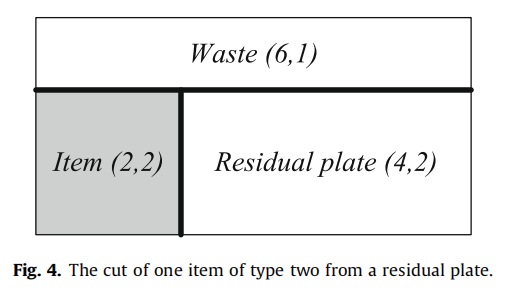
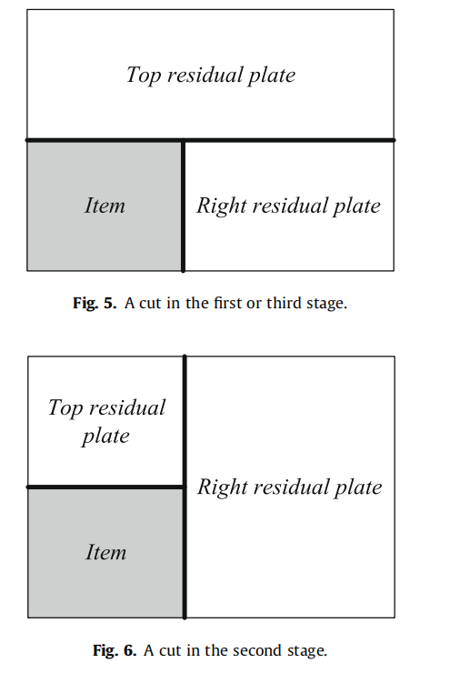
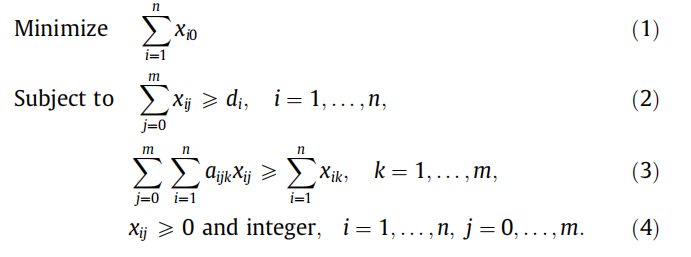
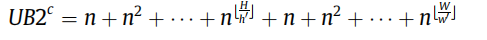
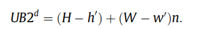
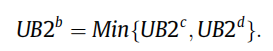
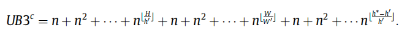
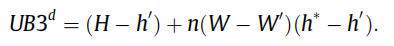
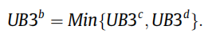

# An integer programming model for two- and three-stage two-dimensional cutting stock problems 

本文提出了一种二维切割料问题的整数规划模型。

在所解决的问题中，它打算从一组较大的矩形板中切割出一组给定尺寸的小矩形项目，从而使使用的板的总数最小化。

考虑了两阶段和三阶段的精确和非精确问题。其他问题也被解决，如项目的旋转，切割的长度和剩余板的价值。

新的整数规划模型可以看作是Dyckhoff针对一维切割库存问题提出的“单切割模型”的扩展。在所提出的模型中，每个决策变量都与从平板上或从之前的切割（剩余板）产生的一部分平板上切割一个项目有关

给出了所提出的模型和文献中模型的计算结果的比较和讨论

# 1. Introduction

本文提出了一种精确的解决二维切割机（2DCS）问题的方法。

本文提出了一种精确的解决二维切割机（2DCS）问题的方法。该方法基于一个整数规划模型的定义，具有伪多项式数的变量和约束，由一般的整数规划求解器直接优化。该方法基于一个整数规划模型的定义，具有伪多项式数的变量和约束，由一般的整数规划求解器直接优化。

在2DCS问题中，它打算从一组矩形板中切割一组矩形项目，从而使使用板的数量最小化。这些板在（实际上）中都是无限多的，而且它们都有相同的尺寸，即相同的宽度和高度。给出了一组要切割的项目，并根据其尺寸（宽度和高度）按类型进行分组。每个项目类型由宽度、高度和需求（对应于要切割的类型的项目数量）定义。

根据Wascher等人（2007）的类型学，本文所解决的问题是 **two-dimensional rectangular Single Stock Size Cutting Stock Problems**二维矩形单库存尺寸切割库存问题（SSSCSP），以及与允许的切割类型相关的附加约束。

在第3节中，还描述了处理多个库存规模（MSSCSP）的扩展。

这项工作背后的动机在于木刻行业，即木板必须被切成碎片（项目），以满足客户的订单。在这个行业中，由于技术的限制，通常只允许平行于板的侧面的切割（正交切割）和从一个边界到相反的一个边界（断头台切割）。此外，可以切割一个板的级数（具有相同方向的水平或垂直的切割组）也经常被限制为两个或三个。

在两阶段问题中，项目是通过一组水平切割获得的，将板分成条纹，然后是一组垂直切割，分离不同的项目。如果允许一组额外的水平切割来将浪费从项目中分离出来，那么这个问题就是一个非精确的两阶段问题（与给定条带中的所有项目都具有相同高度的精确情况相反）。图1显示了一个非精确的两阶段切割模式，其中白色矩形对应浪费，阴影矩形对应项目。

本文还考虑了这个三阶段的问题。在这个问题中，允许第三组切割：在盘子被条纹切割之后（在第一阶段），每条条纹被切割成堆栈（第二阶段），最后每个堆栈中的项目被第三组（水平）切割（第三阶段）分开。

在两阶段问题中，考虑了精确和非精确的情况。在后者中，允许增加一组垂直切割，以将物品从废物中分开。在前者中，堆栈中的所有项必须具有相同的宽度。在这两种情况下，都考虑了三阶段问题的受限版本，其中，在每个条纹中，总是有一个堆栈，只有一个项目定义其高度。.一个非精确的三级切割模式的示例见图2。

之前针对2DCS问题的精确方法。

本文提出了一种不基于列生成的两阶段和三阶段2DCS问题的最优解的方法。

该模型是对Dyckhoff（1981）提出的一维切割库存问题的单次切割模型的扩展。该方法基于一个整数规划模型，可以由一个通用的整数规划求解器来求解，利用了近年来（混合-）整数规划求解器实现的效率和鲁棒性。

例如，在本文用于计算测试的软件CPLEX 11.0（见Ilog，2007）中，实现了几种有效的不等式和启发式，以改进搜索分支和边界树时的（下、上界）。

该模型继承了将Dyckhoff已经指出的特征建模的可能性，即多种类型的块（板）和块（板）的价值，以供将来使用。此外，所提出的模型还有一个特点，这在实践中非常相关，但通常没有被考虑到，它是建模获得所有最终项目所需的切割的长度（或时间）。这个问题以及部件旋转的扩展将在模型展示后得到解决。

本文的组织结构如下。下一节将介绍针对两阶段和三阶段、精确和非精确的2个DCS问题的整数规划模型。给出了模型的约束数和变量数的上界。该模型是基于对所有不同的切割和残余板的枚举，并描述了一种算法。第2节以一个小例子结束。在第3节中，我们讨论并提出了所开发的模型的扩展。计算结果在第4节中进行了报告和分析。在第5节中，得出了这项工作的主要结论。

# \2. The integer programming model

## 2.1. Description

所提出的模型是基于明确地考虑如何从盘子中获得所需的项目。所提出的模型的主要概念是切割，它包括取出一个盘子，并从其中获得一件物品（通过一个或两个断头台切割）。一般来说，一个切割会导致一个项目（由于需要，因此不会进一步切割）和两个可以进一步切割的板。由切割产生的板被称为残余板。

为了说明这些概念，现在介绍了一个小的例子。考虑一个非精确的两阶段2DCS问题的实例，初始板的宽度和高度为6，以及两个项目类型，由i索引，宽度、高度和要求如表1所示。

切割的一个例子是从一个初始板中获得一种类型为1的项目。在该切割中，通过水平切割产生高度为3的条带，然后通过该条带中的垂直切割获得类型为1的项目。结果，除了期望的类型项外，还获得了两个尺寸为（6、3）和（2、3）的新板，如图3所示，其中粗线表示切割。切割的另一个例子是从尺寸为（6,3）的残余板中获得一个类型为2的项目，如图4所示。结果，除了所需的类型2项外，还获得了两个尺寸为（6、1）和（4、2）的新板。第一个板是浪费，因为它的高度小于两种项目类型的高度。

所提出的模型是基于列举所有的切割和残留板的类型。同一类型的板具有相同的宽度、高度，并属于同一阶段。

当定义一个板的类型时，这个阶段是相关的，因为，如图所示。5和6，一个切割根据其执行它的阶段产生不同的残余板。

有一组简单的规则，允许定义可能的切割，从而定义由此产生的残余板的宽度、高度和阶段。在第2.3节中，将分析切割和残留板的生成细节。在本小节中，假设所有可能的切割和相应的残余板类型都是已知的。

所提出的整数规划模型的主要思想是将一个决策变量与每个切割关联起来，或者更准确地说，与执行切割的次数联系起来。约束确保了项目类型的需求得到满足，并且只能在现有板中进行切割。

该模型现在已正式提出。项目类型数量定义为n，残余板类型数量定义为m。

板类型以j，j = 0，...，m为索引，j = 0对应初始板，j = 1，...，m对应残余板类型。

项目类型i的需求，i = 1，...，n，记为di。

一个决策变量$x_{ij} \ i=1……n；j=0,…m$；定义为项目类型i从板类型j中剪下的次数。参数$a_{ijk}；i=1...n；j=0...m；k=1...m$；如果板类型k来自切割板类型j得到项目类型i，则等于1，否则等于0

使用刚才介绍的符号，该模型如下：

**目标函数(1)使初始类型的板中的切割次数最小化。**

**约束集(2)确保满足每种物料类型的需求。**

在显示的模型中，允许过度生产（超过需求）。如果大于或等于约束(2)被等式替换，则模型不允许过度生产，即减少每个项目类型的确切数量。

**约束(3)规定，对于每种类型的残留板，产生这种剩余板的切割数必须大于或等于在该剩余板上执行的切割数，也就是说，只能对现有剩余板进行切割。**

所提出的模型的大小取决于项目和板的尺寸以及项目类型的数量。

一般来说，对于小项目的实例（与盘子的尺寸相比）比对于大项目的实例（独立于方法）更难解决，因为问题的组合结构（对于小的项目，在一个盘子中有更多的安排是可行的）。

在所提出的方法中，**将小的项目转换为大量的切割和剩余的板类型，从而产生了一个大的整数规划模型**。

 模型的大小还取决于项目类型的数量。当比较具有相同项目数量的实例时，所提出的模型更适合于项目类型较少（需求更大）的实例，而不是相反的实例，因为需求并不影响模型的大小。下一小节给出了整数规划模型大小的上界

## 2.2. Size

在本节中，推导出了两阶段问题的剩余板类型数量的三个上界和三阶段问题的剩余板类型数量的三个上界。

这些上界可以很容易地用来获得切割次数的上界。

由于在整数规划模型中，约束数和变量的数量分别与残差板类型的数量和切割数有关，因此上界表明模型的大小是伪多项式的。

我们将使用以下表示法。

如前所述，n是项目类型的数量，W和H分别为初始板的宽度和高度，w'和h'分别为项目类型的最小宽度和最小高度。

命题1给出了基于问题组合结构的两阶段问题残差板类型数的上界

**Proposition 1**：对于两阶段非精确问题，给出了剩余板类型数的上界

在命题2中给出了基于离散化的残差板类型数量的另一个上界。

**Proposition 2.**：对于两阶段非精确问题，假设H；W；h'和w'为非负整数，给出了剩余板类型数量的上界为

由于残余板类型的数量没有上界，因此命题3给出了最佳上界。

**Proposition 3**.:对于两阶段非精确问题，给出了剩余板类型数的上界

接下来的三个命题是针对三阶段的问题的。项目类型的最大高度用h*表示。

**Proposition 4**:对于三阶段非精确问题，给出了剩余板类型数的上界

**Proposition 5.**对于三阶段非精确问题，假设H；W；h'和h*是非负整数，则剩余板类型数的上界为

**Proposition 6**:对于三阶段非精确问题，给出了剩余板类型数的上界

由于模型的约束数是n加上残差板类型的数量，因此对于两阶段问题，模型的约束数的上界为n+UB2b，而对于三阶段问题，其上界为n+UB3b。

由于在最坏的情况下，每种板类型都可以用来切割任何项目类型，因此对于两阶段问题的决策变量数量的上限是n(1+UB2b)，对于三阶段问题，是n(1+UB3b)。

## 2.3. Generating the cuts and the residual plates

整数规划模型是基于所有可能的切割和剩余板的枚举。生成所有切割和剩余板的算法如图7所示。

残余板的类型列表记为R，切割的列表记为C。在这两个列表中，都不允许重复。

在表2（两阶段问题）和表3（三阶段问题）中给出了一组定义由切割产生的剩余板的宽度、高度和阶段的规则。

在决定是否应该考虑切割时（参见图7算法中通环内部的是否条件），如果解决了精确的两阶段问题，则只应考虑与剩余板高度相同的项目的切割
