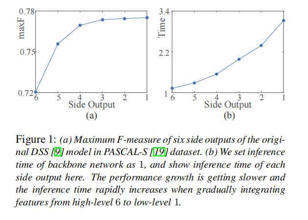
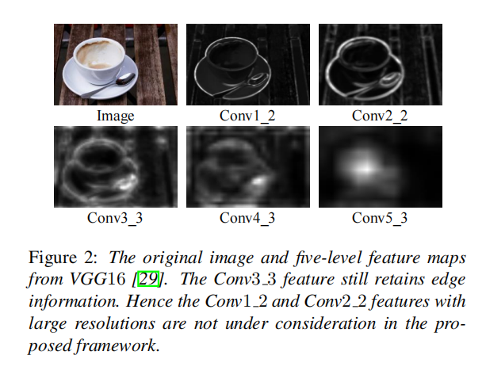
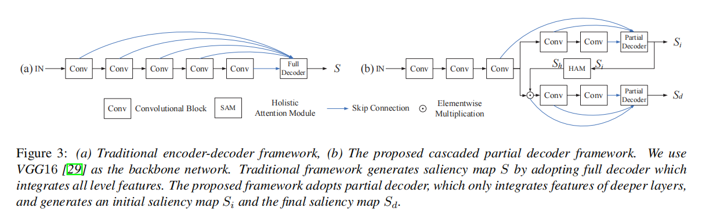
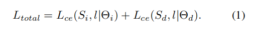
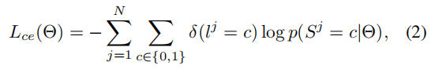
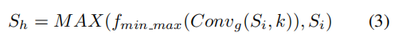
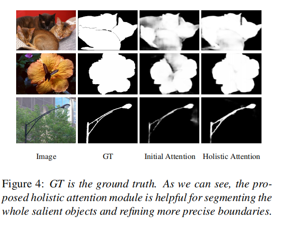
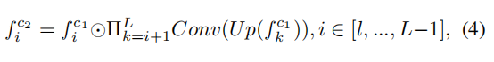
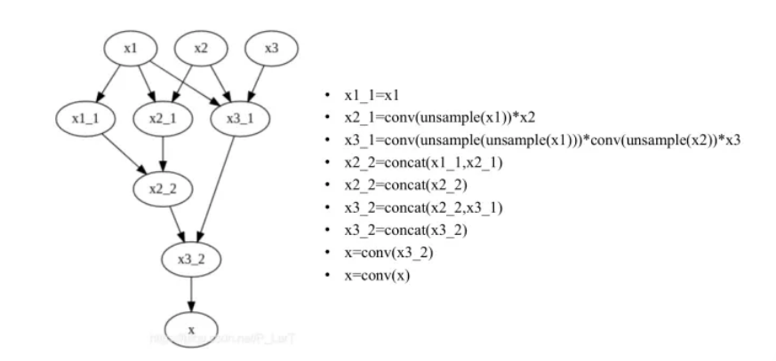

# **Cascaded Partial Decoder for Fast and Accurate Salient Object Detection**

现有的最先进的显著目标检测网络依赖于聚合预先训练好的卷积神经网络（CNNs）的多层次特征。

与高级特性相比，低级特性对性能的贡献较小，但由于其更大的空间分辨率，需要花费更多的计算。

在本文中，我们提出了一种新的级联部分解码器（CPD）框架来快速和准确的显著目标检测。

一方面，该框架构建了部分解码器，丢弃较浅层的大分辨率特征进行加速。

另一方面，我们观察到，整合更深层的特征得到了相对精确的显著性图。

因此，我们直接利用生成的显著性图来细化主干网络的特征。该策略有效地抑制了特征中的干扰物，并显著提高了它们的表现能力。

在5个基准数据集上进行的实验表明，该模型不仅取得了最先进的性能，而且比现有模型运行得要快得多。此外，该框架还进一步应用于改进现有的多层次特征聚合模型，显著提高了其效率和准确性。

# **1. Introduction**

最近，深度学习在显著目标检测方面取得了惊人的性能，因为它提供了丰富的和有区别的图像表示。早期的深度显著性方法[15,16,32]利用cnn来预测图像区域的显著性得分，获得计算复杂度高的精确显著性图。

.在下面的工作中，基于编解码器的全卷积网络（FCN）[24]体系结构广泛应用于显著目标检测。

编码器是预先训练的图像分类模型（如VGG [29]和ResNet [8]），提供多层次的深度特征：低分辨率的高级特征代表语义信息，高分辨率的低层次特征代表空间细节。在解码器中，这些特征被结合起来生成精确的显著性映射。研究人员开发了各种解码器[9,17,20,21,25,41,42]来集成低级和高级特性。

然而，这些深度聚合方法存在两个缺点。一方面，与高级特征相比，低级特征对深度聚合方法的性能的贡献较小。在图1(a)中，我们给出了DSS [9]模型的不同侧输出的性能。很明显，当逐渐从高级聚合到低级别时，性能趋于迅速饱和。

.另一方面，由于低层次特征分辨率较大,将低层次特征与高级特征相结合，明显增加了计算复杂度，如图1(b).所示

然而，**检测和分割显著的对象应该是快速的，因为这个过程通常是一个对更复杂的操作[3]的预处理阶段。**因此，必须设计一种机制，在确保性能的同时，消除低级特征对计算复杂度的影响。

当cnn深入时，特征逐渐从低级表示转变为高级表示。因此，当只整合深层特征时，深度聚合模型可以恢复显著性图的空间细节。在图2中，我们展示了VGG16 [29]的多层特征图的例子。与Conv1 2层和Conv2 2层的低级特征相比，Conv3 3层的特征还保留了边缘信息。

此外，特征图中的背景区域可能会导致显著性图的不准确性。以往的研究都是利用自适应注意机制[21,41]来解决这一问题。然而，这种机制的效果依赖于注意图的准确性。**由于融合深层的特征将生成相对精确的显著性图，我们可以直接使用这个图来细化特征。**

在本文中，我们提出了一种新的级联部分解码器框架，该框架丢弃较浅层的特征以保证高计算效率，然后细化较深层次的特征以提高其表示能力。我们将标准的直主干网络修改为分叉网络。这个新的主干网络包含两个具有相同架构的分支。我们构造了只聚合每个分支中的特征的部分解码器。为了进一步加速模型，我们设计了一个快速高效的上下文模块来抽象鉴别特征，并以上采样连接的方式进行集成。然后提出了一种级联优化机制，利用第一个分支的初始显著性映射，重新对第二个分支的特征进行级联优化。

为了均匀地分割整个显著性对象，我们提出了一个整体的注意模块，以允许初始显著性映射覆盖更多有用的信息。此外，所提出的框架还可用于改进现有的深度聚合模型。当将它们的解码器嵌入我们的框架时，准确性和效率将显著提高。我们的贡献总结如下：

- (1)我们提出了一种新的级联部分解码器框架，该框架丢弃低级特征以降低深度聚合模型的复杂性，并利用生成的相对精确的注意图来细化高级特征以提高性能。
- (2)在5个基准数据集上的实验结果表明，该模型不仅取得了最先进的性能，而且比现有模型运行得要快得多。
- (3)我们的框架可以用于改进现有的深度聚合模型。与原始模型相比，改进后的模型的效率和精度都将得到显著提高。

# **2. Related Work**

在过去的二十年里，研究人员开发了大量的显著性检测算法。传统的模型提取手工制作的特征，并基于各种显著性假设[2,6,11,46]。更多关于传统方法的细节在[3,4]中总结。本文主要讨论了基于深度学习的显著性检测模型。

早期的工作利用cnn来确定图像区域是否显著或[15,16,32,44]。虽然这些模型比传统方法取得了更好的性能，但预测图像区域的显著性得分是很耗时的。然后，研究人员基于成功的完全卷积网络[24]开发了更有效的模型。Li等人[18]建立了显著对象检测和语义分割的统一框架，以有效地学习显著对象的语义属性。Wang等人，[34]利用级联的完全卷积网络来不断完善之前的预测图。

最近，研究人员证明，融合多层特征进一步提高了密集预测任务[7,27]的性能。在cnn中，高级特征提供语义信息，而低级特征包含空间细节，有助于细化对象边界。许多工作人员[9,17,20,21,25,41,42]都遵循这种策略，并精确地分割突出的对象。Li等人，[17]直接集成了多层次的特征，以获得更高级的特征表示。Liu和Han [20]首先进行粗略的全局预测，然后通过集成本地上下文信息分层、渐进地逐步细化显著性图的细节

Hou等人[9]在HED [38]体系结构中引入了跳跃层结构的短连接。Luo等人通过多分辨率的4×5网格网络，结合局部对比度特征和全局信息，将[25]分割突出对象。Zhang等人[42]首先将多层次的特征映射集成到多个分辨率中，同时包含语义信息和空间细节。然后预测每个分辨率中的显著性映射，并将它们融合起来生成最终的显著性映射。在[41]中，该工作提取了上下文感知的多层次特征，然后利用双向门控结构在它们之间传递消息。Liu等人[21]利用全局和局部像素级上下文注意网络来捕获全局和局部上下文信息。然后将这些模块与U-Net架构相结合，以分割显著的对象。

在本文中，我们认为低级特征的贡献总是小于高级特征。然而，由于它们具有更大的空间分辨率，它们需要比高级特征更多的计算成本。因此，我们提出了一种新的级联部分解码器框架用于显著性目标检测，该框架不考虑低级特征，并利用生成的显著性映射来细化高级特征。

# **3. The Proposed Framework**

本文提出了一种新的包含两个分支的级联部分解码器框架。在每个分支中，我们设计了一个快速、有效的部分解码器。第一个分支生成一个初始显著性映射，用于细化第二个分支的特征。此外，我们还提出了一个整体的注意模块来均匀地分割整个对象

## **3.1. Mechanism of the Proposed Framework**

我们在VGG16网络的基础上设计了该模型，该网络是在深度显著目标检测模型中应用最广泛的骨干网络。

对于大小为H×W的输入图像I，我们可以在五个层次上提取特征，分别表示为$\{f_i，i = 1，...，5\}$，分辨率为$[\frac H{2^{i−1}},\frac 2{W^{i−1}}]$。

之前中提出的解码器工作[41,42]，称为全解码器，整合所有特征生成显著地图s完整解码器的统一架构如图3(a)所示，它可以表示$D_T=g(f_1f_2f_3f_4f_5)$，其中g（·）表示多层特征聚合算法。以前的工作主要集中在如何开发一个更有效的集成策略上。

在图3(b)中，我们展示了所提出的级联部分解码器框架的架构。由于较浅层的特征对性能的贡献较小，因此我们构建了一个只集成了较深层特征的部分解码器。为了利用生成的显著性映射来细化特征，我们设计了一个分叉的主干网络。我们将Conv3_3层设置为优化层，并使用最后两个卷积块构建两个分支（一个注意和一个检测）。

在注意分支中，我们设计了一个部分解码器来集成三级特征，分别表示为$\{f_i^a = f_i，i = 3,4,5\}$。因此，部分解码器由$D_a = g_a(f_3^a，f_4^a，f_5^a）$表示，并生成一个初始显著性映射Si。通过对所提出的整体注意模块进行处理，我们得到了一个增强的注意图Sh，用于细化特征$f_3$。由于我们可以通过整合三个顶层的特征来获得相对精确的显著性图，因此注意图Sh有效地消除了特征f3中的干扰物。

然后通过元素级将特征与注意图相乘，得到检测分支的细化特征$f_3^d=f_3\odot S_h$。因此，将检测分支的以下两级特征记为$\{f_4^d，f_5^d\}$。通过构造另一个部分解码器$D_d = g_d(f_3^d，f_4^d，f_5^d)$，输出最终的显著性映射Sd。为了方便起见，本文设置了$g_a= g_d$。

建议的整体注意模块和部分解码器的细节分别在第3.2节和第3.3节中描述。

我们用地面真理共同训练这两个分支。这两个分支的参数不共享。

$\{S_i，S_d\}$和对应的标签l，总损失总额表示为：

Lce是sigmoid交叉熵损失：

N为像素数，δ为指示函数，j为像素坐标，Θ = {Θi，Θd}为显著性映射S = {Si，Sd}对应的参数集。

很明显，Θi是Θd的一个适当的子集，这表明这两个分支是交替工作的。

一方面，注意分支为检测分支提供了精确的注意地图，这使得检测分支分段成为更准确的突出对象。

另一方面，检测分支可以被认为是注意分支的一个辅助损失，这也有助于注意分支关注于显著的对象。这两个分支的联合训练使我们的模型一致地突出突出的物体，同时抑制干扰物。

此外，我们可以利用所提出的框架来改进现有的深度聚合模型当我们通过使用这些工作的聚合算法来集成每个分支的特征时。尽管与传统的编码-解码器架构相比，我们提高了主干网络的计算成本，并增加了一个解码器，但由于解码器中丢弃了低级特征，总计算复杂度仍然显著降低。此外，该框架的级联优化机制提高了其性能，实验结果表明，这两个分支的性能都优于原始模型。

## **3.2. Holistic Attention Module**

给定来自优化层的特征映射和来自注意分支的初始显著性映射，我们可以使用一个初始注意策略，即直接将特征映射与初始显著性映射相乘

当我们从注意分支获得一个准确的显著性图时，该策略将有效地抑制特征的干扰物。相反，如果干扰物被归类为显著区域，该策略会导致异常的分割结果。因此，我们需要提高初始显著性映射的有效性。更具体地说，由于显著性对象的边缘信息难以被精确预测，因此可能会被初始显著性图过滤掉。此外，复杂场景中的一些对象很难被完全分割。因此，我们提出了一个旨在扩大初始显著性图的覆盖范围的整体注意模块，其定义如下：

Convg是一个卷积操作使用高斯核k和零bias，ffminmax（·）是一个归一化函数，用于在[0,1]中创建模糊的映射范围，MAX（·）是一个最大函数，它倾向于增加Si显著区域的权重系数 因为卷积运算会模糊Si。

与最初的注意相比，所提出的整体注意机制几乎没有增加计算成本，它进一步突出了整个突出的对象，如图4所示。此外，高斯核k的大小和标准差初始化为32和4。然后与所提出的模型进行联合训练。

## **3.3. The Proposed Decoder**

由于所提出的框架由两个解码器组成，我们需要构建一个快速的集成策略，以确保低复杂度。同时，我们需要生成尽可能准确的显著性地图。

____

首先，为了获取全局对比信息，我们设计了一个有效的上下文模块，该模块的灵感来自于感受野块（RFB）[22]。

与原来的RFB相比，我们又增加了一个分支来进一步扩大接受野。我们的上下文模块由四个分支$\{b_m，m = 1，...，4\}$组成。

为了加速，在每个分支中，我们使用一个1×1的卷积层来将信道数减少到32。对于{bm，m > 1}，我们添加了两层：一个（2m−1）×（2m−1）卷积层和一个3×3卷积层（2m−1）膨胀[5]。我们将这些分支的输出连接起来，并通过一个额外的1×1的卷积层将通道减少到32。然后添加一个短连接作为原始RFB。

_____

一般情况下，给定分叉主干网络的特征$\{f_i^c，i∈[l，...，L]，c∈[a，d]\}$，我们从上下文模块得到鉴别特征${f_i^{c1} }$。然后利用乘法运算来减小多级特征之间的差距。

特别是，对于最上面的特性（i = L），我们设置了$f^{c2}_L = f^{ c1}_ L$。对于特征${f_i^{c1}，i < L}$，我们将其更新为fi c2通过从元素层面上将自己与更深层次的所有特征相乘。

该操作的定义如下：

Up（·）是一个因子2k−j的上采样特征，Conv是一个3×3的卷积层。

最后，我们利用一种上采样连接策略来集成多层次的特性。当我们构建一个部分解码器并将Conv3 3层设置为优化层（l = 3，L = 5）时，我们得到了一个具有$[ \frac H 4，\frac W 4 ]$大小和96通道数的特征图。利用3×3层和1×1卷积层，我们得到最终的特征图，并将其调整为[H，W]。

