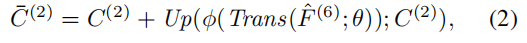

# **EGNet: Edge Guidance Network for Salient Object Detection**

全卷积神经网络（FCNs）在突出的目标检测任务中显示出了其优势。然而，大多数现有的基于fcns的方法仍然存在粗糙的对象边界。为了解决这一问题，我们重点研究了显著边缘信息和显著对象信息之间的互补性。

因此，我们提出了一种用于显著目标检测的边缘制导网络（EGNet），它可以在单个网络中同时建模这两种互补信息。

在第一步中，我们通过一种渐进融合的方式提取显著的对象特征。在第二步中，我们整合局部边缘信息和全局位置信息，得到显著的边缘特征。最后，为了充分利用这些互补特征，我们将相同的显著边缘特征与不同分辨率的显著对象特征耦合。

利用显著边缘特征中丰富的边缘信息和位置信息，融合后的特征可以帮助更准确地定位突出对象，特别是其边界。实验结果表明，该方法在6个广泛使用的数据集上，在没有任何预处理和后处理的情况下，其性能优于现有的方法。

# **1. Introduction**

# **3. Salient Edge Guidance Network**

整体架构如图2所示。在本节中，我们首先在Sec3.1中描述其动机。然后在3.2节引入所采用的显著对象特征提取方法,并提出了非局部显著性边缘特征提取模块。最后3.3节介绍了所提出的一对一指导模块。

## **3.1. Motivation**

与基于区域的方法相比，像素级显著目标检测方法具有优势。然而，他们忽略了图像中的空间相干性，导致显著的物体边界不满意。大多数方法[17,18,31,33,59,61]都希望通过融合多尺度信息来解决这一问题。一些方法[17,28,33]使用后处理，如CRF来细化突出的对象边界。

在NLDF [35]中，他们提出了一个IOU损失来影响边缘周围位置的梯度。它们都不注意显著边缘检测和显著目标检测之间的互补性。一个良好的显著的边缘检测结果可以帮助在分割和定位中完成显著的目标检测任务，反之亦然。在此基础上，我们提出了一种EGNet，以端到端方式对互补的显著边缘信息和显著对象信息进行建模和融合。

## **3.2. Complementary information modeling**

我们提出的网络是独立于主干网络的。在这里，我们使用其他基于深度学习的方法[17,35]提出的VGG网络来描述所提出的方法。

首先，我们截断了最后三个完全连接的层。

在DSS [17,18]之后，我们将另一个侧路径连接到VGG中的最后一个池化层。因此，从主干网络中，我们得到了Conv1-2、Conv2-2、Conv3-3、Conv4-3、Conv5-3、Conv6-36个侧特征。因为Conv1-2离输入端太近，而接受域也太小，所以我们扔掉了这个侧路$S^{(1)}$。在我们的方法中还有五路径S (2)、S (3)、S (4)、S (5)、S (6)。为简单起见，这五个特征可以用一个主干特征集C来表示：

C (2)表示Conv2-2特征等。Conv2- 2保存了更好的边缘信息[61]。

因此，我们利用S (2)来提取边缘特征和其他侧路径来提取显著的对象特征。

### **3.2.1 Progressive salient object features extraction**

如图2中的PSFEM所示，为了获得更丰富的上下文特征，我们利用广泛使用的架构UNet [40]来生成多分辨率特征。与原来的U-Net不同，为了获得更鲁棒的显著对象特征，我们在每个边路径上添加三个卷积层（图2中的Conv），在每个卷积层之后增加一个ReLU层，以保证非线性。

为了简单地说明，我们使用T (Tab。1)表示这些卷积层和ReLU层。此外，对每条侧边路径都采用了深度监督。我们采用卷积层将特征映射转换为单通道预测掩模，并使用D (Tab。1)来表示它。卷积层的细节可以在Tab 1.中找到。

### **3.2.2 Non-local salient edge features extraction**

在这个模块中，我们的目标是对显著边缘信息进行建模和提取显著边缘特征。如上所述，Conv2-2保存了更好的边缘信息。因此，我们从Conv2- 2中提取局部边缘信息。然而，为了获得显著的边缘特征，只有局部信息是不够的。还需要高级的语义信息或位置信息。

当信息像U-Net架构一样逐步从顶层返回到低层次，高级的位置信息逐渐被稀释。此外，顶层的感受域最大，位置最准确。因此，我们设计了一个自顶向下的位置传播，将顶层位置信息传播到侧路径S (2)，以约束非突出边缘。

融合的特征$\overline C(2)$可表示为：

Trans（∗；θ）是一个参数为θ的卷积层，旨在改变特征的通道数，φ（）表示ReLU激活函数。Up（∗；C (2))是双线性插值操作，其目的是将*向上采样到与C (2)相同的大小。在方程的右边，第二项表示来自较高侧路径的特征。

为了清楚地说明，我们使用UpT（Fˆ(i)；θ，C (j)）来表示Up（φ（Trans（Fˆ(i)；θ））；C (j)）。Fˆ(6)表示侧路径S (6)中的增强的特征。增强的特征Fˆ(6)可以表示为f（C (6)、WT (6)），S (3)、S (4)、S (5)中的增强特征可以计算为：

在获得与其他侧路径相似的引导特征¯C(2)后，我们添加了一系列卷积层来增强引导特征，然后将S (2)中的最终显著边缘特征$F_E$计算为$f（\overline C(2)；WT (2)）$。配置的详细信息可以在选项卡1中找到。 为了明确地对显著边缘特征进行建模，我们添加了一个额外的显著边缘监督来监督显著边缘特征。我们使用交叉熵损失，它可以定义为：

Z+和Z−分别表示显著的边缘像素集和背景像素集.WD为过渡层的参数，如表1.中所示。 

P r（yj = 1|FE；WD (2)）是一个预测图，其中每个值表示像素的显著边缘置信度。此外，在显著目标检测侧路径上添加的监督可以表示为：

其中，Y+和Y−分别表示显著区域像素集和非显著像素集。因此，在互补信息建模中的总损失L可以记为：

## **3.3. One-to-one guidance module**

在获得互补的显著边缘特征和显著目标特征后，我们的目标是利用显著边缘特征来引导显著目标特征更好地进行分割和定位。最简单的方法是融合$FE$和$\hat F(3)$。最好是充分利用多分辨率的显著对象特性。然而，将显著边缘特征和多分辨率显著对象特征从下到上逐步融合的缺点是，当显著对象特征融合时，显著边缘特征被稀释。此外，目标是融合显著目标特征和显著边缘特征，利用互补信息获得更好的预测结果。因此，我们提出了一个一对一的指导模块。此外，实验部分验证了我们的观点。

具体来说，我们为S (3)、S (4)、S (5)、S (6)添加了子边路径。在每条支线路径中，通过将显著边缘特征融合为增强的显著对象特征，使高级预测的位置更加准确，更重要的是，分割细节变得更好。显著的边缘制导特征（s个特征）可表示为：

然后与PSFEM类似，我们在每个子侧路径上采用一系列卷积层T来进一步增强s-特征，并采用过渡层D来将多通道特征图转换为单通道预测图。这里为了清楚地说明，我们在这个模块中将T和D表示为t0和d0。由等式提供(3)，我们得到了增强的s-特征ˆG(i)。

在这里，我们还为这些增强的特性添加了深度监督。对于每个支线输出预测图，损失可计算为：

然后将多尺度精细的预测图融合，得到融合图。融合地图的损失函数可记为：

因此，这部分的损失和拟议网络的总损失可以表示为：

