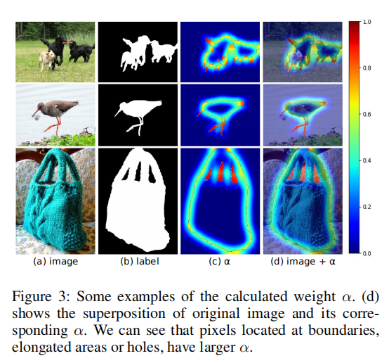

# **F** 3**Net: Fusion, Feedback and Focus for Salient Object Detection**

现有的显著目标检测模型通过聚合从卷积神经网络中提取的多层次特征取得了很大的进展。然而，由于不同卷积层的接受域不同，这些层产生的特征之间存在着很大的差异。

常见的特征融合策略（添加或连接）忽略了这些差异，并可能导致次优解。

在本文中，我们提出了F3网络来解决上述问题，该网络主要由交叉特征模块（CFM）和级联反馈解码器（CFD）组成，通过最小化一个新的像素位置感知损失（PPA）进行训练。

具体来说，CFM旨在有选择地聚合多级特性。

与加法和连接不同的是，CFM在融合前从输入特征中自适应地选择互补组件，可以有效地避免引入过多的冗余信息，从而破坏原始特征。

此外，CFD采用了多阶段反馈机制，在前几层的输出中引入封闭监督的特征，对其进行补充，消除特征之间的差异。

这些改进后的特性在生成最终的显著性映射之前，将经过多次相似的迭代。

此外，与二值交叉熵不同的是，所提出的PPA损失并不平等地对待像素，它可以合成一个像素的局部结构信息，引导网络更多地关注局部细节。来自边界或容易出错部分的硬像素将得到更多的关注，以强调其重要性。

F 3Net能够准确地分割突出的目标区域，并提供清晰的局部细节。在5个基准数据集上进行的综合实验表明，F3Net在6个评价指标上优于最先进的方法。代码将在https://github.com/weijun88/F3Net上发布。

# **Introduction**

显著目标检测（SOD）的目的是估计图像或视频中的视觉重要区域，通常作为许多下游视觉任务的预处理步骤（Wang et al. 2019a）。早期的SOD算法主要依赖于启发式先验（例如，颜色、纹理和对比度）来生成显著性映射。

然而，这些手工制作的功能很难捕获高级语义关系和上下文信息，因此它们对复杂的场景不够健壮。

最近，卷积神经网络（CNNs）在视觉特征表示方面显示了其强大的特征提取能力（Zhang等2018c；Szegedy等2015；黄等2017；胡、沈、孙2018）。许多基于CNNs的模型（侯等2019；秦等2019；陈等2018；吴、苏、黄2019；李等2018；张等2018b；冯、陆、丁2019；王等2017b；张等2017)取得显著进展，将SOD性能推到一个新的水平。这些模型采用了结构简单、计算效率高的编解码器结构。编码器通常由预先训练好的分类模型（例如ResNet（He等人2016）和VGG（西蒙尼扬和泽塞曼2015））组成，该模型可以提取不同语义级别和分辨率的多个特征。在解码器中，将提取出的特征组合起来生成显著性映射。

然而，SOD仍存在两大挑战。

- **首先，不同层次的特征具有不同的分布特征。高级特性具有丰富的语义但缺乏准确的位置信息。**
- **低级的特征有丰富的细节，但充满了背景噪音。**

为了生成更好的显著性映射，我们将多层次的特征组合了起来。但是，**如果没有对模型中的信息流进行精细控制的情况下，一些冗余特征，包括低层的噪声和高层的粗边界，将会进入，可能导致性能下降。**其次，大多数现有模型使用二值交叉熵的平等对待所有像素。**从直观地看，不同的像素值得拥有不同的权值，例如，边界处的像素更有区别性，应该更加重视。**

各种边界损耗（Qin et al. 2019；冯、陆、Ding 2019）已被提出以提高边界检测精度，但仅考虑边界像素不够全面，因为边界附近有大量像素容易发生错误预测。这些像素也很重要，应该被分配更大的权重。因此，有必要设计一种机制来减少不同级别特征之间不一致的影响，并为那些真正重要的像素分配更大的权重。

为了解决上述挑战，我们提出了一种新的SOD框架F3Net，该框架在生成高质量的显著性图方面取得了显著的性能。

- 首先，为了减轻特征之间的差异，我们设计了交叉特征模块（CFM），它通过元素级乘法融合了不同层次的特征。与加法和串联不同，CFM采用选择性融合策略，抑制冗余信息，避免特征之间的污染，重要特征将相互补充。与传统的融合方法相比，CFM能够去除背景噪声和锐化边界，如图1所示。

  

- 其次，**由于降采样，高级特征可能会出现信息丢失和失真，这是CFM无法解决的。**因此，我们开发了级联反馈解码器（CFD）来迭代地细化这些特征。CFD包含多个子解码器，每个子解码器都包含自下而上和自上而下的进程。对于自底向上的过程，通过CFM逐步聚合多层特性。对于自上而下的过程，聚合的特性会被反馈到以前的特性中，以改进它们。

- 第三，我们提出了像素位置感知损失（PPA）来改进常用的平等对待所有像素的二叉交叉熵损失。事实上，位于边界或拉长区域的像素更不同和辨别。多关注这些硬像素可以进一步增强模型的泛化。PPA损失为不同的像素分配不同的权值，从而扩展了二进值交叉熵。每个像素的权重由其周围的像素决定。硬像素将得到更大的权重，而容易得到的像素将得到更小的权重。

为了证明F3Net的性能，我们报告了在5个流行的SOD数据集上的实验结果，并可视化了一些显著性映射。我们进行了一系列的消融研究来评估每个模块的效果。定量指标和视觉结果表明，F3Net可以显著获得更好的局部细节和改进的显著性图。代码已发布。简而言之，我们的主要贡献可以总结如下：

- 我们引入交叉特征模块来融合不同层次的特征，能够提取特征之间的共享部分，抑制彼此的背景噪声，补充彼此缺失的部分。
- 我们提出了用于SOD的级联反馈解码器，它可以将高分辨率和高语义的特征反馈到以前的特征上，从而对其进行纠正和改进，以更好地生成显著性映射。
- 我们设计像素位置感知损失，为不同的位置分配不同的权重。它可以更好地挖掘特征中包含的结构信息，帮助网络更多地关注细节区域。
- 实验结果表明，该模型F 3Net在5个数据集上均达到了最先进的性能，证明了该方法的有效性和优越性。

# **Related Work**

早期的SOD方法主要依靠内在线索，如颜色对比（Cheng et al. 2015）、纹理（Yan et al. 2013）和中心先验（Jiang and Davis 2013）来提取显著性地图，主要关注低级信息，忽略丰富的上下文语义信息。近年来，cnn被用于从原始图像中提取多层特征，并对提取的特征进行聚合，生成显著性图。

在这些方法中，（Hou et al. 2019）在全卷积网络中引入了短连接（Long，shelhemer和ll2015）来整合来自不同层的特征。

（Deng et al. 2018）和（Wang et al. 2017b）采用迭代策略，利用深层和浅层的特征，逐步细化显著性图。

（Liu，Han，and Yang 2018）提出了对每个像素的上下文区域产生关注，这有助于抑制背景噪声的干扰。

（Chen et al. 2018）和（Zhang et al. 2018b）使用注意引导网络来选择和提取补充特征，并对其进行整合，以增强显著性图。

（Qin et al. 2019）设计了混合损失，充分利用边界信息，

（Feng，Lu，Ding2019）使用双分支网络同时预测等高线和显著性图。

（Zhang et al. 2018a）设计了一个双向消息传递模型，以实现更好的特征选择和集成。

（Liu et al. 2019）利用简单的池化和特征聚合模块构建了快速、高性能的模型。

（Zhao和Wu 2019）引入了通道注意和空间注意来提取有价值的特征并抑制背景噪声。

然而，不同层次的特征之间的差异尚未得到全面的研究。如何设计更有效的融合策略来减少这种差异已成为SOD中的一个重要问题。此外，除了边界之外，还有许多硬像素值得更多的关注。增加它们在损失函数中的权重可以进一步提高鉴别能力。基于上述问题，我们设计了f3网络来准确、有效地生成显著性映射。

# **Proposed Method**

我们设计了跨特征模块来有选择性地集成特征，从而防止了冗余特征的引入。为了细化显著性映射，我们提出了一种级联反馈解码器，通过多次迭代来细化多级特征。为了引导网络更多地关注局部细节，我们引入了像素位置感知损失，为不同的像素分配不同的权值。详见图2。

## **Cross Feature Module**

我们提出交叉特征模块（CFM）来细化高级特征$f_h∈R^{H×W×C}$和低级别特征$f_l∈R^{H×W×C}$。由于接受域的限制，fl保留了丰富的细节和背景噪声。这些特征具有清晰的边界，这对于生成准确的显著性图非常重要。相比之下，由于多次下采样，fh在边界上是粗糙的。尽管丢失了太多详细的信息，fh仍然具有一致的语义和清晰的背景。这两种特征之间存在着很大的统计学差异。一些例子如图1所示。

CFM通过进行特征交叉来减轻特征之间的差异。首先通过元素乘法提取fl和fh之间的公共部分，然后通过元素加法分别将其与原始fl和fh组合。与现有研究中采用的直接添加或串联相比，CFM避免了向fl和fh引入的冗余信息，冗余信息可能会“污染”原始特征，给显著性图的生成带来不利影响。通过多个特征交叉，fl和fh将逐渐相互吸收有用的信息来相互补充，即fl的噪声将被抑制，fh的边界将被锐化。

具体来说，CFM包含两个分支，一个为fl，另一个为fh，如图2所示。首先，分别对fl和fh应用一个3x3的卷积层，使其适应于后续处理。然后通过乘法对这些特征进行变换和融合。融合的特征具有fl和fh的特性，即边界清晰和一致的语义。最后，融合的特征将被添加到原始的fl和fh中，以进行细化表示。整个过程可以如下所示。

每个Mh（·）、Ml（·）、Gh（·）、Gl（·）都是卷积、批数范数和relu的组合。

在得到细化的特征后，应用3x3卷积来恢复原始维度。整个模块呈现了一个完全对称的结构，其中fl将其细节嵌入到fh中，并且fh过滤了fl的背景噪声。

## **Cascaded Feedback Decoder**

基于级联反馈解码器（CFD），对多层次特征进行细化，迭代生成显著性映射。对于SOD，传统的方法的目标是直接聚合多层次的特征，以生成最终的显著性映射。事实上，由于降采样和噪声，不同级别的特征可能存在缺失或冗余的部分。

即使使用CFM，这些部件仍然难以识别和恢复，这可能会影响最终的性能。**考虑到输出的显著性映射相对完整且接近于地面真实值，我们建议将最后一个卷积层的特征传播回前一层的特征，以对其进行校正和细化。**

图2显示了包含多个解码器的CFD的体系结构。每个解码器由两个过程组成，即自下而上和自上而下。**对于自底向上的过程，CFM将特性从高层逐渐聚合到底层。聚合的特征将被监督，并产生一个粗糙的显著性映射**。**对于自顶向下的过程，由最后一个进程聚合的特性被直接降采样，并添加到CFM导出的以前的多级特性中，以细化它们。这些改进后的特性将被发送到下一个解码器，以通过相同的进程。**

事实上，在计算CFD中，多个解码器的两个过程被逐个连接，形成一个网格网。多层次的特性在这个网络中迭代地流动和细化。最后，这些特性将足够完整，以生成更精细的显著性映射

具体来说，我们在ResNet-50（He et al. 2016）上构建CFD，这是在SOD任务中广泛使用的骨干。

对于大小为HxW的输入图像，ResNet-50将在五个级别上提取其特征，表示为$\{f_i |i = 1，...，5\}$，分辨率为$[\frac H{2^{i−1}},\frac W{2^{i−1}}]$。由于低级别的特性带来太多的计算成本，但性能提高很小（Wu、Su和Huang 2019），我们只使用最后四级f2、f3、f4、f5的特性，它们的分辨率更低，计算成本更低。

CFD的整个过程可以表述为Alg。1，其中Dei（·）为第i个子解码器，Dsi（·）表示降采样操作。

## **Pixel Position Aware Loss**

在SOD中，二进制交叉熵（BCE）是应用最广泛的损失函数。然而，BCE的损失有三个缺点。

- 首先，它独立地计算每个像素的损失，而忽略了图像的全局结构。
- 其次，在背景占主导地位的图片中，前景像素的丢失会被稀释。
- 第三，它平等地对待所有像素。事实上，位于杂乱或拉长区域（如杆和角）的像素容易出现错误的预测，值得更多的关注，而像素位于区域，如天空和草，值得更少的关注。

因此，我们提出了一个加权二进制交叉熵的损失，如等式所示3

1（·）是指示器函数，γ是一个超参数。符号l∈{0,1}表示两种标签。$p^s_{ij}$和$g^s_{ij}$是图像中位置（i，j）处像素的预测和地面真实值。Ψ表示模型的所有参数，Pr（p s i，j = l|Ψ）表示预测概率。

在$L^s_{wbce}$中，每个像素将被分配一个权重α。硬像素对应较大的α，简单像素将分配较小的α。α可以作为像素重要性的指标，它是根据中心像素与其周围环境的差值等式计算出来的 4.

Aij表示围绕像素的区域（i，j）。对于所有像素，$α^s_{ij}∈[0,1]$。如果αij很大，则（i，j）处的像素与周围环境很大不同。所以它是一个重要的像素（例如，边缘或孔），值得更多的关注。

相反，如果αij很小，我们认为它是一个普通像素，不值得关注。图3显示了一些例子。

与BCE相比，$L^s_{wbce}$更关注硬像素。此外，局部结构信息被编码到L s wbce中，这可能有助于模型关注一个更大的接受域，而不是单个像素。为了进一步使网络关注全局结构，我们引入了加权IoU（wIoU）损失，如等式所示 5.

IoU损失已被广泛应用于图像分割（Rahman和Wang 2016）。其目的是优化全局结构，而不是专注于单个像素，且不受不平衡分布的影响。最近，它已被引入SOD（Qin et al. 2019），以弥补BCE的缺陷。但它仍然是平等地对待所有的像素，而忽略了像素之间的差异。与IoU损失不同的是，我们的wIoU损失为硬像素分配了更多的权重，以强调它们的重要性。

基于以上讨论，像素位置感知损失如等式所示 6.它综合了局部结构信息，为所有像素生成不同的权值，并引入了像素限制（L s wbce）和全局限制（L s wiou）,可以更好地指导网络的学习和生产明确的细节。

CFD中的每个子解码器对应一个$L^s_{ppa}$。此外，还增加了多层次监督（MLS）作为辅助损失，以促进充分的训练，如图2所示。给定CFD和M级中的N个子解码器，整个损失在等式中定义7

第一项对应所有子解码器损失的平均值，第二项对应辅助损失的加权和，其中高水平损失由于误差较大而权重较小