# **Multi-scale Interactive Network for Salient Object Detection**

基于深度学习的显著目标检测方法取得了很大的进展。然而，突出物体的可变尺度和未知类别一直是一个巨大的挑战。这些与多层次和多尺度特性的利用密切相关。

在本文中，我们提出了聚合交互模块来集成来自相邻级别的特征，其中由于只使用了较小的上/下采样率，因此引入了较小的噪声。

为了从集成特征中获得更有效的多尺度特征，在每个解码器单元中都嵌入了自交互模块。

此外，由尺度变化引起的类不平衡问题削弱了二元交叉熵损失的影响，导致了预测的空间不一致性。

因此，我们利用一致性增强的损失来突出前/后景的差异，并保持类内的一致性。

在5个基准数据集上的实验结果表明，该方法没有任何后处理的性能优于23种最先进的方法。源代码将在https://github.com/la上公开获得

# **1. Introduction**

显著目标检测（SOD）的目的是区分视觉上最明显的区域。

在数据驱动的深度学习方法的帮助下，它发展迅速，并已应用于许多计算机视觉领域，如视觉跟踪[24]、图像检索[10]、非逼真渲染[28]、4D显著性检测[33]、无参考合成图像质量评估员[38]等。

虽然目前已经取得了很大的进展，但如何从尺度变化数据中提取更有效的信息，以及如何在这种情况下提高预测的空间一致性，仍需要关注两个问题

由于突出区域的尺度不同，基于CNN的方法由于重复的子采样缺乏必要的详细信息的限制，对不同尺度的显著物体进行一致、准确的分割存在差异（图1）。

此外，由于卷积操作的固有局部化和交叉熵函数的像素级特性，很难实现对象的均匀高亮。

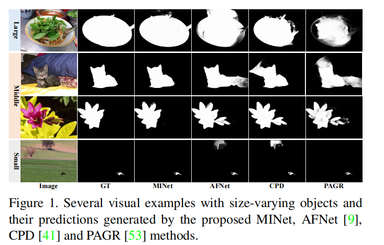

对于第一个问题，现有方法的主要解决方案是分层集成较浅的特征。一些方法[23,53,4,9,40,41,27,37]通过传输层将编码器中相应级别的特征连接到解码器（图2（a、c、e）)。

单级特征只能描述特定于尺度的信息。在自上而下的路径中，由于深层特征的不断积累，细节在浅层特征中的表示能力减弱。

为了利用多层次的特征，一些方法[51,13,34]以完全连接的方式或启发式的方式组合来自多层的特征（图2（b，f，g））。

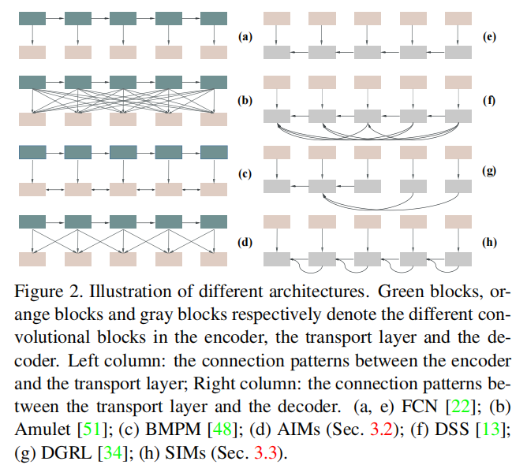

然而，整合过多的特征，缺乏不同分辨率之间的平衡，容易导致计算成本高、大量噪声和融合困难，从而干扰自上而下路径的后续信息恢复。

.此外，空间金字塔池模块（ASPP）[3]和金字塔池化模块（PPM）[55]来提取多尺度的上下文感知特征，并增强单层表示[6,32]。

尽管如此，现有的方法通常会在编码器背后装备这些模块，这导致由于顶层特性的低分辨率的限制，它们的网络错过了许多必要的细节。

对于第二个问题，一些现有的模型**[41,27]**主要采用一个特定的分支或一个额外的网络来细化结果。然而，这些方法仍面临着计算冗余和训练困难的问题，不利于进一步的应用。

____

受Zhang等人[54]提出的相互学习思想的启发，我们提出了一种聚合交互策略（AIM），以更好地利用多层次特征，避免大分辨率差异导致的特征融合的干扰（图2(d)）。我们协同学习知识指导，以有效地整合来自相邻解决方案的上下文信息。为了进一步从提取的特征中获得丰富的尺度特异性信息，我们设计了一个自交互模块（SIM）（图2(h)）

训练两个不同分辨率的交互式分支从单个卷积块中学习多尺度特征。AIMs和SIMs有效地提高了处理SOD任务中规模变化的能力。与[54]中的设置不同，在这两个模块中，相互学习机制被纳入到特征学习中。每个分支都可以通过交互式学习更灵活地整合来自其他分辨率的信息。

在AIMs和SIMs中，主分支（图4中的B1和图5中的B0）由辅助分支加以补充，并进一步增强了其鉴别能力。此外，多尺度问题也导致了数据集前景和背景区域之间的严重不平衡，因此我们在训练阶段嵌入了**一致性增强损失（CEL），这对对象的规模不敏感。同时，CEL可以更好地处理空间相干性问题，并在没有附加参数的情况下均匀地突出显著性区域，因为其梯度具有保持类内一致性和扩大类间差异的特点。**

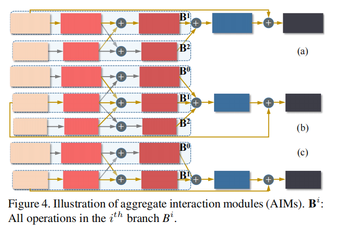

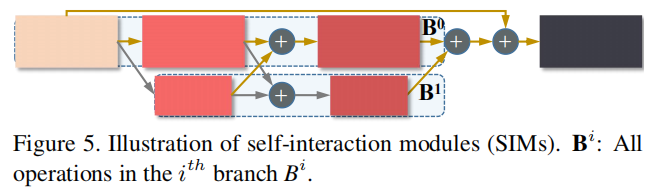

我们的贡献可以总结为三个方面：

- 我们提出了MINet来有效地满足SOD任务中的规模挑战。聚合交互模块可以通过相互学习的方式有效地利用相邻层的特征，自交互模块使网络自适应地从数据中提取多尺度信息，更好地处理尺度变化。

- 我们利用一致性增强损失作为辅助，推动我们的模型均匀地突出整个突出区域，更好地处理由不同尺度的物体引起的前后区域之间的像素不平衡问题，没有任何后处理或额外的参数。
- 我们在5个数据集上将提出的方法与23种先进的SOD方法进行了比较。它在不同的评价指标下都取得了最佳的性能。此外，该模型在GPU上的前向推理速度为35 FPS

# **2. Related Work**

## **2.1. Salient Object Detection**

早期的方法主要是基于手工制作的先验[5,39,49,47]。它们的泛化性和有效性是有限的。早期的深度显著性目标检测（SOD）方法[57,16]使用多层感知来预测一个图像的每个处理单元的显著性得分。这些方法的计算效率较低，并破坏了潜在的特征结构。有关传统方法和早期深度方法的更多细节，请参阅[2,35]。

近年来，一些方法引入了全卷积网络（FCN）[22]，取得了很好的效果。此外，Liu等人[20]将全局和局部上下文模块分层嵌入到自上而下的路径中，为每个像素构建信息性的上下文特征。

Chen等人[4]提出了在自上而下的路径中的反向注意来指导残差显著性学习，从而驱动网络发现补体对象区域和细节。然而，上述方法仅在每个解码器单元中使用单独的分辨率特征，这并不是解决复杂和各种尺度问题的足够有效的策略。

## **2.2. Scale Variation**

尺度变化是SOD任务中的主要挑战之一。受到局部卷积操作和下采样操作，CNN很难处理这个问题。

一方面，嵌入在不同分辨率的特征中的关于物体的信息量会随着物体的尺度而变化。一个简单的策略是粗略地集成所有特征。

另一方面，每个卷积层只有处理特殊尺度的能力。因此，我们需要通过构建多路径特征提取结构从单个层表征多尺度信息

**Multi-level Information.**

Zhang等人[51]简单地将所有层级特征合并到传输层中。这种粗融合很容易产生信息冗余和噪声干扰。在[48]中，利用门函数来控制消息传递速率，以优化层间信息交换的质量。然而，多重门控处理导致来自其他层的信息严重衰减，这限制了网络的学习能力。与这些方法不同的是，我们只融合了相邻层的特征，同时获得了丰富的尺度信息。

**Multi-scale Information**

atrous空间金字塔池化（ASPP）[3]和金字塔池化模块（PPM）[55]是多尺度信息提取的两种常用选择，通常固定在网络[6,32]的最深处。由于较深的特征所包含的小尺度对象信息较少，而对于顶层特征尤其如此，这些方法不能有效地处理大尺度变化。此外，在[37]中，金字塔注意模块可以通过对所有位置进行多次降采样和softmax操作来获得多尺度注意图来增强特征。但这种softmax严重抑制非最大值，对噪声更敏感。它并不能很好地改善规模问题。

为了避免对小对象的错误判断，我们**提出了一个多尺度的处理模块，其中两个分支交互式地学习特征。通过数据驱动的训练，双路结构可以学习到丰富的多尺度表示。此外，超大和过小的物体导致了前景和背景样本之间的不平衡，这削弱了像素级监督的效果。**

**我们引入了一致性增强损失（CEL）作为交叉熵损失的帮助。CEL对对象的大小不敏感。它可以克服监督的困难，在面对大规模变化时表现良好。**

## **2.3. Spatial Coherence**

为了提高显著性映射的空间相干性和质量，一些非深度方法通常集成一个过分割过程，生成区域[44]、超像素[45]或对象建议[11]。

对于基于深度学习的方法，Wu等人[41]提出了一个具有两个分支的级联部分解码器框架，并直接利用注意分支生成的注意映射，从显著性检测分支中细化特征。Qin等人的[27]采用了一个残余细化模块，并结合了一个超损失来进一步细化预测，这大大降低了推理速度。在本文中，CEL更加关注预测的整体效果。它有助于获得更均匀的显著性结果，是效果和速度之间更好的权衡。

# **3. Proposed Method**

本文提出了一种融合多层次和多尺度特征信息的交互式集成网络，以解决显著性目标检测（SOD）任务中普遍存在的尺度变化问题。整体网络结构如图3所示。

编码器块、集成聚合交互模块（AIMs）、自交互模块（SIMs）和融合单元（FUs）分别表示为$\{E^i\}^4_{i=0}$、$\{AIMI^i\}^4_{i=0}$、$\{SIM^i \}^ 4_{ i=0}$和$\{F^i\}^ 4_{i=0}$

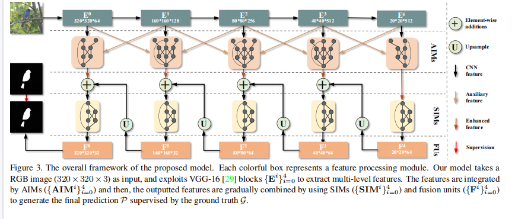

## **3.1. Network Overview**

我们的模型建立在FCN体系结构上，以预先训练好的VGG-16 [29]或ResNet-50 [12]为骨干，两者都只保留了特征提取网络。

具体来说，我们删除了VGG-16的最后一个最大池化层，以保持最终卷积层的细节。因此，VGG-16的输入下采样系数为16，ResNet-50的输入因子为32。我们使用主干来提取多层次的特征和抽象，然后每个AIM（图4）使用相邻层的特征作为输入，有效地利用多层次的信息，为当前的分辨率提供更相关和有效的补充。

接下来，在解码器中，每个SIM（图5）后面是一个FU，它是卷积层、批处理归一化层和ReLU层的组合。SIM可以自适应地从特定的层次上提取多尺度的信息。这些信息被FU进一步整合，并被输入到较浅的层。此外，我们引入了一致性增强损失作为辅助损失来监督训练阶段。在本节中，我们将详细介绍这些模块。为了简化描述，所有后续的模型参数均基于VGG-16骨干。

## **3.2. Aggregate Interaction Module**

在特征提取网络中，不同层次的卷积层对应着不同程度的特征抽象。

多层次集成可以增强不同分辨率特征的表示能力：1)在浅层，可以进一步强化详细信息，抑制噪声；2)在中间层，同时考虑语义信息和详细信息，可根据网络自身的需要自适应调整特征中不同抽象信息的比例，从而实现更灵活的特征利用；3)在顶层，考虑相邻分辨率时可以挖掘更丰富的语义信息。特别地，我们提出了聚合交互模块（AIM）（图4），通过交互学习的策略来聚合特征。

第i个AIM表示为$AIM^i$，其输入由编码器的特征$f^{i−1}_e$、$f^i_e$和$f^{i+1}_ e$组成，如图4 (b).所示

通过单个卷积层、批处理归一化层和ReLU层的组合进行初始转换后，减少了这些特征的通道数。

在交互阶段，B0分支和B2分支通过池化、邻近插值和卷积操作进行调整，然后通过元素相加它们两个都被合并到B1分支中。同时，B1分支也被调整其分辨率，并分别合并到B0和B2分支。最后，通过后续的卷积层将这三个分支融合在一起，并减少了信道数。

为了有效地训练AIMs，增加f i e的权重，以确保其他分支仅作为补充，我们引入了一种剩余学习策略。输出特征表示为$f^i_{AIM}∈R^{Ni×Hi×Wi×Ci}$，其中C0 = 32和$C_{i\ne0} = 64$。对于AIM0和AIM4，它们的输入值只相应地包含$f_e^ 0、f_e^ 1$和$f_e^3、f_e^4$（图4（a、c）)。整个过程的表述如下：

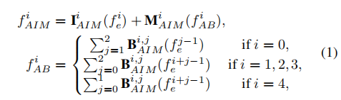

I（.）和M（·）分别表示身份映射和分支合并。

$B^{i，j}_{AIM}（·）$是$AIM_i$中的第j个分支（即B j）的整体操作。由于空间限制，每个分支内部的计算细节详见图4。

**3.3. Self-Interaction Module**

AIMs旨在实现层间卷积特征的有效利用，而提出了自交互模块（SIMs）从层内特征产生多尺度表示。sim的细节见图5。同样，我们也在sim中应用了转换-交互-融合策略。

具体地说，输入特征的分辨率和维数首先通过一个卷积层来降低。在每个分支中，SIM执行一个初始转换，以适应以下交互操作：我们将低分辨率特征上采样和降采样高分辨率特征到与来自其他分支的特征相同的分辨率。

在交互不同信道数的高分辨率和低分辨率特征使用可以获得大量关于不同尺度的知识，并在低参数量下保持高分辨率的信息。

为便于优化，还采用了残差连接，如图5所示。经过上采样、归一化和非线性处理后，将使用FU来融合来自SIM和残差分支的双路径特征。将sim集成到解码器中，使网络能够自适应地处理训练阶段不同样本的尺度变化。整个过程都被写为：

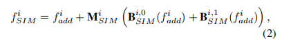

$f^i_{SIM}$是SIMi的输出。M（·）表示分支合并，$B^{i，j}_{SIM}$表示SIM^i中第j个分支（即B j）的操作，其中，i添加的输入特征f计算如下：

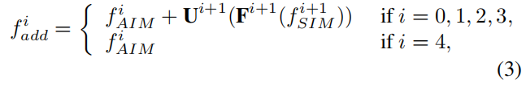

Ui+1（·）和Fi+1（·）表示（i+1）的上采样操作和融合单元。有关sim的详情，请见图5。

## **3.4. Consistency-Enhanced Loss**

在SOD任务中，广泛使用的二进制交叉熵函数在整个批中累积每像素损失，不考虑像素间关系，不能明确提示模型尽可能平稳地突出前景区域，处理样本不平衡问题。为此，我们提出了一种一致性增强损失（CEL）。首先，最终的预测结果的计算方法如下：

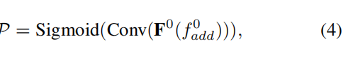

P∈RN×H×W×1表示一批数中的N个显著性映射，N为批数大小

0 < p∈P < 1是属于显著区域的概率。sigmoid（Conv（·））实际上代表了解码器中具有非线性激活函数的最后一个卷积层。二进制交叉熵损失（BCEL）函数写得如下：

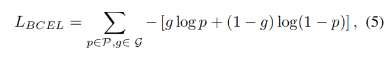

其中，log（·）也是一个元素级的操作。g∈{0,1}N×H×W×1代表真实值。

为了解决不同尺度引起的前后不平衡问题，损失函数至少需要满足两个要求，1）更关注前景而不是背景，物体尺度上的差异不会导致计算损失产生较大的波动；2）预测前景区域与地面真实区域完全不相交时，应有最大的损失。基于这两点，我们考虑区域之间的拓扑关系来定义CEL如下：

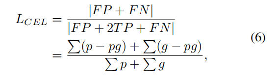

TP、FP和FN分别代表真阳性、假阳性和假阴性。|·|计算该面积。F P + F N表示预测前景区域与地面真值的并集与相交的差集，F P + 2T P + F N表示该并集与该交点的和。

当{p|p > 0，p∈P}∩{g|g = 1，g∈G} =∅时，损失达到其最大值，即LCEL = 1。由于p是连续的，所以LCEL对于p是可微的。因此，该网络可以以端到端的方式进行训练。

为了比较LCEL和LBCEL，我们分析了它们的直接作用于网络预测的梯度。其衍生物表示如下：

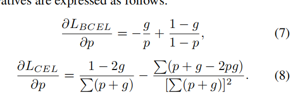

可以观察到，∂LBCEL/∂p只依赖于对个体位置的预测。而∂LCEL/∂p与预测P和地面真实g中的所有像素都相关，因此，我们认为CEL可以对预测结果施加全局约束，从而产生更有效的梯度传播。

在eq(8)，除了分子1−2g是特定于位置的外，其他术语都是特定于图像的。该分子与二元地面事实密切相关，导致类间导数差异较大，而类内导数差异相对一致。这有几个优点： 1)确保在训练后期有足够大的梯度驱动网络；2)它有助于解决类内不一致和类间不清楚的问题，在一定程度上，从而促进突出对象的预测边界变得更清晰。最后，总损失函数可以写成

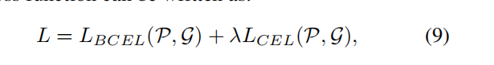