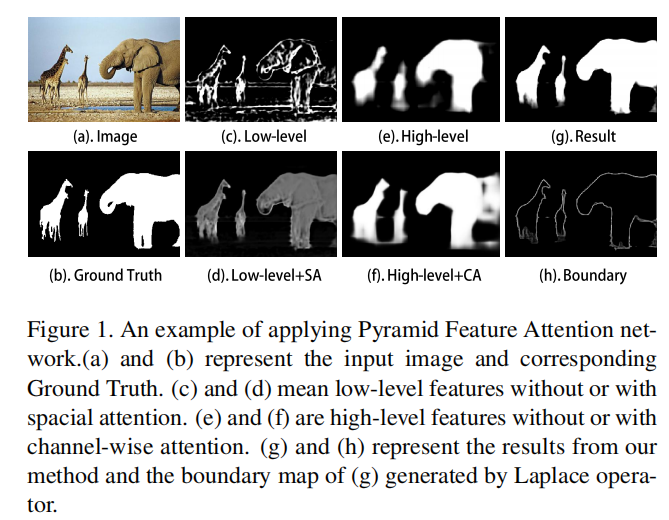

# Pyramid feature attention network for saliency detection

显著性检测是计算机视觉中的基本挑战之一。如何提取有效的特征是进行显著性检测的关键。

近年来的方法主要是不加选择地采用多尺度卷积特征的集成。然而，并不是所有的特征都对显著性检测有用，有些特征甚至会引起干扰。

为了解决这一问题，我们提出了金字塔特征注意网络，以关注有效的高级上下文特征和低层次的空间结构特征。

首先，我们设计了基于上下文感知的金字塔特征提取（CPFE）模块，以捕获丰富的上下文特征。其次，我们在CPFE特征图之后采用通道级注意（CA），在低水平特征图之后采用空间注意（SA），然后将CA和SA的输出融合在一起。

最后，我们提出了一种边缘保护损失来指导网络在边界定位中学习更详细的信息。对五个基准数据集的广泛评估表明，所提出的方法在不同的评估指标下优于最先进的方法。

# **1. Introduction**

本文提出了一种新的显著目标检测方法——金字塔特征注意（PFA）网络。考虑到不同层次特征的不同特征（图1（c，e）），低层次特征的显著性映射包含许多噪声，而高级特征的显著性映射只得到一个近似区域。

因此，对于高级特征，受SIFT[23]特征提取算法的启发，设计了上下文感知金字塔特征提取（CPFE）模块来获得多尺度多尺度多接受域高级特征，然后利用通道级注意（CA）选择合适的尺度和接受域来生成显著性区域。在训练过程中，CA对对显著性检测起重要作用的信道分配较大的权值（图1 (f)）。

为了细化显著性区域的边界，我们将低级特征与边缘信息进行了融合。但并不是所有的边缘信息都能有效地细化显著性映射，我们希望专注于突出对象和背景之间的边界。因此，我们利用空间注意来更好地关注有效的低水平特征，并获得清晰的显著性边界（图1 (d)）。

经过对不同注意机制的处理后，高级特征和低级特征具有互补感知能力，适合生成显著性映射。此外，与以往的显著性检测方法不同，我们提出了一种边缘保留损失来指导网络在边界定位中学习更详细的信息。基于上述考虑，所提出的PFA网络方法可以产生良好的显著性映射。

简而言之，我们的贡献总结如下：

1. 我们提出了一种用于图像显著性检测的金字塔特征注意（PFA）网络。对于高级特征，我们采用了一个上下文感知的金字塔特征提取模块和一个信道注意模块来捕获丰富的上下文信息。对于低层次的特征，我们采用空间注意模块来过滤掉一些背景细节。
2. 我们设计了一种新的边缘保持损失来指导网络学习边界定位中更详细的信息。 
3. 该模型在几个具有挑战性的数据集上取得了最先进的水平。实验证明了该方法的有效性和优越性

# **2. Related Works**

## **2.1. Salient Object Detection**

在过去的十年中，有许多可以进行显著性检测的方法。早期的方法[5,38,39,17]基于手工制作的特征来估计显著价值。这些方法检测具有类人直觉感觉和启发式先验的显著对象，如颜色对比度[5]、边界背景[38,39]和中心先验[17]。这些直接的技术被认为是友好的，以保持良好的图像结构。然而，手工特征和先验很难捕获关于对象的高级和全局语义知识。

近年来，各种网络架构在显著性检测方面做出了许多努力。一些实验[15,18,29]表明，深层的高级特征对语义信息进行编码，以获得对象的抽象描述，而浅层的低级特征保留空间细节，用于重建对象边界（图1（c，e））。

因此，一些工作将多层次的特征引入到了显著性检测中。Hou等人提出了一种显著性方法，在HED结构中引入跳跃层结构的短连接。Wang等人[31]提出了一种基于递归全卷积网络（RFCNs）的显著性检测方法。Luo等人的[24]通过一个多分辨率的网格结构，将本地信息和全球信息相结合。Zhang等人。[43]通过直接连接来自高级和低层次的特征图来聚合多层次的特征。Zhang等人[42]提出了一个双向消息传递模块，其中消息可以通过门功能相互控制进行传输。然而，一些特征可能会对显著性检测的干扰。如何获得各种特征并选择有效的特征已成为显著性检测中的一个重要问题。

## **2.2. Attention Mechanisms**

注意机制已成功地应用于机器翻译[11]、目标识别[25]、图像字幕[3,36]、视觉问题回答[34,41]和姿态估计[6]等各种任务中。

Chu等人[6]提出了一个具有多上下文注意机制的网络到端到端框架的人体姿态估计。

Chen等人[3]提出了一种SCA-CNN网络，该网络在CNN中包含了空间和通道方面的注意，用于图像字幕。

Zhang[45]等人[45]提出了一种渐进式注意引导网络，该网络通过通道级和空间注意机制依次生成注意特征，用于显著性检测。

由于注意机制具有很强的特征选择能力，因此它是对显著性检测的完美选择。在集成卷积特征的同时，大多数现有的方法对多层次特征的处理都没有区别。有些方法采用了一些有效的策略，如门函数[42]和渐进注意[45]，但这些方法选择一定方向选择特征，忽略了高级特征和低级特征之间的差异。与之不同的是，对于高级特征，我们采用了上下文感知的金字塔特征提取（CPFE）模块和通道级注意模块来获取丰富的上下文信息。

在CPFE模块中，我们在VGG网的三个高级块侧采用多尺度无卷积，然后通过通道注意机制对突出物体显示高响应的通道分配较大的权重。

对于低级特征，存在一些背景区域，分散了显著性地图的生成。空间注意机制根据高级特征过滤掉一些背景细节，更多地关注前景区域，有助于生成有效的特征进行显著性预测。

# **3. Pyramid Feature Attention Network**

在本文中，我们提出了一种新的显著性检测方法，其中包含上下文感知金字塔特征提取模块和通道注意模块捕获上下文感知多尺度多接受域高级特征，空间注意模块低级特征地图细化突出对象细节和有效的边缘保存损失指导网络在边界定位学习更详细的信息。整体架构如图2所示。

## **3.1. Context-aware pyramid feature extraction**

视觉上下文对于显著性检测非常重要。现有的CNN模型通过叠加多个卷积层和池化层来学习对象的特征。

然而，突出的物体在尺度、形状和位置上有很大的变化。以前的方法通常直接使用从自底到上的卷积层和池化层，这可能不能有效地处理这些复杂的变化。

受SIFT[23]特征提取的启发，我们尝试设计一个新的模块来提取尺度、形状和位置不变性的特征。尺度不变特征变换（SIFT）是计算机视觉中一种用于检测和描述图像中的局部特征的特征检测算法。

该算法提出了融合尺度空间表示和金字塔多分辨率表示的高斯表示[23]。由多个具有相同分辨率的不同高斯核函数处理的尺度空间表示；以及由不同分辨率的下采样处理的金字塔多分辨率表示。

与SIFT中的高斯函数相似，我们使用atrous卷积[4]得到了具有相同尺度但不同接受域的特征。与SIFT中的金字塔多分辨率表示类似，我们采用VGG-16 [27]的conv3-3、conv4-3和conv5-3来提取多尺度特征。

具体来说，上下文感知的金字塔特征提取模块如图3所示。我们将VGG-16中的conv 3-3、conv 4-3和conv 5-3作为基本的高级特征。为了使最终提取的高级特征包含尺度和形状不变性特征，我们采用不同膨胀率的无卷积，设置为3、5和7以捕获多接受域上下文信息。然后结合不同卷积层的特征映射和1×1维降维特征。在此之后，我们得到了三个具有上下文感知信息的不同尺度特征，我们将两个较小的特征上采样到最大的一个。最后，我们通过跨通道连接将它们合并，作为上下文感知金字塔特征提取模块的输出。

## **3.2. Attention mechanism**

我们利用上下文感知的金字塔特征提取来获得多尺度的多接受场高级特征。不同的特征具有不同的语义值来生成显著性映射。

但大多数现有的方法都是不加区分的集成多尺度特征，这导致了信息冗余。更重要的是，在某些程度上，不准确的信息会导致性能下降，甚至是错误的预测。过滤这些特性和进一步关注有价值的特性是很重要的。

在本小节中，我们将讨论PFA网络中的注意机制。根据不同层次特征的特征，对高级特征采用通道式注意，对低层次特征采用空间式注意来选择有效的特征。此外，我们不对高级特征使用空间注意，因为高级特征包含高抽象语义[16,45]，因此不需要过滤空间信息。然而，我们没有对低级特征使用通道级的注意，因为在低级特征的不同通道之间几乎没有语义区别

### **3.2.1 Channel-wise attention**

**cnn中不同的特征通道对不同的语义的[16]产生响应**。从图1中可以看出，来自高级特征的显著性图只是一个粗略的结果，一些基本区域可能会被削弱。在上下文感知金字塔特征提取后，我们将加权多尺度多接受域高级特征的[16,3]模块添加到通道注意（CA）中。CA将为对突出物体显示高响应的通道分配更大的权重。

我们将f∈RW×H×C的高级特征展开为$f^h=[f^h_1,f^h_2，...，f^h_C]$，其中$f^h_i∈R^{W×H}$是$f^h$的第i片，C是总通道数。

首先，我们对每个$f^h_i$应用平均池，以获得一个通道特征向量$v^h∈R^C$。之后，使用两个连续的完全连接（FC）层来完全捕获通道级依赖关系（见图4）。如[16]，为了限制模型的复杂性和帮助泛化，我们通过在非线性周围形成一个具有两个FC层的瓶颈来对通道级特征向量进行编码。然后，通过sigmoid运算，对映射到[0,1]的编码通道特征向量进行归一化处理。

自然图像通常包含丰富的前景细节和复杂的背景。从图1中可以看出，来自低级特征的显著性映射包含了许多细节，很容易带来不好的结果。在显著性检测中，我们希望在没有其他纹理的情况下获得显著性物体和背景之间的详细边界，这样会分散人们的注意力。因此，我们没有平均考虑所有的空间位置，而是采用空间注意来更多地关注前景区域，这有助于生成预测显著性的有效特征。

我们将低级特征表示为$f^l∈R^{W×H×C}$。空间位置的集合用$R = \{(x，y)|x = 1，...，W；y = 1，...，H\}$表示，其中j =（x，y）为低层次特征的空间坐标。为了增加接受域和获取全局信息而不增加参数，类似于[26]，我们采用两个卷积层，一个核为1×k，另一个核为k×1，对于高级特征捕获空间问题（见图4）。然后，利用s型运算，对编码的空间特征图映射到[0,1]进行归一化处理。

其中W为空间注意块中的参数，σ2为s型操作，conv1和conv2为1×k×C和k×1×1对流层

我们在实验中设置了k=9。用SA对fl进行加权，得到了该块的最终输出$\overline  f l$。

## **3.3. Loss function**

在机器学习和数学优化中，损失函数代表了在分类问题中预测的不准确性所付出的代价。在显著性目标检测中，我们总是使用最终显著性映射与地面真相之间的交叉熵损失。损失函数的定义为：

式中，Y为地面真值，P为网络输出的显著性图，αs为正负样本的平衡参数，我们设置αs = 0.528，由训练集的地面真值计算得到。然而，损失函数只是提供了生成显著性映射的一般指导。

我们使用一个更简单的策略来强调突出的对象边界细节的生成。首先，我们利用拉普拉斯算子[12]来得到网络输出的地面真实值的边界和网络输出的显著性图，然后我们利用交叉熵损失来监督显著性目标边界的生成

拉普拉斯算子是n维欧几里得空间中的一个二阶微分算子，定义为梯度的散度（∆f）。因为二阶导数可以用来检测边缘，所以我们使用拉普拉斯算子来得到突出的对象边界。

二维中的拉普拉斯算符由等式8给出，其中x和y是xy平面的标准笛卡尔坐标。事实上，由于拉普拉斯算子使用了图像的梯度，所以它在内部调用卷积操作来执行其计算。然后我们使用通过激活函数的绝对操作等式9，将该值映射到[0,1]。最后，我们利用交叉熵损失来监督显著目标边界等式10的生成 总损失函数是它们的加权和：

在第3.3节中，我们提出了一种有效的边缘保护损失来指导网络学习边界定位中更详细的信息。图7显示了由我们的方法生成的显著性图和由等式9计算出的边界图是否有边缘保存损失。这些结果表明，边缘保留损失直接提高了其通用性，并使我们的方法细节化。此外，我们发现不同α值下的边缘保存损失对最终结果有不同的影响。从选项卡2可知，当α为0.7时，得到最好的结果。

