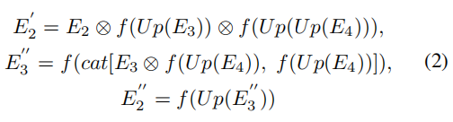

# **TRACER: Extreme Attention Guided Salient Object Tracing Network**

现有的显著目标检测（SOD）研究主要集中在利用边缘信息提取不同的目标和聚合多层次特征以提高SOD性能。

为了达到令人满意的性能，这些方法采用了细化的边缘信息和低级的多级差异。然而，性能增益和计算效率都无法达到，这促使我们研究现有的编解码器结构中的低效，以避免这种权衡。

我们提出了跟踪器，它通过合并注意引导跟踪模块来检测具有显式边缘的显著对象。

我们在第一个编码器的末尾使用一个掩码的边缘注意模块，使用快速傅里叶变换将细化后的边缘信息传播到下游的特征提取中。

在多层聚合阶段，联合注意模块识别出互补的通道和重要的空间信息

为了提高解码器的性能和计算效率，我们最小化了使用对象注意模块的解码器块的使用。该模块从细化的通道和空间表示中提取未检测到的对象和边缘信息。随后，我们提出了一个自适应的像素强度损失函数来处理相对重要的像素，而传统的损失函数则是平等地处理所有像素。与13种现有方法的比较表明，示踪器在5个基准数据集上取得了最先进的性能。

# Introduction

为了提高显著目标检测（SOD）的性能，现有的方法可以分为两种方法：改进边缘表示的方法和减少多层次聚合过程中的差异的方法。

为了细化边缘，现有方法采用了浅层编码器表示，其中包含足够的边缘信息 (Zhang et al. 2017; Wang et al. 2018; Wu, Su, and Huang 2019a), and deeper encoder outputs (Feng, Lu, and Ding 2019; Qin et al. 2019; Wu, Su, and Huang 2019b; Zhao et al. 2019; Wei et al. 2020).

尽管多层聚合可以显式地表示边缘，但多个编码器输出有不同的数据分布。为了减少差异，已经提出了跳跃连接或级联解码器结构 (Zhang et al. 2018b; Zhou et al. 2018; Feng,Lu, and Ding 2019; Pang et al. 2019; Qin et al. 2019; Zhao et al. 2019).这些现有的方法提高了SOD的性能；然而，它们不能同时实现性能和计算效率。因此，为了提高性能和计算效率，本研究的重点是减少可以在现有解码器结构中发展的低效率，并将自适应像素权重应用于传统的损失函数

在现有的编码器-解码器结构中，以往的研究通过网络使用多层次编码器表示(Feng, Lu, and Ding 2019; Qin et al. 2019; Wu, Su, and Huang 2019b; Zhao et al. 2019; Wei et al. 2020) 来提取边缘信息。虽然这些研究由于显式的边缘信息而提高了SOD的性能，但它们广泛地使用了边缘细化模块，这些模块需要全部或部分编码器输出。这些方法增加了参数开销和计算效率低下。此外，这些研究中的方法没有在下游特征提取阶段的提取细化边缘，因为边缘生成方法依赖于其他编码器的输出。由于低级和高级信息可以有效地检测边缘特征和语义表示，因此为了提高网络效率，应该有选择地确定使用两级细化模块并最小化。

解码器的目的是在合并低级和高级表示时减少多层次聚合期间的差异（Zhang等2018b；庞等2019；秦等2019；魏、王和黄2020）。由于使用多个编码器输出的解码器会消耗大量的内存，最近的研究提出了一种级联解码器，它可以减少低级连接或聚合高级表示（Wu、Su、黄2019a；魏、王、黄2020；魏等人。2020）

随后，其他人提出了对象和边缘细化模块（昆、王、王2016；陈等2018；刘、韩、杨2018；张等2018a；秦等2019；王等2019；赵等2019；赵、吴2019)或多解码器结构（吴、苏、黄2019b；魏、王、黄2020；魏等2020)，以减少不同表示的差异。

然而，它还没有确定是否多个模块和多解码器的计算是有效的。为了提高性能和网络效率，重点应该是确定在多层次上的哪些表示是重要的，同时最小化在多层次聚合和解码器结构中的注意模块的使用。因为不同的级别包含不同的数据分布，所以在多层次聚合过程中应该强调不同的表示。

在对损失函数应用自适应像素级权值的过程中，每个像素都独立处理二值交叉熵（BCE）和IoU损失，这些损失函数被全局采用（Zhao et al. 2019；Pang等，2020）。很明显，靠近细边或显式边的像素应该比背景或突出对象中心的像素更聚焦。为了处理这种像素不一致性，现有的研究（Wei，Wang，和Huang 2020）提出了加权BCE和加权IoU损失函数。虽然该研究对相对重要的像素分配了较大的权重，但它们也对冗余像素施加了重要性，包括背景区域，而不覆盖显式和精细的边缘。因此，有必要采用自适应的像素级权值来描绘精细的或显式的边缘区域，同时排除冗余的区域。

本研究提出了一种极端注意引导的显著对象跟踪网络，称为跟踪器。为了解决现有方法的低效问题，我们在浅层编码器、多级聚合过程和解码器中分别应用了三个注意引导模块（即掩码边缘、联合和目标注意模块）。掩蔽边缘注意模块使用快速傅里叶变换增强了低级表示中的边缘特征，并将边缘细化的表示传播到下一个编码器。联合注意模块聚合了多级编码器输出，以减少分布中的差异。随后，该模块确定了聚合通道和空间表示中更重要的上下文。在集成之后，对象注意模块合并了低级编码器表示和解码器输出来识别显著的对象。为了处理像素的相对重要性，我们提出了一个自适应的像素强度损失函数。我们通过使用多个核聚合来聚合目标像素周围的相邻像素，并排除边缘之外的权值。当目标像素由细边或显式边组成时，它被分配了一个比其他像素更高的强度。本研究的主要贡献如下。

我们研究了现有编码解码器结构的低效，并提出了一种称为示踪剂的高效网络，它克服了SOD性能提高和计算效率之间的权衡。

我们提出了掩码边、并集和对象注意模块，这些模块能够有效地识别解码器结构中的显著对象和边

自适应像素强度损失函数聚焦于相对显著的像素，它们与显式边或细边相邻。它使网络能够优化有噪声的标签的鲁棒性和局部-全局结构感知。

# **TRACER**

在本节中，我们描述了示踪器，它包括一个非常有效的主干编码器以及注意引导的显著对象跟踪模块（即掩蔽边缘、联合和对象注意模块），如图1所示。

## **Architecture overview**

由于现有的主干编码器VGG16（14.7M）和ResNet50（23.5M）在特征提取性能和内存效率方面存在漏洞，因此需要一个替代主干。因此，我们使用高效网（Tan和Le 2019）作为主干编码器，并将现有的7个块合并到4个块中，除了初始卷积块外，输出分辨率被移动。

在这里，我们将每个编码器块输出表示为Ei，并将**掩蔽边缘注意模块**首先应用于第一个编码器块输出E1，它具有足够的边界表示，以利用增强的边缘信息，提高存储效率。

在解码器上，我们实现了联合注意模块和目标注意模块，它们聚合了多层次的特征，并分别合并了编码器和解码器的输出。在联合注意模块中，我们整合了三个编码器块输出E2、E3和E4，它们是由基于多核的感受场块在E2的尺度上获得的。多层次表示具有不同的分布；因此，我们通过联合注意模块强调更多不同的通道和空间信息。

对象注意模块提取具有互补边缘信息的不同对象，并利用这些补充信息来减少浅层编码器和解码器表示之间的差异（Zhang等，2018b；Pang等，2019）。此外，对象注意模块由深度卷积块组成（Howard et al. 2017），最小化学习参数的数量，以提高计算效率。

最后，示踪剂生成四个深度监督图（DSi）（Lee et al. 2015），它们是输出联合（DS0）、对象注意模块（DS1和DS2）和DS图（DSe）的集合。

## **Attention guided tracing modules**

检测带有边缘的不同对象对于提高SOD性能至关重要。利用所提出的卷积模块（为计算效率而设计），我们通过注意引导的显著目标跟踪模块（ATMs）来跟踪目标和边缘，以提高性能。

**Masked edge attention:** 为了跟踪边缘信息，我们提出了掩蔽边缘注意模块（MEAM），该模块采用快速傅里叶变换（F F T）提取显式边界（尚穆甘，迪基和格林1979；徐1996；阿卜杜勒-卡德，阿布达耶和凯利2003），并增强了第一编码器的输出边界。现有的方法使用边缘信息，但它们不能在特征提取阶段利用显式边缘，因为这些方法需要更深的编码器的输出来获得不同的边缘。

因此，我们只使用F F T来从第一个编码器表示中提取显式边缘。使用F F T和F F T−1，将第一个编码器表示分为高频和低频如下：

X表示输入特征，FFT（·），F F T−1（·）分别表示快速傅里叶变换及其逆变换。此外，frH（·）是一个高通滤波器，它消除了除半径为r内的频率以外的所有频率。

为了区分显式边，我们利用高通滤波器获得的高频，它具有足够的边界信息（Haddad，Akansu et al. 1991；Xu 1996；Wang et al. 2020b）。此外，当XH从频域转换到空间域时，XH还包含了背景噪声。因此，我们通过应用接受场操作RFB（·）来消除噪声，并生成的显式边如下： E = RFB（XH）。最后，我们计算边缘细化表示XE如下： XE = X + E。使用E，我们计算显式边损失

**Union attention:**一个联合注意模块（UAM）被设计用来聚合多层次的特征，并从通道和空间表示中检测更重要的上下文。这里，f（·）和cat（·）分别表示卷积操作和通道方向的特征连接。每个编码器输出的Ei∈{2、3、4}，分别聚合为32、64和128个通道，集成如下：

我们得到了一个聚合的表示法，它是e2的尺度

在聚合之后，是哪些上下文信息在通道和空间特征中都相对重要。然而，现有的研究（Wang et al. 2019；Zhao和Wu 2019）已经将通道和空间注意模块独立应用于解码器和接受域块，尽管这两个空间都存在依赖性。因此，我们首先区分相对显著的通道级上下文，并强调基于从通道上下文中获得的互补置信度分数的空间信息。

在等式中3，是通道级合并表示，F（·）表示使用1×1核大小的卷积操作。利用自注意方法和自注意信息的软max函数来区分具有s型函数的显著通道αc∈RC×1×1。为了细化聚合表示X，我们应用如下置信通道权重： Xc =（X⊗αc)+ X。

随后，我们根据αc的分布和置信比γ保留置信通道，如下：

F−1(γ)为αc的γ分位数。我们排除了分布αc下尾的γ区域。

然后，通过空间计算细化的输入，以区分突出对象，生成第一个解码器表示D0∈R1×H2×W2，如等式所示 5.

G（·）使用1×1内核大小的卷积操作将输入特性投影到中。将D0上采样到DS0，以获得深度监督图。

**Object attention:**为了减少使用最小参数的编码器和解码器表示之间的分布差异，我们组织了一个对象注意模块（OAM）作为解码器。与现有的研究相比（Chen et al. 2018；Zhao等人，2019），我们保持D作为解码器效率的单一通道，OAM从每个解码器表示Di∈R1×H×W中跟踪对象和互补边。

为了细化突出对象，对象权重αO的计算方法如下： 。然而，αO并不能总是用显式的边缘区域来检测整个对象；因此，我们生成一个互补的边权值αE来覆盖未检测到的区域，如图2所示。对于D中的每个像素xij，我们对检测区域进行反转，消除去噪比d对应的遗漏区域检测的背景噪声，如Eq 6所示。

我们合并了编码器输出的Ei∈{2,1}和解码器特性Di∈{0,1}，如等式所示 7.为了减少差异，我们利用接受野操作RFB（·）和上样本Di+1来生成DSi+1。

为了减少差异，我们利用接受野操作RFB（·）和上样本Di+1来生成DSi+1。

对于损失函数，我们结合二叉交叉熵（BCE）、IoU和L1损失函数，以减少对象和背景之间的差异。虽然BCE和IoU被全局用于损失函数，但当所有像素都被同等考虑时，这些函数会导致前景和背景之间的类差异。与背景和突出对象中心的像素相比，靠近精细边缘或显式边缘的像素需要更多的关注。因此，我们提出了自适应像素强度（API）损失，它将像素强度ω应用于每个像素如下：

我们通过使用多个核大小K和排除像素外的权重，来聚合目标像素Aij周围的相邻像素（h，w）。

如图3所示，如果目标像素由细边组成，则采用多核聚合来分配给目标像素的强度高于分配给其他像素的强度。

λ是一种覆盖权重，在使用多核聚合时受到惩罚，因为分层聚合对显式边缘的像素施加更多的权重。我们根据经验将惩罚项λ设置为0.5，并将核大小设置为K∈{3,15,31}。

像素强度ω用于自适应BCE（aBCE）损失，如等式所示 9.这里，y和yˆ分别表示二进制类c对应的标签和预测概率。通过使用ω，aBCE损失使网络能够更多地关注与显式或精细边缘相关的局部结构，而不像BCE损失。

相比之下，自适应IoU损失基于ω对应的密集特征优化了全局结构。如等式中所示10，与原始的IoU损失相比，与密集区域高度相关的像素被区分和强调。

此外，为了进一步改进网络的等方差学习和减少散度差异，我们测量了L1距离，这使网络能够对噪声标签进行稳健的学习（Ghosh、Kumar和Sastry 2017；Wang et al. 2020a）。L1损失也同样处理所有像素；因此，我们将像素强度ω应用于L1损失，以区分相对显著的像素，并排除与显边或细边相邻的噪声像素，如下所示：

为了纳入上述局部和全局结构强度，我们将API损失函数组合如下：

基于组合损失函数L AP I，我们使用地面真实G、三个深度监督DSi∈{0,1,2}、三个监督DSe的集合和从MEAM得到的显式边E对最终损失进行优化，如下：

