# 自信息、熵、交叉熵与KL散度

## 1. Self-Information

信息论中最根本的一个问题就是，怎么量化一个事件x包含的信息量I(x)呢？

一个量化事件信息量的思路是，**量化观测到该事件发生后，给人带来的惊讶程度**。

具体来说，如果我们有一个信息量的度量，I(x)，它应当是**以事件x发生的概率P(x)参数化**的，即，I(x)=f(P(x))，同时我们会希望f(P(x))有以下属性：

1. f(P(x))是关于P(x)单调递减的。即，**概率越高的事件发生后，带来的信息量/惊讶程度越低；概率越低的事件发生后，带来的信息量/惊讶程度越高**。
2. f(P(x))≥0。 即，任何事件包含的信息量，应当是非负的
3. f(P(x))对任意P(x)均是连续的
4. I(x1,x2)=I(x1)+I(x2)。即，多个独立事件带来的总信息量，应当等于各个事件的信息量之和

事实上，满足上述四个条件的函数形式只有$I(x)=Klog(P(x)),K<0$

____

证明如下：

设事件C为两个独立事件A和B的交集，即。C=A∩B。根据属性4，我们有，

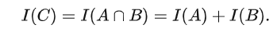

因为事件A、B相互独立，我们有

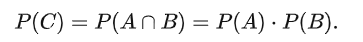

因此

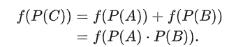

可以得出，函数$f(P(x))$应当满足。$f(ab)=f(a)+f(b)$。

现在我们证明满足该等式的函数f，必然有f(a)=Klog⁡(a)，其中K是任意实常数。

令，$g(a)=f(2^a)$，我们有

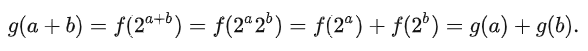

显然，我们有。g(a+b)=g(a)+g(b)。因为f是连续的，那么g也是连续的。因此，根据**柯西函数方程**，必然有g(a)=Ka。

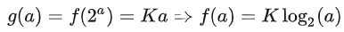

为了使f(P(x))满足上述条件1和2，K应当取负数。另外，其中log的底数可任取，为了方便，我们后续均取2为底数。

关于K的取值，Shannon在他1948年的论文A Mathematical Theory of Communication中写到：

​			**系数K的选择是一个方便的问题，相当于选择一个度量单位。**

出于此intuition，Shannon令，K=−1，最终得到，$I(x)=−log⁡(P(x))$，用来描述事件x中包含的信息量。

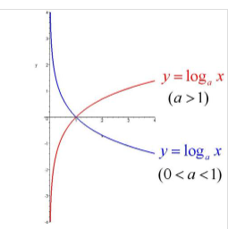

## 2. Entropy

现在我们有了对于一个事件x的信息量的度量I(x)，但是往往我们更感兴趣的是这些事件对应的随机变量X的信息量。

一个直观的做法就是对随机变量X中的所有可能事件的信息量求均值，来代表这个随机变量X的信息量。设随机变量，X∼p(X)，那么X的熵被定义为：

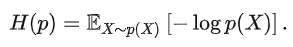

当X为离散随机变量时，

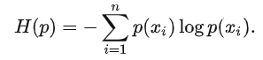

显然，在这个定义下，H(p)自然可以代表随机变量X的信息量。

"熵代表随机变量的平均信息量"，这个说法还是过于抽象了，我们能否把这个定义变得更加的数学化？自然是可以的，我们接下来引入熵的一个更加数学化的理解，即，**熵代表编码随机变量所需的最短平均编码长度**。换句话说，一个随机变量的平均信息量，等价于编码这个随机变量所需的最短平均编码长度。

那么，什么叫做编码一个随机变量呢？编码长度又指什么呢？我们用下面的例子进行一个直观的理解。

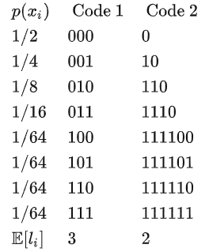

假设一离散随机变量X的分布如上，其共对应8个事件，每个事件发生的概率不一。现在我们希望的是：对每个事件进行二进制编码，使得传递该随机变量的取值时，所需的平均编码长度最小。

显然，若令每个事件的编码长度为li，如果我们利用上表Code 1编码随机变量X的各个取值，那么平均来看我们传递X的值时需要$E[l_i]=3bits$的编码长度。而利用Code 2进行编码的话，平均只需要$2bits$的编码长度。这是因为**Code 2对概率更大的事件采用了更短的编码，从而降低了编码所需的平均长度**，这一方法同霍夫曼编码的思路一致。

现在的问题是，给定随机变量X，我们能否预先求得其最短的平均编码长度？答案就是利用随机变量X∼p(X)的熵。

不难计算。$H(p)=−∑p(x_i)log\ ⁡p(x_i)=2bits$。也就是说，熵H(p)也可以理解为编码随机变量X时，所需的最短平均编码长度。

通过以上定义，显然，一个随机变量的信息量与其所需的最短平均编码长度是等价的。这也是很直觉的，**如果一个随机变量最优的平均编码长度更大，那么它应当包含更大的信息量；如果一个随机变量所需的最优平均编码长度很小，那么它包含的信息量也应当是很小的**。

____

我们刚刚只是陈述了结论：随机变量的熵即等价于编码该随机变量所需的最短平均编码长度，接下来我们提供证明。

假设编码的字符集的大小为，D，若采用二进制编码，则D=2。另外我们假设存在m个事件需要编码，每个事件的编码长度为li。根据编码理论中的Kraft–McMillan Inequality，在给定的码字字长$l_1,…,lm$下能够成功编码，当且仅当

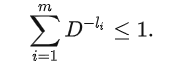

至此，寻找最优平均编码长度的问题可以写成如下优化问题：

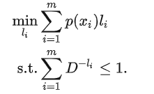

我们利用Lagrangian multiplier进一步求解带约束的优化问题，即

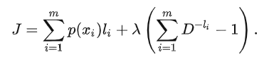

易得$l_i^∗=−logD⁡p(xi)$。 若采用二进制编码，显然，

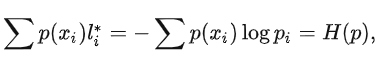

其中，熵的单位为bit，若采用e为底数，则熵的单位为mat。

因此，随机变量X∼p(X)的熵H(p)即是编码随机变量X的最优平均编码长度。

## 3. Cross-Entropy

在说交叉熵之前，我们再回顾一下熵的定义：

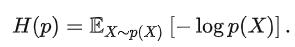

设p为真实分布，q为p的近似分布，交叉熵被定义为：

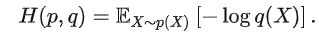

交叉熵和熵的定义长的很像，它们之间的区别可以这样理解：

1. 因为X的实际分布为p，所以计算期望编码长度时，尽管我们可能并不知道p，但理论上总是基于真实分布X∼p(X)计算期望。
2. 当我们利用正确的分布p(X)进行编码时，log里面的真数是p(X)。最终算出来的就是随机变量X的最优期望编码长度，即熵。
3. 当我们利用错误的分布q(X)进行编码时，log里面的真数是。q(X)。最终算出来的自然不再是熵，而是我们用错误的分布q(X)进行编码后，算出来的随机变量X的期望编码长度。

因为熵H(p)是随机变量X的最优期望编码长度，因此从其定义中我们可以直接得到$E_{X∼p(X)}[−log\ ⁡p(X)]≤E_{X∼p(X)}[−log\ ⁡q(X)]$。但我们这里依然证明一下。

令上述右式减左式，我们只需要证明

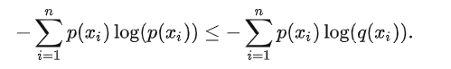

令上述右式减左式，我们只需要证明

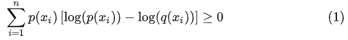

因为对任意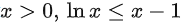所以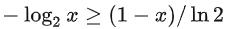不难证明，

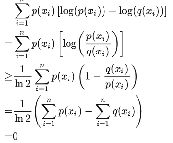

显然，我们确实有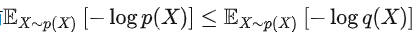

在了解了交叉熵和熵的关系后，我们就可以从信息论的角度理解，为什么交叉熵可以在机器学习中作为损失函数。我们在最小化交叉熵的时候，事实上是在逼近最优期望编码长度，即利用q(x)逼近p(x)，使得交叉熵尽可能的小，以接近熵的值。

## 4. KL Divergence

对于离散随机变量，分布p和q的KL散度的定义如下：

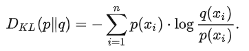

对KL散度在信息论中的一个直观的理解是将其写开，即

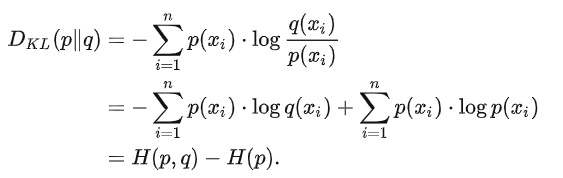

通过上节我们知道，交叉熵H(p,q)指利用分布q编码随机变量X所需的期望编码长度，而熵H(p)指编码随机变量X所需的最优期望编码长度。

既然，DKL(p‖q)=H(p,q)−H(p)， 那么显然，其意味着**利用q编码X所带来的额外编码长度**。事实上，上一节中的式(1)左侧等价于KL散度，因此KL散度恒大于等于零。

倘若我们优化KL散度，即是希望减小所需的额外编码数，使得分布p和q变得接近。这里有两种情况：

1. **若真实分布p恒定，那么优化KL散度等价于优化交叉熵**，其目的是令交叉熵逼近最优期望编码长度，使得q尽可能接近。p。在训练辨别模型时，往往是这种情况。为了简化计算，人们往往直接对交叉熵进行优化。
2. **若真实分布p不恒定，那么优化KL散度会同时改变交叉熵和熵的值**，使得p与q**相互**接近。在训练生成模型时，往往是这种情况，为了使分布p与q相互接近，我们必须直接对KL散度进行优化

# 统计的角度

##  KL Divergence

我们知道，给定分布p和q，KL散度被定义为

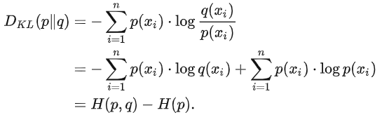

信息论的文章中，我们也提到过，KL散度可以理解为p和q的交叉熵H(p,q)与真实分布p的熵H(p)的差。最小化KL散度，可以令H(p,q)与H(p)接近，从而使得分布p和q变得相近。

从逻辑上而言，这样解释似乎不是特别的严谨。为什么令H(p,q)与H(p)接近后，两个分布就会相近呢？不妨让我们再还原一下KL散度的式子，来更直观的理解为什么KL散度能够work：

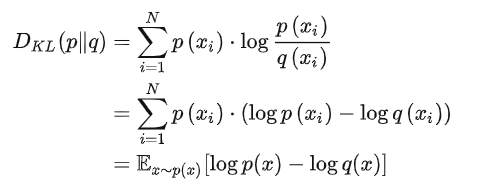

这样写开后可以更加清晰的看出来，在**最小化KL散度时，会迫使分布p和q对每一个x都变得接近，最终自然会使得分布p和q变得相似**。也不会存在KL散度很小，但分布p和q却相差甚远的情况。

##  Cross-Entropy

在机器学习中，笼统的说，我们往往认为数据的分布$p_{data}$即是真实分布，而模型输出的分布$q_{model}$即是用来逼近$p_{data}$的分布。当然，这背后实际上是ERM (Empirical Risk Minimization)的思想，我们可能会在Learning Theory的部分再深入介绍这一概念。现在，我们先设训练集大小为n，每个数据点为$x_i$。KL散度可以写成：

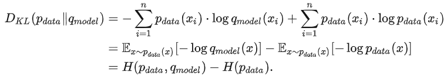

显然，倘若我们希望训练一个辨别模型，上式中$H(p_{data})$则为常数。为了使得模型的分布$q_{model}$接近数据的分布$p_{data}$，我们优化KL散度即等价于优化交叉熵$H(p_{data},q_{model})$。因此用交叉熵来作为surrogate loss function训练辨别模型的思路是work的。

现在我们将模型输出的分布$q_{model}(x_i)$，显性的写成$q_{model}(x_i;θ)$，代表模型是由θ参数化的。因此，MLE可以写为：

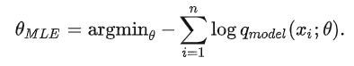

这样一来，利用MLE优化$q_{model}$即在使得数据集出现的概率最大化。不过这样写的话，MLE似乎和交叉熵还是不太像，我们进一步对上式进行变化：

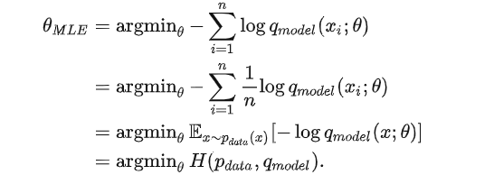

因此，从统计的角度来说，交叉熵与MLE也是等价的。这也能解释为什么交叉熵是work的。

