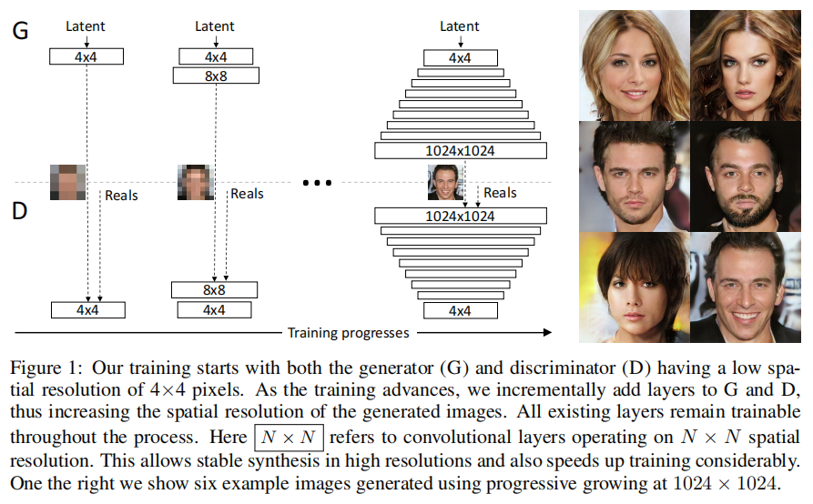
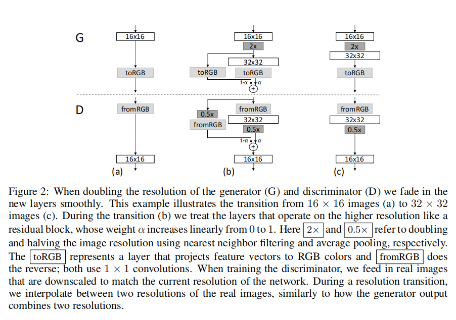
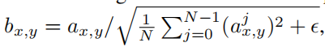
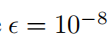

# **PROGRESSIVE GROWING OF GANS FOR IMPROVED** **QUALITY, STABILITY, AND VARIATION**

我们描述了一种新的生成式对抗网络的训练方法。关键的思想是逐步增长生成器和鉴别器：从低分辨率开始，我们添加新的层，随着训练的进展，建模越来越精细的细节。这既加快了训练速度，又大大稳定了它，使我们能够产生前所未有的图像，例如10242的CELEBA图像。

我们还提出了一种简单的方法来增加生成图像的变化，并在无监督的CIFAR10中达到8.80的记录初始分数。

此外，我们还描述了几个对于阻止生成器和鉴别器之间的不健康竞争非常重要的实现细节。

最后，我们提出了一个新的度量标准来评估GAN结果，包括在图像质量和变化方面。作为额外的贡献，我们构建了一个更高质量的CELEBA数据集。

# 1 INTRODUCTION

从高维数据分布中生成新样本的生成方法，如图像，正在得到广泛应用，例如语音合成（van den Oord等人，2016a）、图像到图像转换（朱等人，2017；刘等人，2017；Wang等人，2017)和图像修复（Iizuka等人，2017）。

目前最突出的方法是自回归模型（van den Oord等人，2016b；c）、变分自编码器（VAE）（Kingma & Welling，2014）和生成对抗网络（GAN）（goodfell等人，2014）。

目前，它们都有显著的优势和劣势。自回归模型——如PixelCNN——产生清晰的图像，但评估速度慢，而且没有潜在的表示，因为它们直接模拟像素上的条件分布，这可能限制了它们的适用性。

VAEs很容易训练，但由于模型中的限制，往往会产生模糊的结果，尽管最近的工作正在改进这一点（Kingma et al.，2016）。

GANs可以产生清晰的图像，尽管只有相当小的分辨率和一些有限的变化，而且尽管最近取得了进展，但训练仍然不稳定(Salimans等人，2016年；古拉贾尼等人，2017年；贝特洛等人，2017年；科达利等人，2017年）。

混合方法结合了这三种方法的各种优点，但在图像质量方面仍落后于GANs（Makhzani&Frey，2017；尤扬诺夫等人，2017；Dumoulin等人，2016)。

通常，一个GAN由两个网络组成：发生器和鉴别器（又名批评器）。生成器从一个潜在的代码中产生一个样本，例如，一个图像，并且理想情况下，这些图像的分布应该与训练分布难以区分。**由于通常不可能设计一个函数来判断这种情况是可行的，所以训练一个鉴别器网络来做评估，而且由于网络是可微的，我们也得到一个梯度，我们可以用来引导两个网络到正确的方向。**通常，生成器是主要感兴趣的部分——鉴别器是一个自适应损失函数，一旦生成器被训练好，它就会被丢弃。

这个公式存在多个潜在的问题。当我们测量训练分布和生成的分布之间的距离时，如果分布没有实质性的重叠，即太容易区分，梯度可以指向或多或少的随机方向（Arjovsky & Bottou，2017）。

最初，詹森-香农散度被用作距离度量（古德费尔etal，2014)，最近公式已经改进（Hjelm et al.，2017）和一些更稳定的选择被提出，包括最小二乘（毛等，2016b），带边缘的绝对偏差（赵et al.，2017），和Wasserstein距离（Arjovsky et al., 2017; Gulrajani et al., 2017）

我们的贡献在很大程度上与正在进行的讨论正交，我们主要使用改进的Wasserstein损失，但也实验了最小二乘损失。

____

高分辨率图像的生成是困难的，因为高分辨率更容易区分生的图像与训练图像（Odena et al.，2017），从而大大放大了梯度问题。由于内存限制，大分辨率也需要使用更小的小批量，进一步影响训练的稳定性。**我们的关键见解是，我们可以从更容易的低分辨率图像开始，逐步增长生成器和鉴别器，并添加新的层，随着训练的进行，引入更高分辨率的细节。这大大加快了训练速度，并提高了在高分辨率下的稳定性，正如我们将在第2节中讨论的那样。**

GAN公式并不显式地要求整个训练数据分布由最终生成模型表示。传统观点认为，在图像质量和变化之间存在一种权衡，但这种观点最近受到了挑战（Odena et al.，2017）。保留变异的程度目前正受到关注，并提出了各种方法来测量它，包括初始分数（萨利曼等人，2016年)、多尺度结构相似性（MS-SSIM）(Odena等人，2017年；王等人，2003年）、 birthday paradox(Arora & Zhang，2017年），以及对所发现的离散模式数的显式测试(Metz等人，2016年）。

我们将在第3节中描述我们鼓励变化的方法，并在第5节中提出一个新的评估质量和变化的度量标准。

第4.1节讨论了对网络初始化的一个微妙修改，导致不同层的学习速度更加平衡。此外，我们观察到，传统上困扰GANs的模式崩溃往往发生得非常快，在十几个小批次的过程中。通常，它们从鉴别器过冲开始，导致夸大的梯度，而在两个网络中信号幅度升级时，就会出现不健康的竞争。我们提出了一种机制来阻止生成器参与这种升级，从而克服了这个问题（第4.2节）。

我们使用CELEBA、LSUN，CIFAR10数据集来评估我们的贡献。我们提高了CIFAR10的最佳发布初始分数。由于基准测试生成方法中常用的数据集仅限于相当低的分辨率，我们还创建了一个更高质量版本的CELEBA数据集，允许输出分辨率高达1024×1024像素的实验。这个数据集和我们的完整实现可以在https://github.com/tkarras/progressive_growing_of_gans，训练的网络中找到，可以在https://drive.google.com/open？id=0B4qLcYyJmiz0NHFULTdYc05lX0U和结果图像中找到，在https://youtu.be/G06dEcZ-QTg中有一个补充视频来说明数据集、附加结果和潜在空间插值。

# 2 PROGRESSIVE GROWING OF GANS

我们的主要贡献是对GANs的训练方法，我们从低分辨率图像开始，然后通过向网络中添加层来逐步提高分辨率，如图1所示。这种增量性质允许训练首先发现图像分布的大尺度结构，然后将注意力转移到越来越精细的尺度细节上，而不必同时学习所有尺度。

我们使用生成器网络和鉴别器网络，它们是彼此的镜像，并且总是同步增长。这两个网络中所有存在的层在整个训练过程中都是可训练的。当新层添加到网络中时，我们会平滑地淡出它们，如图2所示。这避免了对已经训练良好、较小分辨率层的突然冲击。附录A详细描述了发生器和鉴别器的结构，以及其他训练参数。

我们观察到，渐进式的训练有几个好处。在早期，更小的图像的生成基本上更稳定，因为有更少的类信息和更少的模式（Odena et al.，2017）。通过逐步提高分辨率，我们不断地提出一个简单得多的问题，而不是发现从潜在向量到如$1024^2$张图像的映射。这种方法与Chen & Koltun（2017）最近的研究成果在概念上很相似。在实践中，它充分稳定了训练，使我们能够使用WGAN-GP损失（古拉贾尼等，2017），甚至LSGAN损失（Mao等，2016b）可靠地合成百万像素尺度的图像。

另一个好处是减少了训练时间。随着GANs的逐步增长，大多数迭代都是在较低的分辨率下完成的，并且根据最终的输出分辨率，类似的结果质量通常要快2-6倍。

逐步增长GANs的想法与Wang等人（2017）的工作有关，他们使用了在不同空间分辨率上操作的多个鉴别器。这项工作又是由Durugkar等人（2016）推动的，他们同时使用一个生成器和多个鉴别器，以及Ghosh等人（2017），他们做相反的事情使用多个生成器和一个鉴别器。分层GANs（Denton等人，2015；Huang等人，2016；Zhang等人，2017）为图像金字塔的每个级别定义了生成器和鉴别器。这些方法建立在与我们工作相同的观察基础上——从潜在图像到高分辨率图像的复杂映射更容易逐步学习——但关键的区别是，我们只有一个GAN，而不是它们的层次结构。与早期关于自适应生长网络的研究相比，例如growing neural gas（Fritzke，1995）和增强拓扑的神经进化（斯坦利和miikulainen，2002），我们只是推迟了预配置层的引入。从这个意义上说，我们的方法类似于对自动编码器的分层训练（Bengio et al.，2007）。

# 3 INCREASING VARIATION USING MINIBATCH STANDARD DEVIATION

GANs倾向于只捕获训练数据中发现的 variation的一个子集，Salimans等人（2016）建议将“小批量识别”作为一种解决方案。他们不仅从单个图像计算特征统计数据，而且从整个小批计算特征统计数据，因此鼓励小批的生成图像和训练图像显示类似的统计数据。这是通过在鉴别器的末端添加一个小批层来实现的，在那里层学习一个大张量，将输入激活投射到一个统计数据数组。为一个小批中的每个示例生成一组单独的统计信息，并将其连接到层的输出中，以便鉴别器可以在内部使用统计信息。我们大大简化了这种方法，同时也改进了变化。

我们的简化解既没有可学习的参数，也没有新的超参数。我们首先计算小批上在每个空间位置的每个特征的标准偏差。然后，我们对所有特征和空间位置平均这些估计，得到一个值。我们复制该值，并将其连接到所有空间位置和小批处理上，生成一个额外的（常数）特征图。这一层可以插入到鉴别器中的任何地方，但我们发现最好是在最后插入它（详见附录A.1）。我们试验了一组更丰富的统计数据，但无法进一步改善变化。在平行的工作中，Lin等人（2017）提供了关于向鉴别器显示多幅图像的好处的理论见解。

变异问题的替代解决方案包括展开鉴别器（Metz等人，2016）来规范其更新，以及一个“排斥正则化器”（Zhao等人，2017），它向生成器添加一个新的损失项，试图鼓励它在一个小批中正交化特征向量。Ghosh等人（2017）的多个生成器也实现了类似的目标。我们承认，这些解决方案可能比我们的解决方案更容易增加变化——或者可能与之正交——但稍后会留下详细的比较。

# 4 NORMALIZATION IN GENERATOR AND DISCRIMINATOR

由于两个网络之间的不健康竞争，GANs容易导致信号幅度的升级。如果不是所有的早期解决方案通过使用批量归一化的变体（Ioffe & Szegedy，2015；萨利曼&金玛，2016；Ba等人，2016），通常也在鉴别器中。

这些归一化方法最初是为了消除协变量的偏移而引入的。然而，我们并没有观察到这在GANs中是一个问题，因此我们认为，在GANs中的实际需求是限制了信号的大小和竞争。我们使用了一种不同的方法，它由两种成分组成，两者都不包括可学习的参数。

## 4.1 EQUALIZED LEARNING RATE

我们偏离了当前谨慎的权值初始化的趋势，而是使用一个简单的N（0,1）初始化，然后在运行时显式地缩放权值。为了准确地说，我们设置了$\hat w_i=w_i/c$，其中wi是权值，c是来自He的初始化器的每层归一化常数（He et al.，2015）。

动态而不是在初始化过程中这样做的好处有些微妙，这与常用的自适应随机梯度下降方法如RMSProp（tiemen&Hanton，2012）和Adam（Kingma & Ba，2015）有关。这些方法通过估计的标准差对梯度更新进行归一化，从而使更新独立于参数的尺度。因此，如果某些参数比其他参数具有更大的动态范围，它们将需要更长的时间来调整。这是现代初始化器导致的一个场景，因此有可能同时出现一个学习率，既太大又太小。我们的方法确保了动态范围，因此学习速度，对所有的权重都是相同的。van Laarhoven（2017）也独立地使用了类似的推理。

## 4.2 PIXELWISE FEATURE VECTOR NORMALIZATION IN GENERATOR

为了避免发生器和鉴别器的大小因竞争而失控的情况，我们将每个像素中的特征向量在每个卷积层后归一化为生成器中的单位长度。

我们使用“局部响应标准化”的变体（Krizhevesketal.，2012），配置为

N为特征映射的个数，$a_{x、y}$和$b_{x、y}$分别为像素（x、y）中的原始特征向量和归一化特征向量。我们发现，令人惊讶的是，这种沉重的约束似乎不会以任何方式伤害生成器，而且事实上，对于大多数数据集，它并没有改变太大的结果，但它在需要时非常有效地阻止了信号幅度的升级。

# 5 MULTI-SCALE STATISTICAL SIMILARITY FOR ASSESSING GAN RESULTS

为了比较一个GAN和另一个GAN的结果，我们需要调查大量的图像，这可能是繁琐、困难和主观的。因此，我们希望依赖自动化方法从大型图像集合中计算一些指示性度量。我们注意到现有的方法如MS-SSIM（Odena et al.，2017）发现大规模模式崩溃可靠但未能应对较小的影响如颜色或纹理的变化，他们也不直接评估图像质量的相似性训练集。

我们建立在直觉上，一个成功的生成器将产生的样本的局部图像结构与训练集相似。我们建议通过考虑从拉普拉斯金字塔（Burt & Adelson，1987）表示生成的和目标图像的局部图像斑块的分布之间的多尺度统计相似性来研究这一点，从16×16像素的低通分辨率开始。按照标准实践，金字塔逐渐加倍，直到达到完整的分辨率，每个连续的级别将差异编码为上一级别的上采样版本。

一个单一的拉普拉斯金字塔水平对应于一个特定的空间频带。我们随机抽取16384张图像，从拉普拉斯金字塔的每个层中提取128个描述符，每个层得到$2^{21}$个（2.1M）描述符。每个描述符是一个7×7像素的邻域，有3个颜色通道，用$x∈R^{7×7×3}=R^{147}$表示。我们将训练集的l级补丁和生成的补丁分别表示为$\{x^l_i \}^{2^{21}}_{i=1}$和$\{y^l_i \}^{2^{21}}_{i=1}$。我们首先将$\{x^l_i \}$和$\{y^l_i \}$w.r.t.进行标准化每个颜色通道的平均值和标准偏差，然后通过计算其切片瓦瑟斯坦距离SWD（{x l i }，{y l i }）来估计统计相似性，这是一种有效可计算的随机近似，使用512个投影（Rabin et al.，2011）。

直观地看，一个小的瓦瑟斯坦距离表明斑块的分布是相似的，这意味着训练图像和生成器样本在外观和变化上是相似的。特别是，从最低分辨率的16×16图像中提取的补丁集之间的距离表明了大规模图像结构的相似性，而最好级别的补丁编码了关于像素级属性的信息，如边缘的锐度和噪声。