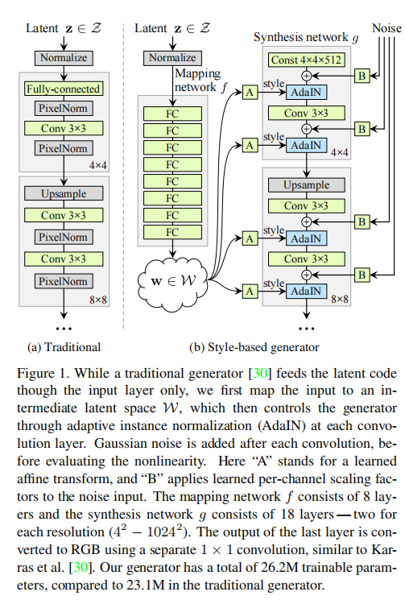
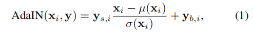
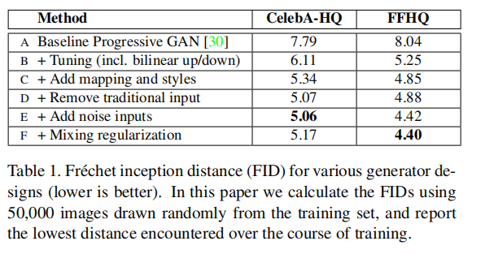
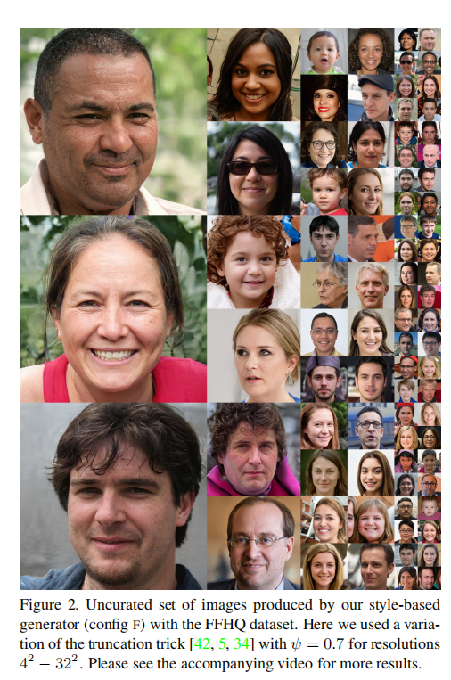
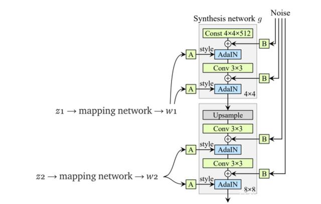
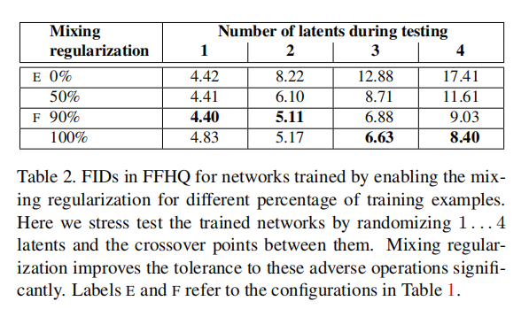

# **A Style-Based Generator Architecture for Generative Adversarial Networks**

我们借鉴了风格转移文献，提出了一种生成对抗网络的可替换生成器架构。

新的架构导致了自动学习的、无监督的高级属性分离（例如，在人脸上训练时的姿势和身份）和生成图像的随机变化（例如，雀斑、头发），它使直观的、特定规模的合成控制。

新的生成器改进了在传统的分布质量指标方面的最先进的技术，导致了明显更好的插值特性，也更好地解耦了潜在的变化因素。

为了量化插值质量和解耦，我们提出了两种新的自动化方法，适用于任何生成器架构。

最后，我们介绍了一个新的、高度多样化的和高质量的人脸数据集。

# **1. Introduction**

由生成式方法产生的图像的分辨率和质量——特别是生成式对抗网络（GAN）[22]——最近在[30,45,5]上得到了快速的改进。然而，生成器继续作为黑盒子运行，尽管最近努力了[3]，对图像合成过程的各个方面的理解，例如，随机特征的起源，仍然缺乏。潜在空间的性质也知之甚少，通常证明的潜在空间插值[13,52,37]没有提供定量的方法来比较不同的生成器。

受风格转移文献[27]的启发，我们重新设计了生成器架构，从而揭示了控制图像合成过程的新方法。我们的生成器从一个学习到的恒定输入开始，并根据潜在代码调整每个卷积层的图像的“风格”，从而直接控制不同尺度上的图像特征的强度。

结合直接注入网络的噪声，这种架构变化导致生成图像中的高级属性（如姿态、身份）与随机变化自动（如雀斑、头发）分离，并实现直观的特定比例的混合和插值操作。我们没有以任何方式修改鉴别器或损失函数，因此我们的工作与正在进行的关于GAN损失函数、正则化和超参数[24,45,5,40,44,36]的讨论相正交。

我们的生成器将输入的潜在代码嵌入到一个中间的潜在空间中，这对variation因素在网络中的表示有深远的影响。输入的潜在空间必须遵循训练数据的概率密度，我们认为这导致了某种程度上不可避免的纠缠。我们的中间潜空间不受这种限制，因此可以被解耦。由于以前估计潜在空间解纠缠程度的方法并不适直接用于我们的情况，我们提出了两个新的自动化度量——感知路径长度和线性可分性——来量化生成器的这些方面。使用这些度量，我们表明，与传统的生成器架构相比，我们的生成器允许更线性、更少的纠缠表示。

最后，我们提出了一个新的人脸数据集（Flickr-Faces-HQ，FFHQ），它比现有的高分辨率数据集提供了更高的质量，并覆盖了更广泛的变化（附录a）。我们已经公开了这个数据集，以及我们的源代码和预先训练过的网络。1.附带的视频可以在同一链接下找到。

# **2. Style-based generator**

传统上，潜码是通过一个输入层，即前馈网络的第一层，提供给生成器的（图1a）。我们离开这个设计，完全省略输入层，而从一个学习的常数开始（图1b，右）。给定输入潜在空间Z中的一个潜在码z，一个非线性映射网络$f： Z→W$首先产生w∈W（图1b，左）。

为了简单起见，我们设置了两者空间的维度都为512，映射f是使用8层MLP实现的，我们将在第4.1节中分析这一决定。然后学习仿射变换将w专门化为样式$y =(y_s，y_b)$，在合成网络g的每个卷积层之后控制自适应实例归一化（AdaIN）[27,17,21,16]操作。AdaIN操作被定义为

其中，每个特征映射xi分别被归一化，然后使用样式y中对应的标量分量进行缩放和偏置。因此，y的维数是这一层上特征映射数量的两倍。

比较我们的方法和风格转移方法，我们从向量w计算空间不变的风格y，而不是一个例子图像。对于y我们选择重复使用“风格”这个词，因为类似的网络体系结构已经被用于前馈风格传输[27]、无监督的图像到图像翻译[28]和域混合[23]。与更一般的特征转换[38,57]相比，AdaIN由于其效率和紧凑的表示而特别适合我们的目的。

最后，我们通过引入显式噪声输入，提供了生成随机细节的直接方法。这些都是由不相关的高斯噪声组成的单通道图像，我们向合成网络的每一层提供一个专门的噪声图像。使用学习到的pre特征比例因子将噪声图像广播到所有的特征图中，然后添加到相应的卷积输出中，如图1b所示。在第3.2节和第3.3节中讨论了添加噪声输入的含义。

## **2.1. Quality of generated images**

在研究我们的生成器的特性之前，我们通过实验证明，重新设计不会影响图像质量，但事实上，它大大提高了它。表1给出了CELEBA-HQ [30]和我们的新FFHQ数据集（附录A）中各种生成器架构的Frechet inception distance（FID）[25]。其他数据集的结果在附录e中给出。

我们的基线配置(A)是Karras等人[30]的渐进式GAN设置，我们从中继承了网络和所有超参数，除非另有说明。我们首先通过使用双线性上/下采样操作[64]、更长时间的训练和调优的超参数来切换到改进的基线(B)。训练设置和超参数的详细描述包括在附录c。

然后我们通过添加映射网络和AdaIN操作(C)进一步改进这个新的基线，并做出一个令人惊讶的观察，网络不再受益于喂养潜在的代码到第一个卷积层。

因此，我们通过去除传统的输入层，并从学习到的4×4×512常数张量(D).我们发现，非常值得注意的是，合成网络能够产生有意义的结果，即使它接收的输入只通过控制AdaIN操作的风格。

最后，我们引入了进一步改善结果的噪声输入(E)，以及新的混合正则化(F)，它关联相邻的风格，并能够对生成的图像进行更细粒度的控制（第3.1节）。

我们使用两种不同的损失函数来评估我们的方法：对于CELEBA-HQ，我们依赖于WGAN-GP。FFHQ对配置A使用WGAN-GP，非饱和损失[22]对配置B-F使用R1正则化[44,51,14]。我们发现这些选择是最好的结果。我们的贡献并没有修改损失函数。

我们观察到，基于风格的生成器(E)比传统的生成器(B)更显著地改进了fid，几乎是20%，证实了在并行工作[6,5]中进行的大规模ImageNet测量。图2显示了使用我们的生成器从FFHQ数据集生成的一组未经管理的新图像。据fid证实，平均质量很高，甚至眼镜和帽子等配件也能成功合成。对于这个图，我们使用所谓的截断技巧来避免极端地采样W的区域[42,5,34]-附录B细节如何执行技巧可以在W而不是z。

我们的生成器允许应用截断选择性地对低分辨率，这样高分辨率的细节不受影响。

本文中所有的fid都是没有截断技巧来计算的，我们只在图2和视频中使用它来说明问题。所有图像的生成分辨率均为$1024^2$。

## **2.2. Prior art**

在GAN架构上的大部分工作都集中在改进鉴别器上，例如，使用多重鉴别器[18,47,11]、多分辨率识别[60,55]，或自我注意[63]。生成器侧的工作主要集中在输入潜在空间[5]中的精确分布，或通过高斯混合模型[4]、聚类[48]或鼓励凸性[52]来塑造输入潜在空间。

最近的条件生成器通过一个单独的嵌入网络将类标识符提供给生成器[46]中的大量层，而潜在code仍然通过输入层提供。一些作者考虑将潜在代码的部分输入多个生成层[9,5]。在平行的工作中，Chen等人的[6]使用AdaINs“自调制”发生器，与我们的工作类似，但不考虑中间的潜在空间或噪声输入。

# **3. Properties of the style-based generator**

我们的生成器架构使通过特定规模的样式修改来使控制图像合成成为可能。**我们可以将映射网络和仿射变换看作是一种从学习到的分布中提取每种样式的样本的方法，而将综合网络看作是一种基于一组样式生成新图像的方法。**每种样式的效果都局限在网络中，也就是说，修改样式的特定子集可以预期只影响图像的某些方面。

为了了解这种局部化的原因，让我们考虑AdaIN(Eq1)使如何操作的。首先将每个通道归一化为零均值和单位方差，然后才应用基于风格的尺度和偏差。由样式决定的新的每个通道的统计量修改了特性对后续卷积操作的相对重要性，但由于规范化，它们不依赖于原始统计量。因此，在被下一个AdaIN操作覆盖之前，每个样式只控制一个卷积。

## **3.1. Style mixing**

为了进一步鼓励样式的局部化，我们采用了混合正则化，即在训练过程中使用两个随机的潜在代码而不是一个潜在代码来生成给定百分比的图像。当生成这样的图像时，我们只需在合成网络中随机选择的点上从一个潜在代码转换到另一个潜在代码——我们称之为样式混合的操作。具体来说，我们通过映射网络运行两个潜在码z1，z2，并让相应的w1，w2控制样式，使w1在交叉点之前应用，w2在交叉点之后应用。**这种正则化技术防止了网络假设相邻的样式是相关的。**

表2显示了如何启用混合正则化在训练期间显著提高了局部化，这表明在测试时多个潜在码混合的情况下提升了FID。图3给出了在不同尺度上混合两个潜在代码所合成的图像的例子。我们可以看到，样式的每个子集都控制着图像的有意义的高级属性。

## **3.2. Stochastic variation**