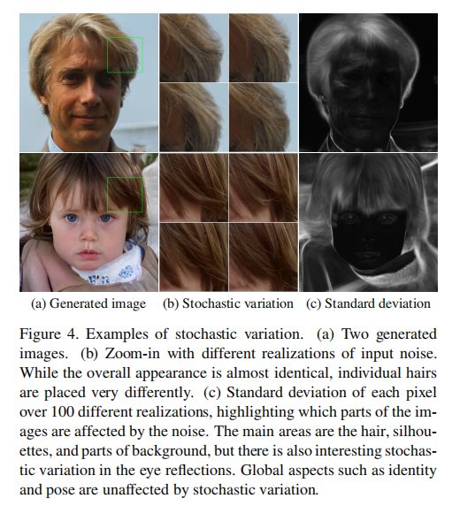
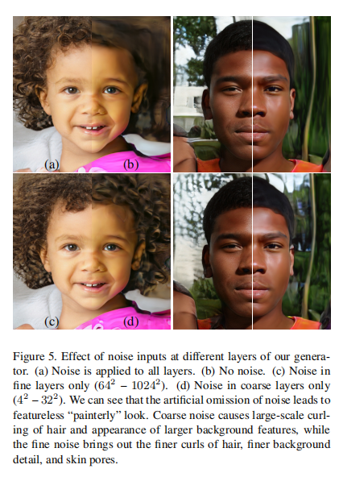
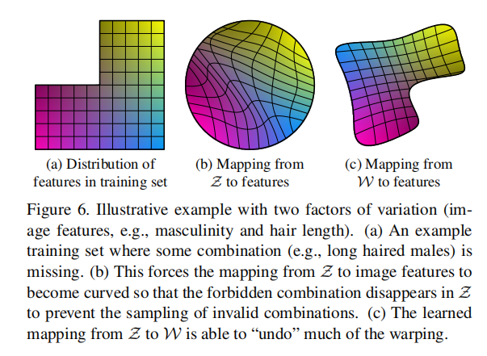
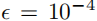
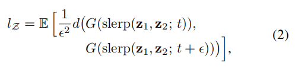
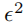
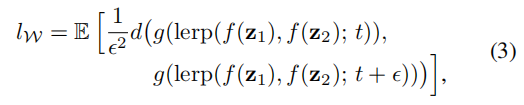
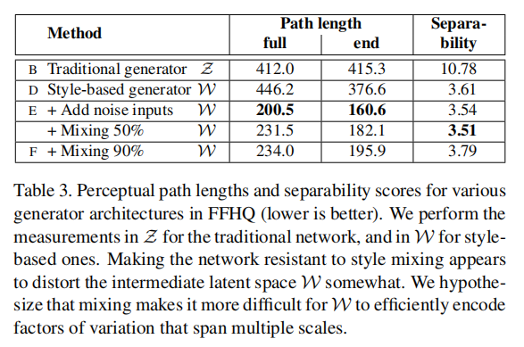
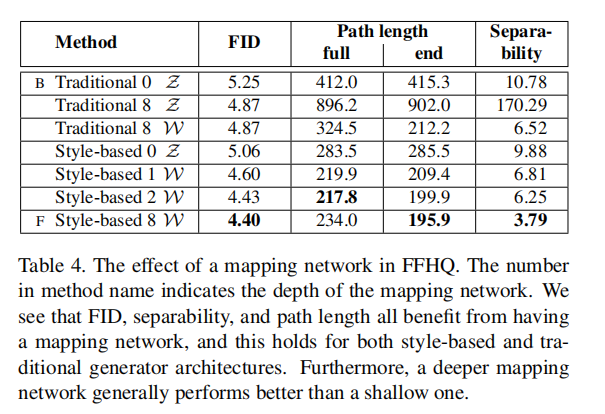

# **A Style-Based Generator Architecture for Generative Adversarial Networks**

我们借鉴了风格转移文献，提出了一种生成对抗网络的可替换生成器架构。

新的架构导致了自动学习的、无监督的高级属性分离（例如，在人脸上训练时的姿势和身份）和生成图像的随机变化（例如，雀斑、头发），它使直观的、特定规模的合成控制。

新的生成器改进了在传统的分布质量指标方面的最先进的技术，导致了明显更好的插值特性，也更好地解耦了潜在的变化因素。

为了量化插值质量和解耦，我们提出了两种新的自动化方法，适用于任何生成器架构。

最后，我们介绍了一个新的、高度多样化的和高质量的人脸数据集。

# **1. Introduction**

由生成式方法产生的图像的分辨率和质量——特别是生成式对抗网络（GAN）[22]——最近在[30,45,5]上得到了快速的改进。然而，生成器继续作为黑盒子运行，尽管最近努力了[3]，对图像合成过程的各个方面的理解，例如，随机特征的起源，仍然缺乏。潜在空间的性质也知之甚少，通常证明的潜在空间插值[13,52,37]没有提供定量的方法来比较不同的生成器。

受风格转移文献[27]的启发，我们重新设计了生成器架构，从而揭示了控制图像合成过程的新方法。我们的生成器从一个学习到的恒定输入开始，并根据潜在代码调整每个卷积层的图像的“风格”，从而直接控制不同尺度上的图像特征的强度。

结合直接注入网络的噪声，这种架构变化导致生成图像中的高级属性（如姿态、身份）与随机变化自动（如雀斑、头发）分离，并实现直观的特定比例的混合和插值操作。我们没有以任何方式修改鉴别器或损失函数，因此我们的工作与正在进行的关于GAN损失函数、正则化和超参数[24,45,5,40,44,36]的讨论相正交。

我们的生成器将输入的潜在代码嵌入到一个中间的潜在空间中，这对variation因素在网络中的表示有深远的影响。输入的潜在空间必须遵循训练数据的概率密度，我们认为这导致了某种程度上不可避免的纠缠。我们的中间潜空间不受这种限制，因此可以被解耦。由于以前估计潜在空间解纠缠程度的方法并不适直接用于我们的情况，我们提出了两个新的自动化度量——感知路径长度和线性可分性——来量化生成器的这些方面。使用这些度量，我们表明，与传统的生成器架构相比，我们的生成器允许更线性、更少的纠缠表示。

最后，我们提出了一个新的人脸数据集（Flickr-Faces-HQ，FFHQ），它比现有的高分辨率数据集提供了更高的质量，并覆盖了更广泛的变化（附录a）。我们已经公开了这个数据集，以及我们的源代码和预先训练过的网络。1.附带的视频可以在同一链接下找到。

# **2. Style-based generator**

传统上，潜码是通过一个输入层，即前馈网络的第一层，提供给生成器的（图1a）。我们离开这个设计，完全省略输入层，而从一个学习的常数开始（图1b，右）。给定输入潜在空间Z中的一个潜在码z，一个非线性映射网络$f： Z→W$首先产生w∈W（图1b，左）。

为了简单起见，我们设置了两者空间的维度都为512，映射f是使用8层MLP实现的，我们将在第4.1节中分析这一决定。然后学习仿射变换将w专门化为样式$y =(y_s，y_b)$，在合成网络g的每个卷积层之后控制自适应实例归一化（AdaIN）[27,17,21,16]操作。AdaIN操作被定义为

其中，每个特征映射xi分别被归一化，然后使用样式y中对应的标量分量进行缩放和偏置。因此，y的维数是这一层上特征映射数量的两倍。

比较我们的方法和风格转移方法，我们从向量w计算空间不变的风格y，而不是一个例子图像。对于y我们选择重复使用“风格”这个词，因为类似的网络体系结构已经被用于前馈风格传输[27]、无监督的图像到图像翻译[28]和域混合[23]。与更一般的特征转换[38,57]相比，AdaIN由于其效率和紧凑的表示而特别适合我们的目的。

最后，我们通过引入显式噪声输入，提供了生成随机细节的直接方法。这些都是由不相关的高斯噪声组成的单通道图像，我们向合成网络的每一层提供一个专门的噪声图像。使用学习到的pre特征比例因子将噪声图像广播到所有的特征图中，然后添加到相应的卷积输出中，如图1b所示。在第3.2节和第3.3节中讨论了添加噪声输入的含义。

## **2.1. Quality of generated images**

在研究我们的生成器的特性之前，我们通过实验证明，重新设计不会影响图像质量，但事实上，它大大提高了它。表1给出了CELEBA-HQ [30]和我们的新FFHQ数据集（附录A）中各种生成器架构的Frechet inception distance（FID）[25]。其他数据集的结果在附录e中给出。

我们的基线配置(A)是Karras等人[30]的渐进式GAN设置，我们从中继承了网络和所有超参数，除非另有说明。我们首先通过使用双线性上/下采样操作[64]、更长时间的训练和调优的超参数来切换到改进的基线(B)。训练设置和超参数的详细描述包括在附录c。

然后我们通过添加映射网络和AdaIN操作(C)进一步改进这个新的基线，并做出一个令人惊讶的观察，网络不再受益于喂养潜在的代码到第一个卷积层。

因此，我们通过去除传统的输入层，并从学习到的4×4×512常数张量(D).我们发现，非常值得注意的是，合成网络能够产生有意义的结果，即使它接收的输入只通过控制AdaIN操作的风格。

最后，我们引入了进一步改善结果的噪声输入(E)，以及新的混合正则化(F)，它关联相邻的风格，并能够对生成的图像进行更细粒度的控制（第3.1节）。

我们使用两种不同的损失函数来评估我们的方法：对于CELEBA-HQ，我们依赖于WGAN-GP。FFHQ对配置A使用WGAN-GP，非饱和损失[22]对配置B-F使用R1正则化[44,51,14]。我们发现这些选择是最好的结果。我们的贡献并没有修改损失函数。

我们观察到，基于风格的生成器(E)比传统的生成器(B)更显著地改进了fid，几乎是20%，证实了在并行工作[6,5]中进行的大规模ImageNet测量。图2显示了使用我们的生成器从FFHQ数据集生成的一组未经管理的新图像。据fid证实，平均质量很高，甚至眼镜和帽子等配件也能成功合成。对于这个图，我们使用所谓的截断技巧来避免极端地采样W的区域[42,5,34]-附录B细节如何执行技巧可以在W而不是z。

我们的生成器允许应用截断选择性地对低分辨率，这样高分辨率的细节不受影响。

本文中所有的fid都是没有截断技巧来计算的，我们只在图2和视频中使用它来说明问题。所有图像的生成分辨率均为$1024^2$。

## **2.2. Prior art**

在GAN架构上的大部分工作都集中在改进鉴别器上，例如，使用多重鉴别器[18,47,11]、多分辨率识别[60,55]，或自我注意[63]。生成器侧的工作主要集中在输入潜在空间[5]中的精确分布，或通过高斯混合模型[4]、聚类[48]或鼓励凸性[52]来塑造输入潜在空间。

最近的条件生成器通过一个单独的嵌入网络将类标识符提供给生成器[46]中的大量层，而潜在code仍然通过输入层提供。一些作者考虑将潜在代码的部分输入多个生成层[9,5]。在平行的工作中，Chen等人的[6]使用AdaINs“自调制”发生器，与我们的工作类似，但不考虑中间的潜在空间或噪声输入。

# **3. Properties of the style-based generator**

我们的生成器架构使通过特定规模的样式修改来使控制图像合成成为可能。**我们可以将映射网络和仿射变换看作是一种从学习到的分布中提取每种样式的样本的方法，而将综合网络看作是一种基于一组样式生成新图像的方法。**每种样式的效果都局限在网络中，也就是说，修改样式的特定子集可以预期只影响图像的某些方面。

为了了解这种局部化的原因，让我们考虑AdaIN(Eq1)使如何操作的。首先将每个通道归一化为零均值和单位方差，然后才应用基于风格的尺度和偏差。由样式决定的新的每个通道的统计量修改了特性对后续卷积操作的相对重要性，但由于规范化，它们不依赖于原始统计量。因此，在被下一个AdaIN操作覆盖之前，每个样式只控制一个卷积。

## **3.1. Style mixing**

为了进一步鼓励样式的局部化，我们采用了混合正则化，即在训练过程中使用两个随机的潜在代码而不是一个潜在代码来生成给定百分比的图像。当生成这样的图像时，我们只需在合成网络中随机选择的点上从一个潜在代码转换到另一个潜在代码——我们称之为样式混合的操作。具体来说，我们通过映射网络运行两个潜在码z1，z2，并让相应的w1，w2控制样式，使w1在交叉点之前应用，w2在交叉点之后应用。**这种正则化技术防止了网络假设相邻的样式是相关的。**

表2显示了如何启用混合正则化在训练期间显著提高了局部化，这表明在测试时多个潜在码混合的情况下提升了FID。图3给出了在不同尺度上混合两个潜在代码所合成的图像的例子。我们可以看到，样式的每个子集都控制着图像的有意义的高级属性。

## **3.2. Stochastic variation**

在人类肖像中有很多方面可以被认为是随机的，比如头发、胡茬、雀斑或皮肤毛孔的精确位置。任何这些都可以随机化，而不影响我们对图像的感知，只要它们遵循正确的分布。

让我们考虑一下传统的生成器是如何实现随机变化的。考虑到网络工作的唯一输入是通过输入层，网络需要发明一种方法，从需要的早期激活中生成空间变化的伪随机数。这消耗了网络容量，隐藏生成信号的周期性是困难的——而且并不总是成功的，生成图像中常见的重复模式就证明了这一点。我们的架构通过在每次卷积后添加每像素的噪声，完全避开了这些问题。

图4显示了相同的底层图像的随机实现，使用我们的生成器产生了不同的噪声实现。我们可以看到，噪声只影响随机的方面，而保持整体的组成和高水平的方面，如身份不变。图5进一步说明了随机变化对不同层子集进行随机变化的效果。由于这些效果在动画中表现得最好，请参考附带的视频，演示如何改变一层的噪声输入会导致匹配尺度上的随机变化。

我们发现有趣的是，噪声的影响在网络中。我们假设，在生成器中的任何时候，都有尽快引入新内容的压力，而我们的网络产生随机变化的最简单的方法是依赖于所提供的噪声。每一层都有一组新的噪声，因此没有动机从早期的激活中产生随机效应，从而导致局部效应。

## **3.3. Separation of global effects from stochasticity**

前面的部分以及伴随的视频表明，虽然风格的改变会产生全局效果（改变姿势、身份等），噪音只影响无关紧要的随机变化（不同梳头的头发、胡须等）。这一观察结果与风格转移文献相一致，其中已经建立了空间不变统计量（格兰克矩阵、通道均值、方差等）。可靠地编码一个图像[20,39]的样式，而空间变化的特征编码一个特定的实例。

在我们的基于样式的生成器中，样式会影响整个图像，因为完整的特征映射会使用相同的值进行缩放和偏置。因此，诸如姿态、灯光或背景风格等全局效果可以被一致地控制。同时，噪声被独立地添加到每个像素中，因此非常适合于控制随机变化。如果网络试图控制，例如，使用噪声控制姿态，这将导致空间上不一致的决定，然后将受到鉴别器的惩罚。因此，网络在没有明确指导的情况下，学习适当地使用全局和局部通道。

# **4. Disentanglement studies**

解耦[54,50,2,7,19]有不同的定义，但一个共同的目标是由线性子空间组成的潜在空间，每个子空间控制一个变化因素。然而，Z中每个因子组合的采样概率需要与训练数据中相应的密度相匹配。如图6所示，这就排除了与典型的数据集和输入的潜在分布完全分离的因素。

StyleGAN 使用一种叫做映射网络（mapping network）的深度网络，将潜在因子 z 转换成中间潜在空间 w。从概念上来看，StyleGAN 将可进行均匀或正态分布采样的空间（下图中）扭曲成潜在特征空间（下图右），从而轻松生成图像。**该映射网络旨在创建彼此独立的特征，以便生成器更容易地执行渲染，同时避免训练数据集中不曾出现的特征组合。**

我们的生成器架构的一个主要好处是，中间潜空间W不需要根据任何固定分布支持采样;它的采样量由学习到的分段连续映射f(z)所得到。这种映射可以适应于“unwarp”W，从而使变化的因素变得更加线性。我们假设生成器有这样做的压力，因为**基于解耦表示生成真实的图像应该比基于纠缠表示更容易**。因此，我们期望训练在一个无监督的设置下产生一个较少的纠缠W，即，当变化的因素是不知道的提前[10,35,49,8,26,32,7]。

不幸的是，最近提出的量化解耦[26,32,7,19]的度量标准需要一个编码器网络，将输入图像映射到潜在代码。这些度量不适合我们的目的，因为我们的基线GAN缺乏这样的编码器。虽然我们可以为此目的添加一个额外的网络，比如[8,12,15]，但我们希望避免投资于一个不是实际解决方案的一部分的组件。为此，我们描述了两种量化解耦的新方法，这两种方法都不需要编码器或已知的变化因素，因此对任何图像数据集和生成器都可以计算。

## **4.1. Perceptual path length**

正如Laine [37]所指出的，潜在空间向量的插值可能会在图像中产生惊人的非线性变化。例如，**在任何一个端点中缺失的特征都可能出现在线性插值路径的中间**。这是潜在空间是纠缠的，变异因素没有正确分离的标志。为了量化这种效应，我们可以测量图像在潜在空间中执行插值时所经历的剧烈变化。直观地说，**一个较少弯曲的潜在空间应该比一个高度弯曲的潜在空间导致感知上更平滑的过渡。**

作为我们的度量的基础，我们使用基于感知的成对图像距离[65]，它计算为两个VGG16 [58]嵌入之间的加权差，其中权重拟合，使度量与人类感知相似性判断一致。如果我们将潜在空间插值路径细分为线性段，我们可以将该分割路径的总感知长度定义为每个分段的感知差异的总和，如图像距离度量所报告的那样。感知路径长度的一个自然定义是在无限精细细分下这个和的极限，但在实践中，我们使用一个小的细分来近似它。因此，潜在空间Z中在所有可能端点上的平均感知路径长度为

$z_1，z_2∼P (z)，t∼U（0,1）$，G是生成器（即，基于样式的网络的g◦f），和d（·，·）计算ceptual distance在生成的图像之间。这里的slerp表示球形插值[56]，这是在我们的归一化输入潜在空间[61]中最合适的插值方法。为了专注于面部特征而不是背景，我们在评估成对图像度量之前，将生成的图像裁剪为只包含人脸。由于度量d是二次[65]，我们除以 .我们通过取10万个样本来计算期望值。

计算W中的平均感知路径长度也以类似的方式进行：

其中唯一的区别是插值发生在W空间中。因为W中的向量没有以任何方式进行归一化，所以我们使用线性插值（lerp）。

表3显示，对于我们的具有噪声输入的基于风格的生成器，这个全路径长度要短得多，这表明W在感知上比Z更线性。然而，这个测量实际上略微偏向于输入的潜在空间Z。如果W确实是Z的一个解纠缠和“扁平”映射，它可能包含一个不在输入流形上的区域——因此被生成器不好地重建——甚至在从输入流形所映射的点之间，而输入潜在空间Z根据定义没有这样的区域。因此，可以预期，如果我们将我们的度量限制在路径端点，即t∈{0,1}，我们应该得到一个更小的$l_W$，而$l_Z$不受影响。这确实是我们在表3中观察到的情况。

表4显示了映射网络对路径长度的影响。我们看到，传统的和基于风格的生成器都受益于拥有一个映射网络，而额外的深度通常会提高感知路径长度和fid。有趣的是，虽然$l_W$在传统发生器中改进，但lZ变得相当糟糕，说明了我们的主张，即输入潜在空间确实可以在GANs中任意纠缠。

## **4.2. Linear separability**

如果一个潜在空间被充分地解纠缠，就应该有可能找到与个别变化因素一致相对应的方向向量。我们提出了另一个度量，通过测量潜在空间点通过线性超平面分离成两个不同的集合来量化这种效应，以便每个集合对应于图像的一个特定的二值属性。

为了对生成的图像进行标记，我们训练辅助分类网络进行分类，例如区分男性和女性面孔。在我们的测试中，分类器具有与我们使用的鉴别器相同的架构（即，与在[30]中相同），并使用CELEBA-HQ数据集进行训练，该数据集保留了原始CelebA数据集中的40个属性。为了测量一个属性的可分性，我们使用z∼P (z)生成20万张图像，并使用辅助分类网络对它们进行分类。然后，我们根据分类器的置信度对样本进行排序，并去除最不具有置信度的一半，产生100,000个标记的潜在空间向量。

对于每个属性，我们拟合一个线性SVM来预测基于潜在空间点的标签-传统的z和基于风格的w-，并根据这个平面对点进行分类。然后我们计算条件熵H（Y |X），其中X是由SVM预测的类，而Y是由预先训练的分类器确定的类。这告诉我们需要多少额外的信息来确定一个样本的真实类，因为我们知道它位于超平面的哪一边。一个较低的值表明对应的变异因素(s)的潜在空间方向一致

我们计算最终的可分性分数为exp（P i H（Yi |Xi）），其中我枚举了40个属性。与初始分数[53]类似，指数化将值从对数域带到线性域，因此它们更容易进行比较。

表3和表4表明，W始终比Z更好地可分离，表明纠缠表示更少。

此外，增加映射网络的深度可以提高W中的图像质量和可分性，这与合成网络本质上有利于解纠缠输入表示的假设相一致。有趣的是，在传统生成器前面添加一个映射网络会导致Z的可分性严重损失，但改善了中间潜在空间W的情况，FID也有所改善。这表明，当我们引入一个不需要遵循训练数据分布的中间潜在空间时，即使是传统的生成器架构也会表现得更好。