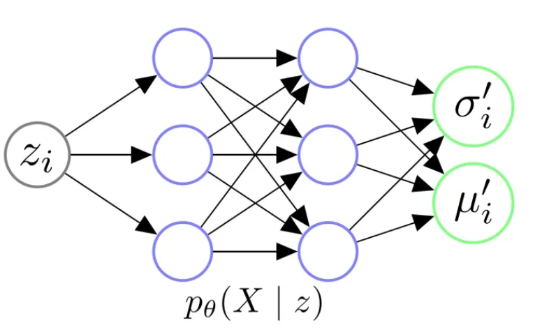
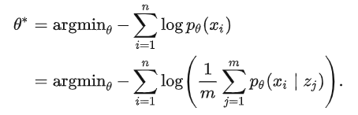

# 变分自编码器（VAE）

## **2. Motivation**

在说VAE之前，自然要先说到传统的自编码器 (Autoencoder)。上图即是一个自编码的实例。自编码器类似于一个非线性的PCA，是一个利用神经网络来给复杂数据降维的模型。现在我们记X为整个数据集的集合，xi是数据集中的一个样本。

自编码器包含一个编码器z=g(X)，它的输出z我们称作编码，z的维度往往远远小于输入X的维度。它还包含一个解码器$\widetilde X=f(z)$，这个解码器能够通过编码z得到$\widetilde X$

我们希望解码器解码得到的$\widetilde X$能够尽可能的接近X，所以自编码器一个常用的损失函数是$ℓ=‖X−X~‖^2$。这样一来，模型训练结束后，我们就可以认为编码z囊括了输入数据X的大部分信息，也因此我们可以直接利用z表达原始数据，从而达到数据降维的目的。

出于方便，假设现在我们的输入$X∈R^{C×H×W}$是一些图片，我们可以训练一个自编码器。它的编码器z=g(X)将每个图片编码成z∈Rd，它的解码器$\widetilde X=f(z)$利用z将输入的图片重建为$\widetilde X∈R^{C×H×W}$。

我们现在仔细研究一下这个模型的解码器。$g:R^d→R^{C×H×W}$。这个解码器只需要输入某些低维向量z，就能够输出高维的图片数据X。**那我们能否把这个模型直接当做生成模型，在低维空间Rd中随机生成某些向量z，再喂给解码器f(z)来生成图片呢？**

答案是，我们可以这么做，运气好的话我们可以得到一些有用的图片，但是对绝大多数随机生成的z，f(z)只会生成一些没有意义的噪声。

为什么会这样呢？这是因为我们没有显性的对z的分布p(z)进行建模，我们并不知道哪些z能够生成有用的图片。**我们用来训练f(z)的数据是有限的，f可能只会对极有限的z有响应。而Rd又是一个太大的空间，如果我们只在这个空间上随机采样的话，我们自然不能指望总能恰好采样到能够生成有用的图片的**。

**在Autoencoder的基础上，显性的对z的分布p(z)进行建模，使得自编码器成为一个合格的生成模型**，我们就得到了Variational Autoencoders，即今天的主题，变分自编码器。

## **3. Derivation**

我们在这一章正式对VAE进行推导。对于自编码器来说，z的分布是不确定的，因此只能在Rd上采样、碰运气。我们为什么不给定z一个简单的分布，将采样的空间缩的很小呢？

我们不妨假设$z∼N(0,I)$，其中$I$代表一个单位矩阵。也就是说，我们将z看作是一个服从标准多元高斯分布的多维随机变量。

现在我们记z、X为随机变量，zi、xi代表随机变量的样本。

在这个架构下，我们可以认为数据集是由某个随机过程生成的，而z是这个随机过程中的一个不可观测到的隐变量。这个生成数据的随机过程包含两个步骤：

1. 从先验分布p(z)中采样得到一个zi
2. 根据zi，从条件分布p(X∣zi)中采样得到一个数据点xi

如果我们能基于这个随机过程进行建模，那么我们可能可以更轻易的得到一个生成模型。

### **3.1 Decoder**

首先，让我们从生成模型的角度来考虑Decoder的架构。

上图是一个Decoder架构的示意图。我们给Decoder输入一个从N(0,I)中采样得到的zi，其实是希望由θ参数化的Decoder能够学会一个映射，输出zi对应的X的分布，即。

让我们假设，给定任意zi后，X都服从某个各维度独立的多元高斯分布，即：

这样一来，我们只需要输入zi给Decoder，然后让它拟合出$μ_i′$和$σ_i^{′2}$，我们就能知道X∣zi的具体分布了。

我们举个例子来更直观的理解这个过程。我们根据分布p(z)采样出一个，zi，一个zi应当对应图片集X中的某一部分类似的图片。比如说，我们的图片集X可能是世界上所有的猫，那么抽样得到的一个zi可能代表颜色为橘色，耳朵为立耳的猫；而下次抽样得到的另一个zj可能代表颜色为白色，耳朵为折耳的猫。

我们再假设，在这个$z_i$下，这类立耳橘猫的图片像素值的分布$X∣z_i$服从一个多元高斯分布$N(μ_i^′,σ_i^{′2}∗I)$。这样一来，我们的Decoder只需要通过神经网络，将zi变换为适当的$μ_i′$和$σ_i^{′2}$，我们就得到了这个多元高斯分布。之后我们就可以从$N(μ_i^′,σ_i^{′2}∗I)$中采样，得到立耳橘猫的图片了！

### **3.2 Objective**

因为本质上我们希望训练一个生成模型，我们也不妨以一个更加统计的视角来看一个生成模型的目标函数。

对于一个生成模型，我们的终极目标是什么？对，我们就是想对数据本身的分布p(X)进行建模。如果能成功得到一个逼近真实分布p(X)的pθ(X)，那么我们就能从中进行采样，生成一些可能的数据点。

如上图，我们举个当X代表所有宝可梦的图片的例子。在得到$p_θ(X)$后，我们就可以生成一些令$p_θ(x_i)$比较大的$x_i$，这些$x_i$就很可能会是正常的宝可梦的图片。

现在的问题就是，我们怎么对pθ(X)进行建模呢？

有了之前的铺垫，现在我们有

这样问题是不是就解决了呢？我们只要从$p(z)=N(z∣0,I)$里采样许多$z_i$出来，就能算出。在这里，我们就可以利用**MLE**的思想，让数据集出现的概率最大化，也就是：

我们确实可以这样做，但是这样做的代价是极大的。因为往往xi的维度会很大，zi的维度也不会很低，并且，对于某个xi而言，与之强相关的zi的数量是相对有限的，但是为了找到这些有限的zi，我们可能要进行大量的采样。

所以如果我们希望较为准确的估计pθ(X)的话，我们可能需要采样**极大量**的zi，只有这样，我们才能让模型知道究竟哪一些zi是与哪一些xi对应着的。

因此，直接从p(z)中采样zi，用来估计pθ(X)的策略几乎是不可行的。不过解决这个问题的思路也很直觉，那就是在Encoder中引入后验分布$p_θ(z|x_i)$。

### **3.3 Encoder**

具体来说，我们怎么在Encoder中利用后验分布呢？假设我们现在有后验分布$p_θ(z∣x_i)$，这样的话，如下图，每次前向传播的时候，我们可以先将xi喂给Encoder，算出z∣xi服从的分布。之后，我们就可以直接在这个分布中采样出zi，喂给Decoder，然后得到X∣zi的分布，最后基于MLE优化模型。

在这个策略下，从$p_θ(z∣x_i)$中采样出来的zi几乎都会和xi相关的，对比之前，我们可能就省去了很多采样的步骤，极大的提高了效率。

那现在的问题就是，我们怎么计算$p_θ(z∣x_i)$呢？我们不妨先尝试下贝叶斯公式：

辛运的是，我们之前已经假设了$p_θ(X∣z)$和$p(z)$的分布，所以对于上式的分子，我们是可以直接算出来的。不幸的是，上式的分母又有一个积分，如果去估计这个积分的话，又会需要从p(z)中采样大量的zi。这显然是代价极大，不太可行的。

这时候我们就可以应用**变分贝叶斯算法**了！我们不妨令由ϕ参数化的Encoder去拟合对任意xi的分布$q_ϕ(z∣x_i)$，我们希望这个分布能够尽可能的逼近真实的后验分布$p_θ(z∣x_i)$。如果$q_ϕ(z∣x_i)$能够足够逼近真实的后验分布的话，我们就可以直接通过Encoder得到z∣xi的分布了！

我们怎么用神经网络去拟合后验分布呢？和之前一样，我们**只要知道这个后验是服从的什么分布，然后让模型拟合这个分布所需的参数就行了**。举个例子，如果这个后验分布本质上是一个多元高斯分布，那么我们让Encoder输出μ和Σ2就能拟合这个分布了。

回忆一下，我们之前已经对似然pθ(X∣z)和先验p(z)的分布做了假设——它们都服从高斯分布。在这种情况下，不难证明，真实的后验分布pθ(z∣X)也服从高斯分布。

那不妨令近似后验分布对任意xi都有

即，它也是一个各维度独立的多元高斯分布。这样一来，整个VAE的架构就非常明了了。

### **3.4 Architecture**

下图即是VAE的架构示例。其中$x_i^{(j)}$代表第i个数据点的第j的特征。

总结一下VAE的架构：

1. 我们首先给Encoder输入一个数据点xi，通过神经网络，我们得到隐变量z服从的近似后验分布qϕ(z∣xi)的参数。我们往往认为后验分布是一个各维度独立的高斯分布，因此令Encoder输出z∣xi服从的高斯分布的参数σi2和μi即可
2. 有了z∣xi分布的参数σi2和μi后，我们从对应的高斯分布中采样出一个zi，这个zi应当代表与xi相似的一类样本
3. 我们令Decoder拟合似然的分布pθ(X∣zi)。喂给Decoder一个zi，它应当返回X∣zi服从的分布的参数。我们往往认为似然也服从一个各维度独立的高斯分布，因此令Decoder输出X∣zi服从的高斯分布的参数σi′2和μi′即可
4. 在得到X∣zi的分布的参数后，理论上我们需要从这个分布中进行采样，来生成可能的数据点xi

上述第四点中值得注意的是，在大部分实现中，人们往往不进行采样，而是直接将模型输出的μi′当作是给定zi生成的数据点。

除此之外，人们也往往认为pθ(X∣zi)是一个固定方差的各维度独立的多元高斯分布，即，$p_θ(X∣z_i)=N(X∣μ_i^′(z_i;θ),σ^′_2∗I)$，其中$σ^′_2$是一个人为给定的超参数。这意味着我们实际中并不真的让模型输出$σ^′_2$，模型只要输出$μ_i^′$就行了。

### **3.5 Reparameterization Trick**

上述VAE的架构应该是比较清晰的，但让我们再仔细研究一下这个架构。尽管现在我们还没有推导得到最终的损失函数，但让我们先假设，在上述步骤4后，我们会接某个损失函数L来训练神经网络。

这样的话，从神经网络训练的角度来看，这个架构的前向传播过程是没有问题的，上述步骤1-4均可顺利的进行前向传播，然后计算出损失的值。

然而，令人在意的一个问题是：我们在前向传播的第2步，居**然调用了一个"采样函数"，从z∣xi中采样出来了zi喂给Decoder**！那采样函数能够进行反向传播吗？

答案显然是不能的。因此，为了让整个网络能够正常的训练，作者们提出了Reparameterization Trick。这一技巧将上述第2步改为：

1. 有了z∣xi分布的参数σi2和μi后，我们先**从N(0,I)中采样得到一个ϵi，然后我们令$z_i=μ_i+σ_i⊙ϵ_i$，**这个zi应当代表与xi相似的一类样本。

其中，⊙代表逐元素相乘操作。不难证明，此时zi背后的分布依然是由σi2和μi参数化的一个高斯分布。

利用了Reparameterization Trick后，VAE的架构变成了下图中的模样，其中$ϵ_i$可以看作是伴随$z_i$喂给Decoder的一个特征。这样一来，这个架构的前向、反向传播就都能跑通了。

### **3.6 Evidence Lower Bound**

好了，我们已经把VAE的架构定下来了。现在我们只要顺着3.2节中MLE的思想，然后在最大化log⁡pθ(X)时，加入变分推断的思想，引入ELBO (Evidence Lower Bound)，我们就能得到一个靠谱的目标函数了

KL散度是恒大于等于零的，因此显然上式中$ℓ(pθ,qϕ)$是$log⁡\ p_θ(X)$的一个下界，也因此我们称ℓ为ELBO (Evidence Lower Bound)。

我们不妨在把上式变换一下，易得：

这个式子实在是太完美了！这个式子告诉我们，我们**只需要最大化ℓ，就能最大化log⁡pθ(X)，并且最小化$D_{KL}(q_ϕ,p_θ)$。**

最大化$log⁡\ p_θ(X)$的理由是显然的，因为我们希望最大化似然。我们为什么希望最小化DKL(qϕ,pθ)呢？其实原因也是显然的，因为我们希望近似后验qϕ(z∣X)能够逼近真实后验，pθ(z∣X)，否则的话Encoder可能只能输出一些无意义的分布。

既然我们希望最大化，ℓ，现在我们进一步对其进行展开，不难得到：

让我们再将上述两项分别展开。

首先，让我们看下$−D_{KL}(q_ϕ,p)$这一项。人们通常称这一项为Latent Loss或者将其看做一个正则项。回忆一下，我们之前已经假设了$q_ϕ(z∣X)$和$p(z)$均服从高斯分布，辛运的是，在这种情况下，我们能够得到$D_{KL}(q_ϕ,p)$的解析解。

更加幸运的是，我们把它们都设成了各维度独立的高斯分布，所以我们可以直接从一维的情况进行推导：
$$
D_{KL}(N(μ,σ^2)‖N(0,1))=∫_z \frac 1{\sqrt{2πσ^2}}exp⁡(−\frac {(z−μ)^2}{2σ^2})log⁡\frac{\frac 1 {\sqrt{2πσ^2}}exp⁡(−\frac{(z−μ)2}{2σ^2})}{\frac 1{\sqrt{2π}}exp⁡(−\frac {z^2}2)}dz\\
=∫_z(\frac {(−z−μ)^2}{2σ^2}+\frac {z^2}2−log⁡σ)N(μ,σ^2)dz\\
=−∫_z\frac {(z−μ)^2}{2σ^2}N(μ,σ^2)dz+∫_z \frac {z^2} 2N(μ,σ^2)dz−∫_zlog⁡\ σN(μ,σ^2)dz\\
=−\frac {E[(z−μ)^2]} {2σ^2}+\frac {E[z^2]}2−log⁡σ\\
=\frac 1 2(−1+σ^2+μ^2−log⁡\ σ^2).
$$
当它们都是d元高斯分布时，易得：

其中$a(j)^2$代表向量a的第j个元素的平方。

至此，最后的问题就是，$E_{q_ϕ}[log⁡_{p_θ}(X∣z)]$怎么求呢？这一项往往被称为Reconstruction Loss，人们通常从$q_ϕ(z∣X)$中采样多个zi来近似求解这一项，即：

$\large E_{q_ϕ}[log⁡p_θ(X∣z)]≈\frac 1m∑_{i=1}^mlog⁡p_θ(X∣z_i)$,

其中，。

现在我们来看$log⁡p_θ(X∣z_i)$这一项怎么展开。我们之前已经假设过$X∣z_i$服从一个固定方差的各维度独立的多元高斯分布，即。

若假设数据为固定方差的高斯分布，MLE后得到的目标函数，等价于MSE。但我们这里还是先把它写开，设每个数据点xi的维度为K，即$X∣z_i$服从一个K维高斯分布，易得：

这样，我们就有了最终的损失函数所需要的所有模块了。

### **3.7 Loss Function**

让我们把上一节中的推导整合起来。现在希望最小化损失函数：

上式即是通过从$q_ϕ(z∣x_i)$中采样m次$z_j$来逼近。

 n也许我们会好奇，之前两次我们都说积分太难求了，采样逼近代价太大了，所以不能采样逼近，为什么这里又可以采样逼近了呢？

答案就是：之前我们都只能从p(z)中采样zj，这样的话，采样到和xi有关联的zj的概率实在是很低，所以为了更好的逼近积分只能采样大量的zj，这样的代价自然是极大的；然而，在上式中，**我们其实是从qϕ(z∣xi)中采样得到zj。随着网络的训练，近似后验qϕ(z∣xi)，很快就会比较接近真实的后验分布。这样一来，我们有很大可能能够在有限次数的采样中，采样到与xi关联的zj**。

事实上，从经验来看，从qϕ(z∣xi)中采样zj估计$Eq_ϕ[log⁡\ p_θ(x_i∣z)]$是比较高效的。在实践中我们往往对一个xi只采样一个zj，即m=1，就能达到可观的效果。所以我们可以将损失改写，并继续往下展开：

值得注意的是，我们已经假设了pθ(X∣zi)对任意zi均是方差固定的各维度独立的K维高斯分布，我们不妨令超参数σ′为元素值全为$\frac12$的K维向量。这样一来，损失可以改写为：

其中，xi代表第i个样本，是Encoder的输入。μi和σi2是Encoder的输出，代表z∣xi的分布的参数。zi是从z∣xi中采样得到的一个样本，它是Decoder的输入。μi′是Decoder的输出，代表利用zi解码后对应的数据点。

到这里，我们终于得到了在假设先验、后验、似然均是高斯分布的情况下，VAE最终的损失函数。值得一提的是，通常人们采用高斯分布只是因为其简便性。我们也可以根据数据的情况，**假设更加复杂分布来推导、训练VAE**。在这种情况下，VAE可能计算会更加复杂，但也可能会得到更强的表达能力。

## **4. Conditional VAE**

## **6. Discussion**

VAE中最老生常谈的问题就是，它为什么生成的图片是模糊的？

我在寻找这个问题的答案的时候，从Reddit的一个**[Post](https://link.zhihu.com/?target=https%3A//www.reddit.com/r/MachineLearning/comments/9t712f/dwhy_are_images_created_by_gan_sharper_than/)**上看到一个高赞回答：

这一类回答的意思是：高斯分布假设下，VAE生成的图像并不模糊，而是因为有噪声。为什么呢？因为我们本应该利用Decoder拟合一个高斯分布，然后从这个分布中采样得到xi的。但是人们偷懒，直接认为拟合出的高斯分布的均值μ′就是生成的数据。xi。你想，本来Decoder告诉你的是给定zi后X可能的**分布**，你到好，直接把这个分布的**均值**作为生成的图像了，那能不模糊吗？

知乎上另一类回答说，VAE产生的图像之所以模糊，就是因为高斯分布的假设，比如**[回答1](https://www.zhihu.com/question/317623081/answer/1062727034)**、**[回答2](https://www.zhihu.com/question/368413722/answer/991708331)**。这类回答的点在于：如果对pθ(X∣zi)进行高斯分布的假设，那么我们等同于假设数据是一个单峰分布，但是现实中数据往往的多峰 (Multimodal) 的，你用单峰的分布去拟合多峰的分布，那模型只能把多峰进行平均来降低损失了，这样一来，拟合的分布对应的图像，自然也就是模糊的了。

这两类回答看问题的角度是不一样的。但我觉得它们都存在一定的问题，至少不能把我完全说服，我列一下各自可能的疑点：

1. 对于第一类回答：确实，本来让你采样，现在你直接拿分布的均值出来，似乎图片注定会变得模糊。但是给你一个模糊的均值，再给你一个高斯的方差，你去采样不依然很可能是模糊的？
2. 对于第二类答案：我数据肯定是多峰的，但我假设pθ(X∣zi)是单峰的为什么不行？只要我能确保每个zi对应的X的分布是单峰的不就行了？那这样来看，这个问题的本质是因为模型拟合能力不行，输出隐变量无法捕捉充分的信息，而高斯分布也只是受害者？

综上，目前最能说服我的观点是这样的：

**模型拟合能力就是没那么强，模型习得的隐变量就是无法完全对应出单峰的X来。在这种前提下，你再假设是高斯分布，那模型只能把多峰的分布给平均了。所以一个更成功的生成模型，就是允许X∣zi是一个更复杂的分布，从而使得模型容错率变高：就算你zi对应的X是多峰的，我这个复杂的分布也能拟合这个多峰的分布。**

至于直接取均值而不采样，故而导致模糊的观点，我觉得只能是非常次要的原因。毕竟你输出的均值就已经是模糊的了，再采样也没有意义。