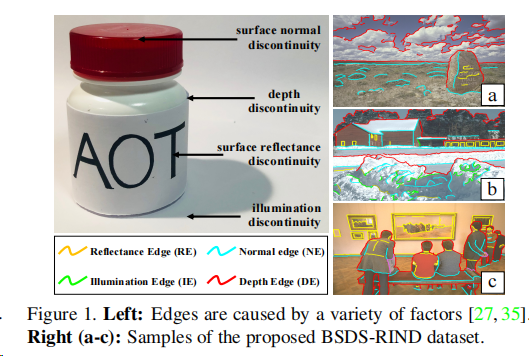

# **RINDNet: Edge Detection for Discontinuity in** **Reflflectance, Illumination, Normal and Depth**

边缘作为计算机视觉的基本构件，根据表面反射率的不连续性可分为四种类型——表面反射率、照明、表面法线或深度。

虽然在检测一般或个别边缘类型方面取得了很大的进展，但对所有四种边缘类型的综合研究仍未得到充分的探索。

在本文中，我们提出了一种新的神经网络解决方案，RINDNet，以联合检测所有四种类型的边。

考虑到每种边的不同属性和它们之间的关系，RINDNet学习每种边的有效表示，并分三个阶段工作

在第一阶段，RINDNet使用一个共同的主干来提取所有边共享的特征。

然后在第二阶段，它进行分支，由相应的解码器为每个边缘类型准备鉴别特征。

在第三阶段，每种类型的一个独立的决策头汇总了之前阶段的特征来预测初始结果。此外，一个注意模块学习所有类型的注意映射，以捕获它们之间的潜在关系，并将这些映射与初始结果相结合，生成最终的边缘检测结果。

为了进行训练和评估，我们构建了第一个公共基准测试，BSDS-RIND，并对所有四种类型的边进行了仔细的注释。在我们的实验中，与最先进的方法相比，RINDNet产生了很有希望的结果。补充的分析在补充材料中提出。

# **1. Introduction**

边缘在许多视觉任务[33,40,43,46]中起着重要的作用。虽然通用边缘检测[14,23,41,44]已经被广泛研究了几十年，但特异性边缘检测由于其在不同类型的[14,23,41,44]上的实际应用而吸引了越来越多的努力，如遮挡轮廓[25,38,39]或语义边界[16,48]。

在他的开创性工作[27]中，David Marr总结了四种基本方法： (1)表面反射不连续，(2)照明不连续，(3)表面法线不连续，(4)深度不连续，如图1所示。[33,40,43,46]最近的研究表明，上述类型的边缘有利于下游任务。例如，路面裂纹检测（反射率不连续）是智能运输[46]的关键任务；阴影边缘（照明不连续）检测是阴影去除和路径检测[43]的前提；[33]和[40]表明，深度边缘和法边表示分别提示精细的法边和尖锐深度估计。此外，[18]同时利用四种类型的线索来提高深度细化的性能

尽管细粒度边很重要，但仍未得到充分探索，特别是与一般边相比。一般边缘检测器通常无法区分边缘；而现有的对特定边缘的研究集中在单个边缘类型。相比之下，据我们所知，这四种基本类型的边缘从未在一个集成的边缘检测框架中被探索过。

在本文中，我们首次提出了同时检测四种类型的边缘，即反射率9边缘（RE）、照明边缘（IE）、正线边缘（NE）和深度边缘（DE）。虽然边缘在图像的强度变化方面具有相似的模式，但它们有不同的物理基础。具体来说，REs和IEs主要与光度原因有关——REs是由材料外观（如纹理和颜色）的变化引起的，而IEs是由照明的变化（如阴影、光源和高光）产生的。相比之下，网元和网元反映了物体表面的几何变化或深度不连续。考虑到所有类型的边之间的相关性和区别，我们开发了一个基于cnn的解决方案，名为RINDNet，用于联合检测上述四种类型的边。

RINDNet分三个阶段工作。在第一阶段，它从所有边缘的主干网络中提取一般特征和空间线索。

然后，在第二阶段中，它继续使用四个独立的解码器。

具体来说，低级特征首先在权重层（WL）的指导下集成，然后输入Re解码器和ie解码器，分别为REs和IEs生成特征。

同时，NE/de-解码器以高级特性为输入，探索有效的特性。

然后，将这些特征和准确的空间线索转发到第三阶段的四个决策头，以预测初始结果。

最后，注意力模块（AM）获得的注意力图，捕获所有类型之间的潜在关系，与初始结果聚合，生成最终的预测。所有这些组件都是可微的，这使得RINDNet成为一个端到端架构，可以共同优化四种边缘类型的检测。

# **3. Problem Formulation and Benchmark**

## **3.1. Problem Formulation**  

设X∈R3×W×H为带有地真值标签E = {Er、Ei、En、Ed}的输入图像，其中Er、Ei、En、Ed∈{0,1}W×H分别为二进制边缘映射，分别表示反射率边缘（REs）、照明边缘（IEs）、表面正线边缘（NEs）和深度边缘（DEs）。我们的目标是生成最终的预测Y = {Y r，Y i，Y n，Y d}，其中Y r，Y i，Y n，Y d分别是对应于REs、IEs、NEs和DEs的边缘映射。在我们的工作中，我们的目标是学习一个基于cnn的边缘探测器ψ： Y = ψ(X)。

ψ的训练可以通过最小化E和y之间的一些损失函数来在训练图像上进行，因此，需要一组带有地面-真实标签的图像来学习映射ψ。我们在这项工作中提供了这样的注释，详细的过程显示在3.2中。

## **3.2. Benchmark**

我们工作的目的之一是为BSDS图像[2]提供第一个公共基准测试，名为BSDS-RIND。原始图像包含了各种复杂的场景，这使得联合检测所有四种类型的边缘具有挑战性。图1（右）显示了我们的一些注释示例。

**Edge Defifinitions.**。为注释任务定义四种类型的边缘类型至关重要。最重要的是，我们给出了每种类型的定义，并通过例子来说明它。

 

**Reflflectance Edges** **(REs)**通常是由光滑表面的材料外观（如纹理和颜色）的变化引起的。值得注意的是，虽然图像中绘画中的边缘（见图1 (c)）可以被人类视觉系统归类为DEs，但由于没有几何不连续，这些边缘被划分为REs。

**Illumination Edges** **(IEs)** 照明边缘（IEs）由阴影、光源、高光等产生。（如图1所示）

**Normal Edges** **(NEs)**法线边（NEs）表示表面方向上的不连续位置，通常出现在零件之间。如图1 (b)所示，我们以建筑和地面之间的边缘为例，这两个表面的深度变化是连续的，但不是平滑的，这是由于它们之间的表面不连续造成的。

**Depth Edges** **(DEs)**深度边缘（DEs）是由深度不连续造成的，通常与对象轮廓一致。很难测量深度差（例如，图1 (a)），因此可以使用相对深度差来确定一条边缘是否属于DEs。尽管建筑中存在窗户与墙壁之间的深度变化（图1 (b)），距离比较小是由于它们与相机之间的距离很长，因此这些边缘被归类为REs而不是DEs。