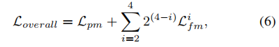

# Camouflaged Object Segmentation with Distraction Mining

伪装物体分割（COS）的目的是识别“完美”融入周围环境的物体，具有广泛的应用价值。

COS的关键挑战是在候选对象和噪声背景之间存在着很高的内在相似性。

在本文中，我们努力接受对有效和高效的COS所面临的挑战。

为此，我们开发了一个仿生框架，称为定位和焦点网络（PFNet），它模拟了自然界中的捕食过程。具体来说，我们的PFNet包含两个关键模块，即定位模块（PM）和焦点模块（FM）。

PM被设计用来模拟捕食的检测过程，从全局的角度定位潜在的目标对象，然后使用FM来执行捕食的识别过程，通过关注模糊区域逐步重新细化粗预测。

值得注意的是，在FM中，我们开发了一种新的干扰挖掘策略来发现和去除干扰，以有利于估计的性能。

大量的实验表明，我们的PFNet实时运行（72 FPS），在四个标准指标下，在三个具有挑战性的数据集上显著优于18个前沿模型。

# **1. Introduction**

伪装是指通过任何材料、颜色或照明的组合来隐藏动物或物体，使目标物体难以看到（隐藏）或将它们伪装成其他东西（模仿）[47]。

得益于发现“无缝”嵌入周围环境的伪装物体的能力，伪装物体分割(COS)在不同领域有广泛的有价值的应用，包括医疗诊断(例如，息肉分割[13]和肺部感染分割[14])，工业(例如，在自动生产线上检查不合格产品)，农业(例如，防止入侵的蝗虫检测)，安全和监视(例如，搜索和救援任务，在恶劣天气中探测行人或障碍物，以便自动驾驶)，科学研究(例如，稀有物种发现)，艺术(例如，照片逼真混合和娱乐艺术)。

然而，COS是一个从根本上具有挑战性的任务由于伪装策略通过欺骗观察者[47]的视觉感知系统，因此大量的视觉感知知识[50]需要消除模糊造成的高目标对象之间的内在相似性和背景。伪装对象分割的研究在生物学和艺术[47]等许多领域有着悠久而丰富的历史。早期的方法是基于手工制作的低级特征，如纹理[45]和运动[28]等三维凸度[39]来区分前景和背景。然而，这些特征在区分伪装物体和非伪装物体方面的能力有限，因此基于它们的方法在复杂的场景中经常失败。尽管最近提出的基于深度学习的方法[26,12,58]在一定程度上取得了性能的提高，但探索精确COS的有效方法仍有很大的空间。

在自然界中，被捕食动物利用伪装等机制来误导捕食者的视觉感觉机制，以降低被发现的风险。

在自然选择的压力下，掠食性动物进化出了各种适应性，如敏锐的感官和聪明的大脑来成功地捕食，可以分为三个阶段，即检测、识别和捕获[15]。这激发了我们的仿生解决方案，通过模仿捕食的前两个阶段来分割伪装的物体

在本文中，我们提出了一种定位和聚焦网络（PFNet），它大大提高了现有的伪装目标分割性能。

我们的PFNet包含两个关键模块，即定位模块（PM）和焦点模块（FM）。

PM被设计用来模拟捕食的检测过程，从全局的角度定位潜在的目标对象，然后使用FM来执行捕食的识别过程，通过关注模糊区域来细化初始分割结果。

具体来说，**PM由一个通道注意块和一个空间注意块组成，它们都以非局部的方式实现，以捕获通道和空间位置方面的长期语义依赖，从而从全局的角度推断目标对象的初始位置。FM首先基于前景注意（背景注意）特征进行多尺度内容探索，以发现假阳性（假阴性）干扰，然后消除这些干扰，以获得对目标物体的更纯粹的表征。**

这种分散挖掘策略以隐式的方式实现，并应用于不同层次的特征上，逐步细化分割结果，使我们的PFNet具有强大的对伪装对象的精确分割能力（以图1为例）。

综上所述，我们的贡献如下：

1. 我们将干扰的概念引入到COS问题中，并开发了一种新的干扰挖掘策略，用于发现和去除干扰，以有利于伪装对象的准确分割。
2. 我们提出了一种新的 COS框架，即定位和聚焦网络（PFNet），该框架首先通过探索远程语义依赖来定位潜在的目标对象，然后关注干扰发现和去除，逐步细化分割结果。
3. 我们在三个基准数据集上实现了最先进的伪装对象分割性能。实验结果证明了该方法的有效性。

# **2. Related Work**

**Generic Object Detection (GOD)** 

通用对象检测（GOD）试图定位对象实例从几个预定义的通用类别在自然图像[31]，这是一个最基本的和具有挑战性的问题在计算机视觉和形式的基础解决复杂或高级视觉任务分割[23]，场景理解[29]和对象跟踪[61]。场景中的一般物体可以是明显的，也可以是伪装的，伪装的物体可以看作是坚硬的外壳。因此，直接应用GOD方法（如[30,17,22]）来分割伪装的对象可能不会得到期望的结果。

**Salient Object Detection (SOD)**

显著对象检测（SOD）的目的是识别和分割输入图像中最引人注目的对象。在过去的几十年里，[9]已经提出了数百种基于图像的SOD方法。早期的方法主要是基于手工制作的低级特征以及启发式先验（例如，颜色[1]和对比度[6]）。近年来，深度卷积神经网络（CNNs）在显著目标检测方面取得了最新的进展。研究了多级特征聚合的鲁棒检测[27,19,63,68]。采用循环和迭代学习策略逐步细化显著性图[64,52]。由于特征增强的有效性，注意机制[51,54]也被应用于显著性检测[32,4]。此外，还利用边缘/边界线索来细化显著性映射[43,67,48]。然而，应用上述SOD方法进行伪装对象分割可能不合适，因为术语“显著”本质上是“伪装”的相反，即突出与沉浸。

**Specifific Region Segmentation (SRS)**

我们在这里定义的特定区域分割（SRS）是指对场景中的特定区域，如阴影[20,25,72,70]、镜像[59,36]、玻璃[38,57]和水[16]区域的分割。这些区域是特殊的，对视觉系统有重要的影响。对于水区、阴影区和镜像区，前景和背景之间通常存在强度或内容不连续。相反，伪装对象和背景之间的强度和内容都是相似的，这导致了COS的巨大挑战。此外，与玻璃区域相比，伪装后的物体的结构通常更为复杂，从而增加了精确分割的难度。

**Camouflflaged Object Segmentation (COS)**

伪装对象分割（COS）在生物学和艺术[47]等许多领域有着悠久而丰富的研究历史，并受到了两项显著研究[49,7]的巨大影响。早期与伪装相关的作品是基于手工制作的纹理[45]等低级特征、3D凸性[39]和运动[28]来区分前景和背景的。这些方法适用于一些简单的情况，但在复杂的场景中经常失败

最近，Le等人[26]提出了一种端到端伪装对象分割网络通过将分类信息集成到像素级分割中。Yan等人[58]进一步引入了对抗性攻击来提高分割精度。Fan等人[12]开发了一个简单而有效的框架，称为SINet，并构建了当前最大的COS数据集COD10K，以促进COS在深度学习时代的发展。

**Contextual Feature Learning**

情境特征学习在许多计算机视觉任务的高性能实现中起着重要的作用。许多作品都致力于利用上下文来增强特征表示的能力。具体来说，在[3,65,37]中开发了多尺度上下文，在[60,62]中提取多层次上下文。在[42,38]中捕获大域上下文特性，在[20]中探索方向感知上下文，在[8,59]中利用上下文对比特性。然而，不加选择地探索上下文特征可能对COS没有太大的贡献，因为上下文往往会被明显物体的特征所主导。我们的方法不同于上述工作，重点从前景/背景感知特征中探索上下文，用于上下文推理和分散注意力的发现。并通过实验验证了该方法的有效性。

# **3. Methodology**

生物学研究[15]指出，捕食的过程可以分为三个阶段，即检测、鉴定和捕获三个阶段。受捕食的前两个阶段的启发，我们设计了一个定位和焦点网络（PFNet），它由两个关键模块组成，即定位模块（PM）和焦点模块（FM）。

PM被设计用来模拟捕食的检测过程，从全局的角度定位潜在的目标对象，然后使用FM来执行捕食的识别过程，通过关注模糊区域来细化初始分割结果。

## **3.1. Overview**

我们所提出的网络的概述如图2 (a).所示给定一个RGB图像，我们首先将其送入ResNet-50 [18]主干，以提取多层特征，这些特征进一步输入到四个卷积层中进行信道缩减。然后，在最高级别的特征上应用一个定位模块（PM）来定位潜在的目标对象。最后，利用多个焦点模块（FMs）来逐步发现和消除假阳性和假阴性的干扰，以准确地识别伪装的物体。

## **3.2. Positioning Module**

图2 (b)说明了精心设计的定位模块（PM）的详细结构。给定输入的高级特征，PM的目标是获取语义增强的高级特征，并进一步生成初始分割图。它由通道注意块和空间注意块组成。它们都是以非局部的方式实现的，以捕获通道和空间位置方面的长期依赖关系，从而从全局的角度增强最高级别特征的语义表示。

具体来说，给定输入特征$F∈R^{C×H×W}$，C、H，W分别代表通道数量，高度和宽度，我们首先重塑F得到聚合Q，键K和值V，其中{Q，K，V }∈RC×N和N = H×W是像素数。

然后，我们在Q和K的转置($K^T$)之间进行矩阵乘法，并应用一个softmax层来计算通道注意图$X∈R^{C×C}$：

$Q_i$：表示矩阵Q的第i行，$x_{ij}$测量第j个通道对第i个通道的影响。然后，我们在X和V之间进行矩阵乘法，并将聚合的注意特征重塑为$R^{C×H×W}$。最后，为了提高容错能力，我们将结果乘以一个可学习的尺度参数γ，并进行识别映射操作，得到最终的输出$F'∈R^{C×H×W}$：

γ逐渐从初始值1中学习一个权重。最终的特征F'模拟了特征映射通道之间的长期语义依赖关系，因此比输入特征F更具鉴别性。

然后，我们将通道注意块的输出特征输入到空间注意块中作为输入。我们首先在输入特征F'上使用3个1×1卷积层，并对卷积结果进行重塑，分别生成三个新的特征图Q'、K'和V'，其中${Q'，K' }∈R^{C_1×N}$和$C_1 = C/8$，和$V'∈R^{C×N}$。

然后，我们对Q'的转置($Q^{'T}$)和K'进行矩阵乘法，并使用softmax归一化生成空间注意图$X'∈R^{N×N}$：

$Q'_{：i}$表示矩阵Q'的第i列，$x'_{ij}$测量第j个位置对第i个位置的影响。同时，我们在V'和X'的转置之间进行矩阵乘法，并将结果重塑为$R^{C×H×W}$。与信道注意块类似，我们将结果乘以一个可学习的尺度参数γ'，并添加一个跳过连接，得到最终的输出$F ''∈R^{C×H×W}$：

γ''也被初始化为1。基于F'，F ''进一步获得了所有位置之间的语义相关性，从而增强了特征的语义表示。

最后，我们可以通过在F''上应用7×7填充量为3的卷积，得到目标的初始位置图。F ''和初始位置图将通过以下焦点模块（FMs）逐步细化。

## **3.3. Focus Module**

由于伪装的物体通常与背景具有相似的外观，假阳性和假阳性预测自然会出现在最初的分割中发生。焦点模块（FM）的设计为首先发现然后消除这些错误的预测。它以主干和高层预测的当前级特征和特征作为输入，输出细化后的特征和更准确的预测。

**Distraction discovery.**

我们注意到，经过仔细的分析，人类可以很好地区分这些干扰。我们的观察是，人类会进行上下文推理，即将模糊区域和自信区域的模式（如纹理和语义）与自信模式进行比较，以做出最终的决定。这激励我们对所有预测的前景（或背景）区域进行上下文探索，目的是发现与自信的前景（或背景）预测区域不同的虚假积极干扰（或假消极干扰）是不同的。

如图2 (c)所示，我们首先对高级预测进行上采样，然后用sigmoid层对其进行归一化。然后利用该归一化图及其反向版本对当前级特征Fc进行相乘，分别生成前景注意特征$F_{fa}$和背景注意特征$F_{ba}$。最后，我们将这两种类型的特征输入两个并行上下文探索（CE）块，以执行上下文推理，分别发现假阳性干扰$F_{fpd}$和假阴性干扰$F_{fnd}$

如图3所示，CE块由四个上下文探索分支组成，每个分支包括用于通道缩减的3×3卷积，用于局部特征提取的$k_i×k_i$卷积，以及用于上下文感知的扩张率为ri的3×3膨胀卷积。

我们将$k_i，i∈{1、2、3、4}$设为1、3、5、7，并将$ri，i∈{1、2、3、4}$分别设为1、2、4、8。

每个卷积之后都有一个批处理归一化（BN）层和一个ReLU非线性操作。

第i，i∈{1,2,3} CE分支的输出将被输入（i+1）分支，**在更大的接受域中进一步处理**。

所有四个分支的输出通过3×3卷积进行连接和融合。通过这种设计，CE块获得了在广泛的尺度上感知丰富的上下文的能力，因此可以用于上下文推理和干扰发现。

**Distraction Removal**

在发现干扰后，我们可以通过以下方式进行干扰消除：

Fh和F 'r分别表示输入的高级特征和输出的细化特征；

CBR是卷积、批处理归一化（BN）和ReLU的组合；U是双线性上采样；α和β是可学习的尺度参数，初始化为1。

在这里，我们使用元素减法操作来抑制模糊的背景（即假阳性【将背景当作前景】干扰），并使用元素加法操作来增加缺失的前景（即假阴性【将前景当背景】干扰）。

最后，通过对细化的特征$F '_r$上应用卷积层，可以得到更准确的预测图。我们使用地面真实地图来监督生成的地图，以迫使$F '_r$变成一个比Fh更纯粹的表示，即，去除干扰的特征。

这将进一步指导CE块发现干扰的具体形式，并使整个焦点模块（FM）以一种隐含的方式进行干扰的发现和消除。

**需要注意的是，我们没有采用特定的干扰地图来明确监督Ffpd和Ffnd**，基于以下两个考虑： 

- (i)注释假阳性和假阴性既昂贵又主观，难以获得足够的和具有代表性的干扰；
- （ii）对所有焦点模块（FMs）使用固定的分心监督是次优的，因为每个FM的输入高级特征是不同的，我们希望发现和删除的干扰应该随着逐渐细化的输入高级特性而动态变化。

**Discussion.** 

干扰线索已经在许多视觉任务中被探索，如显著性目标检测[4,56]、语义分割[21]和视觉跟踪[73]。

现有的工作利用假阳性干扰[21,56,73]或假阴性干扰[4]来获得更准确的结果。

与上述方法不同的是，我们探索了这两种类型的干扰，并提出了一个设计良好的焦点模块（FM），首先发现，然后消除这些干扰。

虽然[70]中的干扰感知阴影（DS）模块也同时利用了这两种干扰，但我们提出的焦点模块（FM）在以下三个方面与DS模块有本质上的不同。

首先，DS模块基于相同的输入特征提取特征来预测两种类型的干扰，而我们的焦点模块（FM）从前景注意特征中发现假阳性干扰，并从背景注意特征中发现假阴性干扰。

其次，DS模块中的特征提取器包含两个3×3卷积，而我们的上下文探索（CE）块由四个分支组成，可以捕获多尺度上下文，更好地发现分散注意力。

第三，基于现有阴影检测模型（即[20,72,25]）的预测与地面真相之间的差异，获得了对DS模块的监督。这种明确的监督策略将受到具体方法的限制，因此可能具有有限的普遍性。相比之下，我们设计了一种隐式的干扰挖掘策略，通过对被干扰去除的特征进行地面真实监督，以迫使每个CE块探索特定的干扰形式。据我们所知，我们是第一个挖掘干扰物以进行伪装物体分割的人，我们相信所提出的干扰物挖掘策略可以为其他视觉任务提供见解。

## **3.4. Loss Function**

PFNet中有四个输出预测，即一个来自定位模块（PM），三个来自焦点模块（FMs）。对于PM，我们对其输出施加二元交叉熵（BCE）损失lbce和IoU损失liou [44]，即Lpm =lbce +lIoU，以指导PM探索目标对象的初始位置。对于FM，我们希望它能更多地关注干扰注意力的区域。这些区域通常位于物体的边界、拉长的区域或孔洞处。

因此，我们结合加权BCE损失lwbce [53]和加权IoU损失lwiou [53]，即Lfm =lwbce +lwiou，以迫使FM更加关注可能的干扰区域。最后，总体损失函数为：

$L^i_{fm}$表示PFNet第i级焦点模块的预测损失