# Concealed Object Detection

我们提出了第一个关于隐藏物体检测（COD）的系统研究，它旨在识别在视觉上嵌入在其背景中的物体。

隐藏对象与背景之间的高度内在相似性使得COD比传统的目标检测/分割更具挑战性。

为了更好地理解这项任务，我们收集了一个名为COD10K的大规模数据集，它包含了10,000张图像，覆盖了来自78个对象类别的不同真实场景中被隐藏的物体。此外，我们还提供了丰富的注释，包括对象类别、对象边界、具有挑战性的属性、对象级标签和实例级注释。

我们的COD10K是迄今为止最大的COD数据集，具有最丰富的注释，可以全面理解隐藏对象，甚至可以帮助完成其他一些视觉任务，如检测、分割、分类等。

基于动物在野外捕猎的方式，我们还设计了一个简单但强大的COD基线，称为搜索识别网络（SINet）。

没有任何花哨声，SINet在所有测试数据集上优于12个前沿基线，使它们成为健壮的通用架构，可以作为未来COD研究的催化剂。

最后，我们提供了一些有趣的发现，并强调了几个潜在的应用和未来的发展方向。为了激发这一新领域的研究，我们的代码、数据集和在线演示都可以在我们的项目页面： http://mmcheng.net/cod上找到。

# 1 INTRODUCTION

你能在10秒内在图1的每个图像中找到隐藏的物体吗？生物学家将其称为背景匹配伪装（BMC）[2]，即一个或多个物体试图调整其颜色，以与周围环境“无缝”匹配，以避免检测到[3]。

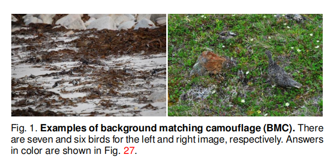

感官生态学家[4]发现，这种BMC策略通过欺骗观察者的视觉感知系统来工作。

自然地，处理隐藏目标检测（COD1）需要大量的视觉感知[6]知识。理解隐藏目标检测本身不仅有科学价值，而且在许多基本领域的应用也很重要，如计算机视觉（例如，搜索和救援工作，或稀有物种发现），医学（如息肉分割[7]，肺感染分割[8]）、农业（如蝗虫检测防止入侵）和艺术（如娱乐艺术[9])

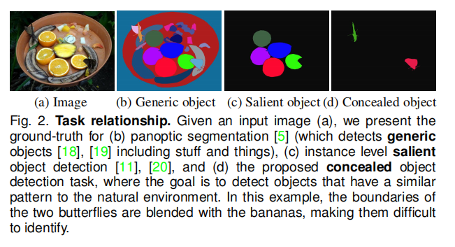

在图2中，我们给出了通用的、显著的和隐藏的目标检测的例子。目标和非目标之间的高内在相似性使得COD远比传统的目标分割/检测[10]、[11]、[12]更具挑战性。

尽管最近COD得到了越来越多的关注，但关于它的研究仍然很少，主要是由于缺乏足够大的数据集和标准基准，如Pascal-VOC [13]、ImageNet [14]、MS-COCO [15]、ADE20K [16]和DAVIS [17]。

在本文中，我们首次利用深度学习全面地研究了隐藏对象检测任务，从隐藏的角度为对象检测带来了一个新的视角。

## **1.1 Contributions**

我们的主要贡献如下：

1. COD10K数据集。基于上述目标，我们仔细组装了COD10K，一个大规模的隐藏目标检测数据集。我们的数据集包含了10,000张图像，涵盖了78个对象类别，如陆地动物、两栖动物、飞行动物、水生动物等。所有隐藏的图像都用类别、边界框、对象级和实例级标签（图3），有利于许多相关任务，如对象建议、定位、语义边缘检测、迁移学习[21]、领域自适应[22]等。

   每个隐藏的图像都被分配了具有挑战性的属性（例如，形状复杂性-sc，不可定义的边界-ib，遮挡soc），在现实世界和匹配级[23]标记（每张图像需要∼60分钟）。这些高质量的标签可以帮助提供更深入的洞察模型的性能

2) COD框架。我们提出了一个简单但有效的框架，称为SINet（搜索识别网）。值得注意的是，SINet的整体训练时间需要4个小时，它在所有现有的COD数据集上实现了最先进的（SOTA），这表明它可以为隐藏目标检测提供一个潜在的解决方案。我们的网络还产生了一些有趣的发现（例如，搜索和识别策略适用于COD），使各种潜在的应用更加可行。

3) COD基准。基于收集到的COD10K和之前的数据集[24]，[25]，我们对12个SOTA基线进行了严格的评估，使我们成为最大的COD研究。我们在两种场景中报告基线，即超类和子类。我们还通过一个在线基准测试（http://dpfan.net/camouflage/）来跟踪社区的进展

4)下游应用程序。为了进一步支持该领域的研究，我们开发了一个在线演示版(http://mc.nankai.edu。厘米/鳕鱼)，使其他研究人员能够轻松地测试他们的场景。此外，我们还展示了一些潜在的应用，如医药、制造、农业、艺术等。

本文从几个方面对我们的会议版本[1]进行了扩展。

首先，我们提供了对COD10K的更详细的分析，包括分类法、统计数据、注释和解决方案。

其次，我们通过引入邻域连接解码器（NCD）和群反转注意（GRA）来提高SINet模型的性能。

第三，我们进行了广泛的实验来验证我们的模型的有效性，并为我们的框架内的不同模块提供了几个消融研究。

第四，我们提供了一个详尽的超类和子类的基准测试，以及一个关于新的COD任务的更深刻的讨论。

最后，基于我们的基准测试结果，我们得出了几个重要的结论，并强调了几个有前景的未来方向，如隐藏对象排名、隐藏对象建议、隐藏实例分割。

# 2 RELATED WORK

在本节中，我们将简要回顾一下密切相关的工作。在[10]之后，我们将目标检测大致分为三类：通用性、显著性和隐藏性目标检测。

**通用对象分割（GOS）:**。计算机视觉中最流行的方向之一是通用的对象分割[5]，[26]，[27]，[28]。请注意，通用对象可以是突出的或隐藏的。隐藏的对象可以看作是一般对象的困难情况。典型的GOS任务包括语义分割和全视分割（见图2 b）。

**显著性对象检测（SOD）**。这项任务的目的是识别出图像中最引人注目的物体，然后分割它们的像素级轮廓[29]，[30]，[31]。使用SOD技术[32]的旗舰产品是华为的智能手机，它使用SOD [32]来创造他们所谓的“人工智能自拍”。最近，Qin等人将SOD算法[33]应用于两个（接近）商业应用： AR COPY & PASTE2和对象分割。这些应用已经引起了极大的关注（12K github星），并对现实世界有重要的影响。

虽然术语“显著”本质上与“隐藏”（突出与沉浸感）相反，但突出物体仍然可以为COD提供重要的信息，例如，包含显著物体的图像可以用作负样本。对SOD进行完整的审查超出了本工作的范围。我们建议读者参考最近的调查和基准论文[11]，[34]，[35]，[36]了解更多细节。我们的在线基准测试可以在： http://dpfan.net/socbenchmark/上公开获得。

**Concealed Object Detection (COD).**

COD的研究对生物学和艺术有着悠久而丰富的历史，对提高我们的视觉感知知识有着巨大的影响。

来自Abbott Thayer [37]和Hugh Cott [38]的两项关于隐藏动物的显著研究仍然具有巨大的影响力。读者可以参考史蒂文斯等人的[4]的调查，以了解更多关于这个历史的细节。还有一些并发的作品[39]，[40]，[41]在这次提交后被接受。

**COD数据集**。变色龙[24]是一个未发表的数据集，只有76张带有手动注释的对象级地面图像（GTs）。这些图片是通过谷歌搜索引擎使用“隐藏的动物”作为关键字从互联网上收集到的。另一个当代的数据集是CAMO [25]，它有2.5K张图像（2K用于训练，0.5K用于测试），覆盖了8个类别。它有两个子数据集，CAMO和MS-COCO，每个都包含1.25K的图像。与现有的数据集不同，我们的COD10K的目标是提供一个更具挑战性、更高质量、更密集注释的注释数据集。COD10K是迄今为止最大的隐蔽目标检测数据集，包含10K张图像（6K用于训练，4K用于测试）。详见表1。

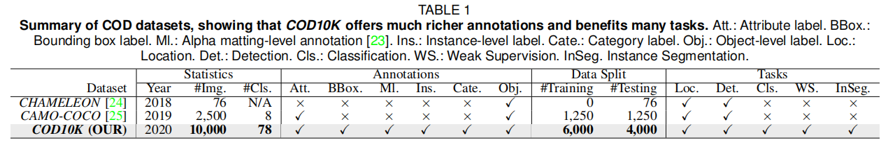

**伪装的类型**。隐藏的图像大致可以分为两种类型：包含自然伪装和人工伪装。自然伪装被动物（如昆虫、海马和头足类动物）用来作为一种生存技能，以避免被捕食者识别。相比之下，人工伪装通常用于艺术设计/游戏中隐藏信息，出现在产品制造过程中（所谓的表面缺陷[42]，缺陷检测[43]，[44]），或出现在我们的日常生活中（例如，透明物体[45]，[46]，[47]）。

**COD定义**。与语义分割等类感知任务不同，隐藏对象检测是一种与类无关的任务。因此，COD的配方简单易于定义。给定一个图像，该任务需要一个隐藏的目标检测算法为每个像素i分配一个标签Labeli∈{0,1}，其中Labeli表示像素i的二进制值。标记不属于隐藏对象的像素为0，而标签为1表示像素完全分配给隐藏对象。我们专注于对象级隐蔽对象检测，将隐蔽实例检测留给我们未来的工作。

# 3 COD10K DATASET

新任务和数据集[16]、[48]、[49]的出现导致了计算机视觉各个领域的快速发展。例如，ImageNet [50]彻底改变了深度模型对视觉识别的使用。

考虑到这一点，我们研究和开发COD数据集的目标是： 

(1)从隐藏的角度提供一个新的具有挑战性的目标检测任务，

(2)促进几个新主题的研究，

(3)激发新的想法。COD10K的例子如图1所示。我们将从图像收集、专业注释、数据集特征和统计等三个关键方面提供关于COD10K的详细信息。

## **3.1 Image Collection**

正如在[11]、[17]、[51]中所讨论的，注释的质量和数据集的大小是作为基准的其寿命的决定因素。为此，COD10K包含10000张图像（5066张隐藏，3000张背景，1934个非隐藏），分为10个超类（即飞行、水生、陆地、两栖动物、其他、天空、植物、植被、室内、海洋和沙子）和78个子类（69个隐藏，9个非隐藏），从多个摄影网站收集。

大多数隐藏的图像来自Flickr，已被学术应用，关键词如下：隐藏的动物、不可见的动物、隐藏的鱼、隐藏的蝴蝶、隐藏的狼蛛、手杖、死叶螳螂、鸟、海马、猫、侏儒海马等。（见图4）其余的隐藏图片（约200张图片）来自其他网站，包括视觉搜索、Pixabay、无溅、免费图片等，它们发布公共领域的库存照片，不受版权和忠诚保护。为了避免选择偏差[11]，我们还从Flickr中收集了3000张显著图像。为了进一步丰富阴性样本，我们从互联网上选择了1934张非隐藏的图像，包括森林、雪、草原、天空、海水等类别的背景场景。有关图像选择方案的更多细节，我们请参考Zhou等人的[52]。

## **3.2 Professional Annotation**

最近发布的数据集[51]，[53]，[54]已经表明，在创建一个大规模的数据集时，建立一个分类系统是至关重要的。受[55]的激励，我们的注释（通过众包获得）是分层的（类别->边界框->属性对象->/实例）。

***Categories***:如图6所示，我们首先创建了5个超类类别。然后，根据我们收集的数据总结69个最常出现的子类类别。最后，我们标记每个图像的子类和超类。如果候选图像不属于任何已确定的类别，我们将其归类为“其他”。

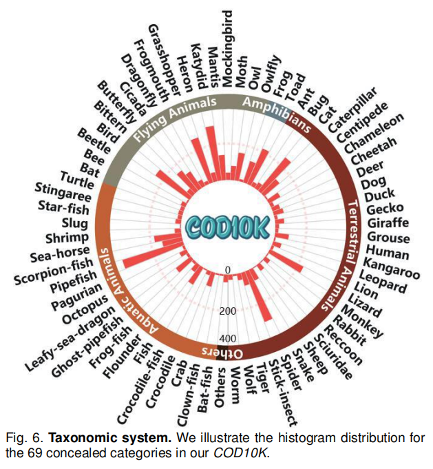

***Bounding boxes***：为了为隐藏对象建议任务扩展COD10K，我们还仔细地标注了每个图像的边界框。

***Attributes：***根据文献[11]，[17]，我们将每个隐藏的图像标记为具有高度挑战性的属性，如遮挡、不可定义的边界。属性描述及协属性分布如图7所示。

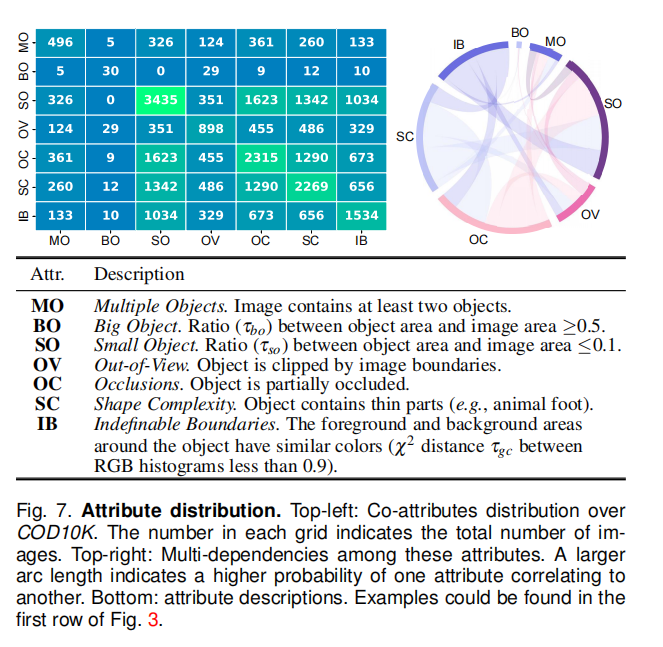

**对象/实例**。我们强调，现有的COD数据集只关注对象级的注释（表1）。然而，能够将一个对象解析为它的实例对于计算机视觉研究人员能够编辑和理解一个场景是很重要的。为此，我们在实例级别上进一步注释了对象，比如COCO [15]，从而得到了5,069个对象和5,930个实例。

## **3.3 Dataset Features and Statistics**

现在，我们将讨论所提议的数据集，并提供一些统计数据。

***Resolution distribution***：正如在[56]中所指出的，高分辨率数据为模型训练提供了更多的对象边界细节，并在测试时产生了更好的性能。图8为COD10K的分辨率分布，其中包括大量的全高清1080p分辨率图像。

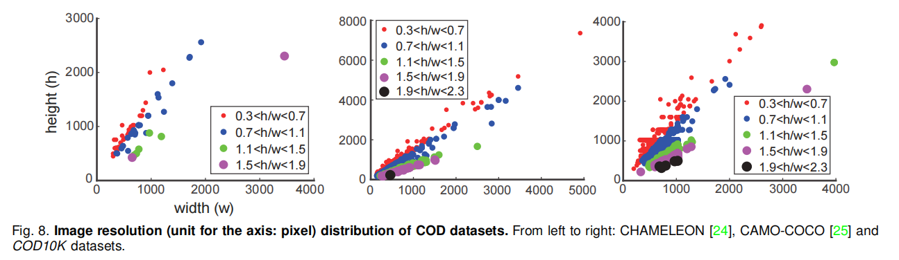

***Object size：***在[11]之后，我们在图9（左上角）中绘制了归一化（即与图像区域相关）的对象大小，即大小分布从0.01%∼80.74%(平均。： 8.94%)，与CAMO-COCO和变色龙相比，其分布范围更广

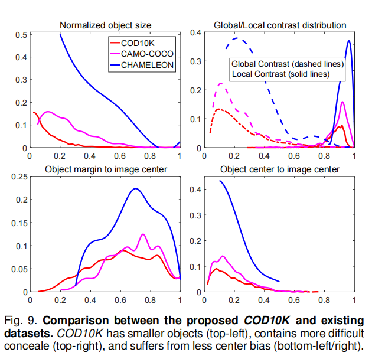

***Global/Local contrast：***为了评估一个对象是否容易检测，我们使用全局/局部对比策略[57]来描述它。图9（右上角）显示，COD10K中的对象比其他数据集中的对象更具挑战性。

***Center bias**.* 这种情况通常发生在拍照时，因为人类自然地倾向于关注场景的中心。我们采用[11]中描述的策略来分析这种偏倚。图9（左下角/右下角）显示，我们的COD10K数据集比其他数据集的中心偏差更小。

***Quality control*** 为了确保高质量的注释，我们邀请了三名查看者参与10倍交叉验证。图10显示了已通过/已被拒绝的示例。这种匹配级注释平均每张图像花费∼60分钟。

***Super/Sub-class distribution**  .*COD10K包括5个隐藏的超级类还有69个亚类（如蝙蝠鱼、狮子、蝙蝠、青蛙等）。不同类别的单词云和对象/实例数的例子分别如图5和图11所示。

***Dataset splits***  为了为深度学习算法提供大量的训练数据，我们的COD10K被分成6000张图像用于训练，4000张图像用于测试，从每个子类中随机选择。

***Diverse concealed objects*** 除了一般的隐藏图案，如图1中的那些，我们的数据集还包括各种其他类型的隐藏物体，如隐藏的身体画和日常生活中的隐藏（见图12）。

# 4 COD FRAMEWORK

## **4.1 Network Overview**

图13显示了所提出的SINet（搜索识别网络）的整体隐藏对象检测框架。

接下来，我们解释我们的动机，并介绍网络概述

**Motivation**：[58]的生物学研究表明，当捕猎时，捕食者会首先判断潜在的猎物是否存在，也就是说，它会寻找猎物。然后，就可以识别出目标动物；最后，它可以被捕获。

**Introduction**几种方法[59]，[60]已经表明，令人满意的性能依赖于重新优化策略（即从粗到细），该策略被认为是多个子步骤的组成。这也表明，解耦复杂的目标可以打破性能瓶颈。

SINet模型包括狩猎的前两个阶段，即搜索和识别。具体来说，前一阶段（第4.2节）负责搜索隐藏的物体，而后一阶段（第4.3节）负责以级联的方式精确检测隐藏的物体。

接下来，我们详细阐述了三个主要模块的细节，包括

a)纹理增强模块（TEM），该模块用于用放大的上下文线索捕获细粒度纹理；

b)邻居连接解码器（NCD），能够提供位置信息；

c)级联组反转注意（GRA）块，协同从更深层次细化粗预测。

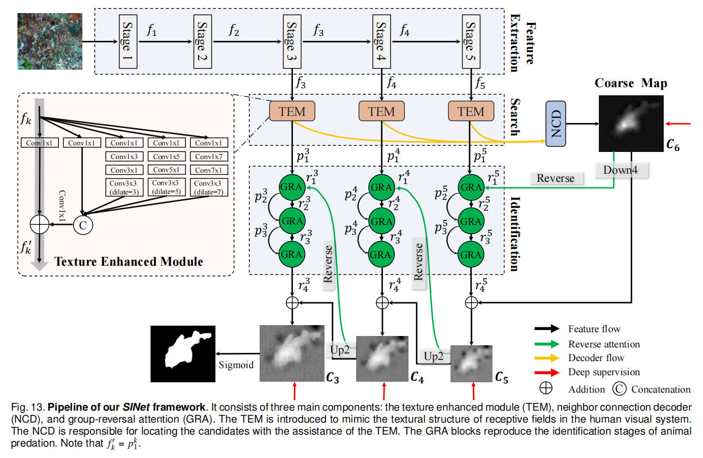

## **4.2 Search Phase**

**Feature Extraction.** 

对于输入图像$I∈R^{W×H×3}$，从Res2Net- 50 [61]中提取了一组特征$f_k，k∈\{1,2,3,4,5\}$（删除了前三层，即“平均池”、“1000-d fc”和“softmax”）。因此，每个特征fk的分辨率为$H/2^k×W/2^k，k∈\{1,2,3,4,5\}$，覆盖了从高分辨率、低语义到低分辨率、强语义的多样化特征金字塔。

**Texture Enhanced Module (TEM)**

神经科学实验已经证实，在人类视觉系统中，一组不同大小的种群接受域有助于突出靠近视网膜中央凹的区域，这对小的空间变化[62]很敏感。这促使我们使用TEM [63]在搜索阶段（通常在一个小的/局部空间中）合并更多有区别的特征表示。

如图13所示，每个TEM组分包括4个平行的残支${b_i,i=1、2、3、4}$，不同的膨胀率分别为∈{1、3、5、7}和一个快捷分支（灰色箭头）。

在每个分支bi中，第一个卷积层利用1×1的卷积操作（Conv1×1）将信道大小减小到32。接下来是另外两层：一个（2i−1）×（2i−1）卷积层和一个3×3卷积层，具有特定的膨胀率（2i−1）。

然后，将前四个分支{bi，i=1、2、3、4}连接起来，通过3×3卷积操作将信道大小减少为C。

请注意，我们在网络的默认实现中设置了C = 32，以进行时间-成本权衡。

最后，加入快捷分支，然后将整个模块输入一个ReLU函数，得到输出特征$f_k'$。

此外，一些作品（例如，Inception-V3[64]）建议标准卷积操作的大小（2i−1）×（2i−1）可以分解为两个步骤（2i−1）×1和1×（2i−1）内核，加快推理效率不降低表示能力。

所有这些想法都是基于这样一个事实：一个秩为1的二维核等于一系列的一维卷积[65]，[66]。简而言之，与标准的接受域块结构[62]相比，TEM又增加了一个扩张率更大的分支，以扩大接受域，并进一步用两个不对称卷积层取代标准卷积。详见图13。

**Neighbor Connection Decoder (NCD)**

正如Wu等人[63]观察到，低级别特征由于其更大的空间分辨率而消耗更多的计算资源，但对性能的贡献较小。

基于这一观察结果，我们决定只聚合前三个最高级别的特征(${f_k∈R^{W/2^k×H/2^k×C},k= 3,4,5}$)以获得更有效的学习能力。而不是考虑到所有的特征金字塔。具体来说，在从前三个tem中获得候选特征后，在搜索阶段，我们需要定位隐藏的对象。

然而，在聚合多个特征金字塔时，仍然存在两个关键问题；即，如何在一个层内保持语义一致性，以及如何跨层连接上下文。在这里，我们建议用邻居连接解码器（NCD）来解决这些问题。

.更具体地说，我们用一个邻居连接函数修改了部分解码器组件（PDC）[63]，并得到了三个改进的特征

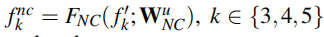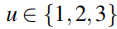

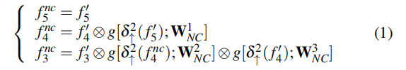

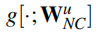表示一个3×3的卷积层，然后进行批处理归一化操作。

为了确保候选特征之间的形状匹配，我们在元素级乘法⊗之前使用了一个上采样（例如，2次）操作δ↑2（·）。

然后，我们将$f_k^{nc}，k∈{3,4,5}$送入邻居连接解码器（NCD），并生成粗位置图C6。

## **4.3 Identifification Phase**

**Reverse Guidance.**

如第4.2节所述，我们的全局位置图C6来自于三个最高的层，它只能捕捉到隐藏物体的一个相对粗糙的位置，而忽略了结构和纹理细节（见图13）。为了解决这个问题，我们引入了一种原则性的策略，通过删除对象[7]，[67]，[68]来挖掘有区别的隐藏区域。

如图14 (b)所示，我们通过sigmoid和反向操作得到了输出的反向制导$r_1^k$。

更准确地说，我们通过一个反向操作得到了输出的反向注意引导$r_1^k$，它可以表述为：

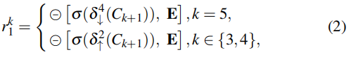

δ↓4和δ↑2分别表示×4降采样和×2上采样操作。

σ(x) = 1/（1 + e−x）是sigmoid函数，它用于将掩码转换为区间[0,1]。

是一个从矩阵E中减去输入的反向操作，其中所有的元素都为1。

**Group Guidance Operation (GGO)**

如[7]所示，通过从侧输出特征中擦除现有的估计目标区域，使用反向注意来挖掘互补区域和细节。受[69]的启发，我们提出了一种新的群体式操作，以更有效地利用反向指导先验。

如图14 (a)所示，组引导操作分为两个主要步骤。

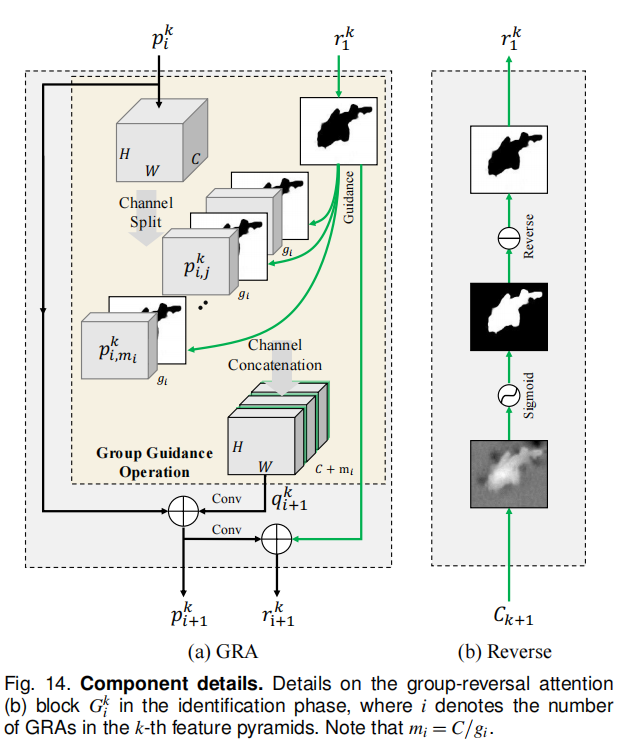

首先，我们将候选特征$\{p^k_i∈R^{H/2^k×W/2^k×C}，k=3,4,5\}$沿通道维度划分为多个（即mi = C/gi）组，其中i=1、2、3和gi表示处理特征的组大小。

然后，在分割特征$p^k_i,j ∈R^{H/2^k×W/2^k×g_i},i∈{1,2,3},j∈{1,...,m_i},k∈{3,4,5}$之间周期性地插值制导先验$r_1^k$

因此，此操作（即，$q^k_{i+1} = F^{GGO}[p^k_i ，r^k_i；m_i]$）可以通过以下两个步骤进行解耦：

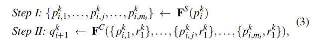

其中，$F_S$和$F_C$表示候选者的通道级分裂和连接函数。请注意，$F^{GGO}： p^k_i∈R{H/2^k×W/2^k×C}→q^k_{i+1}∈R^{H/2^k×W/2^k×（C+m_i）}$，其中k∈{3,4,5}。

相比之下，[7]更强调确保候选人特性直接乘以先验，这可能导致两个问题： 

​	a)特性混淆由于网络的鉴别能力有限，

​	b)简单的乘法引入了真实和错误的指导先验，因此容易积累不准确。

与[7]相比，我们的GGO可以在后续的细化过程之前明确地分离出指导先验特征和候选特征。

**Group-Reversal Attention (GRA).**

最后，我们介绍了在反向指导和小组指导操作的帮助下，将剩余学习过程，称为GRA块。根据以往的研究，[59]，[60]，多阶段细化可以提高性能。

因此，我们结合多个GRA块（例如，$G^k_i$，i∈{1,2,3}，k∈{3,4,5}），通过不同的特征金字塔逐步细化粗预测。总的来说，每个GRA块都有三个残余的学习过程：

i)我们通过组引导操作结合候选特征$p^k_i$和$r_1^k$，然后利用残差阶段生成细化的特征$p^k_{i+1}$。这种方法的定义如下：

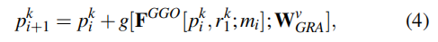

Wv表示具有3×3核的卷积层，然后是批处理归一化层，以将信道数从C +mi减少到C

请注意，在默认实现中，我们只在第一个GRA块（即，当i=1时）中反转之前的指导。详细讨论详见第5.3节。

ii)然后，我们得到一个单通道残差引导：

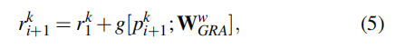

它是由可学习的权值Ww GRA参数化的

iii)最后，我们只输出细化后的引导，作为残差预测。其表述为：

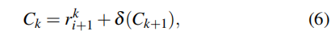

δ（·）在k = {3,4}时为δ↑2，在k = 5时为δ↓4。

## **4.4 Implementation Details**

### *4.4.1 Learning Strategy*

我们的损失函数被定义为

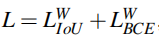

 $L^W_{IoU}$和$L^W_{BCE}$表示全局限制和局部（像素级）限制的加权交叉过并（IoU）损失和二进制交叉熵（BCE）损失。

与在分割任务中广泛采用的标准IoU损失不同，加权IoU损失增加了硬像素的权重，以突出其重要性。

此外，与标准的BCE损失相比，$L^W_{BCE}$更关注硬像素，而不是分配所有像素相等的权重。

这些损失的定义与在[59]、[70]中得到的定义相同，其有效性已在显著性目标检测领域得到了验证

在这里，我们对三个侧输出（即C3、C4和C5）和全局mapC6采用了深度监督。

每个地图都被向上采样（例如，C3以上）到与地面真实地图g相同的大小。因此，建议的SINet的总损失可以表述为：

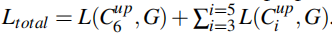

### *4.4.2 Hyperparameter Settings*

SINet用PyTorch实现，并使用Adam优化器[71]进行训练。

在训练阶段，批量大小设置为36，学习速率从1e-4开始，除以每50个时代10个。整个训练时间在100个时代中只有4个小时左右。运行时间是在一个Intelr i9-9820X CPU @3.30GHz×20平台和一个NVIDIA巨头RTX GPU上测量的。在推理过程中，每幅图像被调整到352×352，然后输入所提议的管道，以获得最终的预测，无需任何后处理技术。在一个没有I/O时间的单一GPU上，推理速度是∼45fps。源代码的PyTorch [72]和Jittor [73]版本都将被公开使用。

# 5 COD BENCHMARK

## **5.1 Experimental Settings**

### *5.1.1 Evaluation Metrics*

平均绝对误差（MAE）被广泛应用于SOD任务中。继Perazzi等人[83]之后，我们还采用MAE (M)度量来评估预测地图和地面真相之间的像素级精度。然而，虽然MAE指标对评估错误的存在和数量很有用，但它并不能确定错误发生在哪里。

最近，Fan等人提出了一种基于人类视觉感知的电子测量（Eφ）[74]，该方法可以同时评估像素级匹配和图像级统计数据。这个度量自然适合于评估隐藏目标检测结果的总体和局部精度。.请注意，我们在实验中报告的平均Eφ。

由于隐藏的物体通常包含复杂的形状，COD还需要一个可以判断结构相似性的度量标准。因此，我们使用s-度量（Sα）[84]作为我们的结构相似性评估度量。

最后，最近的研究[74]，[84]表明，加权f-measure[85]（Fβw）[85]比传统的Fβ可以提供更可靠的评价结果。因此，我们进一步认为这是COD的一个替代度量。我们的一键式评估代码也可以在项目页面上找到。

## **5.2 Results and Data Analysis**

本节分别提供了变色龙、CAMO和COD10K数据集的定量评价结果。

**Performance on CHAMELEON.**

从表2来看，与12个SOTA目标检测基线和ANet-SRM相比，我们的SINet在所有指标上都实现了新的SOTA性能。请注意，我们的模型不应用任何辅助边缘/边界特征（例如，EGNet [12]，PFANet [81]），预处理技术[86]，或后处理策略，如[87]，[88]。

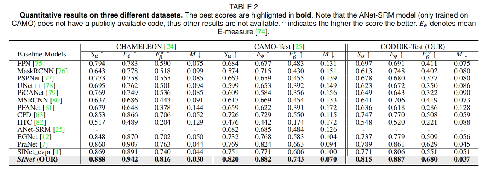

**Performance on CAMO.**

我们还在CAMO [25]数据集上测试了我们的模型，其中包括各种隐藏的对象。根据表2中报告的总体性能，我们发现CAMO数据集比变色龙更具挑战性。同样，SINet获得了最好的性能，进一步证明了其鲁棒性。

**Performance on COD10K.**

通过我们的COD10K数据集的测试集（2,026张图像），我们再次观察到，所提出的SINet始终优于其他竞争对手。这是因为它专门设计的搜索和识别模块可以自动学习从粗到细的丰富多样的特征，这对于克服对象边界中具有挑战性的歧义至关重要。结果如表2和表3所示。

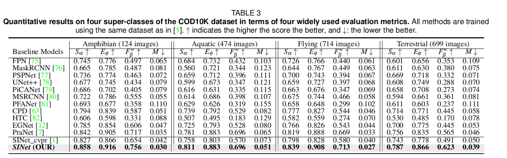

**Per-subclass Performance.**

除了对我们的COD10K数据集进行总体定量比较外，我们还在表4中报告了每个子类的定量结果，以为未来的研究人员调查模型的利弊。

在图15中，我们另外显示了每个子类在所有基线上的最小值、平均值和最大值的s测量性能。最简单的子类是“松鸡”，而最困难的是“叶海龙”，分别来自水生和陆生类别。

**Qualitative Results.**

我们在补充材料中展示了我们的会议版本模型（SINet cvpr）对各种具有挑战性的隐蔽物体，如蜘蛛、蛾、海马和蟾蜍。

如图16所示，与SINet cvpr相比，SINet在不同的照明（第1行）、外观变化（第2行）和不可定义的边界（第3行到第5行）方面进一步改善了视觉结果。PFANet [81]能够定位隐藏的对象，但输出总是不准确的。通过进一步使用反向注意模块，PraNet [7]在第一种情况下实现了比PFANet相对更准确的位置。然而，它仍然忽略了物体的细节，特别是在第二排和第三排的鱼。对于所有这些具有挑战性的情况，SINet能够用更精细的细节来推断出真实的隐藏对象，从而展示了我们的框架的鲁棒性

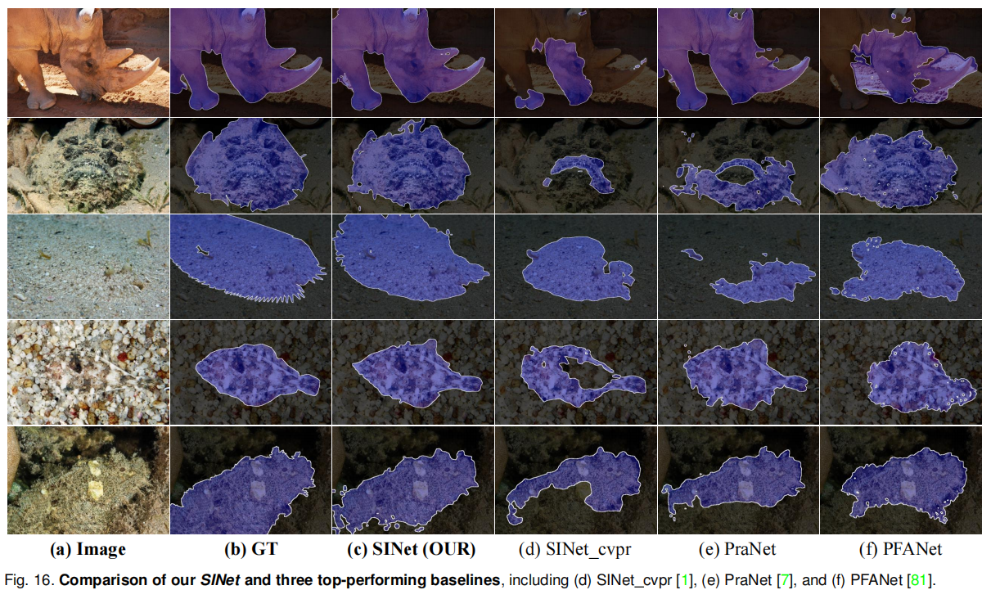

**GOS** **vs.** **SOD Baselines**

一个值得注意的发现是，在前3个模型中，GOS模型（即FPN [75]）比SOD的竞争对手CPD [63]、EGNet [12]表现更差，这表明SOD框架可能更适合于扩展到COD任务。与GOS [75]，[76]，[77]，[78]，[80]，[82]模型和SOD [12]，[63]，[79]，[81]模型相比，SINet显著减少了训练时间(如SINet： 4小时vs。EGNet： 48小时)，并在所有数据集上实现SOTA性能，表明它们是很有前途的COD问题的解决方案。由于空间有限，与现有的SOTA SOD模型进行充分比较超出了本文的范围。请注意，我们的主要目标是为未来的工作提供更一般的观察结果。更新的SOD模型可以在我们的项目页面中找到。

**Generalization**

数据集的通用化性和难度在训练和评估不同的算法[35]中都起着至关重要的作用。因此，我们对现有的COD数据集进行研究这些方面，使用跨数据集分析方法[90]，即在一个数据集上训练一个模型，并在其他数据集上进行测试。我们选择了两个数据集，即CAMO [25]和我们的COD10K。在[35]之后，对于每个数据集，我们随机选择800张图像作为训练集，200张图像作为测试集。为了进行公平的比较，我们在每个数据集上训练SINet cvpr，直到损失稳定为止。

表5提供了跨数据集泛化的s-度量结果。每一行列出了一个在一个数据集上训练并在所有其他数据集上测试的模型，表明了用于训练的数据集的通用性。每一列显示了一个在特定数据集上测试并在所有其他数据集上训练的模型的性能，表明了测试数据集的难度。请注意，训练/测试设置与表2中使用的设置不同，因此性能不具有可比性。正如预期的那样，我们发现我们的COD10K比CAMO具有更好的泛化能力（例如，最后一栏“Drop↓：-6.0%”）。这是因为我们的数据集包含了各种具有挑战性的隐藏对象（第3节）。因此，我们可以看到，我们的COD10K数据集包含了更具挑战性的场景。

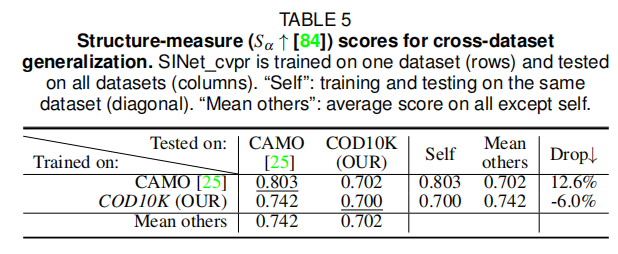

## **5.3 Ablation Studies**

我们现在提供了关于变色龙、CAMO和COD10K的建议SINet的详细分析。我们通过解耦各种子组件来验证其有效性，包括NCD、TEM和GRA，如表6所示。请注意，在每个消融变体的再训练过程中，我们保持了第4.4节中提到的相同的超参数

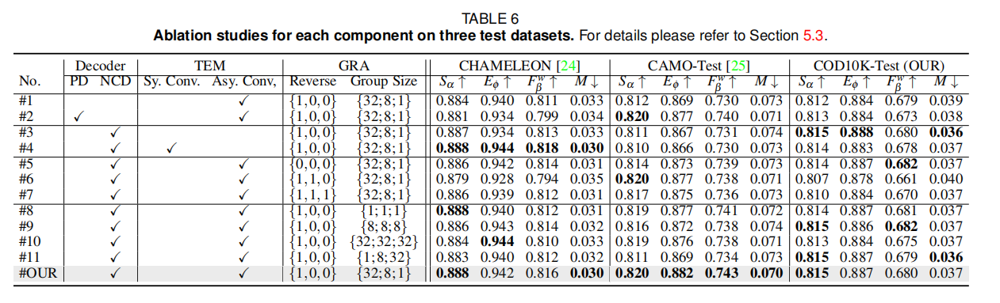

**Effectiveness of NCD**

我们探讨了解码器在我们的SINet的搜索阶段的影响。为了验证其必要性，我们在没有NCD（#1）的情况下对网络进行再训练，发现与#OUR（表6中的最后一行）相比，NCD归因于提高CAMO的性能，将平均Eφ得分从0.869提高到0.882。此外，我们用部分解码器[63]（即第#2号的PD）替换了NCD，以测试该方案的性能。与#2和#我们的设计相比，我们的设计可以稍微提高性能，使变色龙的Fβ w增加了1.7%

如图17所示，我们在改进的类似unet的解码器（去除底部的两个高分辨率层）之前提出了一种新的特征聚合策略，称为NCD，相邻层之间有邻居连接。这种设计的动机是，高级特征优于语义强度和定位精度，**但为目标对象引入了噪声和模糊的边缘。**

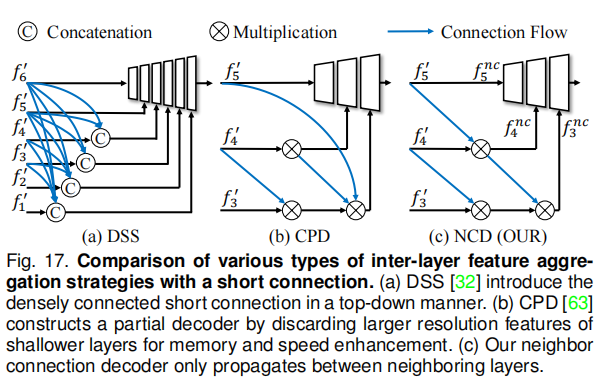

我们的NCD通过邻居连接利用语义上下文，而不是通过短连接[32]的紧密连接层广播语义上下文，提供了一种简单而有效的方法来减少不同特征之间的不一致性。通过短连接[32]聚合所有特性会增加参数。这是DSS（图17 a）和NCD之间的主要区别之一。

与CPD[63]（图17 b）相比，它忽略了在f '5和f'4之间的特性透明度，NCD更有效。

**Effectiveness of TEM.**

我们提供了两种不同的变体：没有TEM的(a)（编号#3）和带有对称卷积层[64]的(b)（编号#4）。

与No.#3相比，我们发现具有非对称卷积层（No.#我们的TUR）的TEM对于提高CAMO数据集的性能是必要的。

此外，用非对称卷积层（No.#OUR）替换标准对称卷积层（No.#4）对网络的学习能力影响不大，同时进一步将CAMO数据集的平均Eφ从0.866提高到0.882。

**Effectiveness of GRA.** 

(1)Reverse Guidance.

如表6的“反向”列所示，{\*，\*，*}表示在每个GRA块$G^k_i$之前，引导是否反向（见图14 (b))。

例如，{1,0,0}意味着我们只反转第一个块（即$r_1^k$）中的引导，而其余两个块（即$r^k_2$和$r^k_3$）没有反向操作。

我们研究了GRA中反向引导的贡献，包括三个选择：

- 没有任何反向的(a)，即#5的{0、0、0}，
- (b)反转前两个$r_i^k, i∈{1、2}$，即#6的{1、1、0}，
- 以及(c)反转所有$r_i^k, i∈{1、2、3}$，即#7的{1、1、1}。

与SINet的默认实现（即#我们的{1,0,0}）相比，我们发现只有反转第一个引导可以帮助网络从两个角度（即注意和反向注意区域）挖掘多元化表示，而在中间过程中多次引入反向引导可能会在学习过程中造成混淆，特别是在变色龙和COD10K数据集上的设置#6。

(2)*Group Size of GGO*

如表6的“组大小”列所示，{∗；∗；∗}表示从第一个块$G^k_1$的GGO到最后一个块$G^k_3$的特征切片的数量（即组大小gi）。

例如，{32；8；1}表示我们在每个GRA块$G^k_i ，i∈{1、2、3}$上将候选特征$p^k_,i∈{1、2、3}$分别划分为32、8和1个组大小。

在这里，我们讨论了选择组规模的两种方法，即统一策略（即{1；1；1}的#8、{8；8；8}的#9、{32；32；32}的#10）和渐进策略（*{*1; 8; 32*}* 的 #11 ， *{*32; 8; 1*}* 的#OUR）。

我们观察到，我们基于渐进策略的设计可以有效地保持网络的通用化，与其他变量相比，提供更令人满意的性能。

