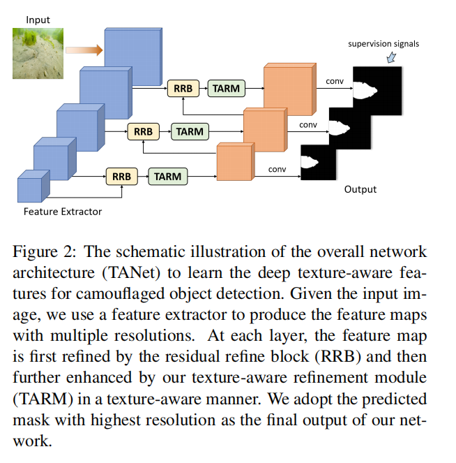
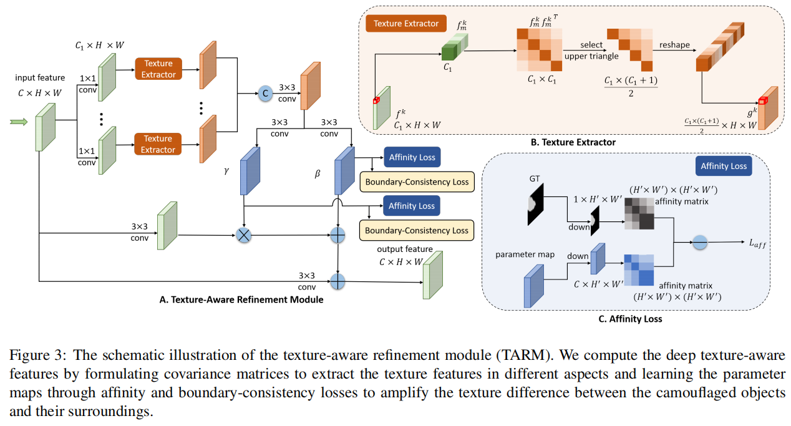
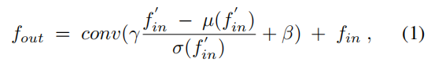
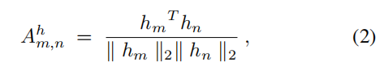
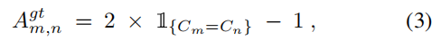
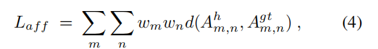
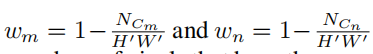
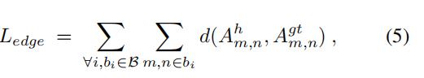

# **Deep Texture-Aware Features for Camouflaged Object Detection**

伪装物体检测是一项具有挑战性的任务，旨在识别与周围环境具有相似纹理的物体。

本文通过构建多个纹理感知细化模块，学习深度卷积神经网络中的纹理感知特征，以放大伪装对象与背景之间的细微纹理差异，用于伪装对象检测。

纹理感知细化模块计算特征响应的协方差矩阵提取纹理信息，设计一个亲和力损失学习一组参数映射帮助分离伪装对象之间的纹理和背景，并采用边界一致性损失来探索对象细节结构。

我们评估我们的网络上的基准数据集的伪装目标检测定性和定量。实验结果表明，我们的方法的性能大大优于各种最先进的方法。

# **1. Introduction**

在自然界中，动物试图通过调整它们身体的纹理与周围环境的纹理来隐藏自己，这有助于帮助它们避免被捕食者识别。该策略很容易欺骗视觉感知系统[34]，目前的视觉算法可能无法区分伪装的物体和背景。

因此，伪装目标检测[7]一直是一个巨大的挑战，解决这个问题可以有利于计算机视觉中的许多应用，如息肉分割[8]、肺部感染分割[9,36]、逼真的混合[11]和娱乐艺术[4]。

为了解决这个问题，Fan等人[7]收集了第一个用于伪装对象检测的大规模数据集。该数据集包括10,000张包含超过78个对象的图像在各种自然场景中大量学习，这使得应用深度学习算法来学习从大数据中识别伪装的物体成为可能。伪装对象通常具有与周围环境相似的纹理，而为一般对象检测[28,27,12,2,40,29,3]和显著对象检测[42,41]设计的深度学习算法在这种困难的情况下通常不能很好地检测伪装对象。

近年来，基于深度神经网络的标记目标检测算法被提出。SINet [7]首先采用搜索模块寻找伪装物体的候选区域，然后使用识别模块精确检测伪装起来的物体。ANet [19]首先利用分类网络来识别图像中是否包含伪装对象，然后采用全卷积网络进行伪装对象分割。然而，由于其相似的纹理，这些算法仍然可能误解伪装的物体为背景。

纹理指的是在自然图像中，视觉原语如何按空间组织的一种特殊方式[？]。本质上，伪装的物体和背景之间的纹理有细微的不同。如图1 (a)所示，鱼的纹理是致密和小的白色颗粒和棕色区域的组合，而背景的纹理是白色和棕色区域的组合。在此基础上，我们通过从深度神经网络中学习纹理感知特征，来放大伪装物体与背景之间的纹理差异，从而提高伪装物体的检测性能；见图1 (c)-(e)。

为了实现这一点，我们设计纹理感知细化模块（TARM）在深度神经网络，我们首先计算的协方差矩阵特征响应来提取纹理信息的卷积特征，然后学习一组亲和力函数放大纹理伪装对象和背景之间的差异。此外，我们在TARM中设计了一个边界一致性损失算法，通过在高分辨率特征图上跨边界重新访问图像斑块来提高分割质量。

之后，我们在深度网络（TANet）中采用多重TARMs的方法来学习不同层次的深度纹理软件特征，并预测每层的检测地图的伪装目标检测。

最后，我们定性和定量地比较了我们的方法与13种最先进的方法，设计用于伪装目标检测、显著目标检测和语义分割的基准数据集，显示了我们的网络的优越性。

我们总结了这项工作的贡献：

首先，我们设计了一个新的纹理感知细化模块（TARM）来放大伪装对象和背景之间的纹理差异，从而显著增强了伪装对象的识别。

其次，我们设计了一个边界一致性损失，以增强跨边界的细节信息，而在测试中没有额外的计算开销

第三，我们在基准数据集上评估我们的网络，并将其与13种最先进的伪装对象检测、显著目标检测和语义分割方法进行比较。定性和定量结果表明，我们的方法大大优于以往的方法。

# **2. Related Work**

**Camouflflaged object detection.**

早期的凸边框对象检测（COD）工作采用了各种手工制作的特征，如颜色[15,31]、凸强度[35]、edge [31]和纹理[1,17]。近年来，深度卷积神经网络在大规模伪装对象数据集[32,19,7]的帮助下取得了巨大的成功。SINet [7]通过搜索模块找到了伪装对象的候选区域，并通过识别模块精确检测到伪装对象。ANet [19]首先通过分类网络识别出包含伪装对象的图像，然后采用全卷积网络对伪装对象进行分割。然而，这些方法并没有考虑到伪装的物体和背景之间的细微的纹理差异，并且在复杂的情况下可能无法检测到伪装的物体。

**Salient object detection and semantic segmentation.**

显著目标检测（SOD）预测一个二进制掩码来表示显著性区域，而语义分割（SS）的目标是生成带有类别标签的掩码，以识别具有不同类别的图像区域。为SOD [21,26,37,41,42]和SS [12,43,40,2,14]设计的基于深度学习的方法可以通过在伪装对象数据集上进行再训练来进行伪装目标检测，并将我们的网络与这些在基准数据集上进行伪装目标检测的方法进行了比较；见第4节。

# **3. Methodology**

图2显示了具有纹理感知细化模块（TARM）的整体网络架构（TANet）。针对输入图像，采用特征提取器提取多分辨率的特征图，然后利用残差细化块（RRB）对不同层的特征图进行细化，以增强细节，去除背景噪声

由于内存占用，我们忽略在第一层细化特性映射。接下来，我们介绍了纹理软件细化模块（TARM）来学习纹理软件的特性，这有助于提高伪装物体的可见性。最后，我们通过添加多层监督信号来预测二元掩模来表示每一层的伪装物体

在下面的小节中，我们将详细阐述纹理感知细化模块（第3.1节），在第3.2节中介绍训练和测试策略，并在第3.3节中可视化学习到的纹理感知特征。

## **3.1. Texture-Aware Refifinement Module**

如图1所示，伪装后的物体与周围环境具有相似的纹理。然而，在伪装后的物体和背景之间仍然存在着细微的纹理差异。因此，我们提出了一个纹理软件细化模块来提取纹理信息，放大伪装对象和背景的纹理差异，从而提高了伪装对象检测的性能。

### **3.1.1 Architecture**

图3显示了所提出的文本软件细化模块的架构。首先，以分辨率C×H×W作为输入的特征图，然后使用1×1内核的多个卷积操作获得多种特征图[33]，每个以C1×H×W的大小。注意C1比C小，这些特征图用于学习以下操作中纹理的多个方面。

接下来，我们计算每个位置的特征通道之间的协方差矩阵，以捕获卷积特征上的不同响应之间的相关性。

特征间的协方差矩阵度量特征的共现性，描述特征的组合，并用于表示纹理信息[16,10]。

如图3(b)所示，对于特征映射$f^k∈C_1×H×W$上的每个像素$f^k_m$，我们计算其协方差矩阵作为$f^k_m$和${f^k_m }^T$之间的内积。由于协方差矩阵（C1×C1）具有对角对称性，我们只采用该矩阵的上三角形来表示纹理特征，并将结果重塑为特征向量。

我们对特征图上的每个像素执行相同的操作，并将结果连接起来，得到包含纹理信息的$g^k∈\frac {C_1×（C_1+1）}2×H×W$。

然后，我们用3×3卷积法融合所有从不同特征映射计算出的协方差矩阵。

然后，我们采用纹理特征的两组3×3卷积来学习两个参数映射$γ∈C'×H×W$和$β∈C'×H×W$（C '表示通道数），通过调整输入特征fin [13,24]的纹理来放大伪装物体及其周围环境的纹理差异。

最后，我们通过以下方法得到输出特征结果：

fin是输入图像，in’是经过3×3卷积提取的特征图，µ和σ是其均值和方差，fconv是一个3×3卷积。

最后，我们将原始的特征图与由上述操作细化的特征图一起添加，作为纹理感知细化模块的输出

### **3.1.2 Loss Function**

**Affifinity loss.**

为了使参数映射γ和β捕捉伪装对象和背景之间的纹理差异，我们在γ和β上采用亲和损失[39]来明确地放大它们的纹理特征之间的差异。如图3 (c)所示，我们首先使用池化操作对参数图进行降采样，然后计算位置m，n处的亲和矩阵Ahm，n：

hm和hn是降采样映射的参数向量。Ah是捕获成对纹理相似度的结果矩阵。

接下来，我们通过以下方法计算地面真实亲和矩阵Agt：

11是一个指标，当位置m和n的标签（Cm和Cn）相同时，它等于1，否则它等于零。

在自然图像中，伪装的物体通常占据小区域，我们将亲和力损失表示来解决类不平衡问题：

NCm和NCn是与像素m和n具有相同类标签的像素数；H0和W0是参数贴图的高度和宽度。从这个损失函数中，我们可以看到参数贴图将学习最大化纹理差异，

**Boundary-Consistency Loss.**

卷积特征包含高度语义的特征，但由于参数映射的分辨率较小，往往会在伪装对象和背景之间产生模糊的边界。为了解决这一问题，我们提出了一个边界一致性损失边框，通过回顾跨边界区域的预测结果来提高边界质量：

bi是B中的第i个图像补丁，它包含了所有跨越边界的图像补丁，如图4所示。

当这些图像补丁包含属于不同类别的像素时，就会选择它们。请注意，与亲和损失不同，Ledge是在参数映射上执行的，而没有降采样操作，具有更高分辨率的参数映射有助于为边界预测提供更详细的信息。在训练过程中额外的内存消耗是合理的，因为我们只考虑小补丁内的亲和关系，而在测试过程中没有引入额外的计算时间。图5中的比较结果表明，我们的边界一致性损失的方法更好地保留了伪装对象的详细结构。