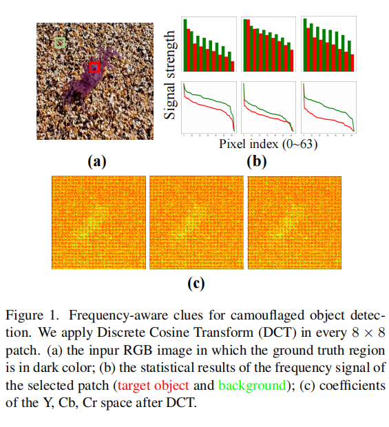

# **Detecting Camouflflaged Object in Frequency Domain**

伪装物体检测（COD）旨在识别完美嵌入在其环境中的物体，这在医学、艺术和农业等领域有各种下游应用。然而，用人眼的感知能力来识别伪装起来的物体，却是一项极具挑战性的任务

因此，我们认为COD任务的目标不仅是在一个单一的RGB领域中模仿人类的视觉能力，而且是超越了人类的生物视觉。然后，我们引入频域作为一个额外的线索，以更好地从背景中检测伪装的物体。为了很好地将频率线索纳入CNN模型，我们提出了一个具有两个特殊组件的强大网络。我们首先设计了一种新的频率增强模块（FEM）来挖掘频域中伪装物体的线索。它包含了离线离散余弦变换，然后是可学习的增强。

然后利用特征对齐的方法融合了RGB域和频域的特征。此外，为了进一步充分利用频率信息，我们提出了高阶关系模块（HOR）来处理丰富的融合特征。在三个广泛使用的COD数据集上进行的综合实验表明，该方法的性能显著优于其他最先进的方法。

# **1. Introduction**

为了检测和分割完美嵌入到环境中的目标，相机折叠目标检测（COD）已经在计算机视觉社区[9,17,59]中流行起来。作为一个初步的步骤，COD在各种视觉系统中起着重要的作用，如息肉分割[10]、肺部感染分割[11]和娱乐艺术[3]。

传统的方法[17,37,41]通过利用手工制作的低级特征来检测伪装的物体，因此这些方法在复杂的场景中经常失败。近年来，随着深度卷积神经网络（CNN）的应用，基于CNN的方法将COD的性能推到了一个新的水平。一些方法[8,40]尝试设计纹理增强模块或采用注意机制来引导模型关注伪装区域。方法试图利用额外的边缘信息[59]准确地定位伪装的对象。在[33]中，引入了新的监督数据来分割伪装的对象。在最近的工作中，[35]试图将分割伪装的物体视为一个两个阶段的过程。

放弃了这些复杂的技术，我们简单地使用类似于Res2Net [13]和ResNet50骨干的U-Net50[16]的网络来检测伪装的物体。，

从表1中可以看出，与现有的最先进的（SOTA）方法相比，只使用U-Net网络已经可以实现具有竞争力的性能，特别是在更大的数据集上（以3个指标实现SOTA性能），这表明现有的SOTA方法可能不能很好地处理COD任务

所有这些SOTA COD方法都有一个共同的特征：它们只是通过复杂的技术来加强图像的RGB域信息。然而，根据生物学和心理学[36]的研究，捕食者频率依赖的捕食者在将目标动物与背景分离时，利用了它们与特定特征结合的感知过滤器[21]。在处理视觉场景时，动物比人类有更多的波段，这使得人类视觉系统（HVS）[4,43]很难发现伪装的物体。在本研究中，我们认为COD任务的目标不仅是在单一RGB域的人类视觉能力，而是超越人类生物视觉。因此，为了更好地从背景中检测出伪装起来的物体，还需要一些图像中的其他线索（例如，频域中的线索）。

正如在之前的工作[51]中所描述的，CNN有潜力利用人类无法感知的各种频率图像成分。本文要解决的第一个问题是如何将频率感知线索纳入CNN模型。为了了解更多的统计信息，并增强关于频域伪装物体的线索，我们设计了一个频率增强模块（FEM）。它包括离线离散余弦变换和在线可学习增强，然后是特征对齐，以融合来自RGB和频域的特征。

.此外，我们提出了一种新的频率损耗来直接限制频率，并引导网络更多地关注频率信号。从图1(a)中可以看出，“红框”表示目标对象，“绿框”表示背景。目标对象在背景中是隐蔽的。在RGB域中，目标对象很难被看到。然而，在频域图1(c)中，捕获了有助于区分目标对象和背景的信息。当图像中存在噪声物体时，它们可以与伪装的物体一起被提取出来。为了区分真实的伪装对象，我们提出了高阶关系模块（HOR）。由于目标对象和噪声对象总是共享相似的结构信息，因此一个低阶关系不足以获得判别特征。

其主要贡献总结如下：据我们所知，我们是第一个声称COD任务应该超越RGB域，并引入频率线索来更好地检测伪装物体的人。

•我们提出了一个强大的网络与增强的COD任务的频率线索。

•我们设计了一个具有频率感知损失的频率增强模块（FEM）和一个高阶关系模块（HOR），以更好地利用频域信息进行密集预测任务。

•在三个广泛使用的COD数据集（变色龙、CAMO-Test和COD10-Test）上进行的综合实验表明，该方法大大优于其他最先进的方法。

## **2.3. Learning in the frequency domain**

频域中的压缩表示包含了用于图像理解任务的丰富模式。[14]从频域中提取特征，对图像进行分类。[5]提出了一种模型转换算法，将空间域CNN模型转换为频域。[56]避免了复杂的模型转换过程，并使用se块来选择频率信道。[39]设计了一个频率通道注意网络。尽管以往的方法在频域方面取得了成就，但如何建模频域和RGB域之间的相互作用关系进行密集预测的研究很少。与之前的工作不同，我们设计了一个可学习的增强模块，并对齐了RGB域和频域。因此，我们的方法可以更好地利用来自不同领域的丰富信息。

# **3. Method**

## **3.1. Network overview**

图2说明了所提议的网络。RGB输入被转换为频域，并通过频率增强模块（FEM）进行增强。然后将RGB和频率输入以RGB流和频率流分别输入网络。

特征对齐（FA）用于融合来自RGB和频域的这些特征。为了在特征中发现更细微的差异来区分伪装对象，在主网络中建立了高阶关系模块（HOR）。设x rgb∈RH×W×3表示rgb输入，其中H，W为图像的高度和宽度。从主干每一层的最后一个残差块得到的特征图可以视为{X1、X2、X3、X4}。

然后所有这些特征映射在跳过连接中进行处理，并以自下而上的方式进行解码。每个解码块由两个卷积层组成，然后是BN和ReLU。

## **3.2. Frequency enhancement module**

**Offlfline Discrete Cosine Transform**

在本部分中，首先通过DCT对输入的RGB图像进行处理，以利用频率信息。将xrgb转换为YCbCr空间（用x ycbcr∈RH×W×3表示）。然后，我们可以通过将x ycbcr分割成一组8×8补丁（在图像的滑动窗口上密集地进行DCT是进行JPEG压缩等频率处理的常见操作）上得到{p_c^{i，j} |1≤i，j≤H 8}。p c i，j∈R8×8表示某一颜色通道的补丁。每个补丁被DCT处理成频谱d c i，j∈R8×8，其中每个值对应于某一频带的强度。组相同频率的所有组件到一个通道，我们平频谱和重塑形成一个新的输入，按照补丁指数： x f请求o = x f请求我，j=扁平（迪，j），xf请求o∈R H 8×W8×192，di，j∈R8×8×3表示所有dc我，j。这样，我们就可以在一个补丁中重新排列排列曲折的信号，x f req o的每个通道都属于一个频带。因此，原始的颜色输入被转换到频域。

**Online learnable enhancement**.。图3描述了频域变换过程，其中图像被映射到频域，并通过一个可学习的模块进行增强，以发现隐藏在频率空间中的伪装物体的线索。在实践中，有各种伪装的对象和复杂的背景，固定的离线DCT可能不能很好地处理这一点。我们还需要一个适应性的学习过程来适应复杂的场景。因为在预处理过程中信息会丢失，如JPEG压缩。我们需要加强频率信号

我们从单个补丁内部和补丁之间构建了增强模块。采用传统的[45]方法，首先提高了局部频带的系数。我们将信号进行降采样并划分为两部分，低xfql和高信号xfrqh∈R96×k2，其中k表示大小。为了在相应的频段内增强信号，我们将它们分别输入两个多头自注意（MHSA）[50]，并将它们的输出连接起来，以恢复原始形状。

然后另一个MHSA调和所有不同的频带，新形成的信号表示x f req f。MHSA能够捕获输入特性中每个项目之间的丰富相关性。此时，与图像的不同频谱完全相互作用。对于DCT，补丁是相互独立的，上述过程只增强了一个补丁。为了帮助网络识别伪装物体的位置，我们需要在补丁之间建立连接

MHSA能够捕获输入特性中每个项目之间的丰富相关性。此时，图像的不同频谱完全相互作用。对于DCT，补丁是相互独立的，上述程序只增强了一个补丁。为了帮助网络识别伪装物体的位置，我们需要在补丁之间建立连接。

为了帮助网络识别伪装物体的位置，我们需要在补丁之间建立连接。所以我们首先重塑xf freq 为x s freq∈Rk2×C。

然后，我们使用MHSA对所有补丁之间的关系进行建模。最后，我们可以上采样并得到增强的频率信号x f req。

x rgb和x f req都被输入到网络。由于我们在每个地方应用单层MHSA，且频率信号的大小规模较小，因此不会带来较高的计算成本。