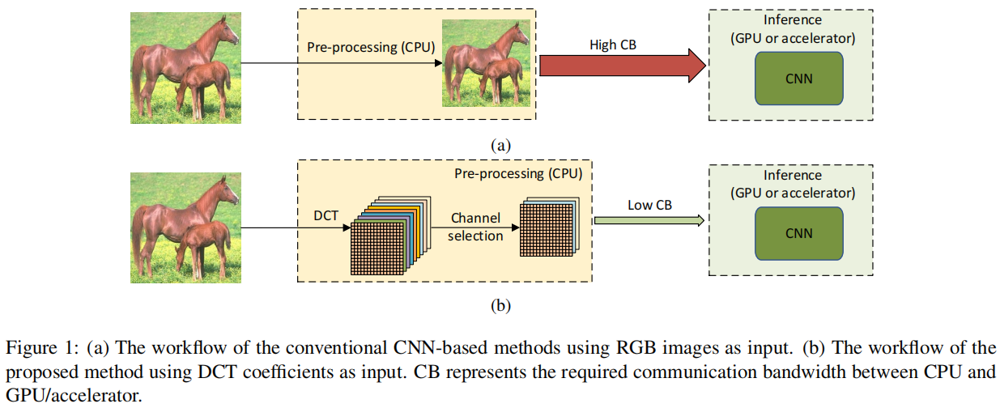
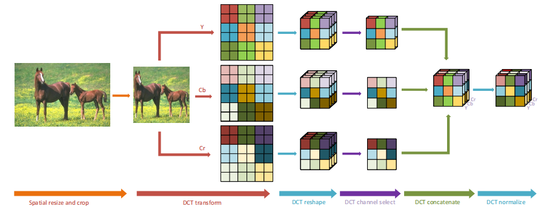
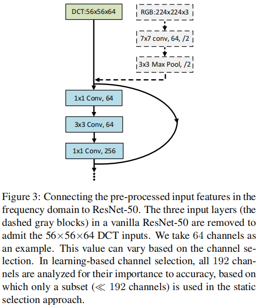

# Learning in the Frequency Domain

深度神经网络在计算机视觉任务中取得了显著的成功。

现有的神经网络主要在固定输入大小的空间域内运行。在实际应用中，图像通常是很大的，必须被降采样到神经网络的预定输入大小。

尽管降采样操作减少了计算量和所需的通信带宽，但它却被忽略地删除了冗余的和显著的信息，从而导致精度下降。

受数字信号处理理论的启发，我们从频率的角度分析了频谱偏差，并提出了一种基于学习的频率选择方法来可以在不受精度损失的情况下识别去除平凡频率分量。

所提出的频域学习方法利用了已知的神经网络的相同结构，如ResNet-50、MobileNetV2和Mask R-CNN，同时接受频域信息作为输入。

实验结果表明，采用静态信道选择方法的频域学习比传统的空间降采样方法具有更高的精度，同时进一步减小了输入数据的大小。

对于相同输入大小的ImageNet分类，该方法在ResNet-50和MobileNetV2上分别提高了1.60%和0.63%的前1位精度。即使有一半的输入大小，该方法在ResNet-50上的前1位精度仍然提高了1.42%。此外，我们观察到在COCO数据集上的分割上，Mask R-CNN的平均精度提高了0.8%

# 1. Introduction

卷积神经网络（CNNs）由于其在图像分类[1,2]、目标检测[3,4]、语义分割[5,6]等各种任务上的出色表现，已经使计算机视觉领域发生了革命性的变化。

受计算资源的限和内存限制，大多数CNN模型只接受低分辨率的RGB图像（例如，224⇥224）。然而，由现代相机产生的图像通常要大得多。例如，高清晰度（HD）分辨率的图像（1920⇥1080）被现代标准认为是相对较小的。甚至在ImageNet数据集[7]中的平均图像分辨率也是482⇥415，这大约是大多数CNN模型所接受的大小的4倍。因此，大部分的真实图像被积极地降低到224⇥224，以满足分类网络的输入要求。然而，图像缩小不可避免地会导致信息丢失和精度下降[8]。

[9,10]的目标是通过学习任务感知的缩小网络来减少信息损失。然而，这些网络是特定于任务的，需要额外的计算，这在实际应用中是不利的。在本文中，我们提出在频域对高分辨率图像的频域进行重构，即离散余弦变换（DCT）域，而不是在空间域进行调整大小，然后将重构后的DCT系数提供给CNN模型进行推断。

我们的方法不需要对现有的以RGB图像作为输入的CNN模型进行任何修改。因此，它是常规数据预处理管道的通用替代品。

我们证明，我们的方法在图像分类、目标检测和实例分割任务方面比传统的基于rgb的输入数据大小相同或更小的方法具有更高的精度。提出的方法导致直接减少所需的芯片间通信带宽，这往往是一个瓶颈在现代深度学习推理系统，也就是说，快速发展的人工智能加速器的计算吞吐量/gpu变得越来越高于cpu的数据加载吞吐量，如图1所示。

受观察到人类视觉系统（HVS）对不同频率分量[11]的敏感性不等的启发，我们分析了频域的图像分类、检测和分割任务，发现CNN模型对低频通道比高频通道更敏感 ，这和HVS是相同的。这一观察结果通过一种基于学习的信道选择方法得到验证，该方法包括多个“开关”。具有相同频率的DCT系数被打包为一个通道，每个开关被堆叠在一个特定的频率通道上，以允许整个通道流入或不流入网络

从数据传输和计算角度来看，使用解码的高保真图像进行模型训练和推断带来了重大挑战。由于CNN模型的频谱偏差，在推理过程中只能保留重要的频率信道而不失去精度。在本文中，我们还开发了一种静态信道选择方法来保持显著的信道，而不是使用整个频谱进行推断。实验结果表明，当输入数据大小减少87.5%时，CNN模型仍然保持了相同的精度。

本文的贡献如下：

- 我们提出了一种频域学习方法（使用DCT系数作为输入），它对现有的采用RGB输入的CNN模型无需进行任何修改。我们在ResNet- 50和MobileNetV2上验证了我们的方法用于图像分类任务，实例分割任务是掩码R-CNN用于实例分割任务。
- 我们表明，学习在频域中更好地保持图像信息在预处理阶段比传统的空间降采样方法（空间调整图像224⇥224，大多数CNN模型的默认输入大小），从而实现提高精度，即+ResNet-50+1.60%和+0.63%移动Net分类任务，+0.8%面具R-CNN目标检测和实例分割任务
- 我们从频率的角度分析了光谱偏差，结果表明CNN模型对低频通道比高频通道更敏感，类似于人类视觉系统（HVS）。
- 我们提出了一种基于学习的动态信道选择方法来识别在推理过程中静态去除的平凡频率分量。在ResNet-50上的实验结果表明，在ImageNet分类任务中，使用该信道选择方法可以修剪多达87.5%的频率信道，而没有或很少的精度降低。
- 据我们所知，这是第一个探索在频域学习的目标检测和实例分割的工作。对Mask R-CNN的实验结果表明，在COCO数据集上的实例分割任务中，在频域学习的平均精度提高了0.8%。

# 3. Methodology

在本文中，我们提出了一种通用的频域学习方法，包括数据预处理管道和输入数据大小剪枝方法

图1显示了我们的方法和传统方法的比较。在传统的方法中，高分辨率的RGB图像通常在CPU上进行预处理，并传输到GPU/AI加速器上进行实时推断。

由于RGB格式的未压缩图像通常很大，所以对CPU和GPU/AI加速器之间的通信带宽的要求通常很高。这样的通信带宽可能成为系统性能的瓶颈，如图1(a).所示为了降低计算成本和对通信带宽的要求，将高分辨率的RGB图像降采样到更小的图像上，这往往会导致信息丢失，从而降低推理精度。

在我们的方法中，高分辨率的RGB图像仍然在CPU上进行预处理。然而，它们首先被转换到YCbCr颜色空间，然后又被转换到频域。这与最广泛使用的图像压缩标准相一致，如JPEG。相同频率的所有分量都被分组到一个通道中。这样，就产生了多个频率信道。如第3.2节所示，某些频率通道对推断精度的影响大于其他频率通道。因此，我们建议只保留和传输最重要的频率通道到GPU/AI加速器进行推断。与传统方法相比，该方法需要更少的通信带宽，同时获得更高的精度。

我们证明了频域的输入特征可以应用于所有现有的空间域CNN模型，以最小的修改。具体来说，我们只需要删除输入的CNN层，并保留剩余的剩余块。使用第一残差层作为输入层，并修改输入通道的数量以拟合DCT系数输入的维数。因此，修改后的模型可以保持与原始模型相似的参数计数和计算复杂度。

基于我们的频域模型，我们提出基于学习的信道选择方法来探索给定的CNN模型的频谱偏差，即哪些频率分量对后续的推理任务提供更多的信息。这些发现促使我们对用于推理的简单频率分量进行修剪，这大大减少了输入数据的大小，从而降低了域转换的计算复杂度和所需的通信带宽，同时保持了推理的准确性。

## 3.1. Data Pre-processing in the Frequency Domain

数据预处理流程如图2所示。我们在空间域中遵循预处理和增强流程，包括图像的大小调整、裁剪和翻转（图2中的空间大小调整和裁剪）。然后将图像转换为YCbCr颜色空间，并转换为频域（图2中的DCT变换）。将相同频率下的二维DCT系数分组到一个通道中，形成三维DCT立方体（图2中的DCT重塑）。正如将在第3.2节中讨论的那样，我们选择了一个有影响的频率信道的子集（在图2中选择了DCT信道）。在YCbCr颜色空间中选定的通道被连接在一起形成一个张量（图2中的DCT连接）。最后，用训练数据集计算的平均值和方差进行归一化。

图2中的DCT重塑操作将二维DCT系数分组为三维DCT立方体。由于JPEG压缩标准在YCbCr颜色空间上使用了8x8 DCT变换，因此我们将所有8x8块中相同频率的分量分组为一个通道，并保持它们在每个频率上的空间关系。因此，每个Y、Cb和Cr组件提供8x8 = 64通道，每个频率一个，在频域内共有192个通道。假设原始RGB输入图像的形状为H⇥W⇥C，其中C = 3和图像的高度和宽度分别表示为H和W。转换到频域后，输入特征形状变为H/8⇥W/8⇥64C，保持相同的输入数据大小。

由于频域的输入特征映射在H和W维上更小，但在C维上比空间域对应的大，我们跳过传统CNN模型的输入层，这通常是步幅2卷积。如果一个最大池运算符立即跟随输入卷积（例如，ResNet-50），我们也跳过最大池运算符。然后，我们调整下一层的信道大小，以匹配频域内的信道数量。它如图3所示。这样，我们就可以最小限度地调整现有的CNN模型，以接受频域特征作为输入。

在图像分类任务中，CNN模型通常采用形状为224⇥224⇥3的输入特征，该特征通常从更高分辨率的图像中降采样。当在频域内进行分类时，可以取较大的图像作为输入。以ResNet- 50为例，频域中的输入特征连接到第一个剩余块，通道数调整到192，形成形状为56⇥56⇥192的输入特征，如图2所示。这是由大小为448⇥448⇥3的输入图像进行的DCT转换，该图像在空间域中保存的信息是224⇥224⇥3对应图像的4倍，代价是输入特征大小的4倍。同样，对于MobileNetV2模型，输入特征形状为112⇥112⇥192，从大小为896⇥896⇥3的图像中重塑。如第3.3节所述，可以在不牺牲精度的情况下修剪。频率通道修剪操作在图2中称为DCT通道选择。