# Segment, Magnify and Reiterate: Detecting Camouflaged Objects the Hard Way

从高度相似的环境中准确地探测到伪装起来的物体是一项艰巨的挑战。现有的方法主要采用单阶段检测方式，而忽略具有低分辨率细边缘的小对象比较大的对象需要更多的操作。为了解决伪装对象检测（COD）问题，我们受到人类注意力的启发，结合粗到细的检测策略，从而提出了一个迭代细化框架，称为SegMaR，它以多阶段检测的方式集成了**分段、放大和重复**。

具体地说，我们设计了一种新的鉴别掩模，使模型注视固定和边缘区域。此外，我们利用一个基于注意力的采样器来逐步放大物体区域，而不需要放大图像的大小。大量的实验表明，我们的SegMaR比其他最先进的方法取得了显著的和一致的改进。

特别是，我们在小伪装对象上平均超过标准评价指标，分别超过7.4%和20.0%。其他的研究为SegMaR提供了更有前途的见解，包括它在鉴别掩模上的有效性和它推广到其他网络架构。

# **1. Introduction**

伪装目标检测（COD）是一项旨在识别隐藏在背景[8,22,29]中的任何目标的任务。它在不同领域的许多应用，包括农业（如蝗虫检测以防止入侵）、艺术（如逼真的混合和娱乐艺术）和医学诊断（如息肉分割）。生物学和心理学研究表明，各种伪装策略很容易欺骗人类的视觉感知系统[38]，因为伪装后的物体总是具有与背景环境相似的视觉特征。

COD的主要困难是如何准确地区分图像中目标对象和背景之间的细微差别。

与传统方法[5,29,51]不同，最近的一些作品[4,7,8,20,28,45]利用复杂的深度学习技术[3,43,53]，在所有COD基准上取得了新的最先进的性能。尽管最新方法的定量性能看起来很有希望（例如，在COD10K测试集[8]上的Sα的0.80），但在COD方面的几个困难仍然没有得到解决。特别是，当一个特定的伪装物体只占整个图像的很小一部分时，要检测到物体周围的精确边缘就变得更加困难。例如，图1中第一列中的螃蟹，它的大小比背景中的海滩要小得多。不幸的是，现有的COD方法不能准确地检测到小型伪装物体

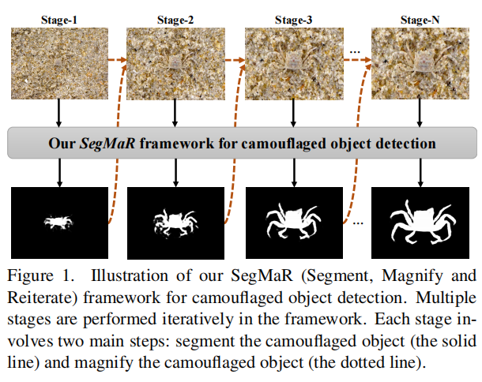

他们的检测和分割结果导致了对低分辨率和小物体的高偏差。一个主要原因是这些方法采用了单阶段的检测方式，但许多伪装的物体在第一次很难被检测到。事实上，当人类不能清楚地看到场景中的任何目标物体时，他们就会有意识地靠近目标，直到其分辨率大到足以进行视觉识别。

我们期望站在屏幕前的每个人都在用这种方式来观察图1中的小蟹。受这种人类行为的激励，我们的工作旨在解决一个研究问题：如何利用更多的阶段来逐渐发现更准确的伪装物体？

为此，我们提出了一种新的迭代细化框架，即SegMaR，它通过多阶段检测方式集成了分段、放大和重复，见图2。

首先，我们的方法建立了一个新的伪装分割网络来生成一个初始的掩模预测。接下来，一个对象放大步骤将原始图像和掩模预测作为输入，并利用一个基于注意力的采样器来自适应地放大伪装的对象。可以观察到，图像大小保持，而伪装对象在图像中占较大的比例。

此外，我们通过将放大对象的图像传递回同一网络，并对网络参数进行微调来运行迭代细化。经过更多的细化阶段之后，SegMaR能够细化和丰富检测到的细节，特别是对于小对象。

重要的是，SegMaR是一个统一和通用的框架，应适用于各种伪装分割网络。考虑到目标定位和边缘提取的重要性，我们主张对分割网络进行几种特殊的设计，以进一步提高COD性能。

特别地，我们引入了一个分心模块来分离前景和背景特征，以捕获更准确的边缘。

此外，我们还提出了一种新的非二元地面真相，称为判别掩模，它将固定和边缘注释结合在一起。除了基于二进制掩模的原始地面真相之外，我们的判别掩模使网络更多地关注与伪装物体相关的最重要的纹理和边缘。这项工作的贡献有三方面：

这项工作的贡献有三方面：

框架贡献：我们提出了SegMaR，它是第一个利用迭代细化框架来伪装对象检测。这项工作提高了人们对在多阶段检测方式中完成COD的重要性的认识。

网络贡献：我们实现了一个有效的伪装分割网络，它引入了一个分心模块来解开更好的目标特征。此外，我们提出了一种新的判别掩模，使网络关注最重要的对象区域

经验贡献：我们的SegMaR在三个COD基准上实现了新的最先进的性能，特别是对于小型伪装物体。此外，以往的COD网络很容易应用于SegMaR，并见证了显著的精度提高。

# **3. Segment, Magnify and Reiterate**

概述本节将介绍为COD设计的SegMaR框架。如图2所示，我们可以观察到SegMaR是一个以多阶段方式训练的迭代细化框架。首先，将输入的图像输入到一个伪装的分割网络中，以生成一个对伪装对象的掩模预测。然后将输入的图像及其掩模组合成一个基于注意力的对象放大模块，以便在保持图像大小的情况下放大对象。接下来，我们通过将放大对象的图像作为输入来重申分割过程。因此，伪装后的物体从背景环境中越来越容易被探测到（图1）。

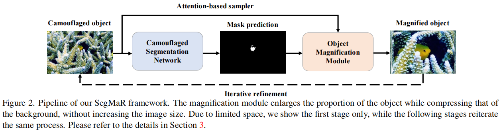

## **3.1. Camouflaged Segmentation Network**

与大多数相关作品[8,43]一样，我们的伪装分割网络是建立在一个双分支网络架构之上的，如图3所示。(1)对于第一个分支（如图蓝色所示），它由四个卷积块和一个生成掩码预测Pdis的鉴别解码器组成。(2)第二个分支（如绿色所示）在第一个分支中的第一个块之后添加了三个新的卷积块。一个二进制解码器负责推断COD的最终二进制掩码Pbin。此外，我们还鼓励使用第一个分支来帮助改善第二个分支的学习过程。为此，我们利用整体注意（HA）模块[43]，将第二卷积块的特征映射和第一分支的鉴别解码器的特征映射与第二分支进行合并。

[43] Zhe Wu, Li Su, and Qingming Huang. Cascaded partial decoder for fast and accurate salient object detection. In *CVPR*,pages 3907–3916, 2019. 1, 2, 3, 

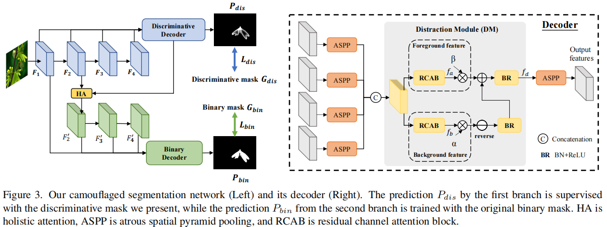

鉴别解码器和二进制解码器具有相同的网络结构，如图3所示。

[46]Maoke Yang, Kun Yu, Chi Zhang, Zhiwei Li, and Kuiyuan Yang. Denseaspp for semantic segmentation in street scenes.In *CVPR*, pages 3684–3692, 2018. 

**HA模块**

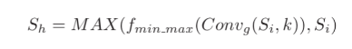

输入特征图首先是膨胀空间金字塔池（ASPP）模块[46]，膨胀率分别为Dr = 3、6、12、18。其目的是在图像中实现多尺度的感受域。然后将池映射连接在一起并传递到一个分散模块（DM）[55]。

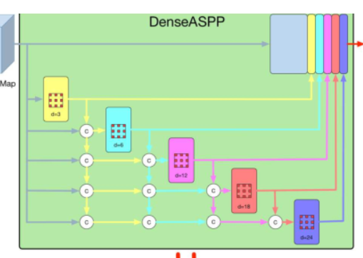

【55】Quanlong Zheng, Xiaotian Qiao, Ying Cao, and Rynson W. H. Lau. Distraction-aware shadow detection. In *CVPR*, pages 5167–5176, 2019. 3

DM是一种有效的将以前的特征图分别分离为前景特征和背景特征的有效技术。我们发现，这种能力对于识别伪装物体和背景环境之间的细微差异尤其重要。

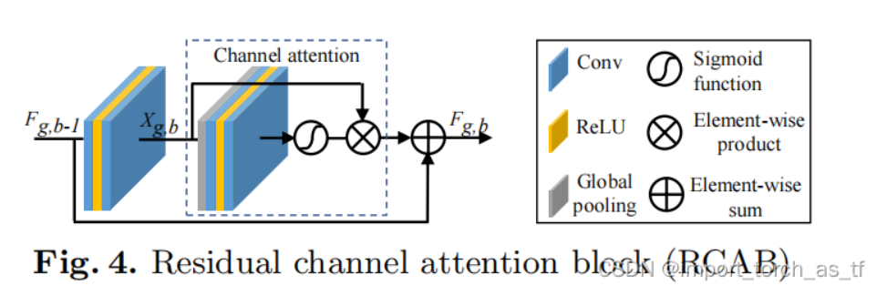

与[55]不同的是，我们通过添加两个并行的残差通道注意块（RCAB）[52]来定制DM模块，使模块更集中于特征图中的信息通道和高频信息（如边缘、纹理）。然后，我们使用元素减法来反转背景特征，并使用元素加法来增强前景特征。通过分心操作得到的输出特征fd由

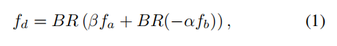

最后，在DM之后添加另一个ASPP组件来生成输出特性。

[52] Yulun Zhang, Kunpeng Li, Kai Li, Lichen Wang, Bineng Zhong, and Yun Fu. Image super-resolution using very deep residual channel attention networks. In *ECCV*, volume 11211, pages 294–310, 2018. 3

**Discriminative mask**

在野外，像面部或四肢这样的固定区域，是捕食者能够快速定位伪装的猎物的关键线索。此外，边缘区域也可能泄露伪装物体的位置，例如动物的毛发。因此，固定和边缘区域都是重要的，使伪装的物体可检测。通常，一个二进制掩模（即255：对象，0：背景）通常作为地面真相来训练COD模型，这意味着对象的所有区域的重量相等。然而，这种方式忽略了与对象相关的一些重要区域。尽管[25]最近的一项工作除了二进制掩码之外还添加了新的固定注释，但它们的固定注释有一些错误的区域溢出了对象区域。

为了解决这个问题，我们提出了一种更丰富的、非二进制的地面真值注释，称为判别掩模。除了原始的二进制掩码外，我们的判别掩码监督网络更多地注视固定和边缘区域。对于任何图像，我们基于二值掩模捕获其边缘标注，然后用高斯运算对边缘进行扩张。扩展的边缘捕获对象边界周围的更多信息。然后我们将固定注释和扩展边缘合并，得到一个附加掩模。最后，我们使用二进制掩码来减去溢出的固定区域。我们的鉴别掩模Gdis是通过

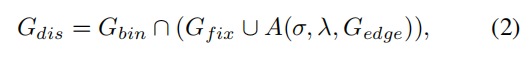

A（·）是具有高斯模糊σ = 15和核大小λ = 25的高斯函数。Gbin是基于地面真实值的二进制掩码，Gf ix和Gedge是固定和边缘注释。由于Gf ix是非二进制的，所以Gdis是一个从0到255的非二进制掩码。图4描述了计算鉴别掩模的过程。我们在图6中说明了一些区别掩模实例，它们对重要区域给予了更强的关注。

**Loss function**

伪装分割网络通过两个损失项端到端训练：鉴别损失Ldis和二值损失Lbin。Ldis表示Pdis和Gdis之间的损失成本，Lbin表示Pbin和Gbin之间的损失成本。我们采用[42]中的结构损失来计算Ldis和Lbin。

结构损失Lstr（P，G）增加了加权二值交叉熵（BCE）损失L w bce和IOU损失L w iou

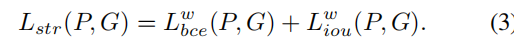

这种结构损失有利于在预测和地面真实值之间保持像素和全局限制。最后，我们总的损失函数是

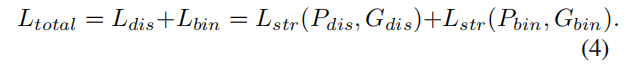

## **3.2. Attention based Object Magnification**

伪装物体通常占整个图像的很小比例，这使得很难准确检测物体边缘。由于人类总是更靠近目标，以便更清楚地观察它，我们建议在压缩背景信息的同时放大隐藏的物体，如图5所示。

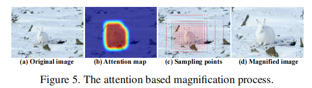

给定预测掩模Pbin，我们进一步将其扩展为一个注意图D，通过

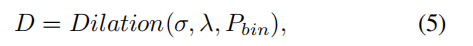

高斯模糊σ = 15和内核大小λ = 75。扩张操作的目的是扩大原有的预测区域，加强目标区域的完整性。

在图5的第二幅图像中，注意力图完全覆盖了该物体。然后我们基于注意力地图d采用一个基于注意力的采样算法[54]放大伪装对象。利用注意图计算原始图像与采样图像的坐标之间的映射函数，注意值较大的区域更有可能被采样。

首先将注意映射分解为二维，通过计算注意映射D在x轴和y轴上的最大值得到边际分布

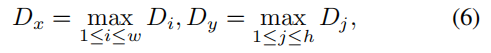

给定原始图像I，采样函数采样pler（I，D）定义为

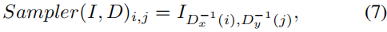

D−1（·）表示D（·）的逆函数。图5显示了注意图中具有高值的区域被密集采样和放大，其形状不变。

[54]Heliang Zheng, Jianlong Fu, Zheng-Jun Zha, and Jiebo Luo. Looking for the devil in the details: Learning trilinear attention sampling network for fine-grained image recognition. In *CVPR*, pages 5012–5021, 2019. 2, 3, 5

## **3.3. Iterative Refinement**

SegMaR的主要优点是通过以多阶段的方式重播片段和放大步骤来进行迭代细化。如图1所示，伪装的螃蟹在各个阶段的增加分辨率中变得更容易被探测到。在训练期间，所有的阶段共享相同的网络参数。此外，我们使用相同的超参数，如高斯模糊和核大小来进行对象放大。当两个连续阶段之间的损失差异变得微妙时，迭代细化将终止。算法1总结了SegMaR框架中的训练步骤。

在测试周期方面，我们需要将最终的掩模预测Pbin恢复到原始对象的大小，以便其与测试图像的地面真实值对齐。我们利用了等式的反向抽样(7)策略，记为Rsampler（·）。恢复后的掩模预测表示为采样器（Pbin）。