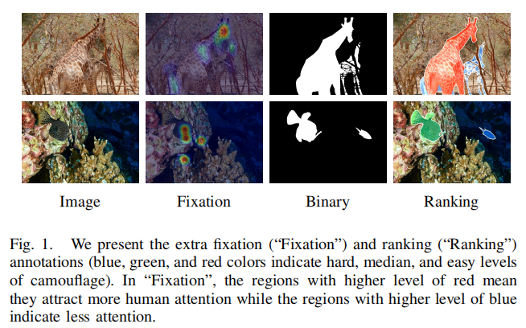
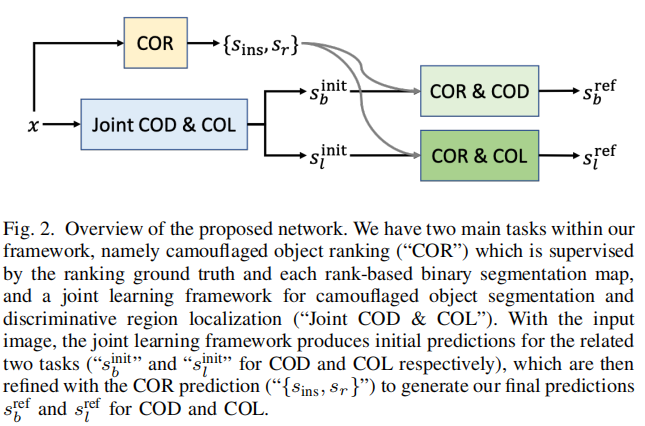

# Towards Deeper Understanding of Camouflflaged Object Detection

野生的猎物进化成伪装，以避免被捕食者识别。通过这种方式，伪装作为一种跨物种的关键防御机制，对生存至关重要。

为了对伪装对象进行检测和分割的整个范围，引入了伪装对象检测（COD）作为二进制分割任务，用二进制地面真实伪装图表示伪装物体的精确区域。

在本文中，我们重新讨论了这个任务，并认为二值分割设置不能完全理解伪装的概念。

我们发现，在特定的背景下对伪装物体的显著性进行明确的建模，不仅可以更好地理解伪装，而且还可以为设计更复杂的伪装技术提供指导。

此外，我们观察到，是伪装物体的一些特定部分使它们可以被捕食者探测到。基于上述对伪装对象的理解，我们提出了第一个同时对伪装对象进行定位、分割和排序的三任务学习框架，表明了伪装的显著性水平。

由于定位模型和排名模型都不存在对应的数据集，我们使用眼动仪生成定位图，然后根据实例级标签进行处理，生成基于排名的训练和测试数据集。我们还提供了最大的COD测试集来全面分析COD模型的性能。实验结果表明，我们的三任务学习框架实现了新的技术，导致了一个更可解释的COD网络。我们的代码、数据和结果可在：

## I. INTRODUCTION

伪装是动物降低被检测或识别[2]-[5]概率的重要工具。为了躲在环境中，动物被进化到与它们的栖息地共享相似的模式，以减少它们独特信号的强度或增强令人困惑的信号。具体来说，背景匹配和破坏性颜色[4]，[5]是两种被广泛采用的作为反捕食者防御来实现伪装的主要策略

前者通过从背景中捕捉和模仿颜色和图案来改变猎物的外观，从而融入到环境。后者提供了在身体边缘附近的高对比度标记，并打破了作为突出提示[2]的真实边缘。

伪装对象检测（COD）是分割伪装对象的任务，通常被定义为二进制分割任务，和具有巨大的潜力在许多计算机视觉相关领域，如农业（如害虫控制[6]，[7]）、城市规划（如道路识别[8]）和医学（如肺部感染检测[9]）。它也与另一个被广泛研究的二值分割任务的显著目标检测[10]-[13]形成了很好的对比，因为这种对比是隐藏的，而不是清晰的。早期的作品[14]-[16]使用手工功能，如亮度、颜色、纹理和边缘，来模拟伪装物体的显著性。然而，手动功能很容易受到复杂伪装的攻击。近年来，许多研究利用深度学习强大的特征表示能力，构建了对象与背景[12]、[13]、[17]之间的结构对比。虽然类似的方法通过对比建模COD已经取得了一些良好的性能[18]-[23]，但它仍然具有挑战性，因为一些详细的信息需要细粒度识别和更好的理解伪装可能被深度神经网络忽略，导致不有效的模型。

现有的伪装物体探测模型[19]-[26]是基于二进制伪装地面真实图设计的，如图1（“二进制”），只捕捉伪装物体的范围，没有充分探索伪装的基本机制。我们认为，这个任务设置并不能提供一些关于伪装的基本理解，例如，1)人们如何发现伪装的物体？它们是作为一个整体还是通过某些特定的部分被注意到的？2)如何测量伪装的程度？我们能估计一下找到每个伪装的实例的困难吗？通过这两个重要问题，我们发现与现有的二元分割设置相比，定位猎物的区分区域和估计其伪装程度对理解动物的进化更有意义

**我们将伪装物体的“区分区域”定义为图案难以隐藏的部分，如在背景匹配中与周围环境具有不同颜色的图案，以及在破坏性颜色中具有低对比度的身体轮廓。**鉴别区域的定位不仅可以提供伪装物体的显著信号，而且还可以为量化伪装的显著性提供一个指标。**为了更好地探索人类的视觉感知，我们建议揭示伪装物体中最可检测的区域，即称为“伪装物体定位”（COL）。**此外，动物进化得更伪装，以生存[27]。因此，了解伪装的水平在进化生物学和感知心理学中至关重要。通过评估伪装物体的可检测性来设计复杂的伪装模式也是有益的。在本文中，我们将伪装的水平定义为伪装等级，并声称它有助于揭示伪装对象的可检测性，以更好地理解伪装策略。**因此，我们打算生成基于实例级排名的伪装对象预测，表示猎物的伪装水平，并将其称为“伪装对象排名”（COR）。**

由于这两个新任务没有相应的数据集，我们使用眼动器重新标记现有的COD数据集[18]，[21]，并为COR任务生成一个固定数据集。如图1第二列所示，使用固定图来表示伪装物体的区分区域，从而更好地理解伪装物体是如何被注意到的。然后我们假设较长的观察时间表明伪装的程度越高。根据此假设，我们利用每个注视点所记录的时间，计算每个伪装实例的检测延迟1，得到我们新的COR任务的排序数据集。排名注释如图1的最后一列所示，它解释了伪装对象的级别（或等级）。

本文是我们的会议论文[1]的扩展。与原始版本相比，我们首先扩大了固定和排序数据集。在[1]中，我们用三种类型的注释标记了2280张基准训练图像，包括2000张用于训练的图像和280张用于测试的图像。在我们当前的版本中，我们将整个伪装训练数据集标记为多种类型的注释，总共得到4040张图像。此外，我们还为基准的COD10K测试数据集[21]提供了固定和排序注释，从而得到了另外2,026张带有这三种类型注释的图像。其次，我们广泛地分析了这三个任务之间的关系，并为每个单独的任务提供了一个新的基线，以及一个具有三项任务学习框架的新基准线。第三，我们全面讨论了每个模块框架内每个模块和每个任务的贡献，以便更好地理解我们网络的优越性。第四，我们没有像[1]那样将伪装对象排序任务作为独立的辅助任务，而是探索其对其他两个任务的贡献（见图2），从而实现更有效的三任务关系建模。

