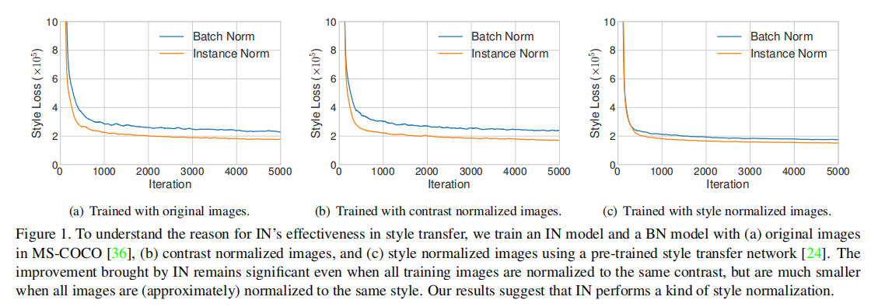

# **Arbitrary Style Transfer in Real-time with Adaptive Instance Normalization**

Gatys等人最近引入了一种神经算法，它可以以另一幅图像的样式呈现一个内容图像，从而实现了所谓的样式转移。然而，他们的框架需要一个缓慢的迭代优化过程，这限制了其实际应用。

利用前馈神经网络的快速逼近已被提出，以加速神经风格的转移。不幸的是，速度的提高是有代价的：网络通常被绑定在一组固定的样式上，并且不能适应任意的新样式。

在本文中，我们提出了一种简单而有效的方法，首次实现任意风格传输。我们的方法的核心是一个新的自适应实例归一化（AdaIN）层，它**将内容特征的均值和方差与风格特征的均值和方差对齐。**

我们的方法实现了与现有最快的方法相当的速度，而不受预定义的样式集的限制。此外，我们的方法允许灵活的用户控制，如内容风格的权衡，风格插值，颜色和空间控制，所有这些都使用一个单一的前馈神经网络。

# **1. Introduction**

Gatys等人{16]的开创性工作表明，深度神经网络（DNNs）不仅编码图像的内容，而且还编码图像的样式信息。

此外，图像样式和内容在某种程度上是可分离的：可以在保留图像内容的同时改变图像的样式。[16]的样式转移方法足够灵活，可以结合任意图像的内容和样式。然而，它依赖于一个非常缓慢的优化过程。

在加速神经风格转移方面已经付出了重大的努力。[24,51,31]试图训练前馈神经网络，执行一个单一的向前传递的风格化。大多数前馈方法的一个主要限制是，每个网络都被限制为一种样式。最近有一些工作解决了这个问题，但它们要么仍然局限于有限的样式集[11,32,55,5]中，要么比单样式传输方法[6]要慢得多。

在这项工作中，我们提出了第一个神经风格转移算法，解决这一基本的灵活性-速度困境。我们的方法可以实时传输任意的新风格，结合了基于优化的框架[16]的灵活性和类似于最快的前馈方法[24,52]的速度。我们的方法受到了实例归一化（IN）[52,11]层的启发，它在前馈风格传输中惊人地有效。为了解释实例归一化的成功与否，我们提出了一种新的解释，即**实例归一化通过规范化特征统计数据来进行样式归一化，这些特征统计数据携带了图像[16,30,33]的样式信息。**

基于我们的解释，我们引入了一个简单的扩展，即自适应实例规范化（AdaIN）。

给定一个内容输入和一个样式输入，AdaIN只是调整内容输入的平均值和方差，以匹配样式输入的平均值。

通过实验，我们发现AdaIN通过转移特征统计信息，有效地结合了前者的内容和后者的风格。然后，通过将AdaIN输出反转回图像空间，解码器网络学习生成最终的样式化图像。我们的方法比[16]快近3个数量级，而不牺牲将输入传输到任意新风格的灵活性。此外，我们的方法在运行时提供了大量的用户控制，而无需对训练过程进行任何修改。

# **2. Related Work**

**Style transfer**

风格转移问题源于非逼真的渲染[28]，与纹理合成和转移[13,12,14]密切相关。一些早期的方法包括在线性滤波器响应[19]上的直方图匹配和非参数采样[12,15]。这些方法通常依赖于低级的统计数据，并且通常无法捕获语义结构。

Gatys等人[16]通过匹配DNN的卷积层中的特征统计数据，首次展示了令人印象深刻的风格转移结果。最近，有人提出了一些改进。Li和Wand [30]在深度特征空间中引入了一个基于马尔可夫随机场（MRF）的框架来增强局部模式。

Gatys等人[17]提出了控制颜色保存、空间位置和规模的风格转移方法。

Ruder等人，[45]通过施加时间约束而改进了质量的视频风格传输。

Gatys等人。[16]的框架是基于一个缓慢的优化过程，迭代地更新图像，以最小化内容损失和由损失网络计算的样式损失。即使与现代gpu融合，也需要几分钟。因此，移动应用程序中的设备上处理速度太慢，难以实现。

一个常见的解决方法是用前馈神经网络替换优化过程，该神经网络经过训练以最小化相同的目标[24,51,31]。这些前馈风格的传输方法比基于优化的替代方法快大约三个数量级，为实时应用程序打开了大门。

Wang等人[53]通过多分辨率体系结构增强了前馈风格传输的粒度。

Ulyanov等人[52]提出了提高生成样本的质量和多样性的方法。

然而，上述前馈方法受到限制，因为每个网络都绑定到一个固定的风格。

为了解决这个问题，Dumoulin等人[11]引入了一个能够编码32种样式及其插值的单一网络。在我们的工作的同时，Li等人[32]提出了一种前馈体系结构，可以合成多达300种纹理并转移16种风格。然而，上述两种方法都不能适应在训练过程中没有观察到的任意风格。

最近，Chen和施密特[6]引入了一种前馈方法，它可以通过样式交换层传输任意样式。给定内容和样式图像的特征激活，样式交换层以补丁-补丁的方式用最匹配的样式特征替换内容特征。然而，他们的样式交换层创造了一个新的计算瓶颈：超过95%的计算都用在了512×512输入图像的样式交换上。我们的方法还允许任意风格的转移，同时比[6]快1-2个数量级。

样式转移中的另一个核心问题是要使用哪些样式损失函数。Gatys等人的原始框架通过匹配Gram矩阵捕获的特征激活之间的二阶统计数据来匹配样式。其他有效的损失函数也已被提出，如MRF损失[30]、对抗性损失[31]、直方图损失[54]、CORAL损失[41]、MMD损失[33]，以及通道均值和方差[33]之间的距离。请注意，上述所有的损失函数都是为了匹配样式图像和合成图像之间的一些特征统计数据。

**Deep generative image modeling**

有几种图像生成可选的框架，包括变分自动编码器[27]、自回归模型[40]和生成对抗网络（GANs）[18]。

值得注意的是，GANs已经取得了最令人印象深刻的视觉质量。对GAN框架的各种改进已经被提出，如条件生成[43,23]、多阶段处理[9,20]和更好的训练目标[46,1]。

GANs也被应用于样式转移[31]和跨域图像生成[50,3,23,38,37,25]。

# **3. Background**

## **3.1. Batch Normalization**

Ioffe和Szegedy [22]的开创性工作引入了批归一化（BN）层，通过归一化特征统计，显著简化了前馈网络的训练。BN层最初被设计用来加速鉴别网络的训练，但在生成图像建模[42]中也被发现是有效的。给定一个输入批次$x∈R^{N×C×H×W}$，BN对每个单独的特征通道的均值和标准差进行归一化：

γ，β∈RC是从数据中学习到的仿射参数；µ(x)，σ(x)∈RC是数据的平均值和标准差，通过每个特征通道的批大小和空间维度独立计算：

BN在训练过程中使用小批量统计，在推理过程中使用流行统计，引入了训练和推理之间的差异。

批处理归一化[21]最近被提出，通过在训练过程中逐步使用流行的统计数据来解决这个问题。作为BN的另一个有趣的应用，**Li等人[34]发现BN可以通过重新计算目标域中的流行统计数据来缓解域的变化。**最近，人们提出了几种替代的归一化方案来将BN的有效性扩展到递归架构[35,2,47,8,29,44]。

## **3.2. Instance Normalization**

在原始的前馈程式化方法[51]中，样式传递网络在每个卷积层之后都包含一个BN层。令人惊讶的是，Ulyanov等人的[52]发现，只要简单地用IN层替换BN层，就可以实现显著的改善：

与BN层不同的是，这里的µ(x)和σ(x)是针对每个通道和每个样本的空间维度独立计算的：

另一个不同之处是，IN层在测试时间内应用不变，而BN层通常用总体统计来代替小批量统计。

## **3.3. Conditional Instance Normalization**

Dumoulin等人[11]没有学习一组仿射参数γ和β，而是提出了一个条件实例规范化（CIN）层，该层为每种风格s学习一组不同的参数$γ^s$和$β^s$：

在训练过程中，从一组固定的样式$s∈\{1,2，...，S\}$（实验中的S=32）中随机选择一个样式图像及其索引s。然后通过样式传输网络对内容图像进行处理，其中相应的$γ^s$和$β^s$在CIN层中使用。令人惊讶的是，该网络可以通过在IN层中使用相同的卷积参数，但使用不同的仿射参数来生成完全不同风格的图像。

与没有归一化层的网络相比，具有CIN层的网络需要2个FS的附加参数，其中F为网络[11]中特征图的总数。由于附加参数的数量与样式的数量呈线性关系，因此将它们的方法扩展到建模大量的样式（例如，数万个样式）是具有挑战性的。此外，他们的方法不能适应任意的新风格，如果没有重新训练的网络。

# **4. Interpreting Instance Normalization**

尽管（有条件的）实例规范化取得了巨大的成功，但它们对风格转移特别有效的原因仍然难以捉摸。

Ulyanov等人[52]将IN的成功将其不变性归因于内容图像的对比性。然而，IN发生在特征空间中，因此它应该比在像素空间中进行简单的对比度归一化会产生更深远的影响。也许更令人惊讶的是，in中的仿射参数可以完全改变输出图像的风格。

已知道DNN的卷积特征统计可以捕获图像[16,30,33]的样式。虽然Gatys等人[16]使用二阶统计数据作为他们的优化目标，但Li等人[33]最近表明，匹配许多其他统计数据，包括通道均值和方差，对风格转移也是有效的。基于这些观察结果，我们认为实例归一化通过归一化特征统计量来执行一种风格规范化的形式，即均值和方差。虽然DNN在[16,33]中作为图像描述符，但我们相信**生成器网络的特征统计也可以控制生成的图像的风格**

我们运行改进的纹理网络[52]的代码来执行单样式传输，使用IN或BN层。与预期的一样，IN模型比BN模型收敛得更快（图1 (a)）。

为了测试[52]中的解释，我们通过对亮度通道进行直方图均衡，将所有训练图像归一化为相同的对比度。如图1 (b)所示，in仍然有效，说明在[52]中的解释是不完整的。为了验证我们的假设，我们使用[24]提供的预训练风格转移网络，将所有的训练图像归一化为相同的风格（不同于目标风格）。根据图1 (c)，当图像已经被样式归一化时，IN带来的改进会小得多。剩下的差距可以用[24]的风格标准化并不完美这一事实来解释。

此外，在风格归一化图像上训练BN的模型可以像在原始图像上训练IN的模型一样快地收敛。我们的结果表明，IN确实执行了一种风格归一化。

由于BN是对一批样本而不是单个样本的特征统计进行归一化处理，因此可以直观地理解为将一批样本以单一风格为中心进行归一化处理。然而，每个单一的样本可能仍然有不同的风格。当我们希望将所有图像传输到相同的样式时，这是不可取的，就像在原始的前馈样式传输算法[51]中的情况一样。虽然卷积层可能会学会补偿批处理内风格的差异，但它给训练带来了额外的挑战。

另一方面，IN可以将每个单独样本的样式规范化为目标样式。培训很容易，因为网络的其他部分可以专注于内容操作，同时丢弃原始的风格信息。CIN成功的原因也很明显：不同的仿射参数可以将特征统计量归一化为不同的值，从而将输出图像归一化为不同的样式。

# **5. Adaptive Instance Normalization**

如果IN将输入归一化为仿射参数指定的单一样式，是否有可能通过使用自适应仿射变换将其使之适应任意给定的样式？在这里，我们提出了一个简单的扩展到in，我们称之为自适应实例规范化（AdaIN）。AdaIN接收一个内容输入x和一个样式输入y，并简单地对齐x的通道均值和方差以匹配y的均值。与BN、IN或CIN不同，AdaIN没有可学习的仿射参数。相反，它可以自适应地从样式输入中计算仿射参数：

其中，我们简单地用σ(y)缩放标准化的内容输入，然后用µ(y)移动它。与IN类似，这些统计数据是跨空间位置计算的。

直观地说，让我们考虑一个特征通道来检测特定风格的绘画技巧。具有这种绘画技巧的样式图像将对该特性产生较高的平均激活度。AdaIN产生的输出对该特征具有相同的高平均激活度，同时保持了内容图像的空间结构。绘画技巧特征可以通过一个前馈解码器反转到图像空间，类似于[10]。该特征通道的方差可以编码更微妙的样式信息，这些信息也被传输到AdaIN输出和最终输出图像。

简而言之，AdaIN通过传递特征统计量，特别是通道均值和方差，在特征空间中进行风格传递。我们的AdaIN层与[6]中提出的样式交换层起着类似的作用。虽然样式交换操作非常耗时和消耗内存，但我们的AdaIN层就像IN层一样简单，几乎不增加计算成本。

# **6. Experimental Setup**

图2显示了我们基于所提出的AdaIN层的风格传输网络的概述。代码和预训练模型（在Torch7[7]中）可以在https: //github.com/xunhuang1995/AdaIN-style上获得

我们使用一个固定的VGG-19网络的前几层来编码内容和样式图像。AdaIN层用于在特征空间中执行样式转移。我们学习了一个解码器来将AdaIN输出转换到图像空间。我们使用相同的VGG编码器来计算一个内容损失Lc (Equ12)和风格损失Ls(Equ13)

## **6.1. Architecture**

我们的风格传输网络T以内容图像c和任意风格图像s作为输入，合成一个输出图像，将前者和后者的内容重组。

我们采用一个简单的编码器-解码器架构，其中编码器f固定在预先训练的VGG-19 [48]的前几层（直到relu4_1）。在特征空间中对内容和样式图像进行编码后，我们将两个特征映射提供到AdaIN层，该层将内容特征映射的均值和方差与样式特征映射的均值和方差对齐，生成目标特征映射t：

一个随机初始化的解码器g被训练成将t映射回图像空间，生成样式化的图像T（c，s）：

解码器主要镜像编码器，所有池化层被最近的上采样取代，以减少棋盘效应。我们在f和g中都使用反射填充来避免边界伪影。

另一个重要的体系结构选择是解码器是应该使用实例层、批处理层还是不使用规范化层。

如在第4节中所讨论的。IN将每个样本归一化为单一样式，而BN将一批样本归一化为以单一样式为中心。当我们希望解码器以截然不同的风格生成图像时，这两者都是不可取的。因此，我们不在解码器中使用规范化层。在第7.1节中。我们将展示解码器中的IN/BN层确实会影响性能。

## **6.2. Training**

我们使用MS-COCO [36]作为内容图像和绘画数据集训练我们的网络，这些大多从维基艺术[39]作为风格图像，遵循[6]的设置。每个数据集包含大约8万个训练示例。我们使用adam优化器[26]和批大小8内容风格的图像对。在训练过程中，我们首先在保留高宽比的同时，将两幅图像的最小维数调整为512，然后随机裁剪大小为256×256的区域。由于我们的网络是完全卷积的，它可以应用于任何大小的图像

与[51,11,52]类似，我们使用预先训练过的VGG- 19 [48]来计算损失函数来训练解码器：

这是内容损失Lc和风格损失Ls与风格损失重量λ的加权组合。

内容损失是目标特征与输出图像特征之间的欧氏距离。我们使用AdaIN输出t作为内容目标，而不是常用的内容图像的特征响应。我们发现这导致稍微快的收敛，也符合我们的目标反转AdaIN输出t。

由于我们的AdaIN层只转移了样式特征的平均值和标准差，所以我们的样式损失只与这些统计数据相匹配。

虽然我们发现常用的Gram矩阵损失可以产生类似的结果，但我们匹配IN统计量，因为它在概念上更干净。Li等人的[33]也探讨了这种风格的损失。

其中，每个φi表示VGG-19中用于计算样式损失的一个层。在我们的实验中，我们使用了等权重的relu1 1，relu2 1，relu3 1，relu4 1层。