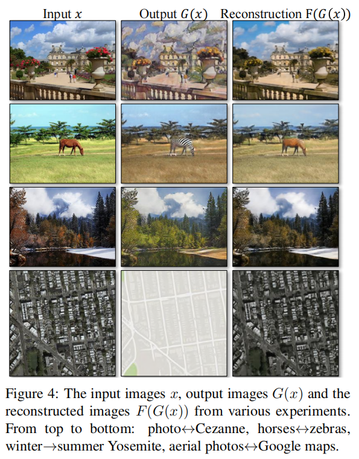

# **Unpaired Image-to-Image Translation** **using Cycle-Consistent Adversarial Networks**

图像到图像的转换是一类视觉和图形问题，其目标是使用对齐图像对的训练集学习输入图像和输出图像之间的映射。

然而，对于许多任务，配对的训练数据不可用。

我们提出了一种在没有成对例子的情况下，学习将图像从源域X转换到目标域Y的方法。

我们的目标是学习一个映射G： X→Y，这样来自G (X)的图像的分布与使用对抗性损失的分布Y难以区分。因为这个映射是高度不受约束的，我们将它与一个逆映射F： Y→X耦合，并引入一个**循环一致性损失**来强制执行$F(G(X))≈X$（反之亦然）。在不存在成对训练数据的几个任务上给出了定性结果，包括协作风格转换、对象变形、季节转换、照片增强等。与以往几种方法的定量比较证明了我们的方法的优越性。

# **1. Introduction**

1873年一个可爱的春天，克劳德·莫奈把画架放在阿根特伊附近的塞纳河边时，他看到了什么？（图1，左上角）如果一张彩色照片被发明出来，可能记录了清新的蓝色天空和反射它的玻璃河流。莫奈通过轻快的笔触和明亮的调色板传达了他对同一场景的印象。

如果莫奈在一个凉爽的夏夜碰巧发现了卡西斯的一个小港口（图1，左下角）怎么办？在莫奈的绘画画廊中短暂漫步，就可以想象他会如何描绘这个场景：也许是柔和的色调，突然的油漆痕迹，以及一个有点平坦的动态范围。我们可以想象这一切，尽管我们从未见过莫奈在他所画的场景的照片的例子。相反，我们对莫奈的画作和风景照片有了了解。

我们可以推断出这两个场景之间的风格差异，从而想象如果我们将场景从一个场景“转换”到另一个场景会是什么样子。

在本文中，我们提出了一种可以学习做同样事情的方法：捕捉一个图像集合的特殊特征，并找出如何将这些特征转化为另一个图像集，所有这些都是在没有任何配对训练示例的情况下完成的

这个问题可以更广泛地描述为图像到图像的转换[22]，将图像从给定场景的一个表示x转换为另一个表示y，例如，灰度到颜色，图像到语义标签，边缘map到照片。多年来在计算机视觉、图像处理、计算摄影和图形方面的研究已经在监督环境中产生了强大的翻译系统，其中示例图像对$\{x_i，y_i\}^N_{i=1}$是可用的（图2，左），例如[11，19，22，23，28，33，45，56，58，62]。然而，获得成对的训练数据可能是困难和昂贵的。例如，只有几个数据集适用于语义分割等任务（例如[4]），而且它们相对较小。获得图形任务（如艺术风格化）的输入-输出对可能更加困难，因为所需的输出非常复杂，通常需要艺术创作。对于许多任务，例如对象变形（例如斑马↔马，图1中上），期望的输出甚至没有明确定义。

因此，我们寻求一种算法，它可以在没有成对输入输出示例的情况下学习在域之间进行转换（图2，右侧）。我们假设域之间存在一些潜在关系——例如，它们是同一潜在场景的两个不同渲染——并试图了解这种关系。尽管我们缺乏成对示例形式的超视觉，但我们可以在集合层次上利用超视觉：我们在域X中得到一组图像，在域Y中得到另一组图像。

我们可以训练映射G:X→ Y使得输出$\hat Y＝G（x）,x∈X $、 无法与图像y区分.从理论上讲，这个目标可以在$\hat Y$上产生一个与经验分布$p_{data}(Y)$相匹配的输出分布（一般来说，这要求G是随机的）[16]。

因此，最优G将域X转换为与Y相同分布的域$\hat Y$。然而，这种转换并不能保证单个输入x和输出y以有意义的方式配对——有无限多的映射G将在$\hat y$上产生相同的分布。此外，在实践中，我们发现很难单独优化对抗性目标：标准程序通常会导致众所周知的模式崩溃问题，即所有输入图像都映射到同一输出图像，优化无法取得进展[15]。

这些问题需要给我们的目标增加更多的结构。因此，我们利用了转换应该是“循环一致”的特性，即如果我们把一个句子从英语翻译成法语，然后再从法语翻译回英语，我们应该回到原来的句子[3]。数学上，如果我们有一个转换G:X→ Y和另一个翻译器F:Y→ X、 那么G和F应该是彼此的逆，并且这两个映射都应该是双射。我们通过同时训练映射G和F，并添加包含F（G（x））≈ x和G（F（y））≈ y、 将此损失与域X和y上的对抗性损失相结合，将产生非成对图像到图像转换的完整目标。

我们将我们的方法应用于广泛的应用，包括收集风格转移，对象变形，季节转移和照片增强。我们还将其与以前依赖于手工定义的风格和内容分解或共享嵌入函数的方法进行了比较，并表明我们的方法优于这些基线。我们同时提供了PyTorch和Torch的实现。请在我们的网站上查看更多的研究结果。

# **2. Related work**

**Generative Adversarial Networks (GANs)**:

GAN在图像生成[6,39]、图像编辑[66]和表示学习[39,43,37]方面取得了令人印象深刻的成果。最近的方法在条件图像生成应用中采用了相同的想法，如文本到图像[41]、图像修复[38]和未来预测[36]，以及其他领域，如视频[54]和3D数据[57]。GANs成功的关键是一种对抗性的损失，这迫使生成的图像在原则上与真实照片难以区分。这种损失对于图像生成任务尤其强大，因为这正是许多计算机图形学旨在优化的目标。

我们采用对抗性损失来学习映射，这样翻译的图像就无法与目标中的图像领域区分开来

**Image-to-Image Translation** ：

图像到图像的转换图像到图像转换的思想至少可以追溯到Hertzmann等人的图像类比[19]，他们在单个输入-输出训练图像对上使用非参数纹理模型[10]。
最近的方法使用输入-输出测试数据集来学习使用CNN的参数转换函数（例如[33]）。

我们的方法基于Isola等人[22]的“pix2pix”框架，该框架使用条件生成对抗网络[16]来学习从输入到输出图像的映射。

类似的想法已经应用于各种任务，例如从草图[44]或从属性和语义布局[25]生成照片。然而，与前面的工作不同，我们在没有配对训练示例的情况下学习映射

**Unpaired Image-to-Image Translation**：

其他几种方法也解决了不成对设置，其目标是将两个数据域（X和Y）关联起来。

Rosales等人[42]提出了一种贝叶斯框架，该框架包括基于从源图像计算的基于补丁的马尔可夫随机场的先验和从多个风格图像获得的似然项。

最近，CoGAN[32]和跨模态场景网络[1]使用权重共享策略来学习跨域的公共表示。

与我们的方法同时，Liu等人[31]利用变分自动编码器[27]和一般对抗网络[16]的组合扩展了上述框架。

另一行并行工作[46，49，2]鼓励输入和输出共享特定的“内容”特征，即使它们在“风格”上可能不同。

这些方法还使用对抗性网络，并使用额外的术语来强制输出在预定义的度量空间中接近输入，例如类标签空间[2]、图像像素空间[46]和图像特征空间[49]。

与上述方法不同，我们的公式不依赖于输入和输出之间的任何特定任务的预定义相似函数，也不假设输入和输出必须位于相同的低维嵌入空间中。这使得我们的方法成为一个针对许多视觉和图形任务的通用解决方案。我们在5.1节中直接比较了之前和以前的当代方法。

**Cycle Consistency**

使用传递性作为一种规范结构化数据的方法的想法有着悠久的历史。

在视觉跟踪中，强制简单的前向后一致性一直是几十年来[24,48]的标准技巧。

在语言领域，通过“反向翻译和和解”来验证和改进翻译是人工翻译人员[3]（包括Mark Twain [51]）以及机器[17]所使用的一种技术。

近年来，高阶循环一致性被应用于运动[61]、三维形状匹配[21]、共分割[55]、密集语义对齐[65,64]和深度估计[14]等结构中。

其中，Zhou等人[64]和Godard等人[14]与我们的工作最为相似，因为他们使用循环一致性损失作为使用传递性的方法来监督CNN训练的一种方式。在这项工作中，我们引入了一个类似的损失来推动G和F彼此一致。

与我们的工作同时，在这些相同的过程中，Yi等人[59]独立地使用了类似的目标进行非配对图像到图像的翻译，灵感来自于机器翻译[17]中的双重学习。

**Neural Style Transfer** 

神经风格转换[13,23,52,12]是另一种进行图像到图像转换的方法，它基于匹配预训练深度图像的格拉姆矩阵统计，将一幅图像的内容与另一幅图像的风格（通常是一幅画）相结合来合成新图像。另一方面，我们的主要重点是学习两个图像集合之间的映射，而不是两个特定图像之间的映射，试图捕捉高级外观结构之间的相关关系。因此，我们的方法可以应用于其他任务，如((绘制→照片，对象变形等。其中单个样品转移方法表现不佳。我们在第5.2节中比较了这两种方法。

# **3. Formulation**

我们的目标是学习两个域X和Y之间的映射函数，给定的训练样本$\{xi\}^N_{i=1}$，其中$x_i∈X$和$\{y_j\}^M_{j=1}$，其中$y_j∈Y$。我们将数据分布表示为$x∼p_{data} (x)$和$y∼p_{data} (y)$。如图3 (a)所示，我们的模型包括两个映射G： X→Y和F： Y→X。此外，我们引入了两个对抗性鉴别器$D_X$和$D_Y$，其中$D_X$的目的是区分图像{x}和翻译图像$\{F (y)\}$；同样，DY的目标是区分{y}和{G (x)}。我们的目标包含两种类型的术语：用对抗损失[16]匹配生成的图像分布到目标域的数据分布；循环一致性损失以防止学习的映射G和F相互矛盾。

## **3.1. Adversarial Loss**

我们将对抗性损失[16]应用于这两个映射函数。对于映射函数G： X→Y及其鉴别器DY，我们将目标表示为：

其中G试图生成与域Y的图像相似的图像G (x)，而DY的目的是区分翻译样本G (x)和真实样本y。G的目标是最小化这个目标，以对抗一个试图最大化它的对手D，即，$min_G max_{D_Y} L_{GAN}(G，D_Y，X，Y)$。我们在映射函数F： Y→X及其鉴别器DX中引入了类似的对抗性损失：即minF maxDX LGAN（F，DX，Y，X）。

## **3.2. Cycle Consistency Loss**

从理论上讲，对抗性训练可以学习映射G和F，它们产生的输出分别同分布为目标域Y和X（严格地说，这需要G和F是随机函数）[15]。然而，在足够大的容量下，网络可以将同一组输入图像映射到目标域的任意随机排列，其中任何学习的映射都可以诱导与目标分布匹配的输出分布。因此，对抗性损失不能保证学习函数可以将单个输入xi映射到期望的输出yi。

为了进一步减少可能映射函数的空间，我们认为学习的映射函数应该是循环一致的：如图3（b）所示，对于来自域x的每个图像x电子翻译循环应该能够将x带回原始图像，即x→ G（x）→ F（G（x））≈ x.我们称之为前向循环的一致性。类似地，如图3 (c)所示，对于域Y的每个图像Y，G和F也应该满足后循环一致性：y→F (y)→G（F(y)）≈y。我们使用一个循环一致性损失来激励这种行为：

在初步实验中，我们也尝试用F（G(x)）和x之间以及G（F(y)）和y之间的对抗性损失来替代该损失中的L1范数，但没有观察到性能的改善

由循环一致性损失引起的行为可以在图4中观察到：重建的图像F（G(x)）最终与输入的图像x紧密匹配。

## **3.3. Full Objective**

我们的全部目标是：

λ控制着这两个目标的相对重要性。我们的目标是解决：

请注意，我们的模型可以看作是训练两个“自动编码器”[20]：我们学习一个自动编码器$F◦G： X→X$与另一个$G◦F：Y→Y$的联合。然而，这些自动编码器都有特殊的内部结构：它们通过一个中间表示将图像映射到自身，即将图像映射到另一个域。

这种设置也可以看作是“对抗性自动编码器”[34]的一种特殊情况，它使用对抗性损失来训练自动编码器的瓶颈层来匹配任意的目标分布。在我们的例子中，X→X自动编码器的目标分布是域Y的目标分布。

在第5.1.4节中，我们将我们的方法与完整目标的消融进行了比较，包括单独的对抗性损失LGAN和单独的周期一致性损失Lcyc，并通过经验表明，这两个目标在获得高质量结果方面发挥了关键作用。

我们还评估了我们的方法，只有循环损失的一个方向，并表明单个循环不足以规范这个欠约束问题的训练。

# **4. Implementation**

**Network Architecture** 

我们采用了约翰逊等人[23]的生成网络架构，他们在神经风格转移和超分辨率方面显示出了令人印象深刻的结果。

该网络包含三个卷积，几个残差块[18]，两个步幅为$\frac 1 2 $步的 fractionally-strided convolutions，以及一个将特征映射到RGB的卷积。

我们对128×128张图像使用6个块，对256×256和更高分辨率的训练图像使用9个块。

与约翰逊等人的[23]类似，我们使用实例归一化[53]。

对于鉴别器网络，我们使用70×70PatchGANs [22,30,29]，目的是分类70×70个重叠的图像补丁是真实的还是假的。这种补丁级鉴别器架构比全图像鉴别器的参数更少，可以以全卷积的方式以[22]对任意大小的图像进行工作。

