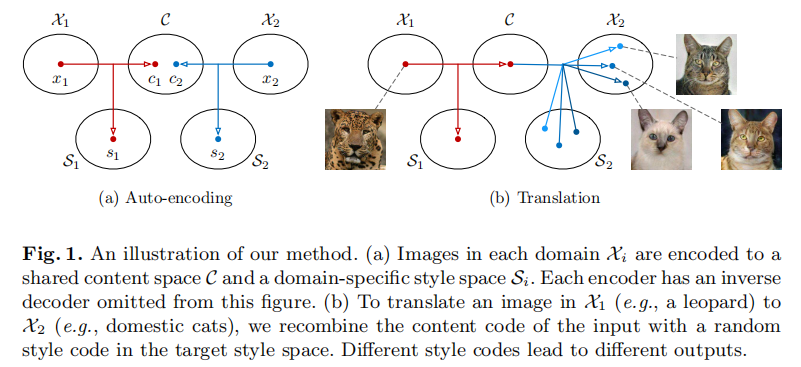

# Multimodal Unsupervised Image-to-Image Translation

无监督图像到图像的翻译是计算机视觉中一个重要且具有挑战性的问题。

给定源域的图像，目标是学习相应图像在目标域的条件分布，而不看到任何相应图像对的例子。

虽然这种条件分布本质上是多模态的，但现有的方法做出了一个过于简化的假设，将其建模为一个确定性的一对一映射。

因此，它们无法从给定的源域映像中生成不同的输出。为了解决这一限制，我们提出了一个多模态无监督图像到图像翻译（MUNIT）框架。

我们假设图像表示可以分解为**域不变的内容代码和捕获域特定属性的样式代码**。为了将图像转换为另一个域，我们将其内容代码与从目标域的样式空间采样的随机样式代码重新组合。我们分析了所提出的框架，并建立了几个理论结果。大量的实验和与最先进的方法的比较进一步证明了所提出的框架的优势。此外，我们的框架允许用户通过提供一个示例样式图像来控制翻译输出的样式。代码和预训练过的模型可以在https://github.com/nvlabs/MUNIT上获得。

# 1 Introduction

计算机视觉中的许多问题都是为了将图像从一个领域转换到另一个领域，包括超分辨率[1]、着色[2]、内绘制[3]、属性转移[4]和样式转移[5]。因此，这种跨域图像到图像的转换设置受到了[6–25]的广泛关注。当数据集包含成对的例子时，这个问题可以通过一个条件生成模型[6]或一个简单的回归模型[13]来解决。在这项工作中，我们关注的是更具有挑战性的设置时，这种监督是不可用的。

在许多情况下，感兴趣的跨域映射是多模态的。例如，由于天气、时间、光照等原因，一个冬季的场景在夏季可能会出现很多情况。不幸的是，现有的技术通常假设有一个确定性的[8–10]或单峰[15]映射。因此，它们无法捕获可能输出的全部分布。即使模型是通过注入噪声而随机的，网络通常学会忽略[6,26]。

在本文中，我们提出了一个原则框架的多模态无监督图像到图像翻译（MUNIT）问题。

如图1 (a)所示，我们的框架做出了几个假设。我们首先假设图像的潜在空间可以分解为内容空间和样式空间。我们进一步假设不同域中的图像共享一个共同的内容空间，但不共享样式空间。为了将图像转换为目标域，我们将其内容代码与目标样式空间中的随机样式代码重新组合（图1 (b)）。

内容代码对在翻译过程中应该保存的信息进行编码，而样式代码表示输入图像中没有包含的剩余变化。通过对不同风格的代码进行采样，我们的模型能够产生不同的多模态输出。大量的实验证明了我们的方法在建模多模态输出分布方面的有效性，以及与最先进的方法相比，其优越的图像质量。此外，内容和样式空间的分解允许我们的框架执行示例引导的图像转换，其中转换输出的样式由目标域中的用户提供的示例图像控制。

# 2 Related Works

**Generative adversarial networks (GANs).**

GAN框架[27]在图像生成方面取得了令人印象深刻的效果。在GAN训练中，生成器被训练欺骗鉴别器，鉴别器试图区分生成的样本和真实样本。对GANs的各种改进已经被提出，如多阶段生成[28–33]，更好的训练目标[34–39]，以及与自动编码器[40–44]的结合。在这项工作中，我们使用GANs对齐翻译图像与真实图像的分布。图像到图像的翻译。Isola等人[6]提出了第一个基于条件GANs的图像到图像转换的统一框架，Wang等人[20]已将其扩展到生成高分辨率图像。

最近的研究也试图在没有监督的情况下学习图像翻译。这个问题本身是不适定的，需要额外的约束。一些工作强制转换来保持源域数据的某些属性，如像素值[21]、像素梯度[22]、语义特征[10]、类标签[22]或成对样本距离[16]。另一个流行的约束条件是循环一致性损失[7–9]。它强制执行，如果我们将一个图像转换到目标域，然后返回，我们应该得到原始图像。此外，Liu等人[15]提出了UNIT框架，该框架假设有一个共享的潜在空间，使两个域中对应的图像映射到相同的潜在代码。

大多数现有的图像到图像转换方法的一个重要局限性是缺乏翻译输出的多样性。为了解决这个问题，一些工作建议在给定相同的输入时同时生成多个输出，并鼓励它们成为不同的[13,45,46]。尽管如此，这些方法只能产生离散数量的输出。Zhu等人[11]提出了一种可以模拟连续和多模态分布的BicycleGAN。然而，上述所有的方法都需要成对的监督，而我们的方法则不需要。一些并发的工作也认识到了这一限制，并提出了扩展CyclelGAN/UNIT，用于多模态映射[47]/[48]。

我们的问题与多域图像到图像的转换[19,49,50]有一些联系。具体来说，当我们知道每个域有多少种模式和每个样本属于的模式时，就可以将每个模式视为一个单独的域，并使用多域图像到图像转换技术来学习每对模式之间的映射，从而实现多模态转换。然而，一般来说，我们并不假设有这些信息。此外，我们的随机模型可以表示连续的输出分布，而[19,49,50]仍然对每一对域使用一个确定性模型。