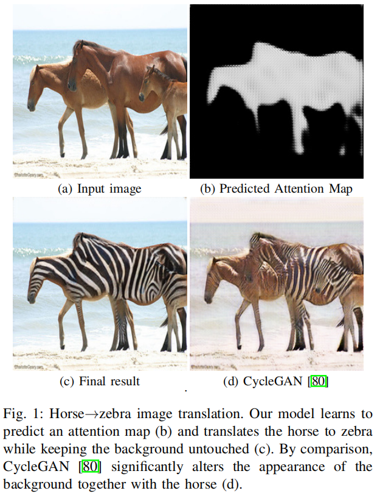
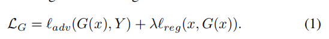
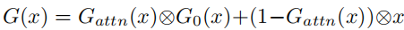
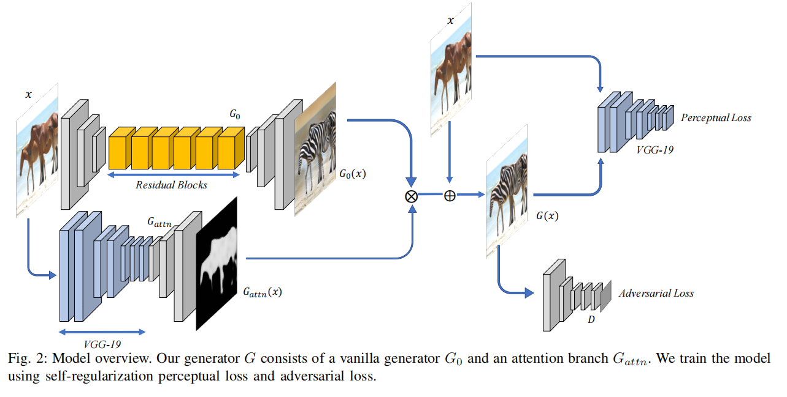
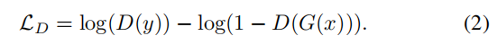
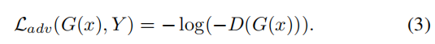
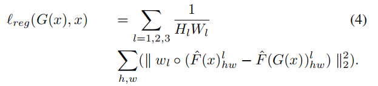

# Show, Attend and Translate: Unsupervised Image Translation with Self-Regularization and Attention

两个域之间的图像转换是一类旨在学习从源域的输入图像到目标域的输出图像的映射的问题。它已被应用于许多应用程序，如数据增强、领域自适应和无监督训练。

当成对的训练数据无法获取时，图像转换就成为一个不适定问题。

我们约束的问题假设翻译后的图像需要在感知上与原始图像相似，这似乎也来自于新的域，并提出一个简单而有效的图像翻译模型由一个生成器 **self-regularization**条件和一个对抗性的条件。

我们进一步注意到，现有的图像转换技术[80]、[42]对感兴趣的主题是不可知的，并且经常会对输入引入不必要的变化或伪影。

因此，**我们建议添加一个注意模块来预测一个注意地图，以指导图像的翻译过程**。该模块学习注意图像的关键部分，同时保持其他一切不变，本质上避免不希望的伪影或变化。广泛的实验和评价

# I. INTRODUCTION

许多计算机视觉问题可以转换为图像到图像的转换问题：任务是将一个域的图像映射到另一个域的相应图像。例如，图像着色可以看作是将灰度图像映射到RGB空间[77]中对应的图像；样式转换可以看作是将一种样式的图像转换为另一种样式[19]、[29]、[18]的对应图像。其他属于这一类的任务包括语义分割[46]、超分辨率[39]、图像处理[28]等。图像翻译的另一个重要应用与领域自适应和无监督学习有关：随着深度学习的兴起，现在认为拥有大型标记训练数据集是至关重要的。

许多计算机视觉问题可以转换为图像到图像的转换问题：任务是将一个域的图像映射到另一个域的相应图像。例如，图像着色可以看作是将灰度图像映射到RGB空间[77]中对应的图像；样式转换可以看作是将一种样式的图像转换为另一种样式[19]、[29]、[18]的对应图像。其他属于这一类的任务包括语义分割[46]、超分辨率[39]、图像处理[28]等。图像翻译的另一个重要应用与领域自适应和无监督学习有关：随着深度学习的兴起，现在认为拥有大型标记训练数据集是至关重要的。

然而，标记和注释如此大的数据集是昂贵的，因此是不可伸缩的。另一种方法是使用合成或模拟数据进行训练，这些标签对于获取[82]、[67]、[60]、[57]、[53]、[48]、[30]、[11]很简单。不幸的是，从合成数据中学习可能会有问题，而且由于这两个领域之间的数据分布差距，大多数情况下并不能推广到真实世界的数据中。

此外，由于深度神经网络学习小细节的能力，预计训练后的模型很容易过拟合到合成域。

为了缩小这一差距，我们可以在特征级别上找到映射或域不变表示[8]，[17]，[47]，[65]，[68]，[21]，[9]，[1]，[33]，或者学习将图像从一个域转换到另一个域，以创建“假的”标记数据，用于训练[7]，[80]，[43]，[39]，[44]，[75].在后一种情况下，我们通常希望学习一个保留标签以及我们所关心的属性的映射。

通常，对于给定两个域X和Y的图像转换存在两个设置。第一个设置是有监督的，其中示例图像对x，y是可用的。这意味着对于训练数据，对于每个图像$x_i∈X$有一个相应的$y_i∈Y$，我们希望找到一个翻译G： X→Y，这样$G（x_i）≈y_i$。

在监督设置中的代表性翻译系统包括特定领域的作品[15]，[24]，[37]，[62]，[46]，[70]，[71]，[77]和更一般的Pix2Pix [28]，[69].然而，配对的训练数据是有溢价的。例如，对于图像的样式化，需要获得成对的数据冗长的艺术家创作，而且非常昂贵。对于其他任务，如对象转换，期望的输出甚至没有很好地定义。因此，我们关注第二种设置，即无监督的图像平移。在无监督设置下，X和Y是两组独立的图像，我们没有成对的例子显示如何将图像$x_i∈X$转换为图像$y_i∈Y$。然后，我们的任务是寻找一种算法，可以学习在X和Y之间转换，而不需要期望的输入输出示例。无监督图像转换设置由于其简单性和灵活性而具有更大的潜力，但也更加困难。

事实上，这是一个高度欠约束和不适定的问题，因为在X和Y之间可能有无限数量的映射：从概率的角度来看，挑战是学习图像在不同领域的联合分布。如耦合理论[41]所述，存在一个无限的联合分布集，它可以到达两个不同域中的两个边际分布。因此，我们需要额外的假设和约束来利用学习映射所必需的结构和监督。

解决这个问题的现有工作假设这两个领域之间存在一定的关系。

例如，CycleGAN [80]假设具有周期一致性，并且存在一个从Y转换为X的逆映射F。然后训练两个生成器双射并且相互可逆和使用对抗约束[20]确保翻译图像似乎是从目标域和周期一致性约束，以确保翻译图像可以映射回原始图像使用逆映射（F（F(G（x））≈x和G（F(y)）≈y）。

另一方面，UNIT [43]假设了共享的潜在空间，这意味着在不同域中的一对图像可以被映射到一些共享的潜在表示。该模型训练了两个具有共享层的生成器GX，GY。GX和GY都将一个输入映射到自己，而域翻译是通过让xi通过部分GX和部分GY来获得yi来实现的。该模型采用对图像的对抗性约束，对潜在代码[35]，[56]的变分约束和另一个周期一致性约束。

假设周期一致性保证了1-1映射，避免了模式折叠[61]，两种模型都产生了合理的图像平移和域自适应结果。然而，现有的方法有几个问题。

首先，**这些方法通常对感兴趣的主题是不可知的，而且几乎不能保证它能达到期望的输出**。事实上，基于循环一致性[80]，[42]的方法在理论上可以找到任何满足约束条件的任意1-1映射，这使得训练不稳定，结果是随机的。这在许多图像转换场景中都是有问题的。例如，当从马的图像转换为斑马的图像时，我们很可能只希望在马的顶部画出特定的黑白条纹，同时保持其他一切不变。然而，我们观察到的是，现有的方法[80]、[43]并没有区分马/斑马和场景背景，而且背景的颜色和外观经常会发生显著变化（图1）。

其次，大多数时候，我们只关心单向翻译，而现有的方法，如CycleGAN [80]和UNIT [42]，总是需要训练两个双射的生成器。这不仅很麻烦，而且也很难平衡这两个生成器的影响。

第三，在翻译后的图像与输入图像的忠实度和与新域的相似度之间存在一个敏感的权衡，需要过度手动调整对抗损失和重建损失之间的权重才能获得令人满意的结果。

为了解决上述问题，我们提出了一个更简单、更有效的图像转换模型，它由一个带有注意模块的单一生成器组成。我们首先重新考虑图像转换任务的期望结果应该是什么：大多数情况下，期望的输出不仅应该与目标域相似，而且还应该保留某些属性，并与输入共享相似的视觉外观。例如，在马-斑马翻译[80]的情况下，输出的斑马在场景背景、斑马和马的位置和形状等方面应该与输入的马相似。在将MNIST [38]转换为USPS [13]的领域自适应任务中，我们期望输出在数字的形状和结构上在视觉上与输入相似，这样它就可以保留标签。基于这样的观察，我们的模型建议使用一个生成器，将X映射到Y，并使用一个自正则化术语进行训练，强制输出和输入之间的感知相似性，以及一个对抗性术语，强制输出看起来像从Y绘制。此外，为了将转换集中在图像的关键成分上，避免对不相关的部分引入不必要的变化，我们建议添加一个注意模块，该模块可以预测在转换时需要注意的哪一部分图像的概率映射。这种概率图，以一种完全无监督的方式学习，可以进一步促进分割或显著性检测（图1）。第三，我们提出了一种自动且有原则的方法来寻找自正则化项和对抗性项之间的最优权值，这样我们就不必手动搜索最佳超参数。

我们的模型不依赖于周期一致性或共享表示假设，它只学习单向映射。尽管约束很容易过度简化某些场景，但我们发现该模型工作得出奇地好。通过注意模块，我们的模型学习从背景上下文中检测关键对象，并能够纠正伪影，并从翻译的结果中删除不必要的变化。我们将我们的模型应用于各种图像翻译和领域适应任务，表明我们的模型不仅简单，而且比现有方法更好，实现了优越的定性和定量性能。为了演示其在现实任务中的应用，我们展示了我们的模型可以通过适应合成图像增强真实图像的训练数据来提高人脸三维变形模型[6]预测的精度

# II. RELATED WORK

# III. OUR METHOD

我们首先解释了我们的无监督图像转换模型。假设X和Y是两个图像域，我们的目标是训练一个生成器$G_θ： X→Y$，其中θ是函数参数。为简单起见，我们省略了θ，而使用G。

我们给出了未配对的样本$x∈X$和$y∈Y$，并且无监督设置假设x和y是独立地从边缘分布$P_{x∼X}(x)$和$P_{y∼Y}(y)$中提取出来的

设$y'=G(x)$表示翻译后的图像，关键的要求是y'应该像从域Y绘制的一样，同时保留x的低级视觉特征。翻译后的图像y'可以进一步用于其他下游任务，如无监督学习。然而，在我们的例子中，我们将图像转换从它的应用程序中解耦。

基于前面所述的要求，我们建议通过最小化以下损失来学习θ：

其中$G_0$是简朴生成器，$G_{attn}$是注意力分支。

G0输出一个转换后的图像，而Gattn预测了一个概率映射，用于用x合成G0(x)来得到最终的输出。

损失的第一部分，$l_{adv}$是在图像域上的对抗性损失，以确保G (x)看起来像域Y。损失的第二部分$lreg$确保G (x)在视觉上与x相似。

在我们的例子中，$l_{adv}$由与G联合训练的鉴别器D给出，$lreg$用perceptual loss测量。我们在图3中举例说明了这个模型。

**The model architectures:** 

我们的模型由一个发生器G和一个鉴别器d组成。发生器G有两个分支：简朴生成器G0和注意分支Gattn。G0将输入x作为一个整体转换，在新的域中生成一个类似的图像G0(x)，Gattn预测一个概率映射Gattn (x)作为注意掩模。Gattn (x)与x的大小相同，每个像素都是一个介于0-1之间的概率值。最后，我们根据注意掩模将x和G0(x)相加，从而合成最终的图像G (x)。

G0是基于全卷积网络（FCN），并利用了卷积神经网络的特性，如平移不变性和参数共享。与[28]，[80]类似，生成器G由三个组件组成：一个下采样前端以减小尺寸，然后是多个残差块[23]，和一个上采样后端以恢复原始尺寸。

下采样前端由两个卷积块组成，每个块的步幅为2。中间部分包含9个保持高度/宽度不变的残差块，上采样后端由两个反卷积块组成，步幅也为2。

每个卷积层之后都有批处理归一化和ReLU激活，除了最后一层的输出在图像空间中。在开始时使用降采样增加了残差块的接受域，并使在更小的规模上更容易学习转换。另一个修改是，我们对所有残差块采用膨胀卷积，并将膨胀因子设为2。

膨胀卷积使用间隔的核，使它能够在不增加参数数量和计算负担的情况下以更宽的输入视图计算每个输出值

Gattn由VGG-19网络[64]的初始层（高达conv3_3）组成，然后是两个反卷积块。最后，它是一个sigmoid卷积层，输出一个单通道概率映射。在训练过程中，VGG-19层是在ImageNet [59]上预先训练的重量。

对于鉴别器，我们使用了一个五层卷积网络。前三层的有一个步幅为2的卷积层，然后是两个步幅为1的卷积层，这有效地对网络降采样三次。输出是一个真实/虚假预测的向量，每个值对应于图像的一个补丁。将每个补丁归类为真/假补丁引入了PatchGAN，并显示出比全局GAN [80]，[28]工作得更好。

**Adversarial loss:** 

生成对抗网络[20]玩一个双人最小最大游戏来更新网络G和D。G学习将图像x转换为G (x)，看起来像是从Y，而D学习区分G (x)和Y，这是从Y提取的真实图像。D和G的参数交替更新。鉴别器D通过最大化以下目标来更新其参数：

用于更新生成器G的对抗性损失被定义为

通过最小化损失函数，生成器G学习创建一个转换图像，欺骗网络D对从Y中提取的图像进行分类。

**Self-regularization loss:** 

理论上，对抗性训练可以学习一个映射G，它产生的输出与目标域Y同分布。然而，如果容量足够大，网络可以将输入的图像映射到目标域中任意图像的随机排列。**因此，对抗性损失不能保证学习的函数G将输入映射到所期望的输出**。

为了进一步约束学习映射，使其有意义，我们认为G应该保留输入图像的视觉特征。换句话说，输出和输入需要共享感知上的相似性，特别是对于低级特征。

这些特征可以包括颜色、边缘、形状、对象等。我们用自正则化项来施加这个约束，它是通过最小化转换图像y'和输入x之间的距离$l_{reg} = d (x, G(x))$来建模的。

这里d是一些距离函数d，可以是l2，l1，SSIM，等等。

然而，最近的研究表明，与传统的距离度量[78]相比，使用基于预训练网络的感知距离更符合人类的相似性感知。特别是，我们将感知损失定义为：

Fˆ在ImageNet上预训练，用于提取神经特征；我们用l来表示每一层，Hl，Wl是特征Fˆl的高度和宽度。

我们使用Fˆ提取多层神经特征，计算Fˆl的每个位置h、w处的l2差异，以及特征高度和宽度的平均值。

然后我们用分层的重量来缩放它。我们做了大量的实验，尝试了不同的特征层组合，仅使用VGG的前三层，将w1、w2、w3分别设置为1.0/32、1.0/16、1.0/8，得到了最佳的结果。这与我们希望在翻译过程中保留输入的低级特征的直觉相一致。

.请注意，这可能并不总是正确的（例如在纹理传输中），但它是一个超参数，可以很容易地根据不同的问题设置进行调整。我们还实验使用不同的预训练网络，如AlexNet来提取[78]所建议的神经特征，但没有观察到太大的结果差异。

**Training scheme:**

在我们的实验中，我们发现训练注意分支和简朴生成器分支是困难的，因为很难平衡学习到的翻译和掩模。在我们的实践中，我们分别训练这两个分支。

**首先，我们训练了没有注意分支的香草发电机g0。在它收敛后，我们训练注意分支Gattn，同时保持训练后的生成器g0固定**。

最后，我们用更小的学习率来联合调整它们。

**Adaptive weight induction:**

与其他图像转换方法一样，与新领域的相似性和对原始图像的忠实性是一种权衡。在我们的模型中，它是由自正则化项相对于图像对抗项的权重λ决定的。

如果λ太大，翻译后的图像将接近输入，但看起来不像新的域。如果λ太小，翻译后的图像将无法包含输入的视觉特征。以前的方法通常是启发式地决定权重的。

在这里，我们提出了一个自适应方案来搜索最佳的λ：我们从设置λ = 0开始，这意味着我们只使用对抗性约束来训练生成器。

然后我们逐渐增加了λ。这将导致对抗性损失的增加，因为输出将从Y转移到X，这使得D更容易分类。当对抗性损失超过某个阈值$l^t_{adv}$时，我们停止增加λ。

然后，我们保持λ不变，并继续训练网络，直到收敛。使用自适应的权值诱导方案避免了为每个特定的任务手动调整λ，并给出了与输入x和新的域Y相似的结果。

请注意，我们在训练g0和Gattn时都会重复这样的过程。

**Analysis:** 

我们的模型与CycleGAN相关，因为如果我们假设1-1映射，我们可以定义一个逆映射F： Y→X，使F（G(x)）= x。这满足了CycleGAN的约束条件，即循环一致性损失为零。这表明我们学习到的映射属于CycleGAN给出的可能映射集合。另一方面，虽然CycleGAN倾向于学习映射，使得y'和x之间的视觉距离很小，但它并不能保证G (x)和x之间的感知距离最小化。

与UNIT相比，如果我们添加另一个*G*(*y*) = *y*的约束，那么它是单元模型的一个特殊情况，其中两个生成器的所有层都被共享，从而导致一个生成器G。在这种情况下，循环一致性约束隐含为G(G(x))=G(x)和$min_d(x,G(x))$。然而，我们观察到，为域Y添加额外的自映射约束并不能改善结果

即使我们的方法假设x和它对应的y∈Y之间的感知距离很小，我们的方法很好地推广到输入和输出域显著不同的任务，如照片转换的地图，一天到晚，等等，只要我们的假设一般成立。例如，在照片要映射的情况下，公园（照片）被标记为绿色（地图），而水（照片）被标记为蓝色（地图），这提供了某些低级的相似性。

实验表明，即使没有注意分支，我们的模型产生的结果始终与其他方法相似或更好。这表明，周期一致性假设可能对图像转换不是必要的。请注意，我们的方法是一个meta-algorithm，我们可能会通过使用新的/更高级的组件来改进结果。例如，生成器和鉴别器可以很容易地被最新的GAN结构取代，如LSGAN [50]，WGAN-GP [22]，或添加光谱归一化[51]。我们还可以通过使用一个更具体的自规则项来改进结果，该项可以对我们所工作的数据集进行微调。