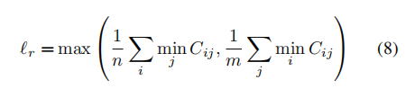
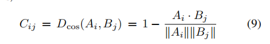
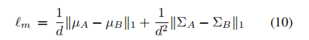
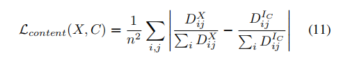
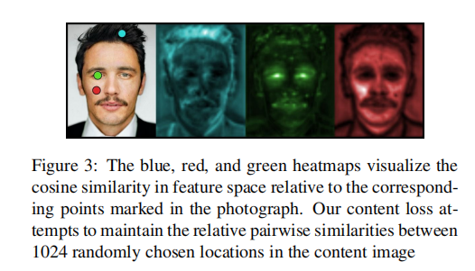
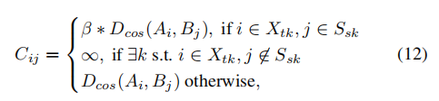

# **Style Transfer by Relaxed Optimal Transport and Self-Similarity**

样式传输算法努力使用另一个图像的样式来渲染一个图像的内容。

我们提出了一种新的基于优化的放松最优传输和自相似性（STROTSS）的风格转移算法。我们扩展了我们的方法，允许用户指定的点-点或区域到区域来控制样式图像和输出之间的视觉相似性。

这种指导既可以用来实现特定的视觉效果，也可以用来纠正由无约束的风格转移所造成的错误。

为了定量地将我们的方法与之前的工作进行比较，我们进行了一项大规模的用户研究，旨在评估风格转移算法中跨设置的风格权衡。

我们的结果表明，对于任何期望的内容保留水平，我们的方法提供了比以前的工作更高质量的风格化。代码可以在这里找到。

# **1 Introduction**

风格转移的主要挑战之一是将“内容”和“风格”正式化，这两个术语能唤起强烈的直觉，但甚至很难从语义上进行定义。

我们提出了每个术语的公式，它们在风格转移领域是新颖的，但在更广泛的计算机视觉领域有悠久的成功应用历史。我们希望改进风格和内容定义的相关努力最终将导致更健壮的识别系统，但在这项工作中，我们只关注它们在风格转移方面的效用。

我们将风格定义为由深度神经网络提取的特征上的分布，并使用在自然语言处理社区[14]中最初提出的 Earth Movers Distance的有效近似来测量这些分布之间的距离。这种风格相似性的定义不仅在统计上的动机很好，而且很直观。**样式转移的目标是将样式图像的视觉属性部署到内容图像上，使内容的底层布局和语义的失真最小；本质上是为了“最优地传输”这些视觉属性。**

我们对内容的定义的灵感来自于自相似性的概念，以及人类感知系统是稳健的，因为**它定义物体基于物体相对于周围环境的外观，而不是绝对的根据外观来识别物体**。以这种方式定义内容相似性在某种程度上将术语与像素精确值断开，使得它比之前工作中使用的定义更容易满足。这允许我们的算法的输出来维护内容图像的感知语义和空间布局，而在像素空间上却有显著的不同。

为了提高风格传递作为一种艺术工具的实用性，用户可以轻松、直观地控制算法的输出。我们扩展了我们的公式，允许风格转移的区域到区域约束（例如，确保内容图像中的头发使用风格图像中的云进行程式化）和点对点约束（例如，确保内容图像中的眼睛与绘画中的眼睛一样进行绘画）。

我们定量地将我们的方法与之前的工作进行了比较，使用了来自亚马逊机械土耳其（AMT）的662名工人的人类评估。工人分别评价内容保留和风格化质量。除了内容或样式输入外，工作人员还向他们展示了两种算法的输出，然后询问哪一种算法分别与显示的输入有更多相似的内容或样式。通过这种方法，就可以沿着两个轴量化每个算法的性能。通过评估我们的方法和之前对多个超参数设置的工作，我们还测量了在每种方法中，风格化和内容保存之间的权衡。我们的结果表明，对于任何期望的内容保存水平，我们的方法提供了比以前的工作更高质量的风格化。

# **2 Methods**

与Gatys等人[4]提出的原始神经风格转移算法一样，我们的方法采用两个输入，样式图像$I_S$和内容图像$I_C$，并使用梯度下降变量RMSprop [11]来最小化我们提出的目标函数（方程1）对输出图像X。

我们在第2.2节中描述了我们的损失αlC的内容术语，并在第2.3节中描述了风格术语lm+lr + $\frac 1αp$。超参数α表示了内容保存对风格化的相对重要性。

我们的方法是迭代的；让$X^{(t)}$表示时间步长t处的程式化输出图像。我们在第2.5节中描述了我们的初始化$X^{(0)}$。

## **2.1 Feature Extraction**

我们的风格项和内容损失项都依赖于从任意的空间位置提取丰富的特征表示。

在这项工作中，我们使用从在ImageNet [26]上训练的VGG16层子集中提取的超列[21,8]。

设$Φ(X)_i$是从输入图像X通过网络Φ的第i层提取的特征激活的张量

给定层指数$l_1，..，l_L$，我们使用双线性上采样来匹配$Φ(X)_{l_1}…Φ(X)_{l_L}$的空间维度与原始图像(X)的空间维度，然后将所有这些张量沿特征维度连接。这将在每个像素上生成一个超列，其中包括捕获底层边缘和颜色特征的特征、中层纹理特征和高级语义特征[27]。在所有实验中，我们使用VGG16的所有卷积层，除了第9、10、12和13层，由于内存限制，我们排除了这些层。

## **2.2 Style Loss**

设一个$A= \{A_1,...,A_n\}$是从X (t)中提取的n个特征向量的集合，而$B = \{B_1,....,B_m\}$是从样式图像$I_S$中提取的m个特征的集合。样式损失来自Earth Movers Distance (EMD)：

其中T是“传输矩阵”，它定义了部分成对赋值，C是“成本矩阵”，它去定义了A中的元素与B中的元素的距离。EMD（A、B）捕获集合A和集合B之间的距离，但找到最优T成本O（max（m、n）3），因此，对于基于梯度下降的风格转移是站不住脚的（需要在每个更新步骤中计算）

相反，我们将使用Relaxed EMD  [14]。为了定义这一点，我们将使用两个辅助距离，基本上每个距离都是只有一个约束条件(3)或(4)的EMD：

然后，我们可以将relaxed earth movers distance定义为：

这相当于：

计算主要是计算成本矩阵c。我们计算从Ai到Bj的运输成本（地面度量）如cosince distance作为两个特征向量之间的距离距离，

我们实验使用向量之间的欧几里德距离，但结果明显更差，见补充的例子。

lr可以很好地将源图像的结构形式转移到目标上，而余弦距离则忽略了特征向量的大小。在实践中，这将导致输出中的视觉伪影，最明显的是过度/不饱和。为了解决这个问题，我们添加了一个时刻匹配的损失：

其中，µA，ΣA为集合A中特征向量的均值和协方差，而µB和ΣB的定义方式相同。

我们还添加了一个颜色匹配的损失，lp来鼓励我们的输出和样式图像有一个类似的调色板。

lp使用$X^{(t)}$和$I_S$中像素颜色之间的松弛EMD进行去定义，这次是使用欧几里德距离作为地面度量。

我们发现，在计算这个项时，将RGB的颜色转换为以平均颜色作为一个通道的去相关颜色空间是有益的。因为调色板的变化与内容保存不一致，所以我们将这个术语加权为$\frac1α$。

## **2.3 Content Loss**

我们的内容损失是由于观察到可以使用**局部自相似性描述符**[25]来构建健壮的模式识别

一个每天的例子是侧视错觉现象，无生命物体的自相似模式被视为面孔，因为它们匹配一个松散的模板

形式上，设$D_X$是从X (t)中提取的所有（超列）特征向量的成对余弦距离矩阵，并对内容图像类似地定义$D_{I_C}$。我们在图3中可视化了$D_X$的几个潜在行。我们将内容损失定义为：\

换句话说，从任何一对坐标中提取的特征向量之间的归一化余弦距离应该在内容图像和输出图像之间保持不变。

这限制了输出的结构，而不强制执行任何直接连接到内容图像的像素的损失。这使得语义和空间布局被广泛地保留，同时允许X (t)中的像素值与IC中的像素值有很大的不同。

## **2.4 User Control**

我们将用户控件作为对输出样式的约束条件。也就是说，用户在X (t)和IS中定义了成对的空间位置（区域）集，它们必须具有较低的风格损失。在点对点用户指导的情况下，每个集合只包含一个空间位置（由单击定义）。让我们将输出图像和样式图像中的成对的空间位置集表示为（Xt1，Ss1）...（XtK，SsK）。我们重新定义了松弛EMD的地面度量如下：

β控制用户指定的约束相对于风格损失的无约束部分的权重，我们在所有实验中使用β = 5。

在点对点约束的情况下，我们发现使用8个点对点用户指定的约束是有用的，这些约束自动生成并以原始约束为中心，形成一个统一的9x9网格。对于512x512输出，网格中每个点之间的水平和垂直距离被设置为20像素，但这是一个可调的参数，可以合并到用户界面中。

## **2.5 Implementation Details**

我们在增加分辨率时迭代地应用我们的方法，每次都将α减半。我们从内容和样式的图像开始，缩放到有一个64个像素的长边。每个尺度上的输出被提前上采样到分辨率的两倍，并用作下一个尺度的初始化。默认情况下，我们在四种分辨率下进行样式化，因为我们在每个分辨率上将α减半，所以我们的默认α = 16.0被设置为最终分辨率下的α = 1.0。

在最低分辨率下，我们使用一个拉普拉斯金字塔的最底层进行初始化，该金字塔由内容图像（高频梯度）添加到样式图像的平均颜色中构造。然后我们将初始化输出图像分解成一个五级拉普拉斯金字塔，并使用RMSprop [11]更新条目的金字塔最小化目标函数.我们发现，优化拉普拉斯金字塔，而不是直接的像素，极大地加快了收敛速度。在每个scales中，我们使用RMSprop进行200次更新，除了最后一个量表外，所有scales都使用0.002，我们将其降低到0.001。

计算样式和内容损失所需的成对距离计算排除了从输入图像的所有坐标中提取特征，相反，我们从样式图像中随机抽取1024个坐标，在统一网格中抽取1024个坐标，从内容图像中随机抽取x，y偏移。我们只区分从这些位置提取的特征，并在RMSprop的每一步后重新采样这些位置。