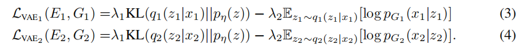

# **Unsupervised Image-to-Image Translation Networks**

无监督图像到图像转换的目的是通过利用不同领域的边缘分布的图像来学习图像在不同领域的联合分布。

由于存在无限的联合分布可以到达给定的边际分布，因此在没有附加假设的情况下，无法从边际分布推断出联合分布。

为了解决这个问题，我们做了一个共享潜在空间假设，并提出了一个基于耦合GAN的无监督图像到图像转换框架。

我们将所提出的框架与竞争方法进行了比较，并在各种具有挑战性的无监督图像翻译任务中给出了高质量的图像翻译结果，包括街景图像翻译、动物图像翻译和人脸图像翻译。

我们还将提出的框架应用于领域适应，并在基准数据集上实现最先进的性能。代码和其他结果可以在https://github.com/mingyuliutw/unit中获得。

# **1 Introduction**

许多计算机视觉问题可以转化为图像到图像的转换问题，即将一个领域的图像映射到另一个领域的相应图像。例如，超分辨率可以看作是将低分辨率图像映射到相应的高分辨率图像的问题；彩色化可以看作是将灰度图像映射到相应的彩色图像的问题。

这个问题可以在有监督和无监督的学习环境中进行研究。在监督设置下，不同领域的对应图像配对可用于[8,15]。在无监督设置下，我们只有两组独立的图像，其中一组由一个域的图像组成，另一组由另一个域的图像组成——没有成对的例子显示一个图像如何转换为另一个领域的相应的图像。由于缺乏相应的图像，无监督的图像到图像转换（UNIT）问题被认为比较困难，但由于训练数据收集更容易，因此更适用。

当从概率建模的角度分析图像转换问题时，关键的挑战是学习图像在不同领域的联合分布。在无监督设置下，这两组图像由来自两个不同领域的两个边缘分布的图像组成，其任务是利用这些图像来推断联合分布。**耦合理论[16]指出，存在无限的联合分布，可以到达给定的边际分布。因此，从边际分布推断联合分布是一个高度不适定的问题**。为了解决不适定问题，我们需要对联合分布的结构进行额外的假设。

为此，我们做了一个共享潜在空间假设，它假设不同域中的一对对应图像可以映射到共享潜在空间中的同一潜在表示。基于此假设，我们提出了一个基于生成对抗网络（GANs）和变分自编码器（VAEs）的UNIT框架。我们使用VAE-GAN对每个图像域进行建模。对抗性训练目标与一个权重共享约束交互，强制共享潜在空间，在两个领域生成相应的图像，而变分自动编码器将翻译的图像与各自领域的输入图像联系起来。

我们应用了提出的框架来解决各种无监督的图像到图像的翻译问题，并取得了高质量的图像翻译结果。

我们还将其应用于领域自适应问题，并在基准数据集上实现了最先进的精度。在耦合GAN [17]中使用共享潜在空间假设进行联合分布学习。

在这里，我们扩展了耦合GAN的工作。我们还注意到一些当代作品提出周期一致性约束假设[29,10]，假设存在一个循环一致性映射，这样一个图像在源域可以映射到一个图像在目标域和这个翻译图像在目标域可以映射到原始图像的源域。

本文证明了共享潜在空间约束隐含了循环一致性约束。

# **2 Assumptions**

设x1和x2是两个图像域。在监督图像到图像的转换中，我们给出了从一个联合分布$P_{X1，X2}(x1，x2)$中提取的样本（x1，x2）。在无监督的图像到图像的平移中，我们给出了从边缘分布$P_{X1}(x1)$和$P_{X2}(x2)$中提取的样本。由于无限一组可能的联合分布可以产生给定的边际分布，因此我们不能在没有额外假设的情况下从边际样本中推断出联合分布。

我们做出了共享-潜在空间的假设。如图1所示，我们假设对于任何给定的图像x1和x2，在共享潜在空间中存在一个共享的潜在代码z，这样我们可以从这段代码中恢复两个图像，我们可以从两个图像中计算这个代码。

也就是说，我们假设存在$E_1^∗、E_2^∗、G^∗_1和G^∗_2$函数，给定联合分布的一对对应的图像（x1、x2），我们有$z = E_1^∗(x1)= E_2^∗(x2)$，反之有$x1=G^∗_1(z)$和$x2=G^∗_2 (z)$。在这个模型中，从X1映射到X2的函数$x_2 = F^∗_{1→2}(x1)$可以用组合物$F^∗_{1→2}(x1)=G^∗_2(E_1^∗(x1))$来表示。

类似地，$x1 = F^∗_{2→1}(x2)=G^∗_1(E_2^∗(x2))$。

然后，UNIT问题就变成了学习$F^∗_{1→2}$和$F^∗_{2→1}$的问题

我们注意到，$F^∗_{1→2}$和$F^∗_{2→1}$存在的一个必要条件是周期一致性约束[29,10]：$ x1 = F^∗_{2→1}(F^∗_{1→2}(x1))$和x2 = F1∗→2（F∗2→1（x2））。

我们可以通过转换翻译后的输入图像来重建输入图像。换句话说，所提出的共享潜在空间假设意味着周期一致性假设（但反之亦然）。

为了实现共享潜在空间假设，我们进一步假设一个共享的中间表示h，这样生成一对相应图像的过程允许一种形式

因此，我们有$G^∗_1≡G^∗_{L,1}◦G^∗_H和G^∗_2≡G^∗_{L，2}◦G^∗_H$  $G^∗_H$是一个常见的高级生成函数映射z到h, $G^∗_{L,1}$和$G^∗_{L，2}$是低级生成函数映射h到x1和x2。

在多域图像翻译（例如，阳光和雨的图像翻译），z可以被视为紧凑，高级表示的场景（前面是车，后面是树”），h可以被认为是z的一个特殊实现通过$G^∗_H$（“车/树占据以下像素”），$G^∗_{L,1}$和$G^∗_{L，2}$将是每个模态的实际图像形成函数（“树在阳光充足的地方是郁郁葱葱的绿色，但在多雨的地方则是深绿色的”）。

假设h也允许我们用$E_1^∗≡E^∗_H◦E^∗_{L，1}$和$E_2^∗≡E^∗_H◦E^∗_{L，2}$来表示$E_1^∗$和$E_2^∗$。

在下一节中，我们将讨论如何在拟议的单元框架中实现上述想法

# **3 Framework**

我们的框架，如图1所示，是基于变分自编码器（VAEs）[13,22,14]和生成式对抗网络（GANs）[6,17]。

它由6个子网组成：包括两个域图像编码器E1和E2，两个域图像生成器G1和G2，以及两个域对抗性鉴别器D1和D2。存在几种方法来解释子网的作用，我们在表1中总结了一下。我们的框架在一次尝试中学习了两个方向的翻译

**VAE:**编码器-生成器对${E_1，G_1}$构成了X1结构域的一个VAE，称为VAE1。对于输入图像$x_1∈X_1$，VAE1首先通过编码器E1将x1映射到潜在空间Z中的编码，然后解码该编码的随机扰动版本，以通过生成器G1重构输入图像。

**假设潜在空间Z中的分量具有条件独立且具有单位方差的高斯分布**。在我们的公式中，编码器输出一个平均向量$E_{µ，1}(x1)$，潜在代码z1的分布由$q_1(z_1|x_1)≡N(z_1|E_{µ，1}(x1)，I)$给出，其中I是一个单位矩阵。重建的图像为$\overline x_1^{1 →1}=G_1(z_1∼q_1(z_1|x_1))$。注意，这里我们滥用了这个符号，因为我们将$q_1(z_1|x_1)$的分布作为$N(E_{µ，1}(x1)，I)$的随机向量，并从其中采样。类似地，{E2，G2}构成了X2的VAE，VAE2其中编码器E2输出一个平均向量$E_{µ，2}(x2)$，潜在代码z2的分布由$q_2(z_2|x_2)≡N(z_2|E_{µ，2}(x_2),I)$给出。重建图像为$\overline x_2^{2 →2}=G_2(z_2∼q_2(z_2|x_2))$。

利用再参数化技巧[13]，非可微采样操作可以利用辅助随机变量再参数化为可微操作。这个重新参数化的技巧允许我们使用后支撑来训练vae。设η是一个具有多元高斯分布的随机向量：η∼N（η|0，I）。z1∼q1（z1|x1）和z2∼q2（z2|x2）的采样操作可以分别通过z$1=E_{µ、1}（x1）+η$和$z2=E_{µ、2}（x2）+η$来实现

**Weight-sharing**

基于第2节中讨论的共享潜在空间假设，我们强制执行一个权重共享约束来关联这两个vae。具体来说，我们共享E1和E2的最后几层的权重，它们负责在这两个域中提取输入图像的高级表示。同样，我们共享G1和G2的前几层的权重，它们负责解码高级表示以重建输入图像。

请注意，**权重共享约束本身并不能保证两个域中对应的图像具有相同的潜在代码**。在无监督的设置下，在这两个域中不存在一对对应的图像来训练网络输出相同的潜在码。提取的一对对应图像的潜在码通常是不同的。即使它们是相同的，相同的潜在成分也可能在不同的领域有不同的语义意义。因此，相同的潜在码仍然可以被解码，以输出两个不相关的图像。

然而，我们将表明，通过对抗性训练，一对在两个领域相应的图像分别通过E1和E2可以映射到一个共同的潜在代码，和一个潜在码将通过G1和G2分别映射到一对相应在两个领域的图像。

共享潜在空间假设允许我们执行图像到图像的转换。我们可以通过应用$G_2(z1∼q1(z1|x1))$将X1中的图像x1转换为X2中的图像。我们将这种信息处理流称为图像转换流。该框架中存在两个图像翻译流： X1→X2和X2→X1。这两个流与来自vae的两个图像重建流共同训练。

一旦我们能够确保将一对对应的图像映射到相同的潜在码，并将相同的潜在码解码到一对对应的图像(x1，G2（z1∼q1（z1|x1））将形成一对对应的图像。

换句话说，在第2节中讨论的无监督图像到图像的转换中，E1和G2函数的组成近似于$F^∗_{1→2}$，而E2和G1函数的组成近似于$F^∗_{2→1}$。

**GANs**

我们的框架有两个生成式对抗网络： $GAN_1 = \{D1，G1\}$和$GAN_2 = \{D2，G2\}$。在GAN1中，对于从第一个域采样的真实图像，D1应该输出true，而对于G1生成的图像，它应该输出false。G1可以生成两种类型的图像： 1)来自重建流˜x1 1 →1=G1（z1∼q1（z1|x1））的图像和2)来自翻译流˜x2 2 →1=G1（z2∼q2（z2|x2））的图像。由于重建流可以被监督训练，所以我们只对来自翻译流˜x2 2 →1的图像应用对抗性训练就足够了。我们对GAN2应用了类似的处理，其中D2被训练为从第二域数据集采样的真实图像输出true，对G2生成的图像输出false。

**Cycle-consistency (CC).**

由于共享潜在空间假设意味着周期一致性约束（见第2节），我们也可以在所提出的框架中强制执行周期一致性约束，以进一步规范不适定的无监督图像到图像的平移问题。所得到的信息处理流称为循环重构流。

**Learning.**

我们共同解决了VAE1、VAE2、GAN1和GAN2对图像重建流、图像转换流和循环重建流的学习问题：

VAE训练的目标是最小化一个变分上限，在(2)中，VAE对象是

其中，超参数λ1和λ2控制了目标项的权值，而KL散度项惩罚了潜在代码的分布与先验分布的偏差。正则化允许用一种简单的方法从潜在空间[13]中采样。我们分别用拉普拉斯分布对pG1和pG2进行建模。因此，最小化负对数似然项相当于最小化图像与重建图像之间的绝对距离。先验分布是一个零均值高斯$p_η(z) = N(z|0，I)$。

在(2)中，GAN目标函数由

我们使用一个类似于VAE的目标函数来建模周期一致性约束，它是由

其中，负对数似然目标项确保一个两次转换的图像类似于输入的图像，并且KL项惩罚在周期重构流中偏离先验分布的潜在代码（因此，有两个KL项）。超参数λ3和λ4控制了两个不同目标项的权重。

继承了GAN，训练提出的框架结果解决一个最小最大问题，其中优化的目标是找到一个鞍点。它可以被看作是一个双人零和游戏。第一个玩家是一个由编码器和生成器组成的团队。第二个球员是由对抗的鉴别者组成的队伍。除了击败第二个玩家，第一个玩家必须最小化VAE损失和周期一致性损失。

我们应用了一个交替的梯度更新方案类似于在[6]中描述的一个来解决(2)

具体来说，我们首先应用一个梯度上升步骤来更新d1和d2，固定e1、e2、g1和g2。然后，我们应用一个梯度下降步骤来更新E1、E2、G1和G2，并固定D1和D2。

**Translation:**

经过学习，我们通过组装子网的一个子集，得到两个图像平移函数。我们有F1→2（x1）=G2（z1∼q1（z1|x1））用于将图像从X1平移到X2，而F2→1（x2）=G1（z2∼q2（z2|x2））用于将图像从X2平移到X1
