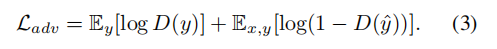

# **Unsupervised Image-to-Image Translation with Generative Prior**

无监督图像到图像的转换的目的是学习两个视觉域在没有配对数据之间的转换。

尽管最近在图像转换模型方面取得了进展，但在具有巨大视觉差异的复杂域之间构建映射仍然具有挑战性。

在这项工作中，我们提出了一个新的框架，生成先验引导无监督图像到图像翻译（GPUNIT），以提高翻译算法的整体质量和适用性。

我们的关键见解是利用预先训练过的类条件GANs（例如，BigGAN）的生成先验来学习跨不同领域的丰富内容对应。

我们提出了一种新的从粗到细的方案：首先提取生成先验来捕获一个稳健的粗层次内容表示，该表示可以在抽象语义层次上链接对象，在此基础上，自适应地学习最终内容特征，以获得更准确的多层次内容对应。

大量的实验证明，我们的通用框架在健壮、高质量和多样化的翻译方面优于最先进的方法，即使是在具有挑战性和遥远的领域。

# **1. Introduction**

无监督图像到图像转换（UNIT）的目标是在没有配对数据的情况下将图像从一个域转换到另一个域。

主流UNIT方法假设域之间存在双射，并利用周期一致性[46]来构建跨域映射。虽然在马到斑马翻译这样的简单情况下取得了良好的结果，但这种假设对于现实世界中更一般的异构和非对称的领域往往过于严格。现有方法的性能往往在具有较大的跨域形状和外观差异的翻译中显著下降，如将人脸转换为动物脸，限制了其实际应用。

跨具有较大差异的领域进行翻译需要在更高的语义级别[43]上建立翻译。例如，要将人的脸转化为猫的脸，人们可以使用更可靠的面部成分的对应关系，比如人和猫之间的眼睛，而不是局部纹理。在更极端的情况下遥远的领域，如动物和人造物体，翻译仍然是可能的，如果他们的对应可以确定在更高的抽象语义水平，例如通过肯定一个对象的正面方向或一个对象的布局。

在不同的语义级别上建立翻译需要一个UNIT模型能够找到不同语义粒度的准确对应关系。.这一要求显然过于严格，因为训练具有这种能力的翻译模型需要复杂的地面真实对应，这些对应要么不存在，要么不可行来收集。

在本研究中，我们通过生成先验的新应用克服了上述问题，得到了如图1所示的良好结果。具体地说，我们展示了一个类条件的GAN，如BigGAN [4]，提供了关于不同的对象是如何链接的强大提示——从相同的潜在代码生成的不同类的对象具有高度的内容对应关系（图2）。通过生成这样的跨域图像对，我们可以挖掘类条件GAN的唯一先验，并使用它们来指导图像转换模型在不同类之间构建有效和可适应的内容映射（以后我们将使用“域”而不是“类”）。

然而，这样的优先权并不能立即对UNIT有利。BigGAN本质上覆盖了大量的领域，这使得它成为我们的问题实现多个域之间转换的理想先验选择。然而，许多域的覆盖范围不可避免地限制了每个域的捕获分布的质量和域内的多样性。如果不仔细处理，这种限制将严重影响UNIT在产生高质量和多样化结果方面的表现。

为了克服上述问题，我们将翻译任务分解为从粗到细的阶段： 1)生成式先验蒸馏，在高语义层次上学习鲁棒的跨域对应；2)对抗性图像翻译，在多个语义层次上构建更精细的适应性对应。

在第一阶段，我们训练一个内容编码器来提取解纠缠的内容表示，通过从BigGAN生成的内容相关数据中提取先验。在第二阶段，我们将预先训练好的内容编码器应用于特定的翻译任务，独立于BigGAN的生成空间，提出一个动态跳过连接模块来学习自适应的对应，从而产生合理和多样化的翻译结果。

据我们所知，这是第一次对无监督1图像到图像翻译使用BigGAN生成先验

特别地，我们提出了一个通用的生成先验引导的无监督图像到图像转换框架（GP-UNIT），以扩展以前主要处理近域的UNIT方法的应用场景。

与之前的周期一致性指导框架相比，我们的框架改进： 1)捕获不同异构和非对称域的粗级对应，超出了周期一致性指导的能力；2)自适应地学习适用于各种任务的精细对应；3)在粗到细阶段保留基本内容特征，避免来自循环重建中通常观察到的源域的伪影。

总之，我们的贡献有三方面：

1. 我们提出了一个通用的GP-UNIT框架，以促进具有BigGAN生成先验的UNIT的整体质量和适用性。
2. 我们提出了一种有效的方法，通过生成先验蒸馏，在高语义水平上学习非平凡的遥远域之间的鲁棒对应。•
3. 我们设计了一种新的从粗到细的方案来学习不同区域的跨域通信

# **2. Related Work**

**Unsupervised image-to-image translation.**

为了在没有监督的情况下学习两个域之间的映射，CycleGAN [46]提出了一种新的周期一致性约束来建立域之间的双向关系。

为了更好地捕获域不变特征，表示解纠缠在 UNIT中得到了广泛的研究，其中通常使用内容编码器和样式编码器[7,8,19,20,31,32]分别提取域不变内容特征和特定于域的样式特征

然而，在两个具有显著差异的领域之间学习解纠缠表示不是重要的。为了应对巨大的视觉差异，COCO-FUNIT [39]设计了一个有内容条件的风格编码器，以防止与任务无关的外观信息的翻译。

TGaGa [43]使用地标来构建几何图形映射。

TraVeLGAN [3]提出了一个siamese network来寻找跨领域的共享语义特征，而U-GAT-IT [27]利用一个注意模块来专注于区分两个领域的重要区域。

这些方法难以为特定的领域寻找强大而平衡的领域相关表示，因此对各种翻译任务的适应能力较差，在某些情况下不可避免地会失败。

与这些方法不同的是，我们提出了一种从粗到细的新方案——首先在高度抽象的语义级别上构建粗级跨域内容对应，并在此基础上逐步学习适应于任务的细级对应。这样的方案使我们能够构建鲁棒的映射来处理各种任务。

**Adversarial image generation**

生成对抗网络（GAN）[12]引入了一种鉴别器来与生成器竞争，以反向逼近真实图像的分布。

在各种模型中，StyleGAN [25,26]已经显示出了良好的结果。许多作品[5,9,21,35,45]利用StyleGAN的生成先验，通过将调制后的图像限制在StyleGAN的生成空间内，来保证优越的图像质量。然而，StyleGAN是一个无条件的GAN，仅限于单个域或相近域[28]

BigGAN [4]能够在不同的领域合成图像，但以牺牲质量和域内多样性为代价。因此，在上述工作之后，利用BigGAN先验并不是很简单的。为了克服这一限制，本文从BigGAN生成的内容相关数据中提取生成的先验，并将其应用于图像翻译任务中，生成高质量的图像。

# **3. Generative Prior Distillation**

## **3.1. Cross-Domain Correspondences Prior**

我们的框架是由以下观察驱动的——BigGAN生成的对象，尽管来自不同的领域，但在从相同的潜在代码生成共享高级内容时相互对应。

图2显示了BigGAN的生成空间，包括三个潜在码（z1、z2、z3）跨五个域的生成空间。对于每个潜在的代码，可以在语义相关的狗和猫之间观察到细粒度的对应关系，如面部特征和身体姿势。对于相当不同的鸟类和车辆，我们也可以在方向和布局上观察到粗糙的对应。

这一有趣的现象表明，无论BigGAN生成空间中是否存在领域差异，但**在高度抽象的语义层次上都存在着内在的内容对应关系**。特别是，具有相同潜在代码的对象在前几层中共享相同或非常相似的抽象表示，基于这些层逐渐添加特定于领域的细节。

在本文中，我们利用这个生成先验来构建鲁棒映射，并选择BigGAN作为其丰富的跨域先验。然而，它的生成空间在质量和多样性上是有限的。在质量方面，BigGAN有时会产生不现实的物体，如图2中含有z2的狗体。至于多样性，首先，空间缺乏域内的变化，例如，狗的纹理或在同一域内的鸟的颜色的多样性非常有限。在UNIT 中使用这种先验将使模型过度适应有限的外观。其次，BigGAN生成空间被限制在ImageNet [38]的1000个域内，这对于一个实际的UNIT 来说是不够的。例如，它只有四种家猫，如图3(b)所示，排除了人脸的重要领域

尽管StyleGAN的生成空间具有高质量和多样性，但它并不适合我们的任务。这是因为它仅限于单个域，因此它主要通过潜在编辑应用于一个域内的属性转移[9,35,45]。最近，通过微调[28,36]实现了StyleGAN上的跨域翻译，但这仍然假定源域和目标域模型之间的距离很小的距离，因此仍然局限于封闭域。这一假设使得StyleGAN先验不适用于更复杂的翻译任务。

我们的框架通过从BigGAN中提取一般生成先验而不是直接约束潜在或图像空间来解决上述问题。它使我们能够独立地设计和训练翻译模块。因此，我们可以实现多模态平移（图3(a)），推广到ImageNet之外的类（图3(b)），并在遥远的域之间建立鲁棒映射（图3(c)）。

接下来，我们详细说明我们如何提取先验的。

## **3.2. Prior Distillation with Content Encoder**

给定从两个随机域X和Y的由BigGAN生成的公共随机潜在代码中生成的相关图像（x，y），我们的主要目标是训练内容编码器Ec提取它们共享的粗级内容特征，可用于重建它们的形状和外观。图4(a)说明了这个用于生成先验蒸馏的自动编码器管道。

具体来说，我们使用解码器F根据其内容特征$E_c (x)$、样式编码器Es提取的样式特征$E_s (x)$和域标签$Ix$来恢复外观x。

我们进一步基于$Ec (x)$和$I_x$利用F的浅层Fs来预测基于x的形状（即实例分割映射$x_s$，由HTC[6]从x中提取）。

我们发现这种辅助预测可以在数百个领域上简化训练。

除了形状和外观重建外，我们还通过三种方式对内容特征进行了正规化：

1.  x和y应该具有相同的内容特征；
2. 引入了具有梯度反转层R [11]的分类器C，使内容特征域无关；
3. 我们将Ec (x)限制在一个通道，以消除域信息[42]，并添加固定方差的高斯噪声以获得鲁棒性。

我们的目标功能是：

$L_{arec}$外观重建损失测量了$\overline x=F(E_c(x)、E_s (x)、lx)$和x之间的L2和perceptual损失[22]

形状重建损失，$L_{srec}$，被定义为

带有成对输入的binary loss $L_{dis}$缩小了x和y的内容特征之间的距离。

另外，我们想用y的内容特征来恢复x的形状，它可以模拟翻译：

最后，Lreg指导C最大化分类精度，并推动EC混淆C，从而使内容特征是域不可知的。L2规范进一步应用于内容功能：

对于Larec、Lsrec和Lreg的单一损失，我们还使用ImageNet [38]和CelebA-HQ [23]的真实图像进行训练，使Ec更一般化

# **4. Adversarial Image Translation**

给定在第一阶段预先训练的固定内容编码器Ec，我们在第二阶段按照标准风格传输范式构建翻译网络。由于预先训练的Ec为内容相似度提供了一个很好的度量，我们的框架不需要循环训练。

如图4(b)所示，我们的翻译网络接收一个内容输入x∈X和一个样式输入y∈Y。网络分别提取它们的内容特征Ec (x)和样式特征Es(y)。然后，生成器G通过AdaIN [18]对Ec (x)进行调制，以匹配y的样式，最终得到翻译后的结果$\hat y= G(Ec(x)，Es (y))$。$\hat y$的真实性通过使用鉴别器D的对抗性训练得到加强，

另外，$\hat y$需要符合y的风格，同时保留x的原始内容特性，可以表述为样式丢失Lsty和内容丢失Lcon，

fD是样式特征，定义为遵循[18]中样式定义的D的中间层特征的通道级平均值。

## **4.1. Dynamic Skip Connection**

语义上相近的域通常会表现出精细级别的内容对应，而这不能仅由抽象内容特征来表征。为了解决这一问题，我们提出了一个动态跳过连接模块，该模块将Ec的中间层特征fE传递到G，并预测掩模m来选择有效的元素来建立精细层次的内容对应。

我们的动态跳过连接的灵感来自于GRU类选择性转移unit30]。

设上标l表示G的那一层。

第l层的掩模$m^l$由传递到同一层的编码器特征$f^l_E$和最后一层的隐藏状态$h^{l−1}$决定。

具体来说，我们首先设置第一个隐藏状态$h^0 = Ec (x)$并且使用上采样卷积匹配使用$f^l_E$和$h^{l-1}$的维度 $\hat h^{l−1}=σ（W^l_h◦↑h^{l−1}$），↑、◦和$W^l_h$是上采样算子、卷积算子和卷积权值。激活层记为σ。

然后，我们在第l层的模块更新隐藏状态$h^l$和编码器特征$\hat f^l_E$，并将$\hat f^l_E$与生成器特征$f^l_G$与预测的掩模ml融合：

$m^l$具有相同的$f^l_G$维度，同时服务于通道注意和空间注意。此外，我们将l1范数应用于ml，使其稀疏，

这样就只从源域中选择最有用的内容线索。

**Full objectives**

结合上述损失，我们的全部目标采取以下形式：

添加一个重建损失Lrec来测量y和$\overline y= G(Ec(y)，Es (y))$之间的L1和知觉损失[22]。

直观地说，我们希望图像学习到的风格特征在其内容特征的帮助下精确地重建自己，从而稳定网络训练。

**Style sampling.**

为了直接采样没有样式图像的多模态生成，我们采用[34]的后处理，训练映射网络，使用最大似然准则[17]将单位高斯噪声映射到潜在样式分布。详情请参考[17]。